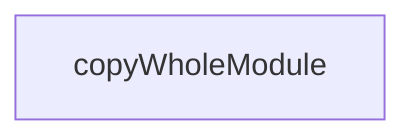

# Chapter 1: Getting Started

Welcome to **Chapter 1: Getting Started**. In this part of **Superset Terminal Tutorial: Command Center for Parallel Coding Agents**, you will build an intuitive mental model first, then move into concrete implementation details and practical production tradeoffs.


This chapter gets Superset running for first-time multi-agent workspace management.

## Quick Start

- download prebuilt macOS release, or
- build from source with Bun

```bash
git clone https://github.com/superset-sh/superset.git
cd superset
bun install
bun run dev
```

## Source References

- [Superset README](https://github.com/superset-sh/superset/blob/main/README.md)

## Summary

You now have a running Superset baseline for workspace-based agent orchestration.

Next: [Chapter 2: Worktree Isolation and Workspace Model](02-worktree-isolation-and-workspace-model.md)

## Depth Expansion Playbook

## Source Code Walkthrough

### `apps/desktop/runtime-dependencies.ts`

The `copyWholeModule` function in [`apps/desktop/runtime-dependencies.ts`](https://github.com/superset-sh/superset/blob/HEAD/apps/desktop/runtime-dependencies.ts) handles a key part of this chapter's functionality:

```ts
};

function copyWholeModule(moduleName: string): PackagedNodeModuleCopy {
	return {
		from: `node_modules/${moduleName}`,
		to: `node_modules/${moduleName}`,
		filter: ["**/*"],
	};
}

function copyModuleSubtree(
	moduleName: string,
	filter: string[],
): PackagedNodeModuleCopy {
	return {
		from: `node_modules/${moduleName}`,
		to: `node_modules/${moduleName}`,
		filter,
	};
}

const externalizedRuntimeModules: ExternalizedRuntimeModule[] = [
	{
		specifier: "better-sqlite3",
		materialize: ["better-sqlite3"],
		packagedCopies: [copyWholeModule("better-sqlite3")],
		asarUnpackGlobs: ["**/node_modules/better-sqlite3/**/*"],
	},
	{
		specifier: "node-pty",
		materialize: ["node-pty"],
		packagedCopies: [copyWholeModule("node-pty")],
```

This function is important because it defines how Superset Terminal Tutorial: Command Center for Parallel Coding Agents implements the patterns covered in this chapter.


## How These Components Connect


