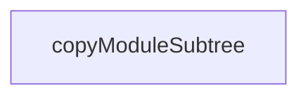

# Chapter 2: Worktree Isolation and Workspace Model

Welcome to **Chapter 2: Worktree Isolation and Workspace Model**. In this part of **Superset Terminal Tutorial: Command Center for Parallel Coding Agents**, you will build an intuitive mental model first, then move into concrete implementation details and practical production tradeoffs.


Superset isolates each active task in its own git worktree and workspace context.

## Isolation Benefits

- avoids branch conflicts between parallel tasks
- preserves clean context per agent run
- enables fast switch/cleanup between active workspaces

## Source References

- [Superset README: worktree isolation](https://github.com/superset-sh/superset/blob/main/README.md)
- [Worktree utility path](https://github.com/superset-sh/superset/blob/main/apps/desktop/src/lib/trpc/routers/workspaces/utils/worktree.ts)

## Summary

You now understand how Superset prevents multi-agent interference through workspace isolation.

Next: [Chapter 3: Workspace Orchestration Lifecycle](03-workspace-orchestration-lifecycle.md)

## Depth Expansion Playbook

## Source Code Walkthrough

### `apps/desktop/runtime-dependencies.ts`

The `copyModuleSubtree` function in [`apps/desktop/runtime-dependencies.ts`](https://github.com/superset-sh/superset/blob/HEAD/apps/desktop/runtime-dependencies.ts) handles a key part of this chapter's functionality:

```ts
}

function copyModuleSubtree(
	moduleName: string,
	filter: string[],
): PackagedNodeModuleCopy {
	return {
		from: `node_modules/${moduleName}`,
		to: `node_modules/${moduleName}`,
		filter,
	};
}

const externalizedRuntimeModules: ExternalizedRuntimeModule[] = [
	{
		specifier: "better-sqlite3",
		materialize: ["better-sqlite3"],
		packagedCopies: [copyWholeModule("better-sqlite3")],
		asarUnpackGlobs: ["**/node_modules/better-sqlite3/**/*"],
	},
	{
		specifier: "node-pty",
		materialize: ["node-pty"],
		packagedCopies: [copyWholeModule("node-pty")],
		asarUnpackGlobs: ["**/node_modules/node-pty/**/*"],
	},
	{
		specifier: "@superset/macos-process-metrics",
		materialize: ["@superset/macos-process-metrics"],
		packagedCopies: [copyWholeModule("@superset/macos-process-metrics")],
		asarUnpackGlobs: ["**/node_modules/@superset/macos-process-metrics/**/*"],
	},
```

This function is important because it defines how Superset Terminal Tutorial: Command Center for Parallel Coding Agents implements the patterns covered in this chapter.


## How These Components Connect


