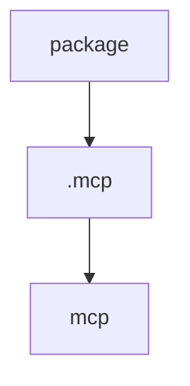

# Chapter 5: Monitoring, Diff, and Review Workflow

Welcome to **Chapter 5: Monitoring, Diff, and Review Workflow**. In this part of **Superset Terminal Tutorial: Command Center for Parallel Coding Agents**, you will build an intuitive mental model first, then move into concrete implementation details and practical production tradeoffs.


Superset centralizes status monitoring and diff review so human decisions can happen faster across many agent tasks.

## Review Loop

1. monitor workspace status in unified view
2. inspect generated diffs quickly
3. approve/edit before committing and merging

## Source References

- [Superset README: monitoring and diff features](https://github.com/superset-sh/superset/blob/main/README.md)

## Summary

You now have a review-first flow for safely scaling agent throughput.

Next: [Chapter 6: Setup/Teardown Presets and Automation](06-setup-teardown-presets-and-automation.md)

## Depth Expansion Playbook

## Source Code Walkthrough

### `package.json`

The `package` module in [`package.json`](https://github.com/superset-sh/superset/blob/HEAD/package.json) handles a key part of this chapter's functionality:

```json
{
	"name": "@superset/repo",
	"version": "0.0.0",
	"repository": {
		"type": "git"
	},
	"devDependencies": {
		"@biomejs/biome": "2.4.2",
		"dotenv-cli": "^11.0.0",
		"sherif": "^1.10.0",
		"turbo": "^2.8.7"
	},
	"description": "Superset Monorepo",
	"homepage": "https://superset.sh",
	"license": "Elastic-2.0",
	"packageManager": "bun@1.3.6",
	"private": true,
	"scripts": {
		"dev": "turbo run dev dev:caddy --filter=@superset/api --filter=@superset/web --filter=@superset/desktop --filter=electric-proxy --filter=//",
		"dev:all": "turbo dev",
		"dev:caddy": "dotenv -- caddy run --config Caddyfile",
		"dev:docs": "turbo dev --filter=@superset/docs",
		"dev:marketing": "turbo dev --filter=@superset/marketing --filter=@superset/docs",
		"build": "turbo build --filter=@superset/desktop",
		"test": "turbo test",
		"lint": "./scripts/lint.sh",
		"check:desktop-git-env": "./scripts/check-desktop-git-env.sh",
		"lint:fix": "bunx @biomejs/biome@2.4.2 migrate --write && bunx @biomejs/biome@2.4.2 check --write --unsafe .",
		"format": "bunx @biomejs/biome@2.4.2 format --write .",
		"format:check": "bunx @biomejs/biome@2.4.2 format .",
		"typecheck": "turbo typecheck",
		"ui-add": "turbo run ui-add",
		"postinstall": "./scripts/postinstall.sh",
		"clean": "git clean -xdf node_modules",
		"clean:workspaces": "turbo clean",
```

This module is important because it defines how Superset Terminal Tutorial: Command Center for Parallel Coding Agents implements the patterns covered in this chapter.

### `.mcp.json`

The `.mcp` module in [`.mcp.json`](https://github.com/superset-sh/superset/blob/HEAD/.mcp.json) handles a key part of this chapter's functionality:

```json
{
	"mcpServers": {
		"superset": {
			"type": "http",
			"url": "https://api.superset.sh/api/agent/mcp"
		},
		"expo-mcp": {
			"type": "http",
			"url": "https://mcp.expo.dev/mcp",
			"enabled": false
		},
		"maestro": {
			"command": "maestro",
			"args": ["mcp"]
		},
		"neon": {
			"type": "http",
			"url": "https://mcp.neon.tech/mcp"
		},
		"linear": {
			"type": "http",
			"url": "https://mcp.linear.app/mcp"
		},
		"sentry": {
			"type": "http",
			"url": "https://mcp.sentry.dev/mcp"
		},
		"posthog": {
			"type": "http",
			"url": "https://mcp.posthog.com/mcp"
		},
		"desktop-automation": {
			"command": "bun",
			"args": ["run", "packages/desktop-mcp/src/bin.ts"]
		}
```

This module is important because it defines how Superset Terminal Tutorial: Command Center for Parallel Coding Agents implements the patterns covered in this chapter.

### `.mastracode/mcp.json`

The `mcp` module in [`.mastracode/mcp.json`](https://github.com/superset-sh/superset/blob/HEAD/.mastracode/mcp.json) handles a key part of this chapter's functionality:

```json
{
	"mcpServers": {
		"superset": {
			"command": "npx",
			"args": ["-y", "mcp-remote", "https://api.superset.sh/api/agent/mcp"]
		},
		"maestro": {
			"command": "maestro",
			"args": ["mcp"]
		},
		"neon": {
			"command": "npx",
			"args": ["-y", "mcp-remote", "https://mcp.neon.tech/mcp"]
		},
		"linear": {
			"command": "npx",
			"args": ["-y", "mcp-remote", "https://mcp.linear.app/mcp"]
		},
		"sentry": {
			"command": "npx",
			"args": ["-y", "mcp-remote", "https://mcp.sentry.dev/mcp"]
		},
		"desktop-automation": {
			"command": "bun",
			"args": ["run", "packages/desktop-mcp/src/bin.ts"]
		}
	}
}

```

This module is important because it defines how Superset Terminal Tutorial: Command Center for Parallel Coding Agents implements the patterns covered in this chapter.


## How These Components Connect


