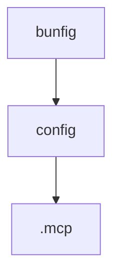

# Chapter 6: Setup/Teardown Presets and Automation

Welcome to **Chapter 6: Setup/Teardown Presets and Automation**. In this part of **Superset Terminal Tutorial: Command Center for Parallel Coding Agents**, you will build an intuitive mental model first, then move into concrete implementation details and practical production tradeoffs.


Superset supports workspace automation through setup/teardown script presets.

## Preset Configuration

Example `.superset/config.json`:

```json
{
  "setup": ["./.superset/setup.sh"],
  "teardown": ["./.superset/teardown.sh"]
}
```

## Source References

- [Superset README: configuration section](https://github.com/superset-sh/superset/blob/main/README.md)
- [Default preset config](https://github.com/superset-sh/superset/blob/main/.superset/config.json)

## Summary

You now understand how to standardize workspace initialization and cleanup workflows.

Next: [Chapter 7: Runtime and Package Architecture](07-runtime-and-package-architecture.md)

## Source Code Walkthrough

### `bunfig.toml`

The `bunfig` module in [`bunfig.toml`](https://github.com/superset-sh/superset/blob/HEAD/bunfig.toml) handles a key part of this chapter's functionality:

```toml
[install]
linker = "isolated" # Prevent hoisting from resolving `path-scurry@2` to `lru-cache@6` (missing `LRUCache`), which breaks the `@superset/desktop` postinstall native rebuild.

```

This module is important because it defines how Superset Terminal Tutorial: Command Center for Parallel Coding Agents implements the patterns covered in this chapter.

### `.codex/config.toml`

The `config` module in [`.codex/config.toml`](https://github.com/superset-sh/superset/blob/HEAD/.codex/config.toml) handles a key part of this chapter's functionality:

```toml
[mcp_servers.superset]
type = "sse"
url = "https://api.superset.sh/api/agent/mcp"

[mcp_servers.expo-mcp]
type = "sse"
url = "https://mcp.expo.dev/mcp"
enabled = false

[mcp_servers.maestro]
command = "maestro"
args = ["mcp"]

[mcp_servers.neon]
type = "sse"
url = "https://mcp.neon.tech/mcp"

[mcp_servers.linear]
type = "sse"
url = "https://mcp.linear.app/mcp"

[mcp_servers.sentry]
type = "sse"
url = "https://mcp.sentry.dev/mcp"


[mcp_servers.desktop-automation]
command = "bun"
args = ["run", "packages/desktop-mcp/src/bin.ts"]

```

This module is important because it defines how Superset Terminal Tutorial: Command Center for Parallel Coding Agents implements the patterns covered in this chapter.

### `.mcp.json`

The `.mcp` module in [`.mcp.json`](https://github.com/superset-sh/superset/blob/HEAD/.mcp.json) handles a key part of this chapter's functionality:

```json
{
	"mcpServers": {
		"superset": {
			"type": "http",
			"url": "https://api.superset.sh/api/agent/mcp"
		},
		"expo-mcp": {
			"type": "http",
			"url": "https://mcp.expo.dev/mcp",
			"enabled": false
		},
		"maestro": {
			"command": "maestro",
			"args": ["mcp"]
		},
		"neon": {
			"type": "http",
			"url": "https://mcp.neon.tech/mcp"
		},
		"linear": {
			"type": "http",
			"url": "https://mcp.linear.app/mcp"
		},
		"sentry": {
			"type": "http",
			"url": "https://mcp.sentry.dev/mcp"
		},
		"posthog": {
			"type": "http",
			"url": "https://mcp.posthog.com/mcp"
		},
		"desktop-automation": {
			"command": "bun",
			"args": ["run", "packages/desktop-mcp/src/bin.ts"]
		}
```

This module is important because it defines how Superset Terminal Tutorial: Command Center for Parallel Coding Agents implements the patterns covered in this chapter.


## How These Components Connect


