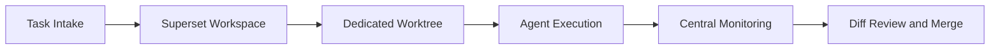

# Superset Terminal Tutorial: Command Center for Parallel Coding Agents

> Learn how to use `superset-sh/superset` to orchestrate many coding agents in parallel with worktree isolation, centralized monitoring, and fast review loops.

## Why This Track Matters

When teams run many coding agents, coordination overhead often dominates. Superset provides a unified terminal/desktop control plane for parallel execution and quick human-in-the-loop review.

This track focuses on:

- parallel agent orchestration with workspace isolation
- worktree and workspace lifecycle management
- built-in diff/review flow for faster shipping
- operational patterns for team rollout and governance

## Current Snapshot (auto-updated)

- repository: [`superset-sh/superset`](https://github.com/superset-sh/superset)
- stars: about **1.5k**
- latest release: [`desktop-v0.0.70`](https://github.com/superset-sh/superset/releases/tag/desktop-v0.0.70)
- recent activity: updates on **February 12, 2026**
- project positioning: command center for CLI coding agents

## Mental Model

## Chapter Guide

| Chapter | Key Question | Outcome |
|:--------|:-------------|:--------|
| [01 - Getting Started](01-getting-started.md) | How do I install and launch Superset quickly? | Working baseline |
| [02 - Worktree Isolation and Workspace Model](02-worktree-isolation-and-workspace-model.md) | How does Superset prevent agent conflicts? | Strong isolation model |
| [03 - Workspace Orchestration Lifecycle](03-workspace-orchestration-lifecycle.md) | How are workspaces created, tracked, and deleted? | Lifecycle clarity |
| [04 - Multi-Agent Program Compatibility](04-multi-agent-program-compatibility.md) | How does Superset run Claude, Codex, OpenCode, and others? | Flexible agent stack integration |
| [05 - Monitoring, Diff, and Review Workflow](05-monitoring-diff-and-review-workflow.md) | How do I review outputs from many agents quickly? | Faster quality gates |
| [06 - Setup/Teardown Presets and Automation](06-setup-teardown-presets-and-automation.md) | How do workspace presets improve consistency? | Better repeatability |
| [07 - Runtime and Package Architecture](07-runtime-and-package-architecture.md) | What are the key architecture components for contributors? | Deeper platform understanding |
| [08 - Production Team Operations](08-production-team-operations.md) | How do teams operationalize Superset at scale? | Governance baseline |

## What You Will Learn

- how to run many coding agents without context-switch chaos
- how to use worktree isolation and workspace orchestration safely
- how to improve review throughput with built-in monitoring and diff flow
- how to deploy Superset with standardized team operations

## Source References

- [Superset Repository](https://github.com/superset-sh/superset)
- [Superset README](https://github.com/superset-sh/superset/blob/main/README.md)
- [Workspace orchestrator](https://github.com/superset-sh/superset/blob/main/apps/cli/src/lib/orchestrators/workspace-orchestrator.ts)
- [Workspace init manager](https://github.com/superset-sh/superset/blob/main/apps/desktop/src/main/lib/workspace-init-manager.ts)
- [Shared agent package](https://github.com/superset-sh/superset/blob/main/packages/agent/README.md)

## Related Tutorials

- [Claude Squad Tutorial](../claude-squad-tutorial/)
- [Kilo Code Tutorial](../kilocode-tutorial/)
- [OpenCode Tutorial](../opencode-tutorial/)
- [Plandex Tutorial](../plandex-tutorial/)

---

Start with [Chapter 1: Getting Started](01-getting-started.md).

## Navigation & Backlinks

- [Start Here: Chapter 1: Getting Started](01-getting-started.md)
- [Back to Main Catalog](../../README.md#-tutorial-catalog)
- [Browse A-Z Tutorial Directory](../../discoverability/tutorial-directory.md)
- [Search by Intent](../../discoverability/query-hub.md)
- [Explore Category Hubs](../../README.md#category-hubs)

## Full Chapter Map

1. [Chapter 1: Getting Started](01-getting-started.md)
2. [Chapter 2: Worktree Isolation and Workspace Model](02-worktree-isolation-and-workspace-model.md)
3. [Chapter 3: Workspace Orchestration Lifecycle](03-workspace-orchestration-lifecycle.md)
4. [Chapter 4: Multi-Agent Program Compatibility](04-multi-agent-program-compatibility.md)
5. [Chapter 5: Monitoring, Diff, and Review Workflow](05-monitoring-diff-and-review-workflow.md)
6. [Chapter 6: Setup/Teardown Presets and Automation](06-setup-teardown-presets-and-automation.md)
7. [Chapter 7: Runtime and Package Architecture](07-runtime-and-package-architecture.md)
8. [Chapter 8: Production Team Operations](08-production-team-operations.md)

*Generated by [AI Codebase Knowledge Builder](https://github.com/The-Pocket/Tutorial-Codebase-Knowledge)*
