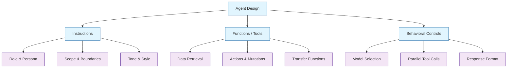
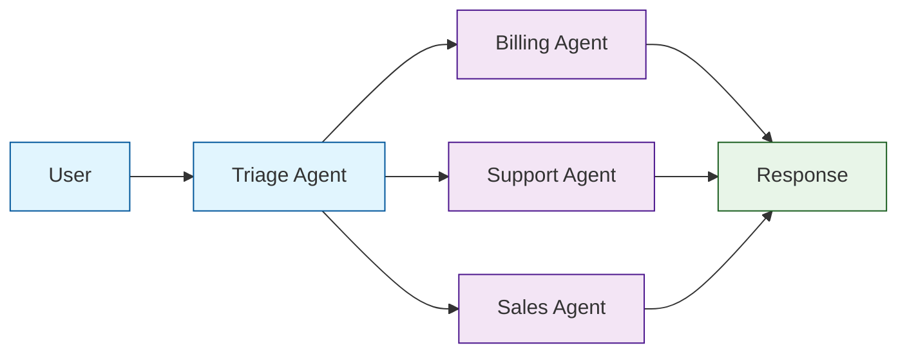
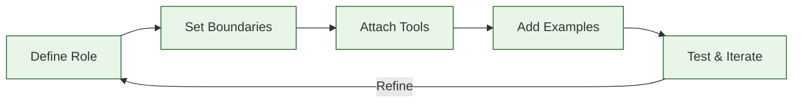

# Chapter 2: Agent Design

In this chapter, you will learn how to design Swarm agents with clear instructions, distinct personas, and well-defined behaviors. Good agent design is the foundation of every effective multi-agent system.

## What Makes a Good Agent?

An agent in Swarm is defined by three pillars: **instructions** (who it is), **functions** (what it can do), and **model behavior** (how it responds). The quality of your system depends on how thoughtfully you design each agent.



## Anatomy of an Agent

The `Agent` class accepts several parameters that control its identity and behavior:

| Parameter | Type | Description |
|:----------|:-----|:------------|
| `name` | `str` | Human-readable name shown in responses and logs |
| `instructions` | `str` or `callable` | System prompt that defines persona, role, and rules |
| `functions` | `list` | Python functions the agent can invoke as tools |
| `model` | `str` | OpenAI model to use (default: `"gpt-4o"`) |
| `tool_choice` | `str` | Force tool usage: `"auto"`, `"required"`, or `"none"` |
| `parallel_tool_calls` | `bool` | Allow multiple tool calls in a single turn |

```python
from swarm import Agent

agent = Agent(
    name="Sales Advisor",
    instructions="""You are a sales advisor for TechCorp.

    Your role:
    - Answer questions about product plans and pricing
    - Help customers choose the right plan
    - Schedule demos when requested

    Your boundaries:
    - Never negotiate custom pricing (transfer to manager)
    - Never provide technical support (transfer to support)
    - Never make commitments about unreleased features
    """,
    model="gpt-4o",
    functions=[],
    parallel_tool_calls=True,
)
```

## Crafting Effective Instructions

Instructions are the most important part of agent design. They shape every response the agent produces.

### The ROLE-SCOPE-RULES Pattern

A reliable structure for instructions follows three sections:

```python
agent = Agent(
    name="Billing Specialist",
    instructions="""
    ## ROLE
    You are a billing specialist at Acme Cloud Services. You speak in a
    professional, empathetic tone. You always greet the customer by name
    when it is available in context variables.

    ## SCOPE
    You handle:
    - Invoice questions and payment history
    - Subscription upgrades and downgrades
    - Refund requests up to $100
    - Payment method updates

    You do NOT handle:
    - Technical troubleshooting (transfer to support)
    - Account deletion (transfer to account manager)
    - Refunds over $100 (transfer to supervisor)

    ## RULES
    1. Always verify the customer's account before making changes.
    2. Summarize any changes you make before confirming.
    3. If the customer is frustrated, acknowledge their feelings first.
    4. Never reveal internal pricing rules or margin data.
    5. Log every billing action with a reason.
    """,
)
```

### Dynamic Instructions with Callables

Instructions can be a callable that receives `context_variables`, allowing the persona to adapt at runtime:

```python
def billing_instructions(context_variables):
    customer_name = context_variables.get("customer_name", "valued customer")
    account_tier = context_variables.get("account_tier", "standard")

    base = f"""You are a billing specialist helping {customer_name}.
    Their account tier is: {account_tier}.
    """

    if account_tier == "enterprise":
        base += """
    Enterprise accounts have a dedicated account manager.
    For complex billing questions, transfer to the enterprise team.
    Refund limit for enterprise accounts is $500.
        """
    else:
        base += """
    Standard accounts have a refund limit of $100.
    For amounts above that, transfer to a supervisor.
        """

    return base


billing_agent = Agent(
    name="Billing Specialist",
    instructions=billing_instructions,
)
```

## Designing Agent Personas

A well-defined persona makes agents consistent and predictable. Consider these dimensions:

| Dimension | Example Values | Effect |
|:----------|:--------------|:-------|
| **Tone** | Formal, friendly, concise | Shapes language style |
| **Expertise** | Beginner-friendly, expert-level | Controls depth of answers |
| **Proactivity** | Reactive, anticipatory | Determines if agent volunteers info |
| **Verbosity** | Terse, balanced, detailed | Controls response length |
| **Empathy** | Clinical, empathetic, enthusiastic | Adjusts emotional register |

```python
# A concise, expert-level technical agent
tech_agent = Agent(
    name="DevOps Engineer",
    instructions="""You are a senior DevOps engineer providing CLI-level guidance.

    Communication style:
    - Be concise: prefer code snippets and commands over prose
    - Assume the user is technically proficient
    - Use bullet points, not paragraphs
    - When uncertain, state assumptions clearly

    Example response format:
    Problem: <one-line summary>
    Fix:
    ```bash
    <command>
    ```
    Explanation: <one sentence>
    """,
)

# A friendly, beginner-oriented onboarding agent
onboarding_agent = Agent(
    name="Onboarding Guide",
    instructions="""You are a patient onboarding guide for new users.

    Communication style:
    - Use simple language; avoid jargon
    - Explain every step in detail
    - Encourage the user and celebrate small wins
    - Offer to repeat or clarify at every step
    - Use numbered steps for any process

    Always start by asking what the user wants to accomplish today.
    """,
)
```

## Agent Architecture Patterns

### Single-Purpose Agents

Each agent handles one responsibility. This is the recommended default.



```python
from swarm import Swarm, Agent

client = Swarm()


def transfer_to_billing():
    """Transfer to billing agent for invoice and payment questions."""
    return billing_agent


def transfer_to_support():
    """Transfer to support agent for technical issues."""
    return support_agent


def transfer_to_sales():
    """Transfer to sales agent for pricing and plan questions."""
    return sales_agent


triage_agent = Agent(
    name="Triage",
    instructions="""You are a triage agent. Determine the user's intent and
    transfer to the appropriate specialist:
    - Billing/payments/invoices -> transfer_to_billing
    - Technical problems/bugs -> transfer_to_support
    - Pricing/plans/upgrades -> transfer_to_sales

    Never attempt to solve the problem yourself.
    """,
    functions=[transfer_to_billing, transfer_to_support, transfer_to_sales],
)

billing_agent = Agent(
    name="Billing",
    instructions="You handle billing inquiries. Be precise with dollar amounts.",
)

support_agent = Agent(
    name="Support",
    instructions="You troubleshoot technical issues. Ask for error messages.",
)

sales_agent = Agent(
    name="Sales",
    instructions="You help with pricing and plans. Be enthusiastic but honest.",
)
```

### Layered Agents with Escalation

Add depth by chaining agents in layers:

```python
def transfer_to_senior_support():
    """Escalate to a senior support engineer."""
    return senior_support_agent


support_agent = Agent(
    name="Support L1",
    instructions="""You are a Level-1 support agent.
    Handle common issues: password resets, connectivity, basic config.
    If the issue requires system access or is unresolved after 3 turns,
    escalate to senior support.""",
    functions=[transfer_to_senior_support],
)

senior_support_agent = Agent(
    name="Support L2",
    instructions="""You are a senior support engineer with system access.
    You can query logs, restart services, and modify configurations.
    Document every action you take for the audit trail.""",
    functions=[query_logs, restart_service, modify_config],
)
```

## Controlling Agent Behavior

### Model Selection per Agent

Use smaller, faster models for simple routing tasks and larger models for complex reasoning:

```python
# Fast router - uses a smaller model for low-latency triage
triage_agent = Agent(
    name="Router",
    instructions="Classify the user request and transfer to the right agent.",
    model="gpt-4o-mini",
    functions=[transfer_to_billing, transfer_to_support],
)

# Complex reasoning - uses a more capable model
analysis_agent = Agent(
    name="Data Analyst",
    instructions="Analyze datasets and produce insights with visualizations.",
    model="gpt-4o",
    functions=[run_query, create_chart],
)
```

### Tool Choice Control

Force or restrict tool usage to shape agent behavior:

```python
# Agent MUST use a tool every turn (no free-text responses)
strict_agent = Agent(
    name="Action Bot",
    instructions="You must always use a tool. Never respond with plain text.",
    functions=[create_ticket, update_ticket, close_ticket],
    tool_choice="required",
)

# Agent can ONLY produce text (tools disabled)
narrator_agent = Agent(
    name="Narrator",
    instructions="Summarize the conversation so far in a friendly tone.",
    functions=[],
    tool_choice="none",
)
```

## Designing Instructions: Anti-Patterns

Avoid these common mistakes:

| Anti-Pattern | Problem | Better Approach |
|:-------------|:--------|:----------------|
| Vague role | Agent improvises behavior | Explicit ROLE section with boundaries |
| No boundaries | Agent attempts tasks it should delegate | Clear SCOPE with "you do NOT handle" list |
| Too many tools | Model struggles to pick the right one | Limit to 5-8 tools per agent; split into sub-agents |
| No examples | Inconsistent response format | Add 1-2 example responses in instructions |
| Wall of text | Key rules get buried | Use headers, bullets, and numbered rules |
| Contradictory rules | Unpredictable behavior | Review instructions for logical conflicts |

### Before and After

```python
# BEFORE: vague, unbounded
bad_agent = Agent(
    name="Helper",
    instructions="Help the user with anything they need.",
)

# AFTER: specific, bounded, structured
good_agent = Agent(
    name="Order Support",
    instructions="""## ROLE
    You are an order support specialist for ShopCo.

    ## SCOPE
    - Check order status using the lookup_order tool
    - Process returns for orders within 30 days
    - Update shipping addresses before shipment

    ## BOUNDARIES
    - Do NOT process refunds (transfer to billing)
    - Do NOT handle product questions (transfer to sales)

    ## RESPONSE FORMAT
    Always include:
    1. Order number reference
    2. Current status
    3. Action taken or recommended next step

    ## EXAMPLE
    User: Where is my order #1234?
    You: Your order #1234 is currently in transit via FedEx.
    Tracking: FX-5678. Expected delivery: March 15.
    """,
    functions=[lookup_order, process_return, update_address],
)
```

## Testing Agent Design

Validate your agent designs with structured test cases:

```python
from swarm import Swarm, Agent

client = Swarm()

test_cases = [
    {
        "input": "I need a refund for order #999",
        "expected_agent": "Billing",
        "description": "Refund request should route to billing",
    },
    {
        "input": "My app keeps crashing on login",
        "expected_agent": "Support",
        "description": "Technical issue should route to support",
    },
    {
        "input": "What plans do you offer?",
        "expected_agent": "Sales",
        "description": "Pricing question should route to sales",
    },
    {
        "input": "Hello, how are you?",
        "expected_agent": "Triage",
        "description": "Greeting should stay with triage",
    },
]

results = []
for case in test_cases:
    response = client.run(
        agent=triage_agent,
        messages=[{"role": "user", "content": case["input"]}],
    )
    actual = response.agent.name
    passed = actual == case["expected_agent"]
    results.append({
        "description": case["description"],
        "expected": case["expected_agent"],
        "actual": actual,
        "passed": passed,
    })
    status = "PASS" if passed else "FAIL"
    print(f"[{status}] {case['description']}: expected={case['expected_agent']}, got={actual}")

pass_rate = sum(1 for r in results if r["passed"]) / len(results) * 100
print(f"\nPass rate: {pass_rate:.0f}%")
```

## Summary

Good agent design follows a disciplined approach: define a clear role, set explicit boundaries, attach only the tools the agent needs, and validate with test cases.



## Key Takeaways

1. **Use the ROLE-SCOPE-RULES pattern** to structure every agent's instructions with clear sections for identity, responsibilities, and constraints.
2. **Keep agents single-purpose** -- one agent, one job. Split broad agents into specialists connected by handoffs.
3. **Dynamic instructions via callables** let you personalize behavior at runtime using context variables.
4. **Limit tools per agent** to 5-8 to reduce confusion. Use sub-agents for additional capabilities.
5. **Test routing systematically** with a suite of representative inputs and expected outcomes.

## Next Steps

In [Chapter 3: Function Calling & Tools](03-function-calling.md), you will learn how to:

- Define Python functions that agents can invoke as tools
- Handle parameters, validation, and error cases
- Return structured data for downstream processing
- Compose tools into powerful agent capabilities

---

**Practice Exercises:**

1. Design a triage agent with three specialist sub-agents for a healthcare helpdesk (scheduling, prescriptions, general questions).
2. Write dynamic instructions that change behavior based on the user's subscription tier.
3. Create a test suite with at least 10 test cases for a customer service triage agent.
4. Refactor a "do-everything" agent into three single-purpose agents with appropriate handoffs.

*Built with insights from the [OpenAI Swarm](https://github.com/openai/swarm) project.*
