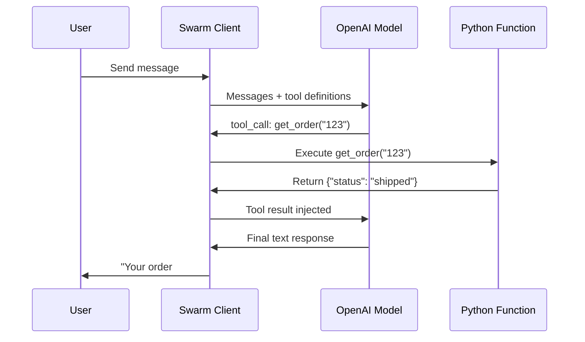
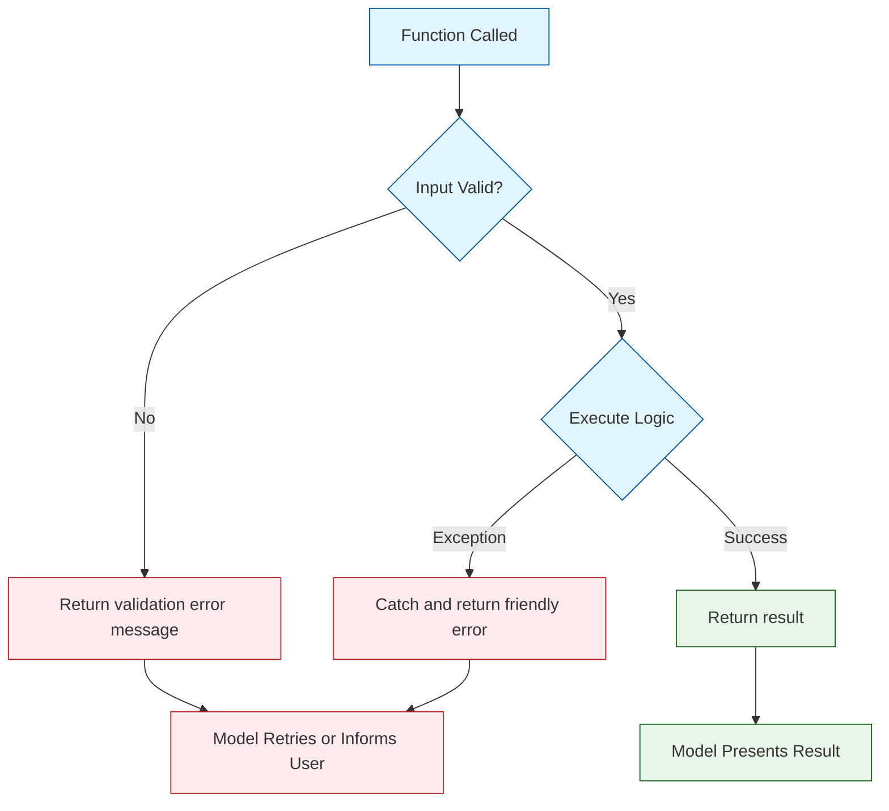
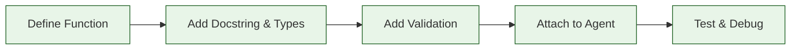

# Chapter 3: Function Calling & Tools

In this chapter, you will learn how to equip Swarm agents with real capabilities by defining Python functions they can call as tools. Function calling is what transforms an agent from a chatbot into an actionable assistant.

## How Function Calling Works in Swarm

When you attach functions to an agent, Swarm automatically converts them into OpenAI tool definitions. The model decides when to invoke a function based on the conversation context, and Swarm handles execution and result injection.



## Defining Functions

Any Python function can become a tool. Swarm uses the function's **name**, **docstring**, and **type annotations** to generate the tool schema automatically.

### Basic Function Definition

```python
from swarm import Swarm, Agent

client = Swarm()


def get_order_status(order_id: str) -> str:
    """Look up the current status of an order by its ID."""
    orders = {
        "ORD-001": "shipped",
        "ORD-002": "processing",
        "ORD-003": "delivered",
    }
    status = orders.get(order_id, "not found")
    return f"Order {order_id}: {status}"


def get_tracking_number(order_id: str) -> str:
    """Get the shipping tracking number for an order."""
    tracking = {
        "ORD-001": "FX-789456",
        "ORD-002": "pending",
        "ORD-003": "FX-123789",
    }
    return tracking.get(order_id, "No tracking available")


agent = Agent(
    name="Order Support",
    instructions="""You help customers check their order status and tracking.
    Always use the available tools to look up real data.
    Never guess or make up order information.""",
    functions=[get_order_status, get_tracking_number],
)

response = client.run(
    agent=agent,
    messages=[{"role": "user", "content": "Where is my order ORD-001?"}],
)

print(response.messages[-1]["content"])
# Your order ORD-001 has been shipped! The tracking number is FX-789456.
```

### How Swarm Reads Your Functions

Swarm inspects three things to build the tool schema:

| Element | Source | Used For |
|:--------|:-------|:---------|
| **Tool name** | `function.__name__` | Identifying the tool in API calls |
| **Description** | `function.__doc__` | Telling the model what the tool does |
| **Parameters** | Type annotations | Defining the JSON schema for arguments |

This means your docstrings and type hints directly affect how well the model uses your tools:

```python
# BAD: No docstring, no types - model does not know what this does
def f(x):
    return db.query(x)

# GOOD: Clear docstring and typed parameters
def search_products(query: str, category: str, max_results: int) -> str:
    """Search the product catalog by keyword.

    Args:
        query: Search keywords (e.g., 'wireless headphones')
        category: Product category to filter by (e.g., 'electronics', 'clothing')
        max_results: Maximum number of results to return (1-20)
    """
    # implementation here
    pass
```

## Parameter Types and Validation

### Supported Parameter Types

Swarm supports standard Python types for function parameters:

| Python Type | JSON Schema Type | Example |
|:------------|:----------------|:--------|
| `str` | `string` | `name: str` |
| `int` | `integer` | `count: int` |
| `float` | `number` | `price: float` |
| `bool` | `boolean` | `active: bool` |
| `list` | `array` | `tags: list` |
| `dict` | `object` | `metadata: dict` |

### Input Validation

Always validate inputs inside your functions. The model may produce unexpected values:

```python
def create_refund(order_id: str, amount: float, reason: str) -> str:
    """Process a refund for a customer order.

    Args:
        order_id: The order ID to refund (format: ORD-XXX)
        amount: Refund amount in USD (max $500)
        reason: Reason for the refund
    """
    # Validate order ID format
    if not order_id.startswith("ORD-"):
        return "Error: Invalid order ID format. Expected ORD-XXX."

    # Validate amount
    if amount <= 0:
        return "Error: Refund amount must be positive."
    if amount > 500:
        return "Error: Refunds over $500 require manager approval. Please escalate."

    # Validate reason
    if len(reason.strip()) < 5:
        return "Error: Please provide a more detailed reason for the refund."

    # Process the refund
    return f"Refund of ${amount:.2f} processed for {order_id}. Reason: {reason}"
```

## Returning Results

Functions should return strings that the model can interpret and relay to the user. You have several return strategies:

### Simple String Returns

```python
def check_balance(account_id: str) -> str:
    """Check the account balance."""
    balance = 1250.75  # from database
    return f"Account {account_id} balance: ${balance:.2f}"
```

### Structured Data as JSON Strings

For complex data, return JSON-formatted strings so the model can extract specific fields:

```python
import json


def get_customer_profile(customer_id: str) -> str:
    """Retrieve full customer profile information."""
    profile = {
        "id": customer_id,
        "name": "Alice Johnson",
        "email": "alice@example.com",
        "tier": "gold",
        "since": "2022-03-15",
        "open_tickets": 2,
        "lifetime_value": 4500.00,
    }
    return json.dumps(profile, indent=2)
```

### Returning Agent Objects for Handoffs

A function can return an `Agent` object to trigger a handoff. This is Swarm's primary mechanism for agent-to-agent transfers:

```python
def transfer_to_billing():
    """Transfer the conversation to the billing specialist."""
    return billing_agent


def transfer_to_support():
    """Transfer the conversation to technical support."""
    return support_agent
```

### Return Type Summary

| Return Type | Effect |
|:-----------|:-------|
| `str` | Value is injected as tool result; conversation continues with current agent |
| `Agent` | Swarm hands off to the returned agent |
| `dict` | Automatically serialized to JSON string |
| `Result` | Advanced: can update context variables and/or trigger handoff |

## The Result Object

For advanced control, return a `Result` object that can update context variables and optionally hand off to another agent:

```python
from swarm import Result


def authenticate_user(username: str, password: str) -> Result:
    """Authenticate a user and update context with their info."""
    # Simulate authentication
    if username == "alice" and password == "secret123":
        return Result(
            value="Authentication successful. Welcome, Alice!",
            context_variables={
                "authenticated": True,
                "user_name": "Alice",
                "user_id": "USR-001",
                "account_tier": "gold",
            },
        )
    else:
        return Result(
            value="Authentication failed. Please check your credentials.",
            context_variables={"authenticated": False},
        )


def escalate_with_context(reason: str) -> Result:
    """Escalate to a supervisor, passing along context."""
    return Result(
        value=f"Escalating to supervisor. Reason: {reason}",
        agent=supervisor_agent,
        context_variables={"escalation_reason": reason},
    )
```

## Real-World Tool Patterns

### Database Lookup Tools

```python
import json


def search_knowledge_base(query: str, max_results: int) -> str:
    """Search the internal knowledge base for relevant articles.

    Args:
        query: Search query describing the issue
        max_results: Number of results to return (1-5)
    """
    max_results = min(max(1, max_results), 5)  # clamp to 1-5

    # Simulated search results
    articles = [
        {"id": "KB-101", "title": "Password Reset Guide", "relevance": 0.95},
        {"id": "KB-204", "title": "Two-Factor Authentication Setup", "relevance": 0.87},
        {"id": "KB-150", "title": "Account Recovery Steps", "relevance": 0.82},
    ]

    results = articles[:max_results]
    return json.dumps({"query": query, "results": results, "total": len(articles)})
```

### External API Tools

```python
import json


def get_weather(city: str, units: str) -> str:
    """Get current weather for a city.

    Args:
        city: City name (e.g., 'San Francisco')
        units: Temperature units - 'celsius' or 'fahrenheit'
    """
    try:
        # In production, call a real weather API
        # response = requests.get(f"https://api.weather.com/current?city={city}")
        weather = {
            "city": city,
            "temperature": 72 if units == "fahrenheit" else 22,
            "units": units,
            "condition": "sunny",
            "humidity": 45,
        }
        return json.dumps(weather)
    except Exception as e:
        return json.dumps({"error": f"Failed to fetch weather: {str(e)}"})
```

### Action / Mutation Tools

```python
def create_support_ticket(
    title: str, description: str, priority: str
) -> str:
    """Create a new support ticket.

    Args:
        title: Brief title for the issue
        description: Detailed description of the problem
        priority: Ticket priority - 'low', 'medium', 'high', or 'critical'
    """
    valid_priorities = ["low", "medium", "high", "critical"]
    if priority not in valid_priorities:
        return f"Error: priority must be one of {valid_priorities}"

    # Simulate ticket creation
    ticket_id = "TKT-2024-0042"

    return json.dumps({
        "ticket_id": ticket_id,
        "title": title,
        "priority": priority,
        "status": "open",
        "message": f"Ticket {ticket_id} created successfully.",
    })
```

## Error Handling Best Practices

Robust error handling ensures your agent degrades gracefully when tools fail.



### The Defensive Function Pattern

```python
def transfer_funds(from_account: str, to_account: str, amount: float) -> str:
    """Transfer funds between two accounts.

    Args:
        from_account: Source account ID
        to_account: Destination account ID
        amount: Amount in USD to transfer
    """
    # 1. Validate inputs
    if not from_account or not to_account:
        return "Error: Both account IDs are required."

    if from_account == to_account:
        return "Error: Source and destination accounts must be different."

    if amount <= 0:
        return "Error: Transfer amount must be positive."

    if amount > 10000:
        return "Error: Transfers over $10,000 require manual approval."

    # 2. Execute with error handling
    try:
        # Simulate the transfer
        source_balance = 5000.00
        if amount > source_balance:
            return f"Error: Insufficient funds. Available balance: ${source_balance:.2f}"

        new_balance = source_balance - amount
        return (
            f"Transfer complete. ${amount:.2f} sent from {from_account} to {to_account}. "
            f"Remaining balance: ${new_balance:.2f}"
        )

    except ConnectionError:
        return "Error: Unable to reach the banking service. Please try again later."
    except Exception as e:
        # Log the real error internally; return a safe message
        print(f"INTERNAL ERROR in transfer_funds: {e}")
        return "Error: An unexpected error occurred. A support ticket has been created."
```

## Composing Multiple Tools

Agents become powerful when they have a coordinated set of tools. Design your tool sets around a coherent responsibility:

```python
from swarm import Swarm, Agent
import json

client = Swarm()


# --- Inventory Tools ---

def check_inventory(product_id: str) -> str:
    """Check stock availability for a product."""
    stock = {"PROD-001": 45, "PROD-002": 0, "PROD-003": 12}
    qty = stock.get(product_id, -1)
    if qty < 0:
        return f"Product {product_id} not found in catalog."
    return f"Product {product_id}: {qty} units in stock."


def get_product_details(product_id: str) -> str:
    """Get detailed product information."""
    products = {
        "PROD-001": {"name": "Wireless Mouse", "price": 29.99, "category": "peripherals"},
        "PROD-002": {"name": "USB-C Hub", "price": 49.99, "category": "peripherals"},
        "PROD-003": {"name": "Mechanical Keyboard", "price": 89.99, "category": "peripherals"},
    }
    product = products.get(product_id)
    if not product:
        return f"Product {product_id} not found."
    return json.dumps(product)


def place_order(product_id: str, quantity: int, shipping_address: str) -> str:
    """Place an order for a product.

    Args:
        product_id: The product to order
        quantity: Number of units (1-10)
        shipping_address: Full shipping address
    """
    if quantity < 1 or quantity > 10:
        return "Error: Quantity must be between 1 and 10."
    if len(shipping_address) < 10:
        return "Error: Please provide a complete shipping address."
    return json.dumps({
        "order_id": "ORD-2024-0099",
        "product_id": product_id,
        "quantity": quantity,
        "status": "confirmed",
    })


# --- Compose into an Agent ---

order_agent = Agent(
    name="Order Agent",
    instructions="""You help customers browse products and place orders.

    Workflow:
    1. Help the customer find the right product using get_product_details
    2. Check availability with check_inventory
    3. If in stock, collect shipping address and place the order
    4. Confirm the order details with the customer

    Always check inventory before placing an order.
    """,
    functions=[check_inventory, get_product_details, place_order],
)

response = client.run(
    agent=order_agent,
    messages=[
        {"role": "user", "content": "I'd like to buy a mechanical keyboard. Ship to 123 Main St, Springfield, IL 62701."}
    ],
)

for msg in response.messages:
    if msg.get("content"):
        print(f"{msg['role']}: {msg['content']}")
```

## Tool Design Guidelines

| Guideline | Rationale |
|:----------|:----------|
| One action per function | Easier for the model to reason about |
| Descriptive docstrings | Model relies on descriptions to pick the right tool |
| Full type annotations | Generates accurate JSON schemas |
| Return strings | Model needs text it can interpret |
| Validate all inputs | Models produce unexpected values |
| Handle all exceptions | Unhandled exceptions crash the conversation loop |
| Keep tool count under 8 | Too many tools confuse the model; split across agents |
| Use consistent naming | `get_*`, `create_*`, `update_*`, `delete_*` prefixes |

## Debugging Function Calls

When tools do not behave as expected, inspect the full message history:

```python
response = client.run(
    agent=order_agent,
    messages=[{"role": "user", "content": "Check stock for PROD-001"}],
)

# Print every message to trace the conversation
for i, msg in enumerate(response.messages):
    role = msg.get("role", "unknown")
    content = msg.get("content", "")
    tool_calls = msg.get("tool_calls", [])

    print(f"\n--- Message {i} (role={role}) ---")

    if content:
        print(f"  Content: {content[:200]}")

    if tool_calls:
        for tc in tool_calls:
            fn = tc["function"]
            print(f"  Tool call: {fn['name']}({fn['arguments']})")

    if role == "tool":
        print(f"  Tool result: {content[:200]}")
```

## Summary

Function calling transforms Swarm agents from conversational assistants into capable actors. By defining Python functions with clear docstrings and type annotations, you give agents the ability to look up data, perform actions, and hand off to other agents.



## Key Takeaways

1. **Swarm auto-generates tool schemas** from your function name, docstring, and type annotations -- invest in all three.
2. **Always validate inputs** inside your functions. Models can produce unexpected argument values.
3. **Return strings** (or JSON-serialized strings) so the model can interpret and relay results.
4. **Use the `Result` object** when you need to update context variables or trigger a handoff from within a function.
5. **Handle all exceptions** gracefully. Unhandled errors crash the conversation loop.
6. **Keep tool sets cohesive** -- group related functions on one agent and limit to 5-8 tools per agent.

## Next Steps

In [Chapter 4: Routines](04-routines.md), you will learn how to:

- Define multi-step workflows as agent routines
- Encode standard operating procedures in instructions
- Build guided conversation flows that follow a specific sequence
- Compose routines for complex business processes

---

**Practice Exercises:**

1. Build a "restaurant assistant" agent with tools for searching menus, checking table availability, and making reservations.
2. Write a function that returns a `Result` object to authenticate a user and update context variables.
3. Create a debugging script that logs every tool call and result in a Swarm conversation.
4. Design a tool set for a project management agent (create tasks, assign owners, update status, list tasks).

*Built with insights from the [OpenAI Swarm](https://github.com/openai/swarm) project.*
