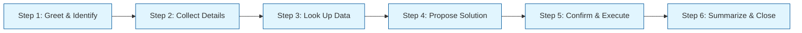
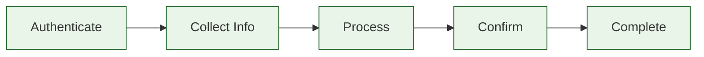
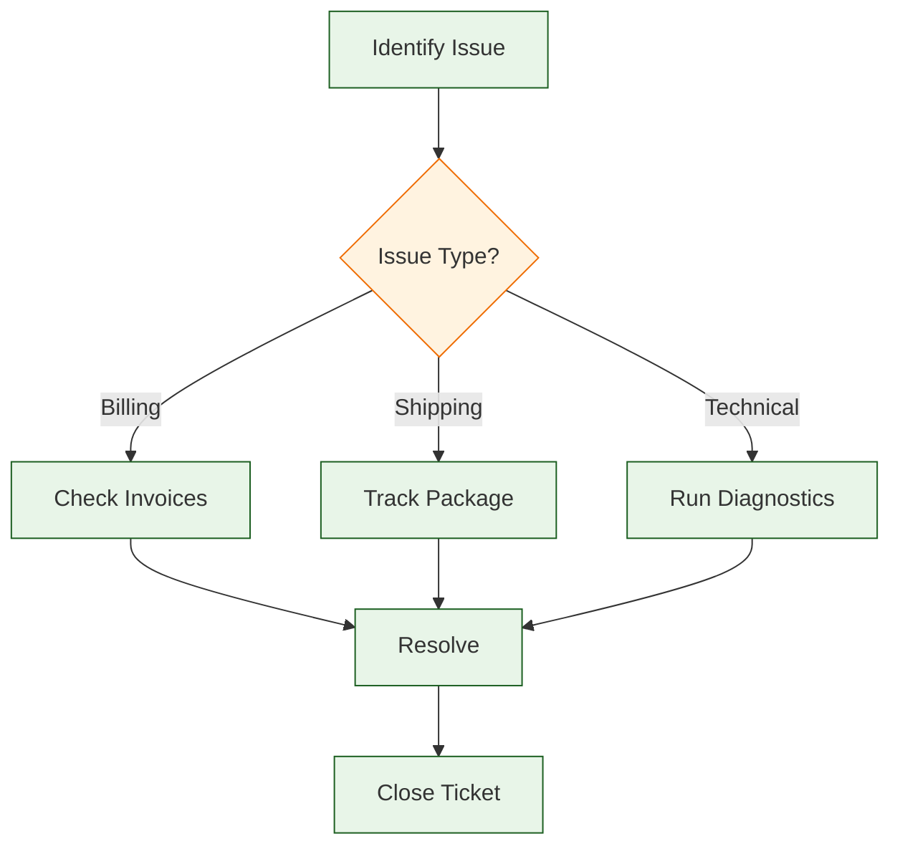
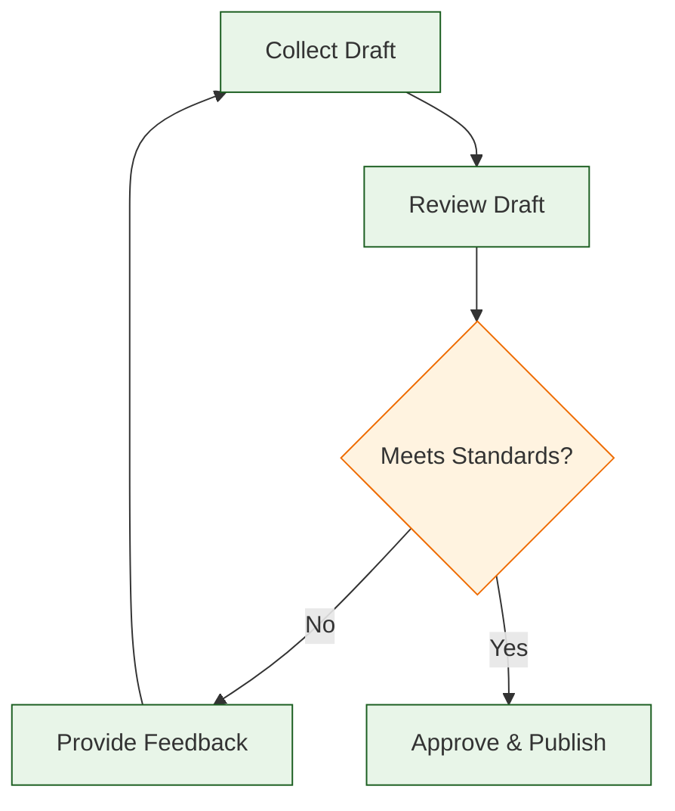
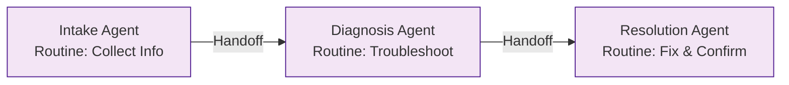
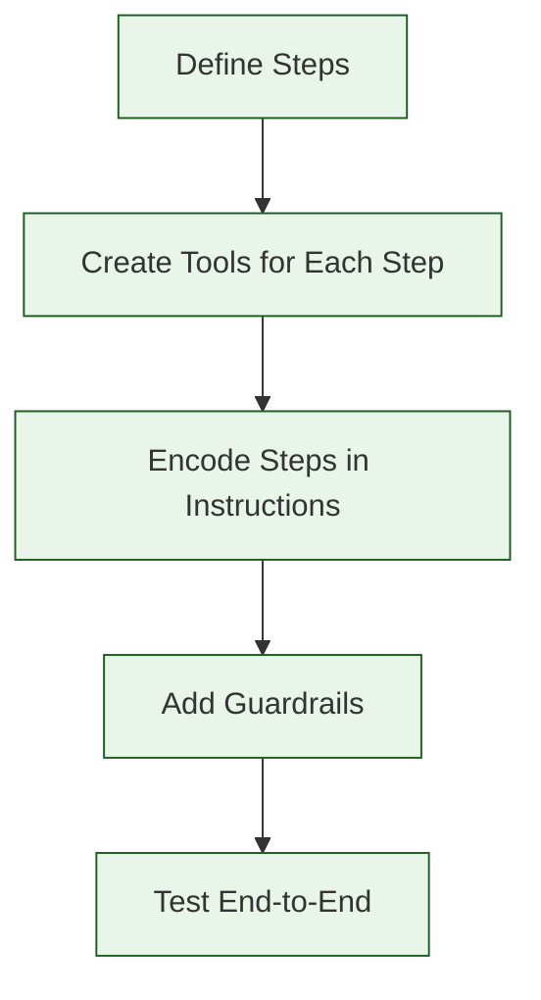

# Chapter 4: Routines

Welcome to **Chapter 4: Routines**. In this part of **OpenAI Swarm Tutorial: Lightweight Multi-Agent Orchestration**, you will build an intuitive mental model first, then move into concrete implementation details and practical production tradeoffs.


In this chapter, you will learn how to build routines -- multi-step workflows that guide agents through a predictable sequence of actions. Routines are the Swarm equivalent of standard operating procedures: they turn free-form conversations into structured, repeatable processes.

## What is a Routine?

In Swarm, a **routine** is not a separate class or API. It is a design pattern where an agent's instructions encode a step-by-step workflow, and its functions provide the tools needed at each step. The agent follows the prescribed sequence, collecting information, calling tools, and producing results in a defined order.



> **Key insight**: Routines are encoded in the agent's instructions, not in a separate workflow engine. This keeps the system lightweight and easy to reason about.

## Why Use Routines?

| Benefit | Description |
|:--------|:------------|
| **Consistency** | Every customer gets the same structured experience |
| **Completeness** | Required steps are never skipped |
| **Auditability** | Each step produces traceable artifacts |
| **Reusability** | The same routine pattern works across different agents |
| **Reliability** | Reduces hallucination by constraining the agent's behavior |

## Your First Routine

Let's build a customer support routine that follows a defined intake process:

```python
from swarm import Swarm, Agent
import json

client = Swarm()


# --- Step Functions ---

def verify_customer(account_id: str) -> str:
    """Verify a customer's account by their account ID."""
    accounts = {
        "ACC-001": {"name": "Alice Johnson", "tier": "gold", "active": True},
        "ACC-002": {"name": "Bob Smith", "tier": "standard", "active": True},
        "ACC-003": {"name": "Carol Davis", "tier": "standard", "active": False},
    }
    account = accounts.get(account_id)
    if not account:
        return "Error: Account not found. Please verify the account ID."
    if not account["active"]:
        return f"Account {account_id} is suspended. Transfer to account recovery."
    return json.dumps({"account_id": account_id, **account})


def lookup_recent_orders(account_id: str) -> str:
    """Look up the most recent orders for a customer account."""
    orders = {
        "ACC-001": [
            {"order_id": "ORD-101", "date": "2024-01-15", "status": "delivered", "total": 89.99},
            {"order_id": "ORD-098", "date": "2024-01-10", "status": "shipped", "total": 45.50},
        ],
        "ACC-002": [
            {"order_id": "ORD-095", "date": "2024-01-12", "status": "processing", "total": 120.00},
        ],
    }
    result = orders.get(account_id, [])
    return json.dumps({"account_id": account_id, "orders": result})


def create_support_ticket(
    account_id: str, category: str, description: str, priority: str
) -> str:
    """Create a support ticket after collecting all required information.

    Args:
        account_id: The verified customer account ID
        category: Issue category - 'billing', 'shipping', 'product', 'technical'
        description: Detailed description of the issue
        priority: Priority level - 'low', 'medium', 'high'
    """
    valid_categories = ["billing", "shipping", "product", "technical"]
    if category not in valid_categories:
        return f"Error: Category must be one of {valid_categories}"

    ticket = {
        "ticket_id": "TKT-2024-0042",
        "account_id": account_id,
        "category": category,
        "description": description,
        "priority": priority,
        "status": "open",
    }
    return json.dumps(ticket)


# --- Routine Agent ---

support_intake_agent = Agent(
    name="Support Intake",
    instructions="""You are a support intake agent. Follow this routine exactly:

    ## ROUTINE: Customer Support Intake

    ### Step 1: Greet and Identify
    - Greet the customer warmly
    - Ask for their account ID if not already provided

    ### Step 2: Verify Account
    - Use verify_customer() to confirm the account
    - If the account is not found or suspended, inform the customer and stop
    - Address the customer by name once verified

    ### Step 3: Understand the Issue
    - Ask the customer to describe their issue
    - Ask clarifying questions if the description is vague
    - Determine the category: billing, shipping, product, or technical

    ### Step 4: Check Context (if relevant)
    - For order-related issues, use lookup_recent_orders() to gather context
    - Reference specific orders when discussing the issue

    ### Step 5: Create Ticket
    - Summarize the issue back to the customer
    - Confirm the category and priority
    - Use create_support_ticket() to log the ticket

    ### Step 6: Close
    - Share the ticket ID with the customer
    - Set expectations for follow-up (24-48 hours)
    - Ask if there is anything else they need

    IMPORTANT: Do not skip steps. Complete each step before moving to the next.
    """,
    functions=[verify_customer, lookup_recent_orders, create_support_ticket],
)

# Run the routine
response = client.run(
    agent=support_intake_agent,
    messages=[{"role": "user", "content": "Hi, I need help with a recent order. My account is ACC-001."}],
)

print(response.messages[-1]["content"])
```

## Routine Design Patterns

### Linear Routine

Steps execute in a fixed sequence. Best for intake processes, onboarding, and form-filling.



```python
onboarding_agent = Agent(
    name="Onboarding",
    instructions="""Follow this onboarding routine:

    Step 1: Welcome the user and explain the setup process (3 steps).
    Step 2: Ask for their company name and team size.
    Step 3: Ask for their primary use case (support, sales, or operations).
    Step 4: Based on the use case, recommend a plan and confirm.
    Step 5: Summarize selections and provide next steps.

    Always tell the user which step they are on (e.g., "Step 2 of 5").
    """,
)
```

### Branching Routine

The routine takes different paths based on conditions discovered during execution.



```python
import json


def check_invoices(account_id: str) -> str:
    """Look up recent invoices for a billing issue."""
    return json.dumps({"invoices": [{"id": "INV-001", "amount": 99.99, "status": "paid"}]})


def track_package(tracking_number: str) -> str:
    """Track a package by its tracking number."""
    return json.dumps({"tracking": tracking_number, "status": "in_transit", "eta": "2024-01-20"})


def run_diagnostics(product_id: str) -> str:
    """Run basic diagnostics on a product or service."""
    return json.dumps({"product": product_id, "status": "healthy", "issues": []})


branching_agent = Agent(
    name="Issue Resolver",
    instructions="""Follow this diagnostic routine:

    Step 1: Ask the customer to describe their issue.

    Step 2: Classify the issue:
    - If billing-related -> use check_invoices() and resolve
    - If shipping-related -> use track_package() and provide update
    - If technical -> use run_diagnostics() and troubleshoot

    Step 3: Present findings and proposed resolution.

    Step 4: Confirm resolution with the customer and close.
    """,
    functions=[check_invoices, track_package, run_diagnostics],
)
```

### Looping Routine

The routine repeats a step until a condition is met. Useful for iterative refinement.



```python
def evaluate_proposal(proposal: str) -> str:
    """Evaluate a proposal against quality criteria.

    Args:
        proposal: The proposal text to evaluate
    """
    criteria = {
        "has_objective": "objective" in proposal.lower() or "goal" in proposal.lower(),
        "has_timeline": "week" in proposal.lower() or "day" in proposal.lower() or "month" in proposal.lower(),
        "has_budget": "$" in proposal or "budget" in proposal.lower(),
        "min_length": len(proposal) > 100,
    }
    passed = all(criteria.values())
    return json.dumps({
        "passed": passed,
        "criteria": criteria,
        "feedback": "All criteria met." if passed else "Please address failing criteria.",
    })


review_agent = Agent(
    name="Proposal Reviewer",
    instructions="""You help users refine proposals through iterative review.

    ## ROUTINE

    Step 1: Ask the user to submit their proposal.
    Step 2: Evaluate it using evaluate_proposal().
    Step 3: If it fails any criteria, explain what is missing and ask for a revision.
    Step 4: Repeat Steps 2-3 until all criteria pass (maximum 3 iterations).
    Step 5: Once approved, congratulate the user and summarize the final proposal.

    If the proposal does not pass after 3 iterations, provide a summary of
    remaining issues and suggest the user consult with their manager.
    """,
    functions=[evaluate_proposal],
)
```

## Multi-Step Data Collection

A common use of routines is collecting structured data from the user across multiple turns:

```python
from swarm import Swarm, Agent, Result

client = Swarm()


def save_lead(context_variables: dict) -> str:
    """Save the collected lead information to the CRM."""
    required = ["lead_name", "lead_email", "lead_company", "lead_use_case"]
    missing = [k for k in required if k not in context_variables]

    if missing:
        return f"Error: Missing required fields: {', '.join(missing)}"

    lead = {
        "name": context_variables["lead_name"],
        "email": context_variables["lead_email"],
        "company": context_variables["lead_company"],
        "use_case": context_variables["lead_use_case"],
        "status": "new",
    }
    return json.dumps({"lead_id": "LEAD-0042", "saved": True, **lead})


def update_lead_field(field: str, value: str) -> Result:
    """Update a single field in the lead record being collected.

    Args:
        field: The field name to update (lead_name, lead_email, lead_company, lead_use_case)
        value: The value to set for this field
    """
    valid_fields = ["lead_name", "lead_email", "lead_company", "lead_use_case"]
    if field not in valid_fields:
        return Result(value=f"Error: field must be one of {valid_fields}")

    return Result(
        value=f"Recorded {field}: {value}",
        context_variables={field: value},
    )


lead_collector = Agent(
    name="Lead Collector",
    instructions="""You collect lead information through a friendly conversation.

    ## ROUTINE

    Step 1: Introduce yourself and explain you need a few details.
    Step 2: Ask for the person's full name. Save with update_lead_field("lead_name", ...).
    Step 3: Ask for their email address. Save with update_lead_field("lead_email", ...).
    Step 4: Ask for their company name. Save with update_lead_field("lead_company", ...).
    Step 5: Ask about their use case. Save with update_lead_field("lead_use_case", ...).
    Step 6: Confirm all collected information with the user.
    Step 7: If confirmed, call save_lead() to persist the record.
    Step 8: Share the lead ID and thank them.

    Collect one field at a time. Do not ask for multiple fields in one message.
    If the user provides information out of order, save it and continue with missing fields.
    """,
    functions=[update_lead_field, save_lead],
)

# Start the routine
response = client.run(
    agent=lead_collector,
    messages=[{"role": "user", "content": "I'd like to learn more about your product."}],
    context_variables={},
)
print(response.messages[-1]["content"])
```

## Composing Routines with Handoffs

Complex workflows can span multiple agents, where each agent runs its own routine and hands off to the next:



```python
from swarm import Swarm, Agent

client = Swarm()


def transfer_to_diagnosis():
    """Transfer to the diagnosis agent after intake is complete."""
    return diagnosis_agent


def transfer_to_resolution():
    """Transfer to the resolution agent after diagnosis is complete."""
    return resolution_agent


def lookup_error_code(error_code: str) -> str:
    """Look up an error code in the knowledge base."""
    errors = {
        "E-001": {"cause": "Database connection timeout", "fix": "Restart the DB service"},
        "E-002": {"cause": "Invalid API key", "fix": "Regenerate key in Settings > API"},
        "E-003": {"cause": "Rate limit exceeded", "fix": "Wait 60 seconds and retry"},
    }
    info = errors.get(error_code)
    if not info:
        return f"Error code {error_code} not found in knowledge base."
    return json.dumps(info)


def apply_fix(fix_action: str, account_id: str) -> str:
    """Apply a fix action to the customer's account.

    Args:
        fix_action: Description of the fix to apply
        account_id: The customer's account ID
    """
    return f"Fix applied to {account_id}: {fix_action}. Changes take effect in 5 minutes."


intake_agent = Agent(
    name="Intake",
    instructions="""## ROUTINE: Intake
    Step 1: Ask for the customer's account ID and the error they are seeing.
    Step 2: Confirm you have the account ID and error code.
    Step 3: Transfer to the diagnosis agent using transfer_to_diagnosis().

    Do NOT attempt to diagnose or fix the issue yourself.
    """,
    functions=[transfer_to_diagnosis],
)

diagnosis_agent = Agent(
    name="Diagnosis",
    instructions="""## ROUTINE: Diagnosis
    Step 1: Look up the error code using lookup_error_code().
    Step 2: Explain the root cause to the customer in simple terms.
    Step 3: Explain the recommended fix.
    Step 4: Transfer to the resolution agent using transfer_to_resolution().

    Do NOT apply the fix yourself -- that is the resolution agent's job.
    """,
    functions=[lookup_error_code, transfer_to_resolution],
)

resolution_agent = Agent(
    name="Resolution",
    instructions="""## ROUTINE: Resolution
    Step 1: Confirm the fix action with the customer before applying.
    Step 2: Apply the fix using apply_fix().
    Step 3: Verify the fix was successful.
    Step 4: Ask if there is anything else the customer needs.
    Step 5: Close the conversation with a summary.
    """,
    functions=[apply_fix],
)
```

## Routine Guardrails

Add safeguards to prevent routines from going off track:

| Guardrail | Implementation | Purpose |
|:----------|:--------------|:--------|
| **Max iterations** | Counter in instructions ("max 3 attempts") | Prevent infinite loops |
| **Required fields** | Validation in save/submit functions | Ensure completeness |
| **Step tracking** | Context variable for current step | Enable resumability |
| **Timeout hint** | Instruction to wrap up after N turns | Prevent long sessions |
| **Scope lock** | "Do NOT handle X" in instructions | Prevent scope creep |

```python
guided_agent = Agent(
    name="Guided Agent",
    instructions="""Follow this routine strictly.

    ## GUARDRAILS
    - Maximum conversation length: 10 turns
    - If the user goes off-topic, gently redirect to the current step
    - If you cannot resolve in 10 turns, create a ticket and escalate
    - Never skip a step, even if the user asks you to

    ## ROUTINE
    Step 1: ...
    Step 2: ...
    Step 3: ...
    """,
)
```

## Testing Routines

Verify that your routines execute all steps in the correct order:

```python
from swarm import Swarm, Agent

client = Swarm()


def test_routine_completeness():
    """Test that the intake routine completes all steps."""

    # Simulate a multi-turn conversation
    messages = [
        {"role": "user", "content": "Hi, I need help. My account is ACC-001."},
    ]

    response = client.run(agent=support_intake_agent, messages=messages)

    # Continue the conversation
    follow_ups = [
        "My recent order ORD-101 arrived damaged.",
        "Yes, the screen was cracked when I opened the box.",
        "High priority please -- I need it for work.",
        "Yes, that summary is correct. Please create the ticket.",
        "No, that's everything. Thank you!",
    ]

    for msg in follow_ups:
        messages = response.messages + [{"role": "user", "content": msg}]
        response = client.run(agent=support_intake_agent, messages=messages)

    # Verify the routine completed
    full_text = " ".join(
        m.get("content", "") for m in response.messages if m.get("content")
    )

    checks = {
        "greeted_customer": "alice" in full_text.lower() or "welcome" in full_text.lower(),
        "verified_account": "ACC-001" in full_text,
        "created_ticket": "TKT-" in full_text,
        "shared_ticket_id": "TKT-2024" in full_text,
    }

    for check, passed in checks.items():
        status = "PASS" if passed else "FAIL"
        print(f"[{status}] {check}")

    return all(checks.values())


success = test_routine_completeness()
print(f"\nRoutine test: {'PASSED' if success else 'FAILED'}")
```

## Summary

Routines bring structure and predictability to agent conversations. By encoding step-by-step workflows in an agent's instructions and providing the right tools at each step, you create agents that consistently deliver complete, auditable interactions.



## Key Takeaways

1. **Routines are an instruction pattern**, not a separate API. Encode your workflow steps directly in the agent's system prompt.
2. **Design routines as linear, branching, or looping** depending on your use case. Linear routines are simplest; use branching for conditional logic and looping for iterative refinement.
3. **Provide one tool per step** so the agent has a clear action to take at each point in the routine.
4. **Add guardrails** such as max iterations, required field validation, and scope locks to keep routines on track.
5. **Compose routines across agents** by having each agent run its own routine segment and hand off to the next agent.
6. **Test routines end-to-end** with multi-turn conversations to verify all steps execute in order.

## Next Steps

In [Chapter 5: Agent Handoffs](05-handoffs.md), you will learn how to:

- Implement seamless control transfers between agents
- Preserve conversation context during handoffs
- Design handoff strategies for different use cases
- Handle handoff failures gracefully

---

**Practice Exercises:**

1. Build a 5-step onboarding routine that collects company info, selects a plan, and creates an account.
2. Create a branching routine that handles three different support categories with different diagnostic steps.
3. Design a looping routine that reviews and refines a document until it passes quality criteria.
4. Chain three agents together, each running a different routine segment in a support pipeline.

*Built with insights from the [OpenAI Swarm](https://github.com/openai/swarm) project.*

## What Problem Does This Solve?

Most teams struggle here because the hard part is not writing more code, but deciding clear boundaries for `Step`, `account`, `Agent` so behavior stays predictable as complexity grows.

In practical terms, this chapter helps you avoid three common failures:

- coupling core logic too tightly to one implementation path
- missing the handoff boundaries between setup, execution, and validation
- shipping changes without clear rollback or observability strategy

After working through this chapter, you should be able to reason about `Chapter 4: Routines` as an operating subsystem inside **OpenAI Swarm Tutorial: Lightweight Multi-Agent Orchestration**, with explicit contracts for inputs, state transitions, and outputs.

Use the implementation notes around `name`, `account_id`, `customer` as your checklist when adapting these patterns to your own repository.

## How it Works Under the Hood

Under the hood, `Chapter 4: Routines` usually follows a repeatable control path:

1. **Context bootstrap**: initialize runtime config and prerequisites for `Step`.
2. **Input normalization**: shape incoming data so `account` receives stable contracts.
3. **Core execution**: run the main logic branch and propagate intermediate state through `Agent`.
4. **Policy and safety checks**: enforce limits, auth scopes, and failure boundaries.
5. **Output composition**: return canonical result payloads for downstream consumers.
6. **Operational telemetry**: emit logs/metrics needed for debugging and performance tuning.

When debugging, walk this sequence in order and confirm each stage has explicit success/failure conditions.

## Source Walkthrough

Use the following upstream sources to verify implementation details while reading this chapter:

- [View Repo](https://github.com/openai/swarm)
  Why it matters: authoritative reference on `View Repo` (github.com).
- [Awesome Code Docs](https://github.com/johnxie/awesome-code-docs)
  Why it matters: authoritative reference on `Awesome Code Docs` (github.com).

Suggested trace strategy:
- search upstream code for `Step` and `account` to map concrete implementation paths
- compare docs claims against actual runtime/config code before reusing patterns in production

## Chapter Connections

- [Tutorial Index](index.md)
- [Previous Chapter: Chapter 3: Function Calling & Tools](03-function-calling.md)
- [Next Chapter: Chapter 5: Agent Handoffs](05-handoffs.md)
- [Main Catalog](../../README.md#-tutorial-catalog)
- [A-Z Tutorial Directory](../../discoverability/tutorial-directory.md)
