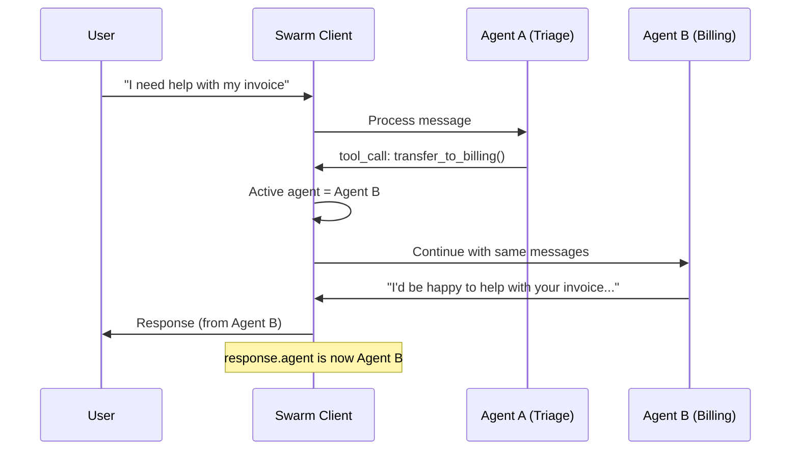
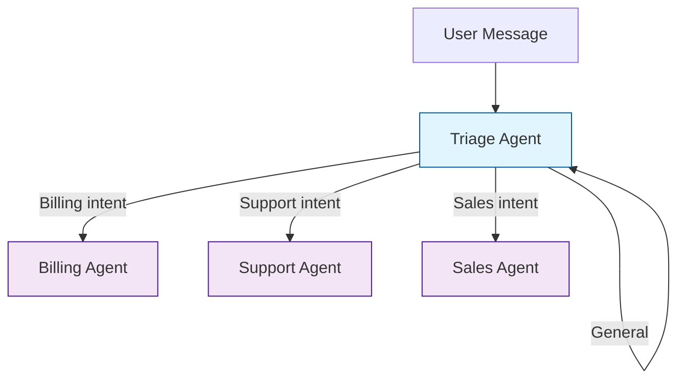
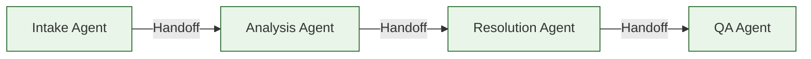
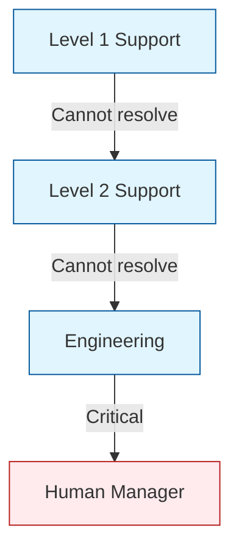
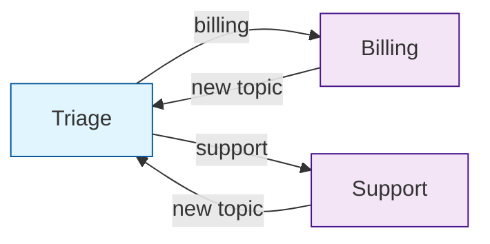
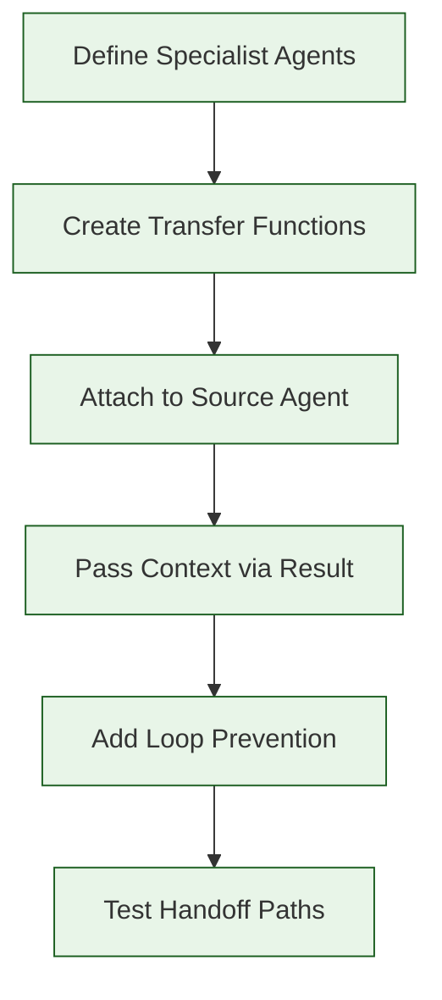

# Chapter 5: Agent Handoffs

In this chapter, you will learn how to implement seamless control transfers between agents. Handoffs are the core mechanism that makes Swarm a multi-agent framework -- they allow specialized agents to collaborate on a single conversation.

## What is a Handoff?

A **handoff** occurs when one agent transfers control of the conversation to another agent. The new agent takes over completely, bringing its own instructions, tools, and persona. Swarm handles this transition transparently -- the user experiences a continuous conversation.



## How Handoffs Work

A handoff is triggered when a function attached to an agent **returns another Agent object**. Swarm detects this, switches the active agent, and continues the conversation loop with the new agent.

```python
from swarm import Swarm, Agent

client = Swarm()


# Step 1: Define the target agents
billing_agent = Agent(
    name="Billing",
    instructions="You are a billing specialist. Help with invoices, payments, and refunds.",
)

support_agent = Agent(
    name="Support",
    instructions="You are a technical support engineer. Help troubleshoot issues.",
)


# Step 2: Define transfer functions that return Agent objects
def transfer_to_billing():
    """Transfer to the billing specialist for invoice and payment questions."""
    return billing_agent


def transfer_to_support():
    """Transfer to technical support for troubleshooting."""
    return support_agent


# Step 3: Create the triage agent with transfer functions
triage_agent = Agent(
    name="Triage",
    instructions="""You are a triage agent. Determine the user's need and transfer:
    - Billing/payment/invoice questions -> transfer_to_billing()
    - Technical issues/bugs/errors -> transfer_to_support()
    Never try to solve the problem yourself. Always transfer.""",
    functions=[transfer_to_billing, transfer_to_support],
)


# Step 4: Run the conversation
response = client.run(
    agent=triage_agent,
    messages=[{"role": "user", "content": "I was double-charged on my last invoice."}],
)

print(f"Started with: Triage")
print(f"Ended with:   {response.agent.name}")
print(f"Response:     {response.messages[-1]['content']}")
# Started with: Triage
# Ended with:   Billing
# Response:     I'm sorry to hear about the double charge. Let me look into that...
```

## Handoff Patterns

### One-to-Many: Triage Router

The most common pattern. A single triage agent routes to multiple specialists.



```python
def transfer_to_billing():
    """Transfer to billing for payment and invoice questions."""
    return billing_agent

def transfer_to_support():
    """Transfer to support for technical issues."""
    return support_agent

def transfer_to_sales():
    """Transfer to sales for pricing and plan questions."""
    return sales_agent

triage_agent = Agent(
    name="Triage",
    instructions="""Classify the user's intent and transfer:
    - Payment/invoice/billing -> transfer_to_billing()
    - Bug/error/technical -> transfer_to_support()
    - Pricing/plan/upgrade -> transfer_to_sales()

    If the intent is unclear, ask a clarifying question.
    """,
    functions=[transfer_to_billing, transfer_to_support, transfer_to_sales],
)
```

### Sequential Chain: Pipeline

Agents form a pipeline where each agent completes its task and passes to the next.



```python
def transfer_to_analysis():
    """Transfer to analysis after intake is complete."""
    return analysis_agent

def transfer_to_resolution():
    """Transfer to resolution after analysis is complete."""
    return resolution_agent

def transfer_to_qa():
    """Transfer to QA for final review."""
    return qa_agent

intake_agent = Agent(
    name="Intake",
    instructions="""Collect the customer's issue details:
    1. Account ID
    2. Issue description
    3. When it started
    Then transfer to analysis.""",
    functions=[transfer_to_analysis],
)

analysis_agent = Agent(
    name="Analysis",
    instructions="""Analyze the issue using available tools.
    Identify the root cause and proposed fix.
    Then transfer to resolution.""",
    functions=[lookup_logs, check_config, transfer_to_resolution],
)

resolution_agent = Agent(
    name="Resolution",
    instructions="""Apply the proposed fix.
    Confirm with the customer that the issue is resolved.
    Then transfer to QA for final review.""",
    functions=[apply_patch, restart_service, transfer_to_qa],
)

qa_agent = Agent(
    name="QA",
    instructions="""Review the conversation and actions taken.
    Verify the resolution is complete and correct.
    Summarize the case and close.""",
)
```

### Escalation Ladder

Agents escalate up a chain of increasing authority.



```python
def escalate_to_l2():
    """Escalate to Level 2 support for advanced troubleshooting."""
    return l2_agent

def escalate_to_engineering():
    """Escalate to engineering for code-level investigation."""
    return engineering_agent

l1_agent = Agent(
    name="Support L1",
    instructions="""You are Level 1 support. Handle:
    - Password resets
    - Basic connectivity issues
    - FAQ questions

    If the issue requires system access or is not resolved after 3 messages,
    escalate to L2 using escalate_to_l2().
    """,
    functions=[reset_password, check_connectivity, escalate_to_l2],
)

l2_agent = Agent(
    name="Support L2",
    instructions="""You are Level 2 support with system access. Handle:
    - Configuration issues
    - Log analysis
    - Service restarts

    If the issue requires code changes, escalate to engineering.
    """,
    functions=[query_logs, restart_service, modify_config, escalate_to_engineering],
)

engineering_agent = Agent(
    name="Engineering",
    instructions="""You are an engineering responder. Handle:
    - Bug investigation
    - Hotfix deployment
    - Architecture-level issues

    Document all findings and actions for the post-mortem.
    """,
    functions=[search_codebase, deploy_hotfix, create_jira_ticket],
)
```

### Bidirectional Handoff: Return to Triage

Allow specialist agents to hand back to triage if the user changes topics.



```python
def return_to_triage():
    """Return to triage to handle a new topic."""
    return triage_agent

billing_agent = Agent(
    name="Billing",
    instructions="""You handle billing questions.
    If the user asks about something outside billing, use return_to_triage()
    to route them to the right agent.""",
    functions=[check_invoice, process_refund, return_to_triage],
)

support_agent = Agent(
    name="Support",
    instructions="""You handle technical issues.
    If the user asks about something outside technical support, use return_to_triage()
    to route them to the right agent.""",
    functions=[check_status, run_diagnostic, return_to_triage],
)
```

## Passing Context During Handoffs

### Using the Result Object

The `Result` object lets you update context variables during a handoff, ensuring the receiving agent has the information it needs:

```python
from swarm import Agent, Result


def transfer_to_billing_with_context(issue_summary: str) -> Result:
    """Transfer to billing with a summary of the issue.

    Args:
        issue_summary: Brief summary of the billing issue
    """
    return Result(
        value=f"Transferring to billing specialist. Issue: {issue_summary}",
        agent=billing_agent,
        context_variables={
            "issue_summary": issue_summary,
            "transferred_from": "triage",
            "transfer_reason": "billing_issue",
        },
    )
```

### Dynamic Instructions with Context

The receiving agent can use dynamic instructions to incorporate handoff context:

```python
def billing_instructions(context_variables):
    summary = context_variables.get("issue_summary", "No summary provided")
    source = context_variables.get("transferred_from", "unknown")
    customer = context_variables.get("customer_name", "customer")

    return f"""You are a billing specialist.

    Transfer context:
    - Transferred from: {source}
    - Issue summary: {summary}
    - Customer: {customer}

    Start by acknowledging the issue summary. Do not ask the customer
    to repeat information they already provided.
    """

billing_agent = Agent(
    name="Billing",
    instructions=billing_instructions,
)
```

## Full Example: Customer Service System

Here is a complete multi-agent customer service system with handoffs:

```python
from swarm import Swarm, Agent, Result
import json

client = Swarm()


# --- Shared Tools ---

def lookup_customer(account_id: str) -> str:
    """Look up customer information by account ID."""
    customers = {
        "ACC-001": {"name": "Alice Johnson", "tier": "gold", "balance": 150.00},
        "ACC-002": {"name": "Bob Smith", "tier": "standard", "balance": 0.00},
    }
    customer = customers.get(account_id)
    if not customer:
        return "Customer not found."
    return json.dumps({"account_id": account_id, **customer})


# --- Transfer Functions ---

def transfer_to_billing(issue_summary: str) -> Result:
    """Transfer to billing agent with issue context.

    Args:
        issue_summary: Summary of the billing issue
    """
    return Result(
        value=f"Connecting you with our billing specialist...",
        agent=billing_agent,
        context_variables={"issue_summary": issue_summary},
    )


def transfer_to_support(issue_summary: str) -> Result:
    """Transfer to support agent with issue context.

    Args:
        issue_summary: Summary of the technical issue
    """
    return Result(
        value=f"Connecting you with technical support...",
        agent=support_agent,
        context_variables={"issue_summary": issue_summary},
    )


def return_to_triage():
    """Return to triage for a different topic."""
    return triage_agent


# --- Specialist Tools ---

def check_invoice(invoice_id: str) -> str:
    """Check the details of a specific invoice."""
    return json.dumps({
        "invoice_id": invoice_id,
        "amount": 99.99,
        "status": "paid",
        "date": "2024-01-15",
    })


def process_refund(invoice_id: str, amount: float, reason: str) -> str:
    """Process a refund for an invoice.

    Args:
        invoice_id: The invoice to refund
        amount: Refund amount
        reason: Reason for the refund
    """
    if amount > 200:
        return "Refunds over $200 require manager approval. Escalating."
    return json.dumps({
        "refund_id": "REF-001",
        "invoice_id": invoice_id,
        "amount": amount,
        "status": "processed",
    })


def check_service_status(service_name: str) -> str:
    """Check the operational status of a service."""
    return json.dumps({
        "service": service_name,
        "status": "operational",
        "uptime": "99.97%",
        "last_incident": "2024-01-10",
    })


# --- Agent Definitions ---

def triage_instructions(context_variables):
    customer = context_variables.get("customer_name", "")
    greeting = f"The customer's name is {customer}. " if customer else ""
    return f"""You are a triage agent for Acme Services. {greeting}

    Determine the user's need and transfer to the right specialist:
    - Billing/invoice/payment/refund -> transfer_to_billing(summary)
    - Technical/error/outage/bug -> transfer_to_support(summary)

    Always include a brief summary when transferring.
    If the intent is unclear, ask one clarifying question.
    """


triage_agent = Agent(
    name="Triage",
    instructions=triage_instructions,
    functions=[lookup_customer, transfer_to_billing, transfer_to_support],
)


def billing_agent_instructions(context_variables):
    summary = context_variables.get("issue_summary", "No summary")
    return f"""You are a billing specialist for Acme Services.

    Issue context: {summary}

    You can check invoices and process refunds up to $200.
    For refunds over $200, inform the customer it requires manager approval.
    If the customer has a non-billing question, use return_to_triage().
    """


billing_agent = Agent(
    name="Billing",
    instructions=billing_agent_instructions,
    functions=[check_invoice, process_refund, return_to_triage],
)

support_agent = Agent(
    name="Support",
    instructions="""You are a technical support engineer for Acme Services.
    Check service status, help troubleshoot, and provide workarounds.
    If the customer has a non-technical question, use return_to_triage().
    """,
    functions=[check_service_status, return_to_triage],
)


# --- Run the System ---

response = client.run(
    agent=triage_agent,
    messages=[
        {"role": "user", "content": "Hi, I'm Alice from account ACC-001. I was charged twice on invoice INV-042."}
    ],
    context_variables={"customer_name": "Alice"},
)

print(f"Final agent: {response.agent.name}")
for msg in response.messages:
    if msg.get("content") and msg["role"] == "assistant":
        print(f"[{msg.get('sender', 'agent')}]: {msg['content'][:200]}")
```

## Tracking Handoff History

Log handoffs for debugging and analytics:

```python
from swarm import Result
import json
from datetime import datetime


handoff_log = []


def tracked_transfer(target_agent, reason: str, source: str) -> Result:
    """Create a tracked handoff with logging."""
    entry = {
        "timestamp": datetime.now().isoformat(),
        "from_agent": source,
        "to_agent": target_agent.name,
        "reason": reason,
    }
    handoff_log.append(entry)
    print(f"HANDOFF LOG: {json.dumps(entry)}")

    return Result(
        value=f"Transferring to {target_agent.name}: {reason}",
        agent=target_agent,
        context_variables={
            "handoff_reason": reason,
            "handoff_from": source,
        },
    )


def transfer_to_billing_tracked(reason: str) -> Result:
    """Transfer to billing with audit trail.

    Args:
        reason: Why this conversation is being transferred
    """
    return tracked_transfer(billing_agent, reason, "Triage")


def transfer_to_support_tracked(reason: str) -> Result:
    """Transfer to support with audit trail.

    Args:
        reason: Why this conversation is being transferred
    """
    return tracked_transfer(support_agent, reason, "Triage")
```

## Preventing Handoff Loops

A common pitfall is agents bouncing the user back and forth endlessly. Use these safeguards:

| Safeguard | How It Works |
|:----------|:-------------|
| **Max handoff count** | Track count in context; refuse after N handoffs |
| **No-return rule** | Agents cannot hand back to the agent that transferred to them |
| **Cooldown** | Require at least 2 user messages before allowing another handoff |
| **Explicit scope** | Each agent's instructions clearly state what it handles |

```python
from swarm import Result


def safe_transfer_to_billing(reason: str, context_variables: dict) -> Result:
    """Transfer to billing with loop prevention.

    Args:
        reason: Reason for transfer
    """
    handoff_count = context_variables.get("handoff_count", 0)

    if handoff_count >= 3:
        return Result(
            value="I've transferred you several times already. Let me try to help directly "
                  "or connect you with a human agent.",
            context_variables={"needs_human": True},
        )

    last_agent = context_variables.get("handoff_from", "")
    if last_agent == "Billing":
        return Result(
            value="It seems billing already looked at this. Let me try to help here.",
        )

    return Result(
        value=f"Transferring to billing: {reason}",
        agent=billing_agent,
        context_variables={
            "handoff_count": handoff_count + 1,
            "handoff_from": "Triage",
            "handoff_reason": reason,
        },
    )
```

## Summary

Handoffs are the mechanism that transforms individual agents into a collaborative system. By defining transfer functions that return Agent objects, you enable Swarm to seamlessly switch the active agent while maintaining the conversation flow.



## Key Takeaways

1. **Handoffs are function returns.** A function returning an `Agent` object triggers Swarm to switch the active agent.
2. **Use the `Result` object** to pass context variables along with the handoff, so the receiving agent has the information it needs.
3. **Design clear handoff patterns**: triage router, sequential pipeline, escalation ladder, or bidirectional handoffs depending on your use case.
4. **Dynamic instructions** on the receiving agent let it adapt its behavior based on handoff context.
5. **Prevent handoff loops** with max counts, no-return rules, and explicit scope boundaries.
6. **Log every handoff** for debugging and analytics. Include timestamps, source, target, and reason.

## Next Steps

In [Chapter 6: Context Variables](06-context-variables.md), you will learn how to:

- Define and manage shared state across agents
- Pass context through handoffs effectively
- Use dynamic instructions that adapt to context
- Handle context growth and cleanup strategies

---

**Practice Exercises:**

1. Build a triage system with four specialist agents and test all routing paths.
2. Implement a three-level escalation ladder with tracked handoffs.
3. Add bidirectional handoffs to a billing/support system so agents can return to triage.
4. Create a handoff loop detector that logs a warning after 3 transfers in a single session.

*Built with insights from the [OpenAI Swarm](https://github.com/openai/swarm) project.*
