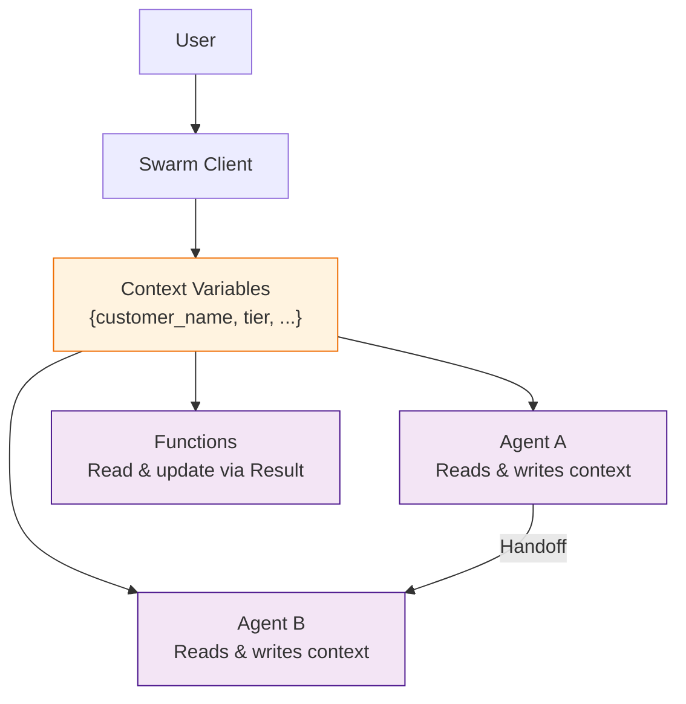
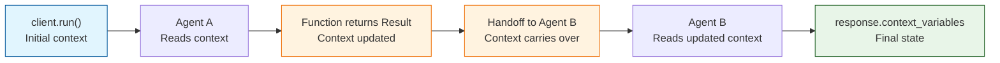
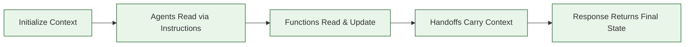

# Chapter 6: Context Variables

In this chapter, you will learn how to manage shared state across agents using context variables. Context variables are the memory of your multi-agent system -- they carry information between handoffs, personalize agent behavior, and track the state of an ongoing interaction.

## What are Context Variables?

Context variables are a Python dictionary passed into `client.run()` that is accessible to all agents and functions throughout a conversation. They serve as the shared memory layer that ties multiple agents together.



## Passing Context Variables

Context variables are initialized when you call `client.run()` and persist throughout the conversation, including across handoffs:

```python
from swarm import Swarm, Agent

client = Swarm()

agent = Agent(
    name="Greeter",
    instructions="You are a friendly assistant. Greet the user by name.",
)

# Pass initial context
response = client.run(
    agent=agent,
    messages=[{"role": "user", "content": "Hello!"}],
    context_variables={
        "customer_name": "Alice",
        "account_id": "ACC-001",
        "account_tier": "gold",
        "language": "en",
    },
)

# Context variables are returned in the response
print(response.context_variables)
# {"customer_name": "Alice", "account_id": "ACC-001", "account_tier": "gold", "language": "en"}
```

## Using Context in Instructions

### Static Template Approach

Reference context variable values in string-formatted instructions:

```python
# This does NOT work - instructions is a static string, not a template
agent = Agent(
    name="Support",
    instructions="Help {customer_name} with their issue.",  # Will NOT be interpolated
)
```

### Dynamic Instructions (Recommended)

Use a callable for instructions that receives `context_variables` as its argument:

```python
def support_instructions(context_variables):
    name = context_variables.get("customer_name", "valued customer")
    tier = context_variables.get("account_tier", "standard")
    language = context_variables.get("language", "en")

    base = f"""You are a support agent helping {name}.
    Account tier: {tier}.
    """

    # Adapt behavior based on context
    if tier == "enterprise":
        base += "This is a premium customer. Prioritize their request.\n"
        base += "You may offer up to 20% discount on renewals.\n"

    if tier == "gold":
        base += "This is a valued customer. Be extra attentive.\n"
        base += "Refund limit: $500.\n"

    if language != "en":
        base += f"Respond in the user's preferred language: {language}.\n"

    return base


support_agent = Agent(
    name="Support",
    instructions=support_instructions,
)
```

## Reading Context in Functions

Functions can access context variables by declaring a parameter named `context_variables`:

```python
from swarm import Agent
import json


def get_account_details(context_variables: dict) -> str:
    """Retrieve account details for the current customer."""
    account_id = context_variables.get("account_id")

    if not account_id:
        return "Error: No account ID in context. Please ask the customer."

    # Simulate a database lookup
    accounts = {
        "ACC-001": {"name": "Alice Johnson", "plan": "Pro", "seats": 10},
        "ACC-002": {"name": "Bob Smith", "plan": "Starter", "seats": 2},
    }

    account = accounts.get(account_id)
    if not account:
        return f"Account {account_id} not found."

    return json.dumps(account)


def get_open_tickets(context_variables: dict) -> str:
    """Get open support tickets for the current customer."""
    account_id = context_variables.get("account_id")

    tickets = {
        "ACC-001": [
            {"id": "TKT-101", "subject": "Login issue", "status": "open"},
            {"id": "TKT-098", "subject": "API rate limit", "status": "in_progress"},
        ],
        "ACC-002": [],
    }

    result = tickets.get(account_id, [])
    return json.dumps({"account_id": account_id, "tickets": result})


support_agent = Agent(
    name="Support",
    instructions=support_instructions,
    functions=[get_account_details, get_open_tickets],
)
```

> **Note**: The `context_variables` parameter is special. Swarm recognizes it by name and injects the current context automatically. It is not exposed to the model as a tool parameter.

## Updating Context with the Result Object

Functions can modify context variables by returning a `Result` object:

```python
from swarm import Result


def authenticate_user(username: str, password: str) -> Result:
    """Authenticate the user and update context with their profile.

    Args:
        username: The user's login name
        password: The user's password
    """
    # Simulate authentication
    users = {
        "alice": {"user_id": "USR-001", "name": "Alice Johnson", "tier": "gold"},
        "bob": {"user_id": "USR-002", "name": "Bob Smith", "tier": "standard"},
    }

    user = users.get(username)
    if not user or password != "demo123":
        return Result(
            value="Authentication failed. Please check your credentials.",
            context_variables={"authenticated": False},
        )

    return Result(
        value=f"Welcome back, {user['name']}!",
        context_variables={
            "authenticated": True,
            "user_id": user["user_id"],
            "customer_name": user["name"],
            "account_tier": user["tier"],
        },
    )


def update_language_preference(language: str) -> Result:
    """Update the user's preferred language.

    Args:
        language: Language code (e.g., 'en', 'es', 'fr', 'de')
    """
    valid = ["en", "es", "fr", "de", "ja", "zh"]
    if language not in valid:
        return Result(value=f"Unsupported language. Choose from: {valid}")

    return Result(
        value=f"Language preference updated to {language}.",
        context_variables={"language": language},
    )
```

## Context Variable Lifecycle

Understanding when and how context variables change is critical for debugging:



| Stage | What Happens |
|:------|:-------------|
| **Initialization** | `context_variables` dict passed to `client.run()` |
| **Agent reads** | Dynamic instructions callable receives current context |
| **Function reads** | Functions with `context_variables` parameter receive current context |
| **Function updates** | `Result(context_variables={...})` merges new values into context |
| **Handoff** | Context carries over to the new agent automatically |
| **Response** | `response.context_variables` contains the final state |

## Common Context Patterns

### Authentication Gate

Use context to gate access to protected functions:

```python
from swarm import Agent, Result
import json


def check_balance(context_variables: dict) -> str:
    """Check the current account balance."""
    if not context_variables.get("authenticated"):
        return "Error: You must be authenticated to check your balance. Please log in first."

    account_id = context_variables.get("account_id", "unknown")
    return json.dumps({"account_id": account_id, "balance": 1250.75})


def process_payment(amount: float, context_variables: dict) -> str:
    """Process a payment from the account.

    Args:
        amount: Payment amount in USD
    """
    if not context_variables.get("authenticated"):
        return "Error: Authentication required for payments."

    tier = context_variables.get("account_tier", "standard")
    max_payment = 1000 if tier == "standard" else 5000

    if amount > max_payment:
        return f"Error: Payment exceeds {tier} tier limit of ${max_payment}."

    return f"Payment of ${amount:.2f} processed successfully."


gated_agent = Agent(
    name="Account Manager",
    instructions="""You manage customer accounts.
    Before performing any account actions, ensure the user is authenticated.
    If not authenticated, ask them to log in using their username and password.
    """,
    functions=[authenticate_user, check_balance, process_payment],
)
```

### Conversation State Tracking

Track the progress of a multi-step interaction:

```python
from swarm import Result


def advance_step(context_variables: dict) -> Result:
    """Advance to the next step in the workflow."""
    current = context_variables.get("current_step", 0)
    total = context_variables.get("total_steps", 5)

    next_step = current + 1
    if next_step > total:
        return Result(
            value="All steps complete!",
            context_variables={"current_step": next_step, "workflow_complete": True},
        )

    return Result(
        value=f"Moving to step {next_step} of {total}.",
        context_variables={"current_step": next_step},
    )


def get_step_info(context_variables: dict) -> str:
    """Get information about the current step."""
    current = context_variables.get("current_step", 0)
    steps = {
        1: "Verify identity",
        2: "Describe issue",
        3: "Diagnose problem",
        4: "Apply fix",
        5: "Confirm resolution",
    }
    return f"Current step ({current}/{context_variables.get('total_steps', 5)}): {steps.get(current, 'Unknown')}"
```

### Accumulating Data Across Agents

Build up a record as the conversation progresses through multiple agents:

```python
from swarm import Agent, Result
import json


def record_intake_data(
    name: str, email: str, issue_type: str
) -> Result:
    """Record intake information.

    Args:
        name: Customer's full name
        email: Customer's email address
        issue_type: Type of issue (billing, technical, account)
    """
    return Result(
        value=f"Recorded intake for {name}.",
        context_variables={
            "intake_name": name,
            "intake_email": email,
            "intake_issue_type": issue_type,
            "intake_complete": True,
        },
    )


def record_diagnosis(root_cause: str, severity: str) -> Result:
    """Record diagnosis findings.

    Args:
        root_cause: The identified root cause
        severity: Issue severity (low, medium, high, critical)
    """
    return Result(
        value=f"Diagnosis recorded: {root_cause} (severity: {severity})",
        context_variables={
            "diagnosis_root_cause": root_cause,
            "diagnosis_severity": severity,
            "diagnosis_complete": True,
        },
    )


def generate_case_summary(context_variables: dict) -> str:
    """Generate a full case summary from all collected context."""
    summary = {
        "customer": context_variables.get("intake_name", "Unknown"),
        "email": context_variables.get("intake_email", "Unknown"),
        "issue_type": context_variables.get("intake_issue_type", "Unknown"),
        "root_cause": context_variables.get("diagnosis_root_cause", "Pending"),
        "severity": context_variables.get("diagnosis_severity", "Pending"),
        "resolution": context_variables.get("resolution_action", "Pending"),
    }
    return json.dumps(summary, indent=2)
```

## Context Variable Best Practices

| Practice | Description |
|:---------|:------------|
| **Use descriptive keys** | `customer_name` not `cn`; `account_tier` not `t` |
| **Namespace by agent** | `intake_name`, `diagnosis_severity` to avoid collisions |
| **Keep values small** | Strings and numbers, not large objects or lists |
| **Validate before use** | Always use `.get()` with defaults |
| **Document expected keys** | List required context in agent instructions |
| **Prune stale data** | Remove keys that are no longer relevant |

### Naming Convention

```python
# Recommended: namespace by phase or agent
context_variables = {
    # Auth phase
    "auth_user_id": "USR-001",
    "auth_authenticated": True,

    # Intake phase
    "intake_issue_type": "billing",
    "intake_summary": "Double charge on invoice",

    # Diagnosis phase
    "diagnosis_root_cause": "Duplicate webhook",
    "diagnosis_severity": "medium",

    # Metadata
    "session_id": "SES-2024-0042",
    "handoff_count": 1,
}
```

## Debugging Context Variables

### Inspect Context at Each Step

```python
from swarm import Swarm, Agent

client = Swarm()


def debug_context(context_variables: dict) -> str:
    """Print the current state of all context variables."""
    import json
    print("\n=== CONTEXT DUMP ===")
    print(json.dumps(context_variables, indent=2, default=str))
    print("====================\n")
    return "Context dumped to console."


debug_agent = Agent(
    name="Debug Agent",
    instructions="You help debug context variable issues. Use debug_context() when asked.",
    functions=[debug_context],
)
```

### Track Context Changes Over Time

```python
from swarm import Result
import json
from copy import deepcopy


context_history = []


def snapshot_context(label: str, context_variables: dict) -> str:
    """Take a snapshot of the current context for debugging.

    Args:
        label: A label for this snapshot (e.g., 'after_auth', 'pre_handoff')
    """
    snapshot = {
        "label": label,
        "context": deepcopy(context_variables),
        "key_count": len(context_variables),
    }
    context_history.append(snapshot)
    return f"Snapshot '{label}' saved. Total snapshots: {len(context_history)}"


def compare_snapshots() -> str:
    """Compare the first and last context snapshots."""
    if len(context_history) < 2:
        return "Need at least 2 snapshots to compare."

    first = context_history[0]["context"]
    last = context_history[-1]["context"]

    added = set(last.keys()) - set(first.keys())
    removed = set(first.keys()) - set(last.keys())
    changed = {
        k for k in first.keys() & last.keys()
        if first[k] != last[k]
    }

    return json.dumps({
        "first_snapshot": context_history[0]["label"],
        "last_snapshot": context_history[-1]["label"],
        "keys_added": list(added),
        "keys_removed": list(removed),
        "keys_changed": list(changed),
    }, indent=2)
```

## Managing Context Size

As conversations grow, context variables can accumulate. Large contexts consume tokens when used in dynamic instructions and can cause performance issues.

### Pruning Strategy

```python
from swarm import Result


def prune_context(context_variables: dict) -> Result:
    """Remove stale or unnecessary context variables."""
    # Keys to always keep
    essential = {"customer_name", "account_id", "authenticated", "session_id"}

    # Keys that can be pruned after use
    pruneable_prefixes = ["intake_", "diagnosis_"]

    pruned = {}
    removed = []

    for key, value in context_variables.items():
        if key in essential:
            pruned[key] = value
        elif any(key.startswith(p) for p in pruneable_prefixes):
            # Summarize instead of keeping raw data
            removed.append(key)
        else:
            pruned[key] = value

    # Add a summary of pruned data
    if removed:
        pruned["pruned_keys"] = removed
        pruned["context_pruned"] = True

    return Result(
        value=f"Context pruned. Removed {len(removed)} stale keys.",
        context_variables=pruned,
    )
```

### Context Size Limits

| Context Size | Recommendation |
|:-------------|:---------------|
| < 10 keys | Healthy -- no action needed |
| 10-20 keys | Review for stale data; consider pruning |
| 20-50 keys | Actively prune; summarize verbose values |
| > 50 keys | Refactor your context strategy; use external storage |

## Summary

Context variables are the shared memory that makes multi-agent collaboration possible. They flow through the entire conversation lifecycle -- from initialization to handoffs to the final response -- and allow agents and functions to share information without direct coupling.



## Key Takeaways

1. **Context variables are a shared dictionary** passed to `client.run()` and accessible to all agents and functions throughout the conversation.
2. **Use dynamic instructions (callables)** to personalize agent behavior based on context at runtime.
3. **Functions access context** by declaring a `context_variables` parameter -- Swarm injects it automatically.
4. **Update context via `Result` objects** returned from functions. New keys are merged into the existing context.
5. **Namespace your keys** by phase or agent to avoid collisions (e.g., `intake_name`, `diagnosis_severity`).
6. **Monitor context size** and prune stale keys to keep token usage and performance under control.

## Next Steps

In [Chapter 7: Multi-Agent Patterns](07-multi-agent-patterns.md), you will learn how to:

- Combine agents into complex orchestration patterns
- Implement planner-executor architectures
- Build review loops and consensus mechanisms
- Design resilient multi-agent workflows

---

**Practice Exercises:**

1. Build an authentication flow that gates access to account functions using context variables.
2. Create a three-agent pipeline where each agent adds data to context and the final agent generates a summary.
3. Implement a context pruning function that summarizes and removes keys from completed workflow phases.
4. Write a context debugging tool that tracks and compares snapshots across a conversation.

*Built with insights from the [OpenAI Swarm](https://github.com/openai/swarm) project.*
