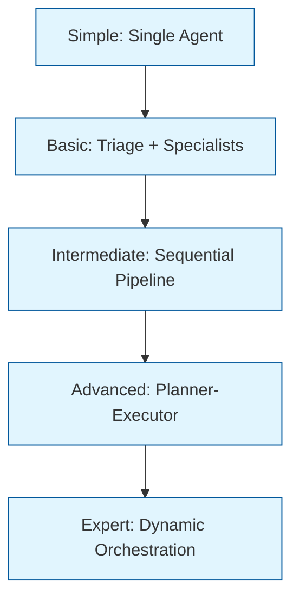
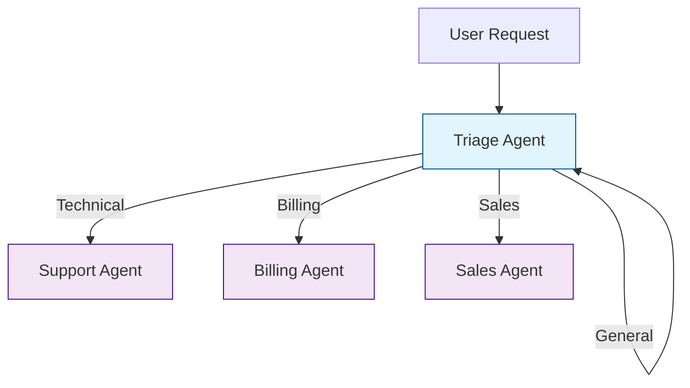
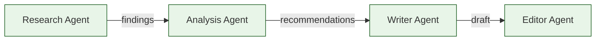
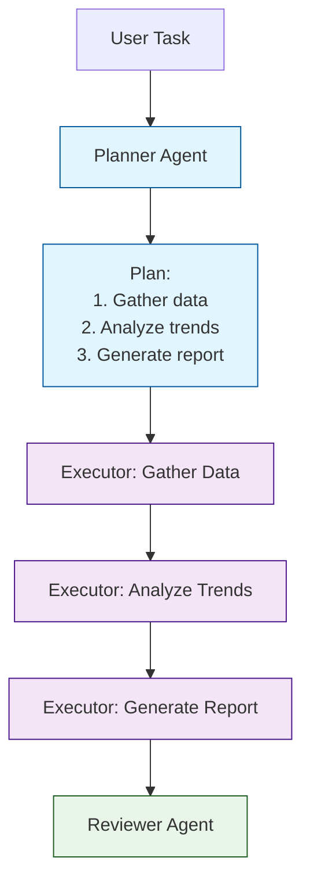
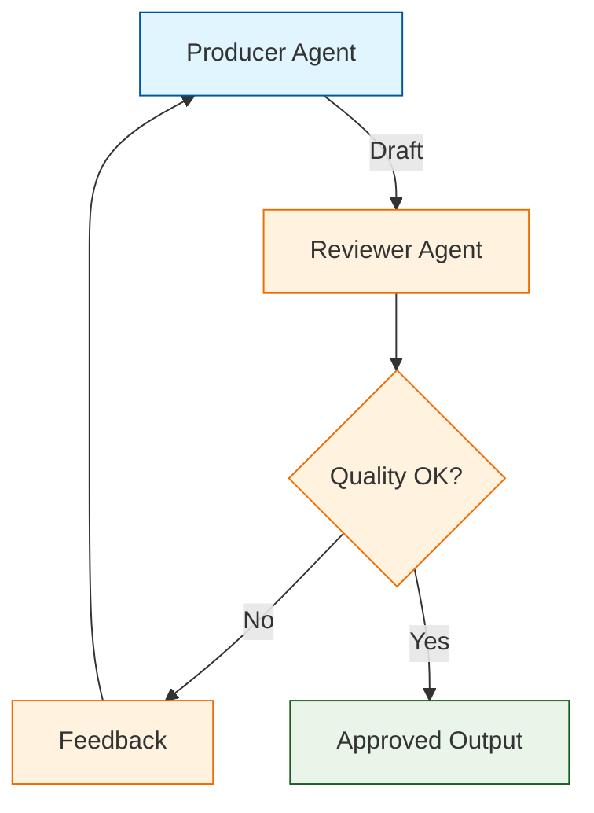
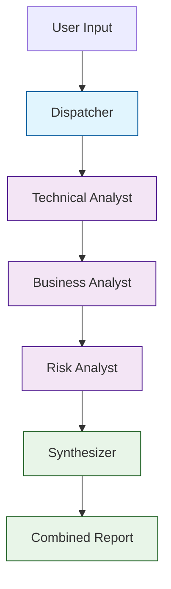
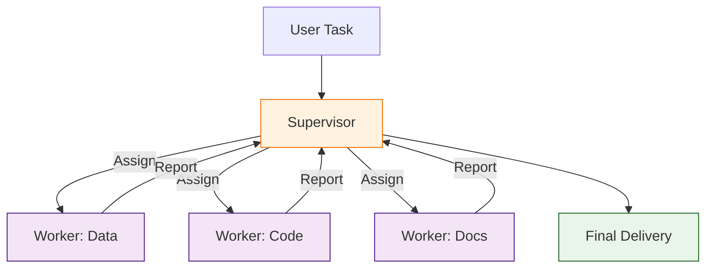
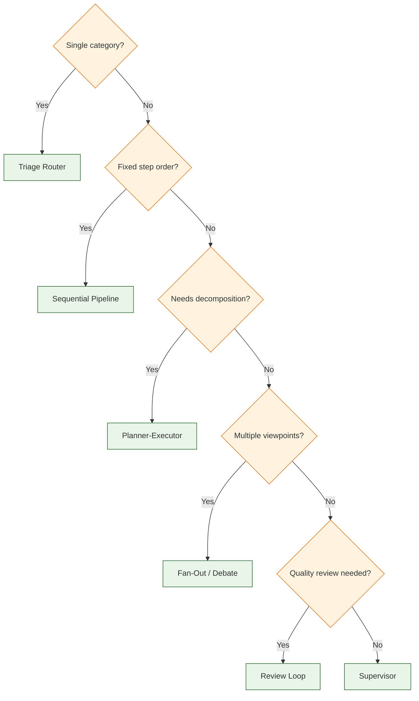
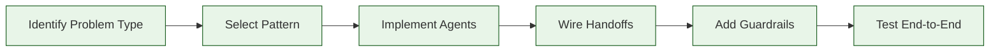

# Chapter 7: Multi-Agent Patterns

Welcome to **Chapter 7: Multi-Agent Patterns**. In this part of **OpenAI Swarm Tutorial: Lightweight Multi-Agent Orchestration**, you will build an intuitive mental model first, then move into concrete implementation details and practical production tradeoffs.


In this chapter, you will learn how to combine agents using proven orchestration patterns for complex tasks. These patterns go beyond simple triage routing, enabling sophisticated workflows like planning-execution loops, parallel analysis, and consensus-based decision making.

## Why Patterns Matter

Individual agents handle focused tasks well. But real-world problems require coordinated teamwork -- breaking down complex problems, executing steps in parallel, reviewing outputs, and converging on a result. Orchestration patterns provide battle-tested blueprints for this coordination.



## Pattern Catalog

| Pattern | When to Use | Complexity |
|:--------|:------------|:-----------|
| **Triage Router** | Classify and delegate to a specialist | Low |
| **Sequential Pipeline** | Steps must execute in order | Low |
| **Planner-Executor** | Complex tasks requiring decomposition | Medium |
| **Parallel Fan-Out** | Independent sub-tasks to execute concurrently | Medium |
| **Review Loop** | Outputs need quality verification | Medium |
| **Escalation Chain** | Progressive authority levels | Medium |
| **Debate / Consensus** | Multiple perspectives needed for decisions | High |
| **Supervisor** | Dynamic task assignment with central coordination | High |

## Pattern 1: Triage Router

The simplest multi-agent pattern. A single triage agent classifies the request and delegates to the appropriate specialist.



```python
from swarm import Swarm, Agent

client = Swarm()


def transfer_to_support():
    """Transfer to technical support."""
    return support_agent

def transfer_to_billing():
    """Transfer to billing specialist."""
    return billing_agent

def transfer_to_sales():
    """Transfer to sales team."""
    return sales_agent


triage_agent = Agent(
    name="Triage",
    model="gpt-4o-mini",  # Fast, cheap model for classification
    instructions="""Classify the user's request into one of these categories
    and transfer immediately. Do not attempt to answer yourself.

    - Technical issue, bug, or error -> transfer_to_support()
    - Billing, invoice, or payment -> transfer_to_billing()
    - Pricing, plans, or purchases -> transfer_to_sales()
    - If unclear, ask ONE clarifying question
    """,
    functions=[transfer_to_support, transfer_to_billing, transfer_to_sales],
)

support_agent = Agent(
    name="Support",
    instructions="You are a technical support engineer. Diagnose and resolve issues.",
)

billing_agent = Agent(
    name="Billing",
    instructions="You are a billing specialist. Handle invoices, payments, and refunds.",
)

sales_agent = Agent(
    name="Sales",
    instructions="You are a sales representative. Help with pricing and plan selection.",
)
```

## Pattern 2: Sequential Pipeline

Agents execute in a fixed order, each completing its phase before handing off to the next. The conversation context accumulates as it moves through the pipeline.



```python
from swarm import Swarm, Agent, Result

client = Swarm()


def transfer_to_analysis(research_summary: str) -> Result:
    """Transfer research findings to analysis.

    Args:
        research_summary: Summary of research findings
    """
    return Result(
        value="Research complete. Handing off to analysis.",
        agent=analysis_agent,
        context_variables={"research_summary": research_summary},
    )

def transfer_to_writer(recommendations: str) -> Result:
    """Transfer analysis recommendations to the writer.

    Args:
        recommendations: Key recommendations from analysis
    """
    return Result(
        value="Analysis complete. Handing off to writer.",
        agent=writer_agent,
        context_variables={"recommendations": recommendations},
    )

def transfer_to_editor(draft: str) -> Result:
    """Transfer draft content to the editor.

    Args:
        draft: The draft content to review
    """
    return Result(
        value="Draft complete. Handing off to editor.",
        agent=editor_agent,
        context_variables={"draft": draft},
    )


def research_instructions(context_variables):
    topic = context_variables.get("topic", "the requested topic")
    return f"""You are a research analyst. Research the topic: {topic}.
    Gather key facts, statistics, and perspectives.
    Summarize your findings and transfer to analysis using transfer_to_analysis().
    """

research_agent = Agent(
    name="Research",
    instructions=research_instructions,
    functions=[transfer_to_analysis],
)

def analysis_instructions(context_variables):
    findings = context_variables.get("research_summary", "No research yet")
    return f"""You are a strategic analyst. Based on these research findings:

    {findings}

    Identify key insights, trends, and actionable recommendations.
    Transfer your recommendations to the writer using transfer_to_writer().
    """

analysis_agent = Agent(
    name="Analysis",
    instructions=analysis_instructions,
    functions=[transfer_to_writer],
)

def writer_instructions(context_variables):
    recs = context_variables.get("recommendations", "No recommendations yet")
    return f"""You are a content writer. Create a well-structured report based on
    these recommendations:

    {recs}

    Write in a professional tone with clear headings and bullet points.
    Transfer your draft to the editor using transfer_to_editor().
    """

writer_agent = Agent(
    name="Writer",
    instructions=writer_instructions,
    functions=[transfer_to_editor],
)

editor_agent = Agent(
    name="Editor",
    instructions="""You are a senior editor. Review and polish the draft.
    Fix grammar, improve clarity, and ensure consistency.
    Deliver the final version to the user.
    """,
)

# Run the pipeline
response = client.run(
    agent=research_agent,
    messages=[{"role": "user", "content": "Write a report on the state of AI agents in 2024."}],
    context_variables={"topic": "AI agents in 2024"},
)
```

## Pattern 3: Planner-Executor

A planner agent decomposes a complex task into steps, then hands off to executor agents that carry out each step.



```python
from swarm import Swarm, Agent, Result
import json

client = Swarm()


def create_plan(task_description: str) -> Result:
    """Create an execution plan for a complex task.

    Args:
        task_description: Description of the task to plan
    """
    # In practice, the planner agent generates this via the LLM
    plan = {
        "task": task_description,
        "steps": [
            {"step": 1, "action": "gather_data", "description": "Collect relevant data"},
            {"step": 2, "action": "analyze", "description": "Analyze patterns and trends"},
            {"step": 3, "action": "report", "description": "Generate summary report"},
        ],
        "current_step": 1,
    }
    return Result(
        value=f"Plan created with {len(plan['steps'])} steps. Starting execution.",
        agent=executor_agent,
        context_variables={
            "plan": json.dumps(plan),
            "current_step": 1,
            "total_steps": len(plan["steps"]),
        },
    )


def execute_step(step_result: str, context_variables: dict) -> Result:
    """Complete the current step and advance to the next.

    Args:
        step_result: The output/result of the current step
    """
    current = context_variables.get("current_step", 1)
    total = context_variables.get("total_steps", 3)
    results = json.loads(context_variables.get("step_results", "{}"))

    results[f"step_{current}"] = step_result
    next_step = current + 1

    if next_step > total:
        return Result(
            value="All steps complete. Transferring to reviewer.",
            agent=reviewer_agent,
            context_variables={
                "step_results": json.dumps(results),
                "execution_complete": True,
            },
        )

    return Result(
        value=f"Step {current} complete. Moving to step {next_step} of {total}.",
        context_variables={
            "current_step": next_step,
            "step_results": json.dumps(results),
        },
    )


planner_agent = Agent(
    name="Planner",
    instructions="""You are a planning agent. When given a complex task:
    1. Break it down into 3-5 concrete, actionable steps
    2. Create the plan using create_plan()
    Do not execute any steps yourself -- that is the executor's job.
    """,
    functions=[create_plan],
)

def executor_instructions(context_variables):
    plan = context_variables.get("plan", "{}")
    current = context_variables.get("current_step", 1)
    return f"""You are an execution agent. You are working on step {current} of the plan.

    Plan: {plan}

    Execute the current step thoroughly. When done, call execute_step()
    with your results.
    """

executor_agent = Agent(
    name="Executor",
    instructions=executor_instructions,
    functions=[execute_step],
)

reviewer_agent = Agent(
    name="Reviewer",
    instructions="""You are a quality reviewer. Review the results from all
    execution steps and provide a final summary. Flag any issues or gaps.
    Present the consolidated output to the user.
    """,
)
```

## Pattern 4: Review Loop

An agent produces output, a reviewer evaluates it, and the cycle repeats until quality standards are met.



```python
from swarm import Swarm, Agent, Result
import json

client = Swarm()


def submit_for_review(content: str) -> Result:
    """Submit content for review.

    Args:
        content: The content to be reviewed
    """
    return Result(
        value="Content submitted for review.",
        agent=reviewer_agent,
        context_variables={"submitted_content": content},
    )


def approve_content() -> Result:
    """Approve the content and deliver to the user."""
    return Result(
        value="Content approved!",
        context_variables={"content_approved": True},
    )


def request_revision(feedback: str) -> Result:
    """Send content back to producer with revision feedback.

    Args:
        feedback: Specific feedback for the revision
    """
    return Result(
        value=f"Revision requested: {feedback}",
        agent=producer_agent,
        context_variables={"revision_feedback": feedback},
    )


def producer_instructions(context_variables):
    feedback = context_variables.get("revision_feedback", "")
    iteration = context_variables.get("review_iteration", 0)

    base = """You are a content producer. Create high-quality content
    based on the user's request."""

    if feedback:
        base += f"""

    REVISION REQUESTED (iteration {iteration}):
    {feedback}

    Please address the feedback and resubmit.
    Maximum iterations: 3. Current: {iteration}.
    """

    base += "\nWhen done, submit using submit_for_review()."
    return base


producer_agent = Agent(
    name="Producer",
    instructions=producer_instructions,
    functions=[submit_for_review],
)


def reviewer_instructions(context_variables):
    content = context_variables.get("submitted_content", "")
    iteration = context_variables.get("review_iteration", 0)

    return f"""You are a quality reviewer. Review this content:

    {content[:500]}

    Evaluate against these criteria:
    1. Accuracy and correctness
    2. Clarity and readability
    3. Completeness
    4. Professional tone

    Review iteration: {iteration + 1} of 3 maximum.

    If the content meets all criteria, use approve_content().
    If it needs improvement, use request_revision() with specific feedback.
    If this is iteration 3, approve with minor notes rather than requesting another revision.
    """


reviewer_agent = Agent(
    name="Reviewer",
    instructions=reviewer_instructions,
    functions=[approve_content, request_revision],
)
```

## Pattern 5: Parallel Fan-Out / Fan-In

Multiple agents analyze the same input independently, and a synthesizer combines their outputs. Since Swarm runs sequentially, this pattern is simulated by chaining agents that each add their perspective.



```python
from swarm import Swarm, Agent, Result
import json

client = Swarm()


def transfer_to_business_analyst(technical_analysis: str) -> Result:
    """Pass technical analysis to business analyst.

    Args:
        technical_analysis: Technical analysis findings
    """
    return Result(
        value="Technical analysis complete.",
        agent=business_analyst,
        context_variables={"technical_analysis": technical_analysis},
    )


def transfer_to_risk_analyst(business_analysis: str) -> Result:
    """Pass business analysis to risk analyst.

    Args:
        business_analysis: Business analysis findings
    """
    return Result(
        value="Business analysis complete.",
        agent=risk_analyst,
        context_variables={"business_analysis": business_analysis},
    )


def transfer_to_synthesizer(risk_analysis: str) -> Result:
    """Pass risk analysis to synthesizer for final report.

    Args:
        risk_analysis: Risk analysis findings
    """
    return Result(
        value="Risk analysis complete.",
        agent=synthesizer,
        context_variables={"risk_analysis": risk_analysis},
    )


def tech_instructions(context_variables):
    proposal = context_variables.get("proposal", "No proposal provided")
    return f"""You are a technical analyst. Evaluate the technical feasibility of:

    {proposal}

    Focus on: architecture, scalability, implementation complexity, and technical risks.
    Provide your analysis and transfer to the business analyst.
    """

technical_analyst = Agent(
    name="Technical Analyst",
    instructions=tech_instructions,
    functions=[transfer_to_business_analyst],
)

def biz_instructions(context_variables):
    proposal = context_variables.get("proposal", "")
    tech = context_variables.get("technical_analysis", "Pending")
    return f"""You are a business analyst. Evaluate the business viability of:

    {proposal}

    Technical analysis so far: {tech[:300]}

    Focus on: market fit, ROI, competitive landscape, and resource requirements.
    Provide your analysis and transfer to the risk analyst.
    """

business_analyst = Agent(
    name="Business Analyst",
    instructions=biz_instructions,
    functions=[transfer_to_risk_analyst],
)

def risk_instructions(context_variables):
    proposal = context_variables.get("proposal", "")
    tech = context_variables.get("technical_analysis", "Pending")
    biz = context_variables.get("business_analysis", "Pending")
    return f"""You are a risk analyst. Evaluate risks for:

    {proposal}

    Technical view: {tech[:200]}
    Business view: {biz[:200]}

    Focus on: operational risks, regulatory concerns, dependency risks, and mitigation strategies.
    Provide your analysis and transfer to the synthesizer.
    """

risk_analyst = Agent(
    name="Risk Analyst",
    instructions=risk_instructions,
    functions=[transfer_to_synthesizer],
)

def synth_instructions(context_variables):
    tech = context_variables.get("technical_analysis", "N/A")
    biz = context_variables.get("business_analysis", "N/A")
    risk = context_variables.get("risk_analysis", "N/A")
    return f"""You are a senior strategist synthesizing three analyses:

    ## Technical Analysis
    {tech[:300]}

    ## Business Analysis
    {biz[:300]}

    ## Risk Analysis
    {risk[:300]}

    Create a unified executive summary with:
    1. Overall recommendation (proceed / proceed with caution / do not proceed)
    2. Key strengths
    3. Key risks and mitigations
    4. Suggested next steps
    """

synthesizer = Agent(
    name="Synthesizer",
    instructions=synth_instructions,
)

# Run the multi-perspective analysis
response = client.run(
    agent=technical_analyst,
    messages=[{"role": "user", "content": "Evaluate building an AI-powered customer support chatbot."}],
    context_variables={"proposal": "Build an AI-powered customer support chatbot using LLMs"},
)
```

## Pattern 6: Supervisor

A central supervisor agent dynamically assigns tasks to worker agents based on the evolving state of the conversation.



```python
from swarm import Swarm, Agent, Result
import json

client = Swarm()


def assign_to_data_worker(task: str) -> Result:
    """Assign a data-related task to the data worker.

    Args:
        task: Description of the data task to perform
    """
    return Result(
        value=f"Assigned to data worker: {task}",
        agent=data_worker,
        context_variables={"assigned_task": task, "assigned_by": "supervisor"},
    )


def assign_to_code_worker(task: str) -> Result:
    """Assign a coding task to the code worker.

    Args:
        task: Description of the coding task to perform
    """
    return Result(
        value=f"Assigned to code worker: {task}",
        agent=code_worker,
        context_variables={"assigned_task": task, "assigned_by": "supervisor"},
    )


def report_to_supervisor(result: str) -> Result:
    """Report task completion back to the supervisor.

    Args:
        result: Summary of the completed work
    """
    return Result(
        value=f"Task complete: {result}",
        agent=supervisor_agent,
        context_variables={"last_worker_result": result},
    )


supervisor_agent = Agent(
    name="Supervisor",
    instructions="""You are a project supervisor. Given a complex task:

    1. Break it into sub-tasks
    2. Assign each sub-task to the appropriate worker:
       - Data analysis, queries, research -> assign_to_data_worker()
       - Code writing, scripts, automation -> assign_to_code_worker()
    3. When a worker reports back, review their output
    4. Assign the next sub-task or deliver the final result

    Track progress and ensure all sub-tasks are completed.
    """,
    functions=[assign_to_data_worker, assign_to_code_worker],
)

def worker_instructions(specialty, context_variables):
    task = context_variables.get("assigned_task", "No task assigned")
    return f"""You are a {specialty} specialist.

    Your assigned task: {task}

    Complete the task thoroughly. When done, use report_to_supervisor()
    to send your results back.
    """

data_worker = Agent(
    name="Data Worker",
    instructions=lambda cv: worker_instructions("data analysis", cv),
    functions=[report_to_supervisor],
)

code_worker = Agent(
    name="Code Worker",
    instructions=lambda cv: worker_instructions("software engineering", cv),
    functions=[report_to_supervisor],
)
```

## Pattern 7: Debate / Consensus

Multiple agents argue different perspectives. A moderator synthesizes the debate into a balanced conclusion.

```python
from swarm import Swarm, Agent, Result

client = Swarm()


def transfer_to_critic(argument: str) -> Result:
    """Present argument to the critic for counterpoints.

    Args:
        argument: The argument in favor of the proposal
    """
    return Result(
        value="Advocate position presented.",
        agent=critic_agent,
        context_variables={"advocate_argument": argument},
    )


def transfer_to_moderator(counterargument: str) -> Result:
    """Present counterargument to the moderator for synthesis.

    Args:
        counterargument: The argument against the proposal
    """
    return Result(
        value="Critic position presented.",
        agent=moderator_agent,
        context_variables={"critic_argument": counterargument},
    )


advocate_agent = Agent(
    name="Advocate",
    instructions="""You argue IN FAVOR of the proposal. Present the strongest
    possible case, supported by evidence and reasoning.
    When done, transfer to the critic using transfer_to_critic().
    """,
    functions=[transfer_to_critic],
)


def critic_instructions(context_variables):
    advocate = context_variables.get("advocate_argument", "")
    return f"""You argue AGAINST the proposal. The advocate's position was:

    {advocate[:500]}

    Present strong counterarguments, identify weaknesses, and highlight risks.
    When done, transfer to the moderator using transfer_to_moderator().
    """

critic_agent = Agent(
    name="Critic",
    instructions=critic_instructions,
    functions=[transfer_to_moderator],
)


def moderator_instructions(context_variables):
    pro = context_variables.get("advocate_argument", "")
    con = context_variables.get("critic_argument", "")
    return f"""You are a neutral moderator. Two perspectives have been presented:

    FOR: {pro[:300]}

    AGAINST: {con[:300]}

    Synthesize both views into a balanced conclusion:
    1. Acknowledge the strongest points from each side
    2. Identify where they agree and disagree
    3. Provide your balanced recommendation
    4. List conditions under which each side's concerns are most relevant
    """

moderator_agent = Agent(
    name="Moderator",
    instructions=moderator_instructions,
)

# Run the debate
response = client.run(
    agent=advocate_agent,
    messages=[{"role": "user", "content": "Should we migrate our monolith to microservices?"}],
)
```

## Choosing the Right Pattern

Use this decision matrix to select the best pattern for your use case:

| Question | If Yes | If No |
|:---------|:-------|:------|
| Does the task have a single clear category? | Triage Router | Continue below |
| Must steps run in a specific order? | Sequential Pipeline | Continue below |
| Does the task need decomposition? | Planner-Executor | Continue below |
| Are multiple perspectives needed? | Fan-Out or Debate | Continue below |
| Does output need verification? | Review Loop | Continue below |
| Does the task require dynamic delegation? | Supervisor | Triage Router |



## Combining Patterns

Real systems often combine multiple patterns. For example, a triage router at the top level with a planner-executor for complex cases and a review loop for quality-critical outputs:

```python
from swarm import Swarm, Agent, Result

client = Swarm()


def transfer_to_simple_handler():
    """Handle simple requests directly."""
    return simple_agent

def transfer_to_planner():
    """Route complex requests to the planning pipeline."""
    return planner_agent

def transfer_to_reviewed_writer():
    """Route writing requests to the reviewed writing pipeline."""
    return writer_with_review


triage_agent = Agent(
    name="Triage",
    instructions="""Classify the request:
    - Simple factual question -> transfer_to_simple_handler()
    - Complex multi-step task -> transfer_to_planner()
    - Content creation (needs review) -> transfer_to_reviewed_writer()
    """,
    functions=[transfer_to_simple_handler, transfer_to_planner, transfer_to_reviewed_writer],
)

simple_agent = Agent(
    name="Simple Handler",
    instructions="Answer simple questions directly and concisely.",
)

planner_agent = Agent(
    name="Planner",
    instructions="Decompose complex tasks into steps and execute them.",
    # ... planner-executor functions
)

writer_with_review = Agent(
    name="Writer",
    instructions="Create content and submit for review.",
    # ... review loop functions
)
```

## Summary

Multi-agent patterns provide proven blueprints for coordinating agents into effective teams. Start with simple patterns like triage routing and graduate to more complex patterns as your use case demands. The key is matching the pattern to the problem structure.



## Key Takeaways

1. **Start simple** -- use a triage router before reaching for complex patterns. Most systems only need two levels of agents.
2. **The Planner-Executor pattern** is the most versatile for complex tasks. It separates thinking (planning) from doing (executing).
3. **Review loops add reliability** at the cost of latency and token usage. Use them for high-stakes outputs.
4. **Fan-Out analysis** gives you multiple perspectives on the same problem, reducing blind spots.
5. **Combine patterns** for real-world systems -- triage at the top, specialized patterns for each branch.
6. **Always add guardrails**: max handoffs, iteration limits, and scope boundaries to prevent runaway loops.

## Next Steps

In [Chapter 8: Production Considerations](08-production.md), you will learn how to:

- Add logging, metrics, and tracing to multi-agent systems
- Implement safety guardrails and content filters
- Manage cost and latency in production
- Build monitoring dashboards for agent systems

---

**Practice Exercises:**

1. Build a planner-executor system that decomposes a research task into steps, executes each, and reviews the result.
2. Implement a debate pattern where an advocate and critic argue about a technology decision, and a moderator synthesizes the conclusion.
3. Create a fan-out analysis where three specialist agents evaluate a business proposal from technical, financial, and operational perspectives.
4. Combine a triage router with a review loop: simple requests go direct, complex requests go through the review cycle.

*Built with insights from the [OpenAI Swarm](https://github.com/openai/swarm) project.*

## What Problem Does This Solve?

Most teams struggle here because the hard part is not writing more code, but deciding clear boundaries for `context_variables`, `Agent`, `Result` so behavior stays predictable as complexity grows.

In practical terms, this chapter helps you avoid three common failures:

- coupling core logic too tightly to one implementation path
- missing the handoff boundaries between setup, execution, and validation
- shipping changes without clear rollback or observability strategy

After working through this chapter, you should be able to reason about `Chapter 7: Multi-Agent Patterns` as an operating subsystem inside **OpenAI Swarm Tutorial: Lightweight Multi-Agent Orchestration**, with explicit contracts for inputs, state transitions, and outputs.

Use the implementation notes around `name`, `instructions`, `task` as your checklist when adapting these patterns to your own repository.

## How it Works Under the Hood

Under the hood, `Chapter 7: Multi-Agent Patterns` usually follows a repeatable control path:

1. **Context bootstrap**: initialize runtime config and prerequisites for `context_variables`.
2. **Input normalization**: shape incoming data so `Agent` receives stable contracts.
3. **Core execution**: run the main logic branch and propagate intermediate state through `Result`.
4. **Policy and safety checks**: enforce limits, auth scopes, and failure boundaries.
5. **Output composition**: return canonical result payloads for downstream consumers.
6. **Operational telemetry**: emit logs/metrics needed for debugging and performance tuning.

When debugging, walk this sequence in order and confirm each stage has explicit success/failure conditions.

## Source Walkthrough

Use the following upstream sources to verify implementation details while reading this chapter:

- [View Repo](https://github.com/openai/swarm)
  Why it matters: authoritative reference on `View Repo` (github.com).
- [Awesome Code Docs](https://github.com/johnxie/awesome-code-docs)
  Why it matters: authoritative reference on `Awesome Code Docs` (github.com).

Suggested trace strategy:
- search upstream code for `context_variables` and `Agent` to map concrete implementation paths
- compare docs claims against actual runtime/config code before reusing patterns in production

## Chapter Connections

- [Tutorial Index](index.md)
- [Previous Chapter: Chapter 6: Context Variables](06-context-variables.md)
- [Next Chapter: Chapter 8: Production Considerations](08-production.md)
- [Main Catalog](../../README.md#-tutorial-catalog)
- [A-Z Tutorial Directory](../../discoverability/tutorial-directory.md)
