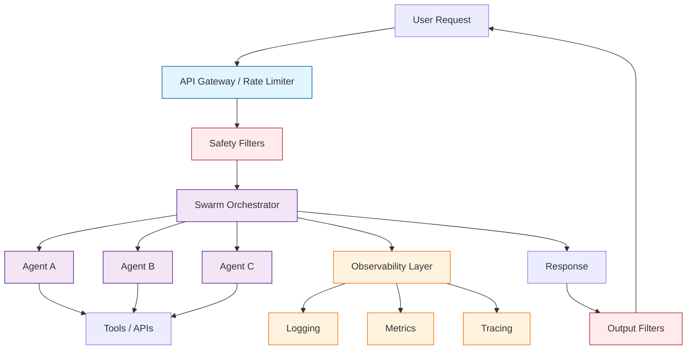
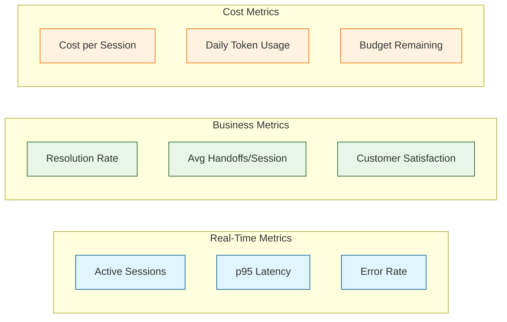
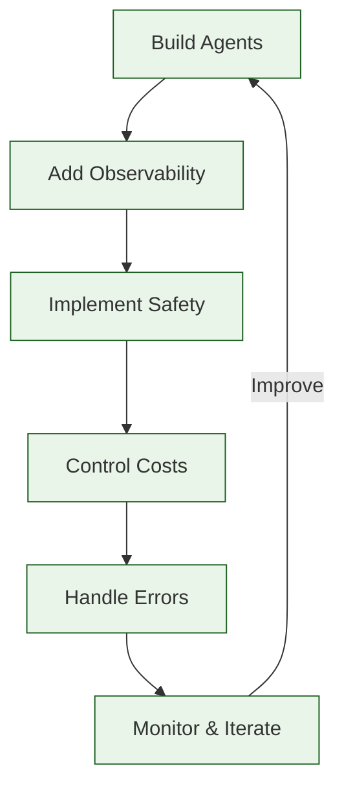

# Chapter 8: Production Considerations

In this chapter, you will learn how to take Swarm agent systems from prototype to production. We cover observability, safety guardrails, cost management, error handling, and operational best practices for running multi-agent systems reliably.

> **Note**: Swarm is an experimental/educational framework. For production deployments, you will likely build on Swarm's patterns rather than using the library directly. The principles in this chapter apply regardless of framework.

## Production Architecture Overview

A production multi-agent system has layers beyond the agents themselves: observability, safety, cost controls, and operational tooling.



## Observability

### Structured Logging

Log every significant event in a structured format for easy querying:

```python
import json
import time
import logging
from datetime import datetime
from swarm import Swarm, Agent

# Configure structured logging
logging.basicConfig(level=logging.INFO, format="%(message)s")
logger = logging.getLogger("swarm_production")


class ObservableSwarmClient:
    """Wrapper around Swarm that adds logging and metrics."""

    def __init__(self):
        self.client = Swarm()
        self.session_metrics = {
            "total_runs": 0,
            "total_tokens": 0,
            "total_handoffs": 0,
            "total_tool_calls": 0,
            "errors": 0,
        }

    def run(self, agent, messages, context_variables=None, **kwargs):
        session_id = f"SES-{datetime.now().strftime('%Y%m%d%H%M%S')}"
        start_time = time.time()

        self._log_event("run_start", {
            "session_id": session_id,
            "agent": agent.name,
            "message_count": len(messages),
            "has_context": context_variables is not None,
        })

        try:
            response = self.client.run(
                agent=agent,
                messages=messages,
                context_variables=context_variables or {},
                **kwargs,
            )

            elapsed = time.time() - start_time
            handoffs = self._count_handoffs(response.messages)
            tool_calls = self._count_tool_calls(response.messages)

            self.session_metrics["total_runs"] += 1
            self.session_metrics["total_handoffs"] += handoffs
            self.session_metrics["total_tool_calls"] += tool_calls

            self._log_event("run_complete", {
                "session_id": session_id,
                "final_agent": response.agent.name,
                "elapsed_seconds": round(elapsed, 3),
                "message_count": len(response.messages),
                "handoffs": handoffs,
                "tool_calls": tool_calls,
            })

            return response

        except Exception as e:
            elapsed = time.time() - start_time
            self.session_metrics["errors"] += 1

            self._log_event("run_error", {
                "session_id": session_id,
                "error": str(e),
                "error_type": type(e).__name__,
                "elapsed_seconds": round(elapsed, 3),
            })
            raise

    def _log_event(self, event_type, data):
        entry = {"timestamp": datetime.now().isoformat(), "event": event_type, **data}
        logger.info(json.dumps(entry))

    def _count_handoffs(self, messages):
        return sum(
            1 for m in messages
            if m.get("role") == "tool" and "transfer" in m.get("content", "").lower()
        )

    def _count_tool_calls(self, messages):
        return sum(
            len(m.get("tool_calls", []))
            for m in messages
            if m.get("tool_calls")
        )
```

### Key Metrics to Track

| Metric | Description | Alert Threshold |
|:-------|:------------|:----------------|
| **Latency (p50/p95/p99)** | Response time per conversation | p95 > 10s |
| **Token usage** | Input + output tokens per session | > 10,000 per session |
| **Handoff count** | Number of agent transfers per session | > 5 per session |
| **Tool call count** | Number of function invocations per session | > 15 per session |
| **Error rate** | Failed runs as a percentage | > 2% |
| **Cost per session** | Dollar cost per conversation | > $0.50 |
| **Completion rate** | Sessions that reach resolution | < 90% |

### Distributed Tracing

Track a request across multiple agents with trace and span IDs:

```python
import uuid
from swarm import Result


def create_traced_transfer(target_agent, source_name, context_variables):
    """Create a handoff with tracing metadata."""
    trace_id = context_variables.get("trace_id", str(uuid.uuid4()))
    span_id = str(uuid.uuid4())[:8]
    handoff_count = context_variables.get("handoff_count", 0)

    return Result(
        value=f"Transferring to {target_agent.name}",
        agent=target_agent,
        context_variables={
            "trace_id": trace_id,
            "span_id": span_id,
            "parent_span": context_variables.get("span_id", "root"),
            "handoff_count": handoff_count + 1,
            "handoff_path": context_variables.get("handoff_path", "") + f" -> {target_agent.name}",
        },
    )
```

## Safety Guardrails

### Input Filtering

Screen user messages before they reach agents:

```python
import re


class InputFilter:
    """Filter and sanitize user input before processing."""

    BLOCKED_PATTERNS = [
        r"ignore.*previous.*instructions",
        r"ignore.*all.*rules",
        r"pretend.*you.*are",
        r"jailbreak",
        r"system.*prompt",
    ]

    PII_PATTERNS = {
        "ssn": r"\b\d{3}-\d{2}-\d{4}\b",
        "credit_card": r"\b\d{4}[\s-]?\d{4}[\s-]?\d{4}[\s-]?\d{4}\b",
        "email": r"\b[A-Za-z0-9._%+-]+@[A-Za-z0-9.-]+\.[A-Z|a-z]{2,}\b",
    }

    def check_input(self, message: str) -> dict:
        """Validate input and return safety assessment."""
        result = {"safe": True, "issues": [], "sanitized": message}

        # Check for prompt injection attempts
        for pattern in self.BLOCKED_PATTERNS:
            if re.search(pattern, message, re.IGNORECASE):
                result["safe"] = False
                result["issues"].append(f"Blocked pattern detected: {pattern}")

        # Detect PII
        for pii_type, pattern in self.PII_PATTERNS.items():
            if re.search(pattern, message):
                result["issues"].append(f"PII detected: {pii_type}")
                # Redact PII
                result["sanitized"] = re.sub(pattern, f"[REDACTED_{pii_type.upper()}]", result["sanitized"])

        # Check message length
        if len(message) > 10000:
            result["safe"] = False
            result["issues"].append("Message exceeds maximum length (10,000 chars)")

        return result


# Usage
input_filter = InputFilter()

def safe_run(client, agent, messages, context_variables=None):
    """Run with input safety checks."""
    last_message = messages[-1].get("content", "")
    check = input_filter.check_input(last_message)

    if not check["safe"]:
        return {
            "error": "Input blocked by safety filter",
            "issues": check["issues"],
        }

    # Use sanitized message
    if check["sanitized"] != last_message:
        messages = messages.copy()
        messages[-1] = {**messages[-1], "content": check["sanitized"]}

    return client.run(agent=agent, messages=messages, context_variables=context_variables or {})
```

### Output Filtering

Screen agent responses before returning to the user:

```python
class OutputFilter:
    """Filter agent responses before delivery."""

    SENSITIVE_TERMS = [
        "internal only",
        "confidential",
        "secret key",
        "api_key",
        "password",
        "access_token",
    ]

    def check_output(self, response_text: str) -> dict:
        """Check response for sensitive content."""
        result = {"safe": True, "issues": [], "filtered": response_text}

        for term in self.SENSITIVE_TERMS:
            if term.lower() in response_text.lower():
                result["safe"] = False
                result["issues"].append(f"Sensitive term found: {term}")

        return result
```

### Tool Allowlists

Restrict which tools each agent can access:

```python
from swarm import Agent


def create_scoped_agent(name, instructions, all_functions, allowed_functions):
    """Create an agent with only the allowed functions.

    Args:
        name: Agent name
        instructions: Agent instructions
        all_functions: Dict of all available functions {name: func}
        allowed_functions: List of allowed function names
    """
    scoped = [all_functions[fn] for fn in allowed_functions if fn in all_functions]

    return Agent(
        name=name,
        instructions=instructions,
        functions=scoped,
    )


# Define the function registry
function_registry = {
    "lookup_customer": lookup_customer,
    "check_balance": check_balance,
    "process_refund": process_refund,
    "delete_account": delete_account,
    "modify_permissions": modify_permissions,
}

# L1 support gets limited tools
l1_agent = create_scoped_agent(
    name="Support L1",
    instructions="Handle basic support questions.",
    all_functions=function_registry,
    allowed_functions=["lookup_customer", "check_balance"],
)

# Admin gets full access
admin_agent = create_scoped_agent(
    name="Admin",
    instructions="Full administrative access.",
    all_functions=function_registry,
    allowed_functions=list(function_registry.keys()),
)
```

### Handoff Limits

Prevent runaway handoff loops:

```python
from swarm import Swarm, Agent, Result

MAX_HANDOFFS = 5


def guarded_run(client, agent, messages, context_variables=None, max_handoffs=MAX_HANDOFFS):
    """Run with handoff limit enforcement."""
    ctx = context_variables or {}
    ctx.setdefault("handoff_count", 0)
    ctx.setdefault("handoff_history", "")

    if ctx["handoff_count"] >= max_handoffs:
        return {
            "error": f"Handoff limit reached ({max_handoffs}). Ending conversation.",
            "handoff_history": ctx["handoff_history"],
        }

    response = client.run(agent=agent, messages=messages, context_variables=ctx)

    final_count = response.context_variables.get("handoff_count", 0)
    if final_count >= max_handoffs:
        # Append a warning to the response
        response.messages.append({
            "role": "system",
            "content": f"Warning: Handoff limit ({max_handoffs}) reached. Please resolve directly.",
        })

    return response
```

## Cost Management

### Token Budget Tracking

```python
import tiktoken


class TokenBudget:
    """Track and enforce token budgets per session."""

    def __init__(self, max_tokens_per_session=20000, model="gpt-4o"):
        self.max_tokens = max_tokens_per_session
        self.used_tokens = 0
        self.encoding = tiktoken.encoding_for_model(model)

    def estimate_tokens(self, messages):
        """Estimate token count for a message list."""
        total = 0
        for msg in messages:
            content = msg.get("content", "")
            if content:
                total += len(self.encoding.encode(content))
            total += 4  # message overhead
        return total

    def check_budget(self, messages):
        """Check if sending these messages would exceed the budget."""
        estimated = self.estimate_tokens(messages)
        return {
            "estimated_tokens": estimated,
            "used_tokens": self.used_tokens,
            "remaining": self.max_tokens - self.used_tokens,
            "within_budget": (self.used_tokens + estimated) <= self.max_tokens,
        }

    def record_usage(self, input_tokens, output_tokens):
        """Record actual token usage after a run."""
        self.used_tokens += input_tokens + output_tokens


# Usage
budget = TokenBudget(max_tokens_per_session=15000)

def budget_aware_run(client, agent, messages, budget, context_variables=None):
    """Run with token budget enforcement."""
    check = budget.check_budget(messages)

    if not check["within_budget"]:
        return {
            "error": "Token budget exceeded",
            "used": check["used_tokens"],
            "limit": budget.max_tokens,
        }

    response = client.run(agent=agent, messages=messages, context_variables=context_variables or {})

    # In production, extract actual usage from the API response headers
    estimated = check["estimated_tokens"]
    budget.record_usage(estimated, estimated // 2)

    return response
```

### Model Selection Strategy

Use the right model for each task to balance quality and cost:

| Task Type | Recommended Model | Rationale |
|:----------|:-----------------|:----------|
| Triage / Classification | `gpt-4o-mini` | Fast, cheap, classification accuracy is sufficient |
| Simple Q&A | `gpt-4o-mini` | Low complexity, cost sensitive |
| Complex reasoning | `gpt-4o` | Needs strong reasoning capabilities |
| Code generation | `gpt-4o` | Quality-critical, fewer retries |
| Content creation | `gpt-4o` | Needs creativity and nuance |
| Data extraction | `gpt-4o-mini` | Structured output, pattern matching |

```python
# Apply model selection at the agent level
triage = Agent(name="Triage", model="gpt-4o-mini", instructions="Classify and route.")
analyst = Agent(name="Analyst", model="gpt-4o", instructions="Deep analysis.")
extractor = Agent(name="Extractor", model="gpt-4o-mini", instructions="Extract structured data.")
```

### Cost Estimation Table

| Component | Approximate Cost | Per |
|:----------|:----------------|:----|
| GPT-4o input | $2.50 | 1M tokens |
| GPT-4o output | $10.00 | 1M tokens |
| GPT-4o-mini input | $0.15 | 1M tokens |
| GPT-4o-mini output | $0.60 | 1M tokens |
| Typical 3-agent session | $0.02 - $0.15 | session |
| Complex 5+ agent pipeline | $0.10 - $0.50 | session |

## Error Handling and Resilience

### Retry Logic

```python
import time
from openai import RateLimitError, APITimeoutError, APIConnectionError


def resilient_run(client, agent, messages, context_variables=None,
                  max_retries=3, initial_delay=1.0):
    """Run with automatic retries for transient failures."""
    retryable_errors = (RateLimitError, APITimeoutError, APIConnectionError)

    for attempt in range(max_retries):
        try:
            response = client.run(
                agent=agent,
                messages=messages,
                context_variables=context_variables or {},
            )
            return response

        except retryable_errors as e:
            if attempt == max_retries - 1:
                raise

            delay = initial_delay * (2 ** attempt)  # exponential backoff
            print(f"Attempt {attempt + 1} failed: {e}. Retrying in {delay}s...")
            time.sleep(delay)

        except Exception as e:
            # Non-retryable errors fail immediately
            print(f"Non-retryable error: {e}")
            raise
```

### Graceful Degradation

```python
from swarm import Agent


def create_fallback_agent():
    """Create a fallback agent for when specialist agents fail."""
    return Agent(
        name="Fallback",
        instructions="""You are a fallback agent activated when the primary system
        encounters an error.

        1. Apologize for the inconvenience
        2. Collect the user's contact information
        3. Create a support ticket for follow-up
        4. Provide estimated response time (24-48 hours)

        Be empathetic and professional.
        """,
    )


def run_with_fallback(client, agent, messages, context_variables=None):
    """Run with fallback to a safe agent on failure."""
    try:
        return client.run(
            agent=agent,
            messages=messages,
            context_variables=context_variables or {},
        )
    except Exception as e:
        print(f"Primary agent failed: {e}. Activating fallback.")
        fallback = create_fallback_agent()
        return client.run(
            agent=fallback,
            messages=messages,
            context_variables={
                **(context_variables or {}),
                "error_context": str(e),
                "original_agent": agent.name,
            },
        )
```

## Production Checklist

### Pre-Launch

| Category | Item | Status |
|:---------|:-----|:-------|
| **Security** | HTTPS for all endpoints | Required |
| **Security** | API key rotation mechanism | Required |
| **Security** | Input sanitization and PII redaction | Required |
| **Security** | Output filtering for sensitive data | Required |
| **Observability** | Structured logging with session IDs | Required |
| **Observability** | Metrics dashboard (latency, errors, cost) | Required |
| **Observability** | Distributed tracing for multi-agent flows | Recommended |
| **Resilience** | Retry logic with exponential backoff | Required |
| **Resilience** | Fallback agent for error scenarios | Required |
| **Resilience** | Handoff loop prevention (max count) | Required |
| **Cost** | Token budget per session | Required |
| **Cost** | Model selection strategy (mini for routing) | Recommended |
| **Cost** | Cost alerting and daily budget caps | Recommended |
| **Testing** | Integration tests for all handoff paths | Required |
| **Testing** | Load testing for concurrent sessions | Recommended |
| **Testing** | Prompt injection testing | Required |

### Monitoring Dashboard

Track these metrics in your monitoring system:



## Operational Runbook

### Common Failure Modes

| Failure | Symptoms | Root Cause | Mitigation |
|:--------|:---------|:-----------|:-----------|
| **Handoff loop** | Agent count > 5, no resolution | Ambiguous routing rules | Add max handoff limit; clarify agent scope |
| **Tool error** | Function raises exception | Missing validation, external API down | Add try/catch in all tools; implement retries |
| **Context bloat** | Slow responses, high token usage | Context variables growing unbounded | Prune context at handoff points; cap key count |
| **Wrong agent** | User gets misrouted | Vague triage instructions | Add test cases; improve classification prompt |
| **Rate limiting** | 429 errors from OpenAI | Too many concurrent requests | Add backoff; implement request queuing |
| **Prompt injection** | Agent ignores instructions | Malicious user input | Input filtering; instruction reinforcement |

### Incident Response

```python
class IncidentDetector:
    """Detect and respond to operational incidents."""

    def __init__(self, error_threshold=0.05, latency_threshold=15.0):
        self.error_threshold = error_threshold
        self.latency_threshold = latency_threshold
        self.recent_runs = []

    def record_run(self, success: bool, latency: float, session_id: str):
        """Record the outcome of a run."""
        self.recent_runs.append({
            "success": success,
            "latency": latency,
            "session_id": session_id,
        })

        # Keep only last 100 runs
        self.recent_runs = self.recent_runs[-100:]

        # Check for incidents
        self._check_error_rate()
        self._check_latency()

    def _check_error_rate(self):
        if len(self.recent_runs) < 10:
            return

        errors = sum(1 for r in self.recent_runs if not r["success"])
        rate = errors / len(self.recent_runs)

        if rate > self.error_threshold:
            self._alert(f"High error rate: {rate:.1%} ({errors}/{len(self.recent_runs)})")

    def _check_latency(self):
        latencies = [r["latency"] for r in self.recent_runs]
        if not latencies:
            return

        p95 = sorted(latencies)[int(len(latencies) * 0.95)]
        if p95 > self.latency_threshold:
            self._alert(f"High p95 latency: {p95:.1f}s (threshold: {self.latency_threshold}s)")

    def _alert(self, message):
        # In production, send to PagerDuty, Slack, etc.
        print(f"INCIDENT ALERT: {message}")
```

## Putting It All Together

Here is a production-ready wrapper that combines all the practices from this chapter:

```python
from swarm import Swarm, Agent
import time
import json


class ProductionSwarm:
    """Production wrapper for Swarm with observability, safety, and cost controls."""

    def __init__(self, max_tokens=20000, max_handoffs=5):
        self.client = Swarm()
        self.input_filter = InputFilter()
        self.output_filter = OutputFilter()
        self.token_budget = TokenBudget(max_tokens)
        self.incident_detector = IncidentDetector()
        self.max_handoffs = max_handoffs

    def run(self, agent, messages, context_variables=None):
        """Execute a production-grade agent run."""
        session_id = f"SES-{int(time.time())}"
        ctx = context_variables or {}
        ctx["session_id"] = session_id
        ctx.setdefault("handoff_count", 0)
        start = time.time()

        # 1. Input safety check
        last_msg = messages[-1].get("content", "")
        input_check = self.input_filter.check_input(last_msg)
        if not input_check["safe"]:
            return {"error": "Input blocked", "issues": input_check["issues"]}

        # 2. Budget check
        budget_check = self.token_budget.check_budget(messages)
        if not budget_check["within_budget"]:
            return {"error": "Token budget exceeded"}

        # 3. Execute with retry
        try:
            response = resilient_run(self.client, agent, messages, ctx)
        except Exception as e:
            elapsed = time.time() - start
            self.incident_detector.record_run(False, elapsed, session_id)
            raise

        # 4. Output safety check
        final_content = response.messages[-1].get("content", "")
        output_check = self.output_filter.check_output(final_content)
        if not output_check["safe"]:
            response.messages[-1]["content"] = "[Response filtered for safety]"

        # 5. Record metrics
        elapsed = time.time() - start
        self.incident_detector.record_run(True, elapsed, session_id)

        return response
```

## Summary

Taking multi-agent systems to production requires layers of infrastructure around your agents: observability to understand what is happening, safety guardrails to prevent harm, cost controls to manage spend, and operational tooling to handle failures gracefully.



## Key Takeaways

1. **Log everything structurally** -- session IDs, agent names, handoff paths, tool calls, latency, and token usage in JSON format.
2. **Filter both inputs and outputs** -- screen for prompt injection, PII, and sensitive data before and after agent processing.
3. **Enforce hard limits** -- set maximum handoff counts, token budgets, and session durations to prevent runaway costs and loops.
4. **Use the right model for each agent** -- `gpt-4o-mini` for routing and extraction, `gpt-4o` for complex reasoning and generation.
5. **Implement retry with backoff** for transient API failures, and always have a fallback agent for graceful degradation.
6. **Monitor proactively** with alerts on error rate, p95 latency, and daily cost. Catch issues before users report them.

## Next Steps

You have completed the OpenAI Swarm tutorial. Here are paths for continued learning:

- **Review the Swarm source code** at [github.com/openai/swarm](https://github.com/openai/swarm) to understand the internals.
- **Build a complete application** by combining patterns from Chapters 4-7 with the production practices from this chapter.
- **Explore enterprise frameworks** like LangGraph, CrewAI, or AutoGen for production-hardened multi-agent orchestration.
- **Contribute examples** to the Swarm repository to help the community learn.

---

**Practice Exercises:**

1. Build an `ObservableSwarmClient` that logs every tool call, handoff, and response with structured JSON.
2. Implement an input filter that detects and redacts PII (emails, phone numbers, SSNs) before passing messages to agents.
3. Create a token budget tracker that warns at 80% usage and blocks at 100%.
4. Design a monitoring dashboard specification with the five most important metrics for a customer service agent system.
5. Write a test suite that validates all handoff paths in a three-agent triage system.

*Built with insights from the [OpenAI Swarm](https://github.com/openai/swarm) project.*
