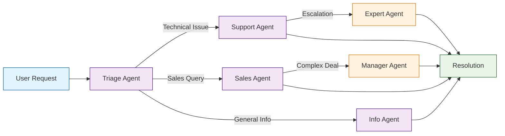

# OpenAI Swarm Tutorial: Lightweight Multi-Agent Orchestration

<div align="center">

**🐝 Build Agent Teams That Work Together Seamlessly**

</div>

---

## 🎯 What is Swarm?

**Swarm**<sup>[View Repo](https://github.com/openai/swarm)</sup> is an educational framework from OpenAI designed for lightweight multi-agent orchestration. It provides a simple, ergonomic way to coordinate multiple AI agents, enabling seamless handoffs and collaborative problem-solving.

### Key Concepts

| Concept | Description |
|:--------|:------------|
| **Agents** | Autonomous units with instructions, tools, and behaviors |
| **Routines** | Predefined sequences of actions an agent can perform |
| **Handoffs** | Seamless transfer of control between agents |
| **Context Variables** | Shared state passed between agents during handoffs |
| **Function Calling** | Tool integration for agent capabilities |



## Tutorial Chapters

1. **[Chapter 1: Getting Started](01-getting-started.md)** - Installation, setup, and your first Swarm agent
2. **[Chapter 2: Agent Design](02-agent-design.md)** - Creating agents with instructions and personalities
3. **[Chapter 3: Function Calling & Tools](03-function-calling.md)** - Equipping agents with capabilities
4. **[Chapter 4: Routines](04-routines.md)** - Building predefined action sequences
5. **[Chapter 5: Agent Handoffs](05-handoffs.md)** - Seamless control transfer between agents
6. **[Chapter 6: Context Variables](06-context-variables.md)** - Managing shared state across agents
7. **[Chapter 7: Multi-Agent Patterns](07-multi-agent-patterns.md)** - Complex orchestration strategies
8. **[Chapter 8: Production Considerations](08-production.md)** - Scaling, monitoring, and best practices

## What You'll Learn

- **Design Specialized Agents** with distinct roles and capabilities
- **Implement Smooth Handoffs** between agents based on context
- **Build Complex Workflows** with multi-agent collaboration
- **Manage Shared State** using context variables
- **Integrate External Tools** through function calling
- **Create Resilient Systems** with proper error handling
- **Scale Agent Systems** for production use cases

## Prerequisites

- Python 3.10+
- OpenAI API key
- Basic understanding of LLMs and prompting
- Familiarity with async Python (helpful)

## Quick Start

```bash
# Install Swarm
pip install git+https://github.com/openai/swarm.git

# Set your OpenAI API key
export OPENAI_API_KEY="your-api-key"
```

```python
from swarm import Swarm, Agent

client = Swarm()

# Define a simple agent
agent = Agent(
    name="Helper",
    instructions="You are a helpful assistant. Be concise and friendly."
)

# Run the agent
response = client.run(
    agent=agent,
    messages=[{"role": "user", "content": "Hello!"}]
)

print(response.messages[-1]["content"])
```

## Example: Customer Service System

```python
from swarm import Swarm, Agent

client = Swarm()

# Transfer functions
def transfer_to_sales():
    """Transfer to sales agent for pricing and purchases."""
    return sales_agent

def transfer_to_support():
    """Transfer to support agent for technical issues."""
    return support_agent

# Define agents
triage_agent = Agent(
    name="Triage",
    instructions="""You are a customer service triage agent.
    Determine the nature of the customer's request and transfer to the appropriate agent:
    - Sales questions → transfer_to_sales()
    - Technical issues → transfer_to_support()
    """,
    functions=[transfer_to_sales, transfer_to_support]
)

sales_agent = Agent(
    name="Sales",
    instructions="You are a sales agent. Help with pricing, plans, and purchases."
)

support_agent = Agent(
    name="Support", 
    instructions="You are a technical support agent. Help troubleshoot issues."
)

# Run the system
response = client.run(
    agent=triage_agent,
    messages=[{"role": "user", "content": "I need help setting up my account"}]
)

print(f"Final agent: {response.agent.name}")
print(f"Response: {response.messages[-1]['content']}")
```

## Learning Path

### 🟢 Beginner Track
1. Chapters 1-3: Setup, basic agents, and function calling
2. Focus on single-agent workflows

### 🟡 Intermediate Track
1. Chapters 4-6: Routines, handoffs, and context management
2. Build multi-agent systems

### 🔴 Advanced Track
1. Chapters 7-8: Complex patterns and production deployment
2. Master enterprise-grade agent orchestration

---

**Ready to build multi-agent systems? Let's begin with [Chapter 1: Getting Started](01-getting-started.md)!**

*Generated for [Awesome Code Docs](https://github.com/johnxie/awesome-code-docs)*
