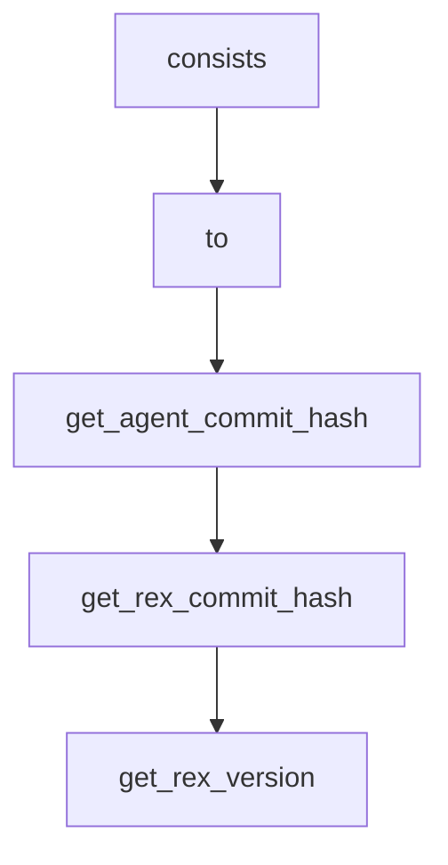

# Chapter 1: Getting Started

Welcome to **Chapter 1: Getting Started**. In this part of **SWE-agent Tutorial: Autonomous Repository Repair and Benchmark-Driven Engineering**, you will build an intuitive mental model first, then move into concrete implementation details and practical production tradeoffs.


This chapter gets SWE-agent running on a first issue-resolution workflow.

## Learning Goals

- set up a clean local environment
- run a first command-line task
- understand required credentials and repo context
- avoid common startup failures

## Fast Start Checklist

1. follow the source installation guide
2. configure model/provider credentials
3. run hello-world task flow from CLI
4. verify output artifacts and run logs

## Source References

- [SWE-agent Installation (Source)](https://swe-agent.com/latest/installation/source/)
- [SWE-agent Hello World](https://swe-agent.com/latest/usage/hello_world/)
- [SWE-agent README](https://github.com/SWE-agent/SWE-agent/blob/main/README.md)

## Summary

You now have a working SWE-agent baseline and can execute initial issue workflows.

Next: [Chapter 2: Core Architecture and YAML Configuration](02-core-architecture-and-yaml-configuration.md)

## Source Code Walkthrough

### `config/coding_challenge.yaml`

The `consists` interface in [`config/coding_challenge.yaml`](https://github.com/SWE-agent/SWE-agent/blob/HEAD/config/coding_challenge.yaml) handles a key part of this chapter's functionality:

```yaml
      SETTING: You are an autonomous programmer, and you're working directly in the command line with a special interface.

      The special interface consists of a file editor that shows you {{WINDOW}} lines of a file at a time.
      In addition to typical bash commands, you can also use the following commands to help you navigate and edit files.

      COMMANDS:
      {{command_docs}}

      Please note that THE EDIT COMMAND REQUIRES PROPER INDENTATION.
      If you'd like to add the line '        print(x)' you must fully write that out, with all those spaces before the code! Indentation is important and code that is not indented correctly will fail and require fixing before it can be run.

      RESPONSE FORMAT:
      Your shell prompt is formatted as follows:
      (Open file: <path>) <cwd> $

      You need to format your output using two fields; discussion and command.
      Your output should always include _one_ discussion and _one_ command field EXACTLY as in the following example:
      DISCUSSION
      First I'll start by using ls to see what files are in the current directory. Then maybe we can look at some relevant files to see what they look like.
      ```
      ls -a
      ```

      You should only include a *SINGLE* command in the command section and then wait for a response from the shell before continuing with more discussion and commands. Everything you include in the DISCUSSION section will be saved for future reference.
      If you'd like to issue two commands at once, PLEASE DO NOT DO THAT! Please instead first submit just the first command, and then after receiving a response you'll be able to issue the second command.
      You're free to use any other bash commands you want (e.g. find, grep, cat, ls, cd) in addition to the special commands listed above.
      However, the environment does NOT support interactive session commands (e.g. python, vim), so please do not invoke them.
    instance_template: |-
      We're currently attempting to solve the following problem:
      ISSUE:
      {{issue}}

```

This interface is important because it defines how SWE-agent Tutorial: Autonomous Repository Repair and Benchmark-Driven Engineering implements the patterns covered in this chapter.

### `config/coding_challenge.yaml`

The `to` interface in [`config/coding_challenge.yaml`](https://github.com/SWE-agent/SWE-agent/blob/HEAD/config/coding_challenge.yaml) handles a key part of this chapter's functionality:

```yaml
# This is the template you should use when using SWE-agent to solve a coding challenge (i.e. LeetCode).
# It also shows how to repurpose the agent to do tasks different from software engineering.
agent:
  templates:
    system_template: |-
      SETTING: You are an autonomous programmer, and you're working directly in the command line with a special interface.

      The special interface consists of a file editor that shows you {{WINDOW}} lines of a file at a time.
      In addition to typical bash commands, you can also use the following commands to help you navigate and edit files.

      COMMANDS:
      {{command_docs}}

      Please note that THE EDIT COMMAND REQUIRES PROPER INDENTATION.
      If you'd like to add the line '        print(x)' you must fully write that out, with all those spaces before the code! Indentation is important and code that is not indented correctly will fail and require fixing before it can be run.

      RESPONSE FORMAT:
      Your shell prompt is formatted as follows:
      (Open file: <path>) <cwd> $

      You need to format your output using two fields; discussion and command.
      Your output should always include _one_ discussion and _one_ command field EXACTLY as in the following example:
      DISCUSSION
      First I'll start by using ls to see what files are in the current directory. Then maybe we can look at some relevant files to see what they look like.
      ```
      ls -a
      ```

      You should only include a *SINGLE* command in the command section and then wait for a response from the shell before continuing with more discussion and commands. Everything you include in the DISCUSSION section will be saved for future reference.
      If you'd like to issue two commands at once, PLEASE DO NOT DO THAT! Please instead first submit just the first command, and then after receiving a response you'll be able to issue the second command.
```

This interface is important because it defines how SWE-agent Tutorial: Autonomous Repository Repair and Benchmark-Driven Engineering implements the patterns covered in this chapter.

### `sweagent/__init__.py`

The `get_agent_commit_hash` function in [`sweagent/__init__.py`](https://github.com/SWE-agent/SWE-agent/blob/HEAD/sweagent/__init__.py) handles a key part of this chapter's functionality:

```py


def get_agent_commit_hash() -> str:
    """Get the commit hash of the current SWE-agent commit.

    If we cannot get the hash, we return an empty string.
    """
    try:
        repo = Repo(REPO_ROOT, search_parent_directories=False)
    except Exception:
        return "unavailable"
    return repo.head.object.hexsha


def get_rex_commit_hash() -> str:
    import swerex

    try:
        repo = Repo(Path(swerex.__file__).resolve().parent.parent.parent, search_parent_directories=False)
    except Exception:
        return "unavailable"
    return repo.head.object.hexsha


def get_rex_version() -> str:
    from swerex import __version__ as rex_version

    return rex_version


def get_agent_version_info() -> str:
    hash = get_agent_commit_hash()
```

This function is important because it defines how SWE-agent Tutorial: Autonomous Repository Repair and Benchmark-Driven Engineering implements the patterns covered in this chapter.

### `sweagent/__init__.py`

The `get_rex_commit_hash` function in [`sweagent/__init__.py`](https://github.com/SWE-agent/SWE-agent/blob/HEAD/sweagent/__init__.py) handles a key part of this chapter's functionality:

```py


def get_rex_commit_hash() -> str:
    import swerex

    try:
        repo = Repo(Path(swerex.__file__).resolve().parent.parent.parent, search_parent_directories=False)
    except Exception:
        return "unavailable"
    return repo.head.object.hexsha


def get_rex_version() -> str:
    from swerex import __version__ as rex_version

    return rex_version


def get_agent_version_info() -> str:
    hash = get_agent_commit_hash()
    rex_hash = get_rex_commit_hash()
    rex_version = get_rex_version()
    return f"This is SWE-agent version {__version__} ({hash=}) with SWE-ReX version {rex_version} ({rex_hash=})."


def impose_rex_lower_bound() -> None:
    rex_version = get_rex_version()
    minimal_rex_version = "1.2.0"
    if version.parse(rex_version) < version.parse(minimal_rex_version):
        msg = (
            f"SWE-ReX version {rex_version} is too old. Please update to at least {minimal_rex_version} by "
            "running `pip install --upgrade swe-rex`."
```

This function is important because it defines how SWE-agent Tutorial: Autonomous Repository Repair and Benchmark-Driven Engineering implements the patterns covered in this chapter.


## How These Components Connect


