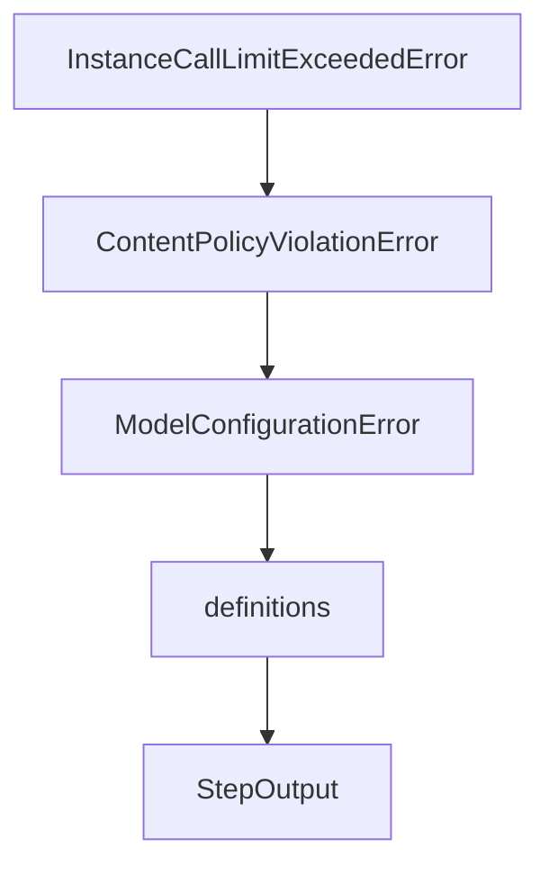

# Chapter 2: Core Architecture and YAML Configuration

Welcome to **Chapter 2: Core Architecture and YAML Configuration**. In this part of **SWE-agent Tutorial: Autonomous Repository Repair and Benchmark-Driven Engineering**, you will build an intuitive mental model first, then move into concrete implementation details and practical production tradeoffs.


This chapter explains SWE-agent's configuration-first design centered around YAML files.

## Learning Goals

- map agent internals to config surfaces
- understand how prompts, tools, and history processors connect
- choose stable defaults for reproducibility
- keep configs versioned and auditable

## Configuration Surfaces

- agent configuration
- tool configuration
- environment configuration
- run configuration for single or batch execution

## Source References

- [SWE-agent Reference: agent_config](https://swe-agent.com/latest/reference/agent_config/)
- [SWE-agent Reference: tools_config](https://swe-agent.com/latest/reference/tools_config/)
- [SWE-agent Reference: run_single_config](https://swe-agent.com/latest/reference/run_single_config/)

## Summary

You now understand the key control points for predictable SWE-agent behavior.

Next: [Chapter 3: CLI Workflows and Usage Modes](03-cli-workflows-and-usage-modes.md)

## Source Code Walkthrough

### `sweagent/exceptions.py`

The `InstanceCallLimitExceededError` class in [`sweagent/exceptions.py`](https://github.com/SWE-agent/SWE-agent/blob/HEAD/sweagent/exceptions.py) handles a key part of this chapter's functionality:

```py


class InstanceCallLimitExceededError(CostLimitExceededError):
    """Raised when we exceed the per instance call limit"""


class ContentPolicyViolationError(Exception):
    """Raised when the model response violates a content policy"""


class ModelConfigurationError(Exception):
    """Raised when the model configuration is invalid/no further retries
    should be made.
    """

```

This class is important because it defines how SWE-agent Tutorial: Autonomous Repository Repair and Benchmark-Driven Engineering implements the patterns covered in this chapter.

### `sweagent/exceptions.py`

The `ContentPolicyViolationError` class in [`sweagent/exceptions.py`](https://github.com/SWE-agent/SWE-agent/blob/HEAD/sweagent/exceptions.py) handles a key part of this chapter's functionality:

```py


class ContentPolicyViolationError(Exception):
    """Raised when the model response violates a content policy"""


class ModelConfigurationError(Exception):
    """Raised when the model configuration is invalid/no further retries
    should be made.
    """

```

This class is important because it defines how SWE-agent Tutorial: Autonomous Repository Repair and Benchmark-Driven Engineering implements the patterns covered in this chapter.

### `sweagent/exceptions.py`

The `ModelConfigurationError` class in [`sweagent/exceptions.py`](https://github.com/SWE-agent/SWE-agent/blob/HEAD/sweagent/exceptions.py) handles a key part of this chapter's functionality:

```py


class ModelConfigurationError(Exception):
    """Raised when the model configuration is invalid/no further retries
    should be made.
    """

```

This class is important because it defines how SWE-agent Tutorial: Autonomous Repository Repair and Benchmark-Driven Engineering implements the patterns covered in this chapter.

### `sweagent/types.py`

The `definitions` class in [`sweagent/types.py`](https://github.com/SWE-agent/SWE-agent/blob/HEAD/sweagent/types.py) handles a key part of this chapter's functionality:

```py
"""This file has types/dataclass definitions that are used in the SWE agent
for exchanging data between different modules/functions/classes.
They oftentimes cannot be defined in the same file where they are used
because of circular dependencies.
"""

from __future__ import annotations

from typing import Any, Literal

from pydantic import BaseModel
from typing_extensions import TypedDict


class StepOutput(BaseModel):
    query: list[dict] = [{}]
    thought: str = ""
    action: str = ""
    output: str = ""
    observation: str = ""
    execution_time: float = 0.0
    done: bool = False
    exit_status: int | str | None = None
    submission: str | None = None
    state: dict[str, str] = {}
    tool_calls: list[dict[str, Any]] | None = None
    tool_call_ids: list[str] | None = None
    thinking_blocks: list[dict[str, Any]] | None = None

    """State of the environment at the end of the step"""
```

This class is important because it defines how SWE-agent Tutorial: Autonomous Repository Repair and Benchmark-Driven Engineering implements the patterns covered in this chapter.


## How These Components Connect


