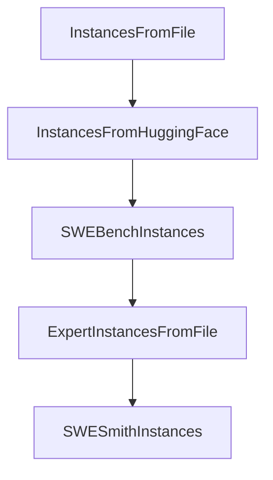

# Chapter 3: CLI Workflows and Usage Modes

Welcome to **Chapter 3: CLI Workflows and Usage Modes**. In this part of **SWE-agent Tutorial: Autonomous Repository Repair and Benchmark-Driven Engineering**, you will build an intuitive mental model first, then move into concrete implementation details and practical production tradeoffs.


This chapter covers how to move between single-run and batch workflows.

## Learning Goals

- run single issues for rapid iteration
- run batch workloads for scale testing
- choose interaction patterns by task complexity
- capture artifacts for post-run analysis

## Usage Modes

- hello-world/single issue flows for focused debugging
- batch mode for benchmark-like evaluations
- custom task templates for specialized workload classes

## Source References

- [SWE-agent Usage: Hello World](https://swe-agent.com/latest/usage/hello_world/)
- [SWE-agent Usage: Batch Mode](https://swe-agent.com/latest/usage/batch_mode/)
- [SWE-agent Usage: Coding Challenges](https://swe-agent.com/latest/usage/coding_challenges/)

## Summary

You can now choose the right execution mode for local debugging or scale evaluation.

Next: [Chapter 4: Tooling, Environments, and Model Strategy](04-tooling-environments-and-model-strategy.md)

## Depth Expansion Playbook

## Source Code Walkthrough

### `sweagent/run/batch_instances.py`

The `InstancesFromFile` class in [`sweagent/run/batch_instances.py`](https://github.com/SWE-agent/SWE-agent/blob/HEAD/sweagent/run/batch_instances.py) handles a key part of this chapter's functionality:

```py


class InstancesFromFile(BaseModel, AbstractInstanceSource):
    """Load instances from a file."""

    path: Path
    filter: str = ".*"
    """Regular expression to filter the instances by instance id."""
    slice: str = ""
    """Select only a slice of the instances (after filtering by `filter`).
    Possible values are stop or start:stop or start:stop:step
    (i.e., it behaves exactly like python's list slicing `list[slice]`).
    """
    shuffle: bool = False
    """Shuffle the instances (before filtering and slicing)."""

    deployment: DeploymentConfig = Field(
        default_factory=lambda: DockerDeploymentConfig(image="python:3.11"),
        description="Deployment options.",
    )
    """Note that the image_name option is overwritten by the images specified in the task instances."""

    simple: Literal[True] = True
    """Convenience discriminator for (de)serialization/CLI. Do not change."""

    type: Literal["file"] = "file"
    """Discriminator for (de)serialization/CLI. Do not change."""

    def get_instance_configs(self) -> list[BatchInstance]:
        instance_dicts = load_file(self.path)
        simple_instances = [SimpleBatchInstance.model_validate(instance_dict) for instance_dict in instance_dicts]
        instances = [instance.to_full_batch_instance(self.deployment) for instance in simple_instances]
```

This class is important because it defines how SWE-agent Tutorial: Autonomous Repository Repair and Benchmark-Driven Engineering implements the patterns covered in this chapter.

### `sweagent/run/batch_instances.py`

The `InstancesFromHuggingFace` class in [`sweagent/run/batch_instances.py`](https://github.com/SWE-agent/SWE-agent/blob/HEAD/sweagent/run/batch_instances.py) handles a key part of this chapter's functionality:

```py


class InstancesFromHuggingFace(BaseModel, AbstractInstanceSource):
    """Load instances from HuggingFace."""

    dataset_name: str
    """Name of the HuggingFace dataset. Same as when using `datasets.load_dataset`."""
    split: str = "dev"
    filter: str = ".*"
    """Regular expression to filter the instances by instance id."""
    slice: str = ""
    """Select only a slice of the instances (after filtering by `filter`).
    Possible values are stop or start:stop or start:stop:step.
    (i.e., it behaves exactly like python's list slicing `list[slice]`).
    """
    shuffle: bool = False
    """Shuffle the instances (before filtering and slicing)."""

    deployment: DeploymentConfig = Field(
        default_factory=lambda: DockerDeploymentConfig(image="python:3.11"),
    )
    """Deployment configuration. Note that the `image_name` option is overwritten by the images specified in the task instances.
    """
    type: Literal["huggingface"] = "huggingface"
    """Discriminator for (de)serialization/CLI. Do not change."""

    def get_instance_configs(self) -> list[BatchInstance]:
        from datasets import load_dataset

        ds: list[dict[str, Any]] = load_dataset(self.dataset_name, split=self.split)  # type: ignore
        simple_instances: list[SimpleBatchInstance] = [SimpleBatchInstance.model_validate(instance) for instance in ds]
        instances = [instance.to_full_batch_instance(self.deployment) for instance in simple_instances]
```

This class is important because it defines how SWE-agent Tutorial: Autonomous Repository Repair and Benchmark-Driven Engineering implements the patterns covered in this chapter.

### `sweagent/run/batch_instances.py`

The `SWEBenchInstances` class in [`sweagent/run/batch_instances.py`](https://github.com/SWE-agent/SWE-agent/blob/HEAD/sweagent/run/batch_instances.py) handles a key part of this chapter's functionality:

```py


class SWEBenchInstances(BaseModel, AbstractInstanceSource):
    """Load instances from SWE-bench."""

    subset: Literal["lite", "verified", "full", "multimodal", "multilingual"] = "lite"
    """Subset of swe-bench to use"""

    # IMPORTANT: Do not call this `path`, because then if people do not specify instance.type,
    # it might be resolved to ExpertInstancesFromFile or something like that.
    path_override: str | Path | None = None
    """Allow to specify a different huggingface dataset name or path to a huggingface
    dataset. This will override the automatic path set by `subset`.
    """

    split: Literal["dev", "test"] = "dev"

    deployment: DeploymentConfig = Field(
        default_factory=lambda: DockerDeploymentConfig(image="python:3.11"),
    )
    """Deployment configuration. Note that the image_name option is overwritten by the images specified in the task instances.
    """

    type: Literal["swe_bench"] = "swe_bench"
    """Discriminator for (de)serialization/CLI. Do not change."""

    filter: str = ".*"
    """Regular expression to filter the instances by instance id."""
    slice: str = ""
    """Select only a slice of the instances (after filtering by `filter`).
    Possible values are stop or start:stop or start:stop:step.
    (i.e., it behaves exactly like python's list slicing `list[slice]`).
```

This class is important because it defines how SWE-agent Tutorial: Autonomous Repository Repair and Benchmark-Driven Engineering implements the patterns covered in this chapter.

### `sweagent/run/batch_instances.py`

The `ExpertInstancesFromFile` class in [`sweagent/run/batch_instances.py`](https://github.com/SWE-agent/SWE-agent/blob/HEAD/sweagent/run/batch_instances.py) handles a key part of this chapter's functionality:

```py

    # IMPORTANT: Do not call this `path`, because then if people do not specify instance.type,
    # it might be resolved to ExpertInstancesFromFile or something like that.
    path_override: str | Path | None = None
    """Allow to specify a different huggingface dataset name or path to a huggingface
    dataset. This will override the automatic path set by `subset`.
    """

    split: Literal["dev", "test"] = "dev"

    deployment: DeploymentConfig = Field(
        default_factory=lambda: DockerDeploymentConfig(image="python:3.11"),
    )
    """Deployment configuration. Note that the image_name option is overwritten by the images specified in the task instances.
    """

    type: Literal["swe_bench"] = "swe_bench"
    """Discriminator for (de)serialization/CLI. Do not change."""

    filter: str = ".*"
    """Regular expression to filter the instances by instance id."""
    slice: str = ""
    """Select only a slice of the instances (after filtering by `filter`).
    Possible values are stop or start:stop or start:stop:step.
    (i.e., it behaves exactly like python's list slicing `list[slice]`).
    """
    shuffle: bool = False
    """Shuffle the instances (before filtering and slicing)."""

    evaluate: bool = False
    """Run sb-cli to evaluate"""

```

This class is important because it defines how SWE-agent Tutorial: Autonomous Repository Repair and Benchmark-Driven Engineering implements the patterns covered in this chapter.


## How These Components Connect


