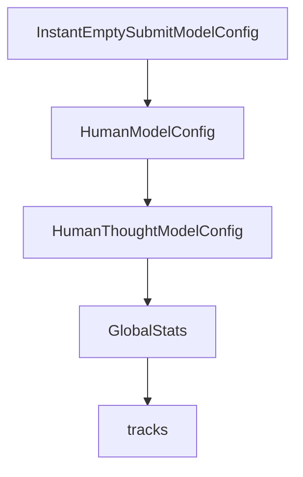

# Chapter 3: CLI Workflows and Usage Modes

Welcome to **Chapter 3: CLI Workflows and Usage Modes**. In this part of **SWE-agent Tutorial: Autonomous Repository Repair and Benchmark-Driven Engineering**, you will build an intuitive mental model first, then move into concrete implementation details and practical production tradeoffs.


This chapter covers how to move between single-run and batch workflows.

## Learning Goals

- run single issues for rapid iteration
- run batch workloads for scale testing
- choose interaction patterns by task complexity
- capture artifacts for post-run analysis

## Usage Modes

- hello-world/single issue flows for focused debugging
- batch mode for benchmark-like evaluations
- custom task templates for specialized workload classes

## Source References

- [SWE-agent Usage: Hello World](https://swe-agent.com/latest/usage/hello_world/)
- [SWE-agent Usage: Batch Mode](https://swe-agent.com/latest/usage/batch_mode/)
- [SWE-agent Usage: Coding Challenges](https://swe-agent.com/latest/usage/coding_challenges/)

## Summary

You can now choose the right execution mode for local debugging or scale evaluation.

Next: [Chapter 4: Tooling, Environments, and Model Strategy](04-tooling-environments-and-model-strategy.md)

## Source Code Walkthrough

### `sweagent/agent/models.py`

The `InstantEmptySubmitModelConfig` class in [`sweagent/agent/models.py`](https://github.com/SWE-agent/SWE-agent/blob/HEAD/sweagent/agent/models.py) handles a key part of this chapter's functionality:

```py


class InstantEmptySubmitModelConfig(GenericAPIModelConfig):
    """Model that immediately submits an empty patch"""

    name: Literal["instant_empty_submit"] = Field(default="instant_empty_submit", description="Model name.")

    per_instance_cost_limit: float = Field(
        default=0.0, description="Cost limit for every instance (task). This is a dummy value here."
    )
    total_cost_limit: float = Field(
        default=0.0, description="Cost limit for all instances (tasks). This is a dummy value here."
    )
    delay: float = 0.0
    """Delay before answering"""

    model_config = ConfigDict(extra="forbid")


class HumanModelConfig(GenericAPIModelConfig):
    name: Literal["human"] = Field(default="human", description="Model name.")

    per_instance_cost_limit: float = Field(
        default=0.0, description="Cost limit for every instance (task). This is a dummy value here."
    )
    total_cost_limit: float = Field(default=0.0, description="Cost limit for all instances (tasks).")
    cost_per_call: float = 0.0
    catch_eof: bool = True
    """Whether to catch EOF and return 'exit' when ^D is pressed. Set to False when used in human_step_in mode."""
    model_config = ConfigDict(extra="forbid")


```

This class is important because it defines how SWE-agent Tutorial: Autonomous Repository Repair and Benchmark-Driven Engineering implements the patterns covered in this chapter.

### `sweagent/agent/models.py`

The `HumanModelConfig` class in [`sweagent/agent/models.py`](https://github.com/SWE-agent/SWE-agent/blob/HEAD/sweagent/agent/models.py) handles a key part of this chapter's functionality:

```py


class HumanModelConfig(GenericAPIModelConfig):
    name: Literal["human"] = Field(default="human", description="Model name.")

    per_instance_cost_limit: float = Field(
        default=0.0, description="Cost limit for every instance (task). This is a dummy value here."
    )
    total_cost_limit: float = Field(default=0.0, description="Cost limit for all instances (tasks).")
    cost_per_call: float = 0.0
    catch_eof: bool = True
    """Whether to catch EOF and return 'exit' when ^D is pressed. Set to False when used in human_step_in mode."""
    model_config = ConfigDict(extra="forbid")


class HumanThoughtModelConfig(HumanModelConfig):
    name: Literal["human_thought"] = Field(default="human_thought", description="Model name.")

    per_instance_cost_limit: float = Field(
        default=0.0, description="Cost limit for every instance (task). This is a dummy value here."
    )
    total_cost_limit: float = Field(
        default=0.0, description="Cost limit for all instances (tasks). This is a dummy value here."
    )
    cost_per_call: float = 0.0

    model_config = ConfigDict(extra="forbid")


ModelConfig = Annotated[
    GenericAPIModelConfig
    | ReplayModelConfig
```

This class is important because it defines how SWE-agent Tutorial: Autonomous Repository Repair and Benchmark-Driven Engineering implements the patterns covered in this chapter.

### `sweagent/agent/models.py`

The `HumanThoughtModelConfig` class in [`sweagent/agent/models.py`](https://github.com/SWE-agent/SWE-agent/blob/HEAD/sweagent/agent/models.py) handles a key part of this chapter's functionality:

```py


class HumanThoughtModelConfig(HumanModelConfig):
    name: Literal["human_thought"] = Field(default="human_thought", description="Model name.")

    per_instance_cost_limit: float = Field(
        default=0.0, description="Cost limit for every instance (task). This is a dummy value here."
    )
    total_cost_limit: float = Field(
        default=0.0, description="Cost limit for all instances (tasks). This is a dummy value here."
    )
    cost_per_call: float = 0.0

    model_config = ConfigDict(extra="forbid")


ModelConfig = Annotated[
    GenericAPIModelConfig
    | ReplayModelConfig
    | InstantEmptySubmitModelConfig
    | HumanModelConfig
    | HumanThoughtModelConfig,
    Field(union_mode="left_to_right"),
]


class GlobalStats(PydanticBaseModel):
    """This class tracks usage numbers (costs etc.) across all instances."""

    total_cost: float = 0
    """Cumulative cost for all instances so far"""

```

This class is important because it defines how SWE-agent Tutorial: Autonomous Repository Repair and Benchmark-Driven Engineering implements the patterns covered in this chapter.

### `sweagent/agent/models.py`

The `GlobalStats` class in [`sweagent/agent/models.py`](https://github.com/SWE-agent/SWE-agent/blob/HEAD/sweagent/agent/models.py) handles a key part of this chapter's functionality:

```py


class GlobalStats(PydanticBaseModel):
    """This class tracks usage numbers (costs etc.) across all instances."""

    total_cost: float = 0
    """Cumulative cost for all instances so far"""

    last_query_timestamp: float = 0
    """Timestamp of the last query. Currently only used with API models."""


GLOBAL_STATS = GlobalStats()
"""This object tracks usage numbers (costs etc.) across all instances.
Please use the `GLOBAL_STATS_LOCK` lock when accessing this object to avoid race conditions.
"""

GLOBAL_STATS_LOCK = Lock()
"""Lock for accessing `GLOBAL_STATS` without race conditions"""


class InstanceStats(PydanticBaseModel):
    """This object tracks usage numbers (costs etc.) for a single instance."""

    instance_cost: float = 0
    tokens_sent: int = 0
    tokens_received: int = 0
    api_calls: int = 0

    def __add__(self, other: InstanceStats) -> InstanceStats:
        return InstanceStats(
            **{field: getattr(self, field) + getattr(other, field) for field in self.model_fields.keys()},
```

This class is important because it defines how SWE-agent Tutorial: Autonomous Repository Repair and Benchmark-Driven Engineering implements the patterns covered in this chapter.


## How These Components Connect


