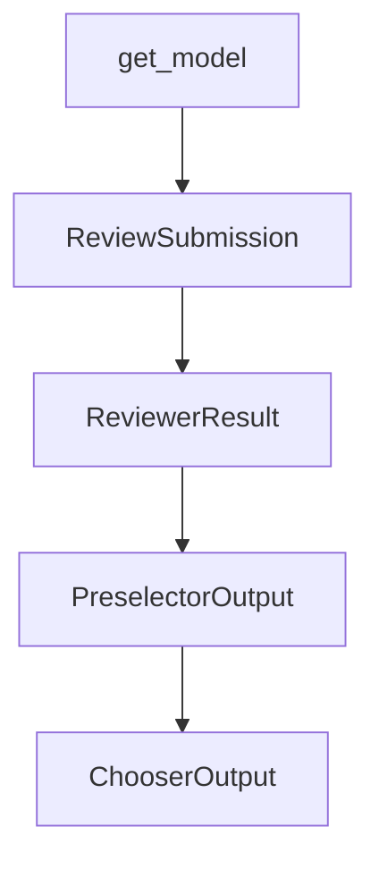

# Chapter 4: Tooling, Environments, and Model Strategy

Welcome to **Chapter 4: Tooling, Environments, and Model Strategy**. In this part of **SWE-agent Tutorial: Autonomous Repository Repair and Benchmark-Driven Engineering**, you will build an intuitive mental model first, then move into concrete implementation details and practical production tradeoffs.


This chapter focuses on runtime controls that materially affect quality and cost.

## Learning Goals

- configure environment constraints and tooling safely
- select model strategies by task profile
- reduce non-deterministic behavior across runs
- control failure domains in autonomous execution

## Practical Tuning Areas

- environment isolation and dependency setup
- model selection for planning vs implementation
- tool restrictions for safer action scope
- retry/error-handling strategies in long tasks

## Source References

- [SWE-agent Reference: env_config](https://swe-agent.com/latest/reference/env_config/)
- [SWE-agent Reference: model_config](https://swe-agent.com/latest/reference/model_config/)
- [SWE-agent Reference: tools_config](https://swe-agent.com/latest/reference/tools_config/)

## Summary

You now have a strategy for balancing reliability, cost, and speed in SWE-agent runs.

Next: [Chapter 5: Benchmarking and Evaluation Practices](05-benchmarking-and-evaluation-practices.md)

## Source Code Walkthrough

### `sweagent/agent/models.py`

The `get_model` function in [`sweagent/agent/models.py`](https://github.com/SWE-agent/SWE-agent/blob/HEAD/sweagent/agent/models.py) handles a key part of this chapter's functionality:

```py


def get_model(args: ModelConfig, tools: ToolConfig) -> AbstractModel:
    """Returns correct model object given arguments and commands"""
    # Convert GenericAPIModelConfig to specific model config if needed
    if isinstance(args, GenericAPIModelConfig) and not isinstance(
        args, HumanModelConfig | HumanThoughtModelConfig | ReplayModelConfig | InstantEmptySubmitModelConfig
    ):
        if args.name == "human":
            args = HumanModelConfig(**args.model_dump())
        elif args.name == "human_thought":
            args = HumanThoughtModelConfig(**args.model_dump())
        elif args.name == "replay":
            args = ReplayModelConfig(**args.model_dump())
        elif args.name == "instant_empty_submit":
            args = InstantEmptySubmitModelConfig(**args.model_dump())

    if args.name == "human":
        assert isinstance(args, HumanModelConfig), f"Expected {HumanModelConfig}, got {args}"
        return HumanModel(args, tools)
    if args.name == "human_thought":
        assert isinstance(args, HumanThoughtModelConfig), f"Expected {HumanThoughtModelConfig}, got {args}"
        return HumanThoughtModel(args, tools)
    if args.name == "replay":
        assert isinstance(args, ReplayModelConfig), f"Expected {ReplayModelConfig}, got {args}"
        return ReplayModel(args, tools)
    elif args.name == "instant_empty_submit":
        assert isinstance(args, InstantEmptySubmitModelConfig), f"Expected {InstantEmptySubmitModelConfig}, got {args}"
        return InstantEmptySubmitTestModel(args, tools)
    assert isinstance(args, GenericAPIModelConfig), f"Expected {GenericAPIModelConfig}, got {args}"
    return LiteLLMModel(args, tools)

```

This function is important because it defines how SWE-agent Tutorial: Autonomous Repository Repair and Benchmark-Driven Engineering implements the patterns covered in this chapter.

### `sweagent/agent/reviewer.py`

The `ReviewSubmission` class in [`sweagent/agent/reviewer.py`](https://github.com/SWE-agent/SWE-agent/blob/HEAD/sweagent/agent/reviewer.py) handles a key part of this chapter's functionality:

```py


class ReviewSubmission(BaseModel):
    """Information that's passed to the reviewer"""

    #: Total trajectory (including several retries)
    trajectory: Trajectory
    #: Aggregate info dict (including several retries)
    info: AgentInfo
    #: Model stats for this attempt
    model_stats: InstanceStats

    def to_format_dict(self, *, suffix="") -> dict[str, Any]:
        """Return all the data that is used to format the
        messages. Trajectory is excluded because it needs special treatment.
        """
        out = {}
        info = copy.deepcopy(self.info)
        if not info.get("submission"):
            # Observed that not all exit_cost lead to autosubmission
            # so sometimes this might be missing.
            info["submission"] = ""
        for k, v in info.items():
            if isinstance(v, str):
                out[f"{k}{suffix}"] = v
            elif isinstance(v, dict):
                for k2, v2 in v.items():
                    out[f"{k}_{k2}{suffix}"] = v2
        return out


class ReviewerResult(BaseModel):
```

This class is important because it defines how SWE-agent Tutorial: Autonomous Repository Repair and Benchmark-Driven Engineering implements the patterns covered in this chapter.

### `sweagent/agent/reviewer.py`

The `ReviewerResult` class in [`sweagent/agent/reviewer.py`](https://github.com/SWE-agent/SWE-agent/blob/HEAD/sweagent/agent/reviewer.py) handles a key part of this chapter's functionality:

```py


class ReviewerResult(BaseModel):
    accept: bool | float
    outputs: list[str]
    messages: list[dict[str, Any]]


class PreselectorOutput(BaseModel):
    chosen_idx: list[int]
    response: str
    messages: list[dict[str, Any]]


class ChooserOutput(BaseModel):
    chosen_idx: int
    response: str
    preselector_output: PreselectorOutput | None = None
    messages: list[dict[str, Any]]


# --- INTERFACES ---


class AbstractReviewer(ABC):
    """The reviewer checks a single solution and tries to predict
    if it successfully solves the issue.
    """

    @abstractmethod
    def review(self, instance: ProblemStatement, submission: ReviewSubmission) -> ReviewerResult:
        """Returns True if the submission is believed to be correct"""
```

This class is important because it defines how SWE-agent Tutorial: Autonomous Repository Repair and Benchmark-Driven Engineering implements the patterns covered in this chapter.

### `sweagent/agent/reviewer.py`

The `PreselectorOutput` class in [`sweagent/agent/reviewer.py`](https://github.com/SWE-agent/SWE-agent/blob/HEAD/sweagent/agent/reviewer.py) handles a key part of this chapter's functionality:

```py


class PreselectorOutput(BaseModel):
    chosen_idx: list[int]
    response: str
    messages: list[dict[str, Any]]


class ChooserOutput(BaseModel):
    chosen_idx: int
    response: str
    preselector_output: PreselectorOutput | None = None
    messages: list[dict[str, Any]]


# --- INTERFACES ---


class AbstractReviewer(ABC):
    """The reviewer checks a single solution and tries to predict
    if it successfully solves the issue.
    """

    @abstractmethod
    def review(self, instance: ProblemStatement, submission: ReviewSubmission) -> ReviewerResult:
        """Returns True if the submission is believed to be correct"""


class AbstractRetryLoop(ABC):
    """The review loop controls how often the agent tries to solve
    the issue and how it selects the best solution.
    """
```

This class is important because it defines how SWE-agent Tutorial: Autonomous Repository Repair and Benchmark-Driven Engineering implements the patterns covered in this chapter.


## How These Components Connect


