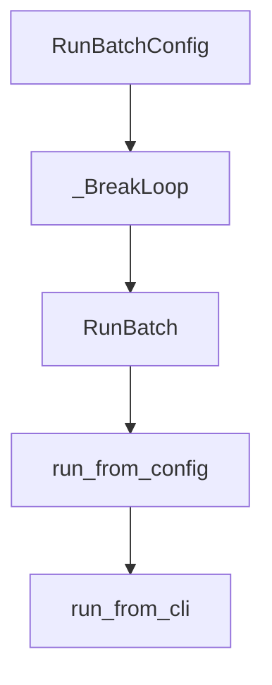

# Chapter 4: Tooling, Environments, and Model Strategy

Welcome to **Chapter 4: Tooling, Environments, and Model Strategy**. In this part of **SWE-agent Tutorial: Autonomous Repository Repair and Benchmark-Driven Engineering**, you will build an intuitive mental model first, then move into concrete implementation details and practical production tradeoffs.


This chapter focuses on runtime controls that materially affect quality and cost.

## Learning Goals

- configure environment constraints and tooling safely
- select model strategies by task profile
- reduce non-deterministic behavior across runs
- control failure domains in autonomous execution

## Practical Tuning Areas

- environment isolation and dependency setup
- model selection for planning vs implementation
- tool restrictions for safer action scope
- retry/error-handling strategies in long tasks

## Source References

- [SWE-agent Reference: env_config](https://swe-agent.com/latest/reference/env_config/)
- [SWE-agent Reference: model_config](https://swe-agent.com/latest/reference/model_config/)
- [SWE-agent Reference: tools_config](https://swe-agent.com/latest/reference/tools_config/)

## Summary

You now have a strategy for balancing reliability, cost, and speed in SWE-agent runs.

Next: [Chapter 5: Benchmarking and Evaluation Practices](05-benchmarking-and-evaluation-practices.md)

## Depth Expansion Playbook

## Source Code Walkthrough

### `sweagent/run/run_batch.py`

The `RunBatchConfig` class in [`sweagent/run/run_batch.py`](https://github.com/SWE-agent/SWE-agent/blob/HEAD/sweagent/run/run_batch.py) handles a key part of this chapter's functionality:

```py


class RunBatchConfig(BaseSettings, cli_implicit_flags=False):
    instances: BatchInstanceSourceConfig = Field(description="Instances to run.")
    agent: AgentConfig = Field(description="Agent options.")
    output_dir: Path = Field(default=Path("DEFAULT"), description="Output directory.")
    suffix: str = ""
    """Suffix to add to the output directory. Only used if `output_dir` is `DEFAULT`."""
    raise_exceptions: bool = False
    """Raise exceptions instead of skipping instances."""
    redo_existing: bool = False
    """Do not skip instances that already have a trajectory."""
    env_var_path: Path | None = None
    """Path to a .env file to load environment variables from."""
    num_workers: int = Field(default=1)
    """Number of parallel workers to use."""
    random_delay_multiplier: float = 0.3
    """We will wait for a random amount of time between 0 and `random_delay_multiplier`
    times the number of workers at the start of each instance. This is to avoid any
    potential race condition or issues with bottlenecks, e.g., when running on a platform
    with few CPUs that cannot handle the startup of all containers in time.
    """
    progress_bar: bool = True
    """Whether to show a progress bar. Progress bar is never shown for human models.
    Progress bar is always shown for multi-worker runs.
    """

    # pydantic config
    model_config = SettingsConfigDict(extra="forbid", env_prefix="SWE_AGENT_")

    def set_default_output_dir(self) -> None:
        # Needs to be called explicitly, because self._config_files will be setup
```

This class is important because it defines how SWE-agent Tutorial: Autonomous Repository Repair and Benchmark-Driven Engineering implements the patterns covered in this chapter.

### `sweagent/run/run_batch.py`

The `_BreakLoop` class in [`sweagent/run/run_batch.py`](https://github.com/SWE-agent/SWE-agent/blob/HEAD/sweagent/run/run_batch.py) handles a key part of this chapter's functionality:

```py


class _BreakLoop(Exception):
    """Used for internal control flow"""


class RunBatch:
    def __init__(
        self,
        instances: list[BatchInstance],
        agent_config: AgentConfig,
        *,
        output_dir: Path = Path("."),
        hooks: list[RunHook] | None = None,
        raise_exceptions: bool = False,
        redo_existing: bool = False,
        num_workers: int = 1,
        progress_bar: bool = True,
        random_delay_multiplier: float = 0.3,
    ):
        """Note: When initializing this class, make sure to add the hooks that are required by your actions.
        See `from_config` for an example.

        Args:
            hooks: If not specified, the default hooks will be used.
            num_workers: Number of parallel workers to use. Default is 1 (sequential execution).
            progress_bar: Whether to show a progress bar. Progress bar is never shown for human models.
                Progress bar is always shown for multi-worker runs.
            random_delay_multiplier: We will wait for a random amount of time between 0 and `random_delay_multiplier`
                times the number of workers at the start of each instance. This is to avoid any
                potential race conditions.
        """
```

This class is important because it defines how SWE-agent Tutorial: Autonomous Repository Repair and Benchmark-Driven Engineering implements the patterns covered in this chapter.

### `sweagent/run/run_batch.py`

The `RunBatch` class in [`sweagent/run/run_batch.py`](https://github.com/SWE-agent/SWE-agent/blob/HEAD/sweagent/run/run_batch.py) handles a key part of this chapter's functionality:

```py
from sweagent.environment.swe_env import SWEEnv
from sweagent.exceptions import ModelConfigurationError, TotalCostLimitExceededError
from sweagent.run._progress import RunBatchProgressManager
from sweagent.run.batch_instances import BatchInstance, BatchInstanceSourceConfig, SWEBenchInstances
from sweagent.run.common import BasicCLI, ConfigHelper, save_predictions
from sweagent.run.hooks.abstract import CombinedRunHooks, RunHook
from sweagent.run.hooks.apply_patch import SaveApplyPatchHook
from sweagent.run.merge_predictions import merge_predictions
from sweagent.run.run_single import RunSingleConfig
from sweagent.types import AgentRunResult
from sweagent.utils.config import load_environment_variables
from sweagent.utils.log import (
    add_file_handler,
    add_logger_names_to_stream_handlers,
    get_logger,
    register_thread_name,
    remove_file_handler,
    set_stream_handler_levels,
)


class RunBatchConfig(BaseSettings, cli_implicit_flags=False):
    instances: BatchInstanceSourceConfig = Field(description="Instances to run.")
    agent: AgentConfig = Field(description="Agent options.")
    output_dir: Path = Field(default=Path("DEFAULT"), description="Output directory.")
    suffix: str = ""
    """Suffix to add to the output directory. Only used if `output_dir` is `DEFAULT`."""
    raise_exceptions: bool = False
    """Raise exceptions instead of skipping instances."""
    redo_existing: bool = False
    """Do not skip instances that already have a trajectory."""
    env_var_path: Path | None = None
```

This class is important because it defines how SWE-agent Tutorial: Autonomous Repository Repair and Benchmark-Driven Engineering implements the patterns covered in this chapter.

### `sweagent/run/run_batch.py`

The `run_from_config` function in [`sweagent/run/run_batch.py`](https://github.com/SWE-agent/SWE-agent/blob/HEAD/sweagent/run/run_batch.py) handles a key part of this chapter's functionality:

```py


def run_from_config(config: RunBatchConfig):
    RunBatch.from_config(config).main()


def run_from_cli(args: list[str] | None = None):
    if args is None:
        args = sys.argv[1:]
    assert __doc__ is not None
    help_text = (  # type: ignore
        __doc__ + "\n[cyan][bold]=== ALL THE OPTIONS ===[/bold][/cyan]\n\n" + ConfigHelper().get_help(RunBatchConfig)
    )
    run_from_config(BasicCLI(RunBatchConfig, help_text=help_text).get_config(args))  # type: ignore


if __name__ == "__main__":
    run_from_cli()

```

This function is important because it defines how SWE-agent Tutorial: Autonomous Repository Repair and Benchmark-Driven Engineering implements the patterns covered in this chapter.


## How These Components Connect


