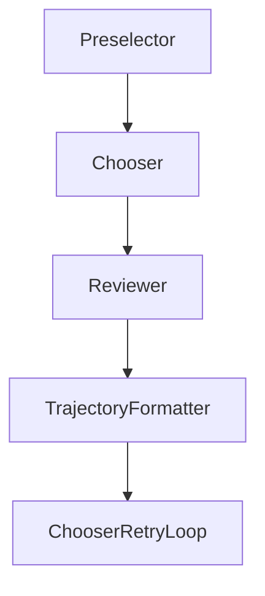

# Chapter 5: Benchmarking and Evaluation Practices

Welcome to **Chapter 5: Benchmarking and Evaluation Practices**. In this part of **SWE-agent Tutorial: Autonomous Repository Repair and Benchmark-Driven Engineering**, you will build an intuitive mental model first, then move into concrete implementation details and practical production tradeoffs.


This chapter maps SWE-agent usage to benchmark-grade evaluation habits.

## Learning Goals

- measure quality across repeated runs
- compare configurations fairly
- analyze failure classes and regressions
- convert insights into config improvements

## Evaluation Guidance

- keep benchmark inputs stable across comparisons
- log run metadata and model versions per experiment
- review partial successes, not only pass/fail outcomes
- track regressions after tool/model changes

## Source References

- [SWE-agent Usage: Batch Mode](https://swe-agent.com/latest/usage/batch_mode/)
- [SWE-bench Repository](https://github.com/SWE-bench/SWE-bench)
- [SWE-agent README: Positioning and Benchmarks](https://github.com/SWE-agent/SWE-agent/blob/main/README.md)

## Summary

You now have a repeatable framework for benchmarking SWE-agent systems.

Next: [Chapter 6: Offensive Security Mode and Specialized Workloads](06-offensive-security-mode-and-specialized-workloads.md)

## Source Code Walkthrough

### `sweagent/agent/reviewer.py`

The `Preselector` class in [`sweagent/agent/reviewer.py`](https://github.com/SWE-agent/SWE-agent/blob/HEAD/sweagent/agent/reviewer.py) handles a key part of this chapter's functionality:

```py


class PreselectorOutput(BaseModel):
    chosen_idx: list[int]
    response: str
    messages: list[dict[str, Any]]


class ChooserOutput(BaseModel):
    chosen_idx: int
    response: str
    preselector_output: PreselectorOutput | None = None
    messages: list[dict[str, Any]]


# --- INTERFACES ---


class AbstractReviewer(ABC):
    """The reviewer checks a single solution and tries to predict
    if it successfully solves the issue.
    """

    @abstractmethod
    def review(self, instance: ProblemStatement, submission: ReviewSubmission) -> ReviewerResult:
        """Returns True if the submission is believed to be correct"""


class AbstractRetryLoop(ABC):
    """The review loop controls how often the agent tries to solve
    the issue and how it selects the best solution.
    """
```

This class is important because it defines how SWE-agent Tutorial: Autonomous Repository Repair and Benchmark-Driven Engineering implements the patterns covered in this chapter.

### `sweagent/agent/reviewer.py`

The `Chooser` class in [`sweagent/agent/reviewer.py`](https://github.com/SWE-agent/SWE-agent/blob/HEAD/sweagent/agent/reviewer.py) handles a key part of this chapter's functionality:

```py


class ChooserOutput(BaseModel):
    chosen_idx: int
    response: str
    preselector_output: PreselectorOutput | None = None
    messages: list[dict[str, Any]]


# --- INTERFACES ---


class AbstractReviewer(ABC):
    """The reviewer checks a single solution and tries to predict
    if it successfully solves the issue.
    """

    @abstractmethod
    def review(self, instance: ProblemStatement, submission: ReviewSubmission) -> ReviewerResult:
        """Returns True if the submission is believed to be correct"""


class AbstractRetryLoop(ABC):
    """The review loop controls how often the agent tries to solve
    the issue and how it selects the best solution.
    """

    def retry(self) -> bool:
        """Returns True if the agent should retry solving the issue"""
        return False

    def on_submit(self, submission: ReviewSubmission) -> None:
```

This class is important because it defines how SWE-agent Tutorial: Autonomous Repository Repair and Benchmark-Driven Engineering implements the patterns covered in this chapter.

### `sweagent/agent/reviewer.py`

The `Reviewer` class in [`sweagent/agent/reviewer.py`](https://github.com/SWE-agent/SWE-agent/blob/HEAD/sweagent/agent/reviewer.py) handles a key part of this chapter's functionality:

```py


class ReviewerResult(BaseModel):
    accept: bool | float
    outputs: list[str]
    messages: list[dict[str, Any]]


class PreselectorOutput(BaseModel):
    chosen_idx: list[int]
    response: str
    messages: list[dict[str, Any]]


class ChooserOutput(BaseModel):
    chosen_idx: int
    response: str
    preselector_output: PreselectorOutput | None = None
    messages: list[dict[str, Any]]


# --- INTERFACES ---


class AbstractReviewer(ABC):
    """The reviewer checks a single solution and tries to predict
    if it successfully solves the issue.
    """

    @abstractmethod
    def review(self, instance: ProblemStatement, submission: ReviewSubmission) -> ReviewerResult:
        """Returns True if the submission is believed to be correct"""
```

This class is important because it defines how SWE-agent Tutorial: Autonomous Repository Repair and Benchmark-Driven Engineering implements the patterns covered in this chapter.

### `sweagent/agent/reviewer.py`

The `TrajectoryFormatter` class in [`sweagent/agent/reviewer.py`](https://github.com/SWE-agent/SWE-agent/blob/HEAD/sweagent/agent/reviewer.py) handles a key part of this chapter's functionality:

```py
        self._config = config
        self._model = model
        self._traj_formatter = TrajectoryFormatter(config=config.traj_formatter)
        self.logger = get_logger("reviewer", emoji="🧑‍⚖️")

    def format_messages(self, instance: ProblemStatement, submission: ReviewSubmission):
        system_message = self._config.system_template
        self.logger.debug(f"MODEL INPUT (system)\n{system_message}")
        ps_format_dict = {
            "problem_statement": instance.get_problem_statement(),
            **instance.get_extra_fields(),
        }
        user_message = Template(self._config.instance_template).render(
            **ps_format_dict,
            **submission.to_format_dict(),
            traj=self._traj_formatter.format_trajectory(submission.trajectory),
        )
        self.logger.debug(f"MODEL INPUT (user)\n{user_message}")
        return [
            {"role": "system", "content": system_message},
            {"role": "user", "content": user_message},
        ]

    def interpret(self, response: str) -> bool | float:
        last_line = response.strip().split("\n")[-1].strip()
        # Find all numbers in the last line and take the last one
        numbers = re.findall(r"-?\d+\.?\d*", last_line)
        if not numbers:
            msg = f"Could not interpret response: {last_line!r}"
            raise ValueError(msg)
        number = float(numbers[-1])
        if self._config.score_range[0] is not None and number < self._config.score_range[0]:
```

This class is important because it defines how SWE-agent Tutorial: Autonomous Repository Repair and Benchmark-Driven Engineering implements the patterns covered in this chapter.


## How These Components Connect


