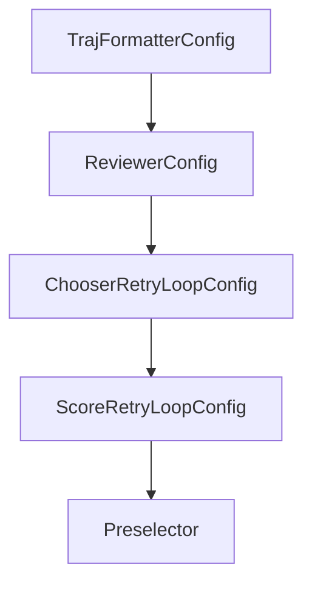

# Chapter 5: Benchmarking and Evaluation Practices

Welcome to **Chapter 5: Benchmarking and Evaluation Practices**. In this part of **SWE-agent Tutorial: Autonomous Repository Repair and Benchmark-Driven Engineering**, you will build an intuitive mental model first, then move into concrete implementation details and practical production tradeoffs.


This chapter maps SWE-agent usage to benchmark-grade evaluation habits.

## Learning Goals

- measure quality across repeated runs
- compare configurations fairly
- analyze failure classes and regressions
- convert insights into config improvements

## Evaluation Guidance

- keep benchmark inputs stable across comparisons
- log run metadata and model versions per experiment
- review partial successes, not only pass/fail outcomes
- track regressions after tool/model changes

## Source References

- [SWE-agent Usage: Batch Mode](https://swe-agent.com/latest/usage/batch_mode/)
- [SWE-bench Repository](https://github.com/SWE-bench/SWE-bench)
- [SWE-agent README: Positioning and Benchmarks](https://github.com/SWE-agent/SWE-agent/blob/main/README.md)

## Summary

You now have a repeatable framework for benchmarking SWE-agent systems.

Next: [Chapter 6: Offensive Security Mode and Specialized Workloads](06-offensive-security-mode-and-specialized-workloads.md)

## Depth Expansion Playbook

## Source Code Walkthrough

### `sweagent/agent/reviewer.py`

The `TrajFormatterConfig` class in [`sweagent/agent/reviewer.py`](https://github.com/SWE-agent/SWE-agent/blob/HEAD/sweagent/agent/reviewer.py) handles a key part of this chapter's functionality:

```py


class TrajFormatterConfig(BaseModel):
    #: Filter the following actions from the trajectory
    filter: list[str] = []
    #: Filter outputs from the following actions from the trajectory
    output_filter: list[str] = []
    #: Format of the trajectory item
    item_template: str = "Model: {{response}}\n\nObservation: {{observation}}"
    only_show_last_n_output: int = 0

    model_config = ConfigDict(extra="forbid")


class ReviewerConfig(BaseModel):
    """The configuration for the reviewer"""

    system_template: str
    instance_template: str
    #: If a submission autosubmits because of total cost or a similar exit status,
    #: it will get this malus to its score
    failure_score_penalty: float = 0.0
    traj_formatter: TrajFormatterConfig
    n_sample: int = 5
    reduce_by_std: float = 0.0
    score_range: tuple[float | None, float | None] = (None, None)
    #: If set, we assume that the score is in the range [score_range[0], score_range[1]]
    #: Reviews that are outside this range will be ignored

    type: Literal["reviewer"] = "reviewer"

    model_config = ConfigDict(extra="forbid")
```

This class is important because it defines how SWE-agent Tutorial: Autonomous Repository Repair and Benchmark-Driven Engineering implements the patterns covered in this chapter.

### `sweagent/agent/reviewer.py`

The `ReviewerConfig` class in [`sweagent/agent/reviewer.py`](https://github.com/SWE-agent/SWE-agent/blob/HEAD/sweagent/agent/reviewer.py) handles a key part of this chapter's functionality:

```py


class ReviewerConfig(BaseModel):
    """The configuration for the reviewer"""

    system_template: str
    instance_template: str
    #: If a submission autosubmits because of total cost or a similar exit status,
    #: it will get this malus to its score
    failure_score_penalty: float = 0.0
    traj_formatter: TrajFormatterConfig
    n_sample: int = 5
    reduce_by_std: float = 0.0
    score_range: tuple[float | None, float | None] = (None, None)
    #: If set, we assume that the score is in the range [score_range[0], score_range[1]]
    #: Reviews that are outside this range will be ignored

    type: Literal["reviewer"] = "reviewer"

    model_config = ConfigDict(extra="forbid")

    def get_reviewer(self, model: AbstractModel) -> AbstractReviewer:
        return Reviewer(self, model)


class ChooserRetryLoopConfig(BaseModel):
    type: Literal["chooser"] = "chooser"
    chooser: ChooserConfig

    max_attempts: int
    min_budget_for_new_attempt: float = 0.0
    """Minimal $ that need to be left in order for us to start a new attempt.
```

This class is important because it defines how SWE-agent Tutorial: Autonomous Repository Repair and Benchmark-Driven Engineering implements the patterns covered in this chapter.

### `sweagent/agent/reviewer.py`

The `ChooserRetryLoopConfig` class in [`sweagent/agent/reviewer.py`](https://github.com/SWE-agent/SWE-agent/blob/HEAD/sweagent/agent/reviewer.py) handles a key part of this chapter's functionality:

```py


class ChooserRetryLoopConfig(BaseModel):
    type: Literal["chooser"] = "chooser"
    chooser: ChooserConfig

    max_attempts: int
    min_budget_for_new_attempt: float = 0.0
    """Minimal $ that need to be left in order for us to start a new attempt.
    If set to 0: Always.
    """

    cost_limit: float
    """The maximum cost to spend on all attempts. Does not include cost of choosing.
    """

    model_config = ConfigDict(extra="forbid")

    def get_retry_loop(self, problem_statement: ProblemStatement) -> ChooserRetryLoop:
        return ChooserRetryLoop(self, problem_statement)


class ScoreRetryLoopConfig(BaseModel):
    """The configuration for the review loop"""

    type: Literal["score"] = "score"

    reviewer_config: ReviewerConfig

    accept_score: float
    max_accepts: int = 1
    max_attempts: int
```

This class is important because it defines how SWE-agent Tutorial: Autonomous Repository Repair and Benchmark-Driven Engineering implements the patterns covered in this chapter.

### `sweagent/agent/reviewer.py`

The `ScoreRetryLoopConfig` class in [`sweagent/agent/reviewer.py`](https://github.com/SWE-agent/SWE-agent/blob/HEAD/sweagent/agent/reviewer.py) handles a key part of this chapter's functionality:

```py


class ScoreRetryLoopConfig(BaseModel):
    """The configuration for the review loop"""

    type: Literal["score"] = "score"

    reviewer_config: ReviewerConfig

    accept_score: float
    max_accepts: int = 1
    max_attempts: int

    min_budget_for_new_attempt: float = 0.0
    """Minimal $ that need to be left in order for us to start a new attempt.
    If set to 0: Always.
    """

    cost_limit: float
    """The maximum cost to spend on all attempts and reviews except the last review.
    The last review is not included in the cost limit, because we would waste the last
    attempt if we couldn't score it.
    """

    model: ModelConfig

    model_config = ConfigDict(extra="forbid")

    def validate(self):
        """Checks config. Raises `ValueError` in case of misconfiguration"""
        ...

```

This class is important because it defines how SWE-agent Tutorial: Autonomous Repository Repair and Benchmark-Driven Engineering implements the patterns covered in this chapter.


## How These Components Connect


