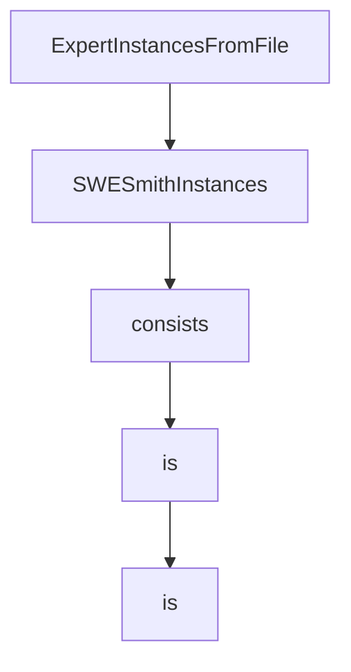

# Chapter 6: Offensive Security Mode and Specialized Workloads

Welcome to **Chapter 6: Offensive Security Mode and Specialized Workloads**. In this part of **SWE-agent Tutorial: Autonomous Repository Repair and Benchmark-Driven Engineering**, you will build an intuitive mental model first, then move into concrete implementation details and practical production tradeoffs.


This chapter explains workload specialization and when to use security-focused variants.

## Learning Goals

- understand EnIGMA mode scope and constraints
- decide when specialized versions are appropriate
- isolate high-risk workflows operationally
- align capabilities with governance requirements

## Scope Notes

SWE-agent's EnIGMA path targets offensive cybersecurity challenge workflows. Keep these environments isolated and policy-governed, and follow project guidance on version alignment.

## Source References

- [EnIGMA Project Site](https://enigma-agent.com/)
- [SWE-agent README: EnIGMA Section](https://github.com/SWE-agent/SWE-agent/blob/main/README.md#swe-agent-for-offensive-cybersecurity-enigma)
- [SWE-agent v0.7 Branch Note](https://github.com/SWE-agent/SWE-agent/tree/v0.7)

## Summary

You now understand how specialized security workloads fit into the broader SWE-agent ecosystem.

Next: [Chapter 7: Development and Contribution Workflow](07-development-and-contribution-workflow.md)

## Source Code Walkthrough

### `sweagent/run/batch_instances.py`

The `ExpertInstancesFromFile` class in [`sweagent/run/batch_instances.py`](https://github.com/SWE-agent/SWE-agent/blob/HEAD/sweagent/run/batch_instances.py) handles a key part of this chapter's functionality:

```py

    # IMPORTANT: Do not call this `path`, because then if people do not specify instance.type,
    # it might be resolved to ExpertInstancesFromFile or something like that.
    path_override: str | Path | None = None
    """Allow to specify a different huggingface dataset name or path to a huggingface
    dataset. This will override the automatic path set by `subset`.
    """

    split: Literal["dev", "test"] = "dev"

    deployment: DeploymentConfig = Field(
        default_factory=lambda: DockerDeploymentConfig(image="python:3.11"),
    )
    """Deployment configuration. Note that the image_name option is overwritten by the images specified in the task instances.
    """

    type: Literal["swe_bench"] = "swe_bench"
    """Discriminator for (de)serialization/CLI. Do not change."""

    filter: str = ".*"
    """Regular expression to filter the instances by instance id."""
    slice: str = ""
    """Select only a slice of the instances (after filtering by `filter`).
    Possible values are stop or start:stop or start:stop:step.
    (i.e., it behaves exactly like python's list slicing `list[slice]`).
    """
    shuffle: bool = False
    """Shuffle the instances (before filtering and slicing)."""

    evaluate: bool = False
    """Run sb-cli to evaluate"""

```

This class is important because it defines how SWE-agent Tutorial: Autonomous Repository Repair and Benchmark-Driven Engineering implements the patterns covered in this chapter.

### `sweagent/run/batch_instances.py`

The `SWESmithInstances` class in [`sweagent/run/batch_instances.py`](https://github.com/SWE-agent/SWE-agent/blob/HEAD/sweagent/run/batch_instances.py) handles a key part of this chapter's functionality:

```py


class SWESmithInstances(BaseModel, AbstractInstanceSource):
    """Load instances from SWE-smith."""

    path: Path

    deployment: DeploymentConfig = Field(
        default_factory=lambda: DockerDeploymentConfig(image="python:3.11"),
    )
    """Deployment configuration. Note that the image_name option is overwritten by the images specified in the task instances.
    """

    filter: str = ".*"
    """Regular expression to filter the instances by instance id."""
    slice: str = ""
    """Select only a slice of the instances (after filtering by `filter`).
    Possible values are stop or start:stop or start:stop:step.
    (i.e., it behaves exactly like python's list slicing `list[slice]`).
    """
    shuffle: bool = False
    """Shuffle the instances (before filtering and slicing)."""

    type: Literal["swesmith"] = "swesmith"
    """Discriminator for (de)serialization/CLI. Do not change."""

    def get_instance_configs(self) -> list[BatchInstance]:
        github_token = os.getenv("GITHUB_TOKEN", "")

        instance_dicts = load_file(self.path)
        instances = []

```

This class is important because it defines how SWE-agent Tutorial: Autonomous Repository Repair and Benchmark-Driven Engineering implements the patterns covered in this chapter.

### `trajectories/demonstrations/str_replace_anthropic_demo.yaml`

The `consists` interface in [`trajectories/demonstrations/str_replace_anthropic_demo.yaml`](https://github.com/SWE-agent/SWE-agent/blob/HEAD/trajectories/demonstrations/str_replace_anthropic_demo.yaml) handles a key part of this chapter's functionality:

```yaml
        </IMPORTANT>

        The special interface consists of a file editor that shows you {{WINDOW}} lines of a file at a time.
        In addition to typical bash commands, you can also use specific commands to help you navigate and edit files.
        To call a command, you need to invoke it with a function call/tool call.

        <notes>
        Please note that THE EDIT COMMAND REQUIRES PROPER INDENTATION.

        For example, if you are looking at this file:

        def fct():
            print("Hello world")

        and you want to edit the file to read:

        def fct():
            print("Hello")
            print("world")

        you search string should be `Hello world` and your replace string should be `"Hello"\n    print("world")`
        (note the extra spaces before the print statement!).

        You could also get the same result by search for `    print("Hello world")` and replace with `    print("Hello")\n    print("world")`.
        </notes>
        <response_format>
        Your shell prompt is formatted as follows:
        (Open file: <path>)
        (Current directory: <cwd>)
        bash-$

        First, you should _always_ include a general thought about what you're going to do next.
```

This interface is important because it defines how SWE-agent Tutorial: Autonomous Repository Repair and Benchmark-Driven Engineering implements the patterns covered in this chapter.

### `sweagent/tools/tools.py`

The `is` class in [`sweagent/tools/tools.py`](https://github.com/SWE-agent/SWE-agent/blob/HEAD/sweagent/tools/tools.py) handles a key part of this chapter's functionality:

```py
"""
This module contains the configuration for the tools that are made available to the agent.

The `ToolConfig` class is used to configure the tools that are available to the agent.
The `ToolHandler` class is used to handle the tools that are available to the agent.
"""

import asyncio
import json
import os
import re
from functools import cached_property
from pathlib import Path
from typing import Any

from pydantic import BaseModel, Field
from swerex.runtime.abstract import Command as RexCommand
from swerex.runtime.abstract import UploadRequest
from typing_extensions import Self

from sweagent.environment.swe_env import SWEEnv
from sweagent.tools.bundle import Bundle
from sweagent.tools.commands import BASH_COMMAND, Command
from sweagent.tools.parsing import FunctionCallingParser, JsonParser, ParseFunction
from sweagent.tools.utils import _guard_multiline_input, generate_command_docs
from sweagent.utils.log import get_logger


class ToolFilterConfig(BaseModel):
    """Filter out commands that are blocked by the environment
    (for example interactive commands like `vim`).
```

This class is important because it defines how SWE-agent Tutorial: Autonomous Repository Repair and Benchmark-Driven Engineering implements the patterns covered in this chapter.


## How These Components Connect


