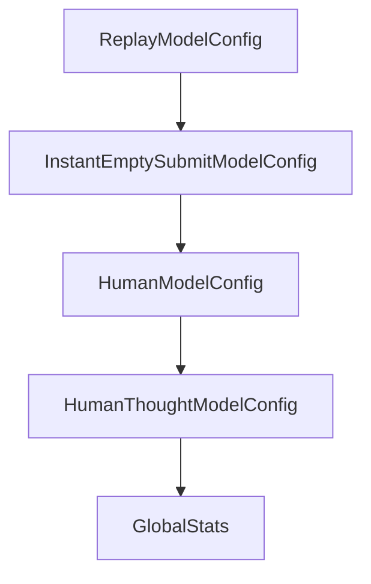

# Chapter 6: Offensive Security Mode and Specialized Workloads

Welcome to **Chapter 6: Offensive Security Mode and Specialized Workloads**. In this part of **SWE-agent Tutorial: Autonomous Repository Repair and Benchmark-Driven Engineering**, you will build an intuitive mental model first, then move into concrete implementation details and practical production tradeoffs.


This chapter explains workload specialization and when to use security-focused variants.

## Learning Goals

- understand EnIGMA mode scope and constraints
- decide when specialized versions are appropriate
- isolate high-risk workflows operationally
- align capabilities with governance requirements

## Scope Notes

SWE-agent's EnIGMA path targets offensive cybersecurity challenge workflows. Keep these environments isolated and policy-governed, and follow project guidance on version alignment.

## Source References

- [EnIGMA Project Site](https://enigma-agent.com/)
- [SWE-agent README: EnIGMA Section](https://github.com/SWE-agent/SWE-agent/blob/main/README.md#swe-agent-for-offensive-cybersecurity-enigma)
- [SWE-agent v0.7 Branch Note](https://github.com/SWE-agent/SWE-agent/tree/v0.7)

## Summary

You now understand how specialized security workloads fit into the broader SWE-agent ecosystem.

Next: [Chapter 7: Development and Contribution Workflow](07-development-and-contribution-workflow.md)

## Depth Expansion Playbook

## Source Code Walkthrough

### `sweagent/agent/models.py`

The `ReplayModelConfig` class in [`sweagent/agent/models.py`](https://github.com/SWE-agent/SWE-agent/blob/HEAD/sweagent/agent/models.py) handles a key part of this chapter's functionality:

```py


class ReplayModelConfig(GenericAPIModelConfig):
    replay_path: Path = Field(description="Path to replay file when using the replay model.")

    per_instance_cost_limit: float = Field(
        default=0.0, description="Cost limit for every instance (task). This is a dummy value here."
    )
    total_cost_limit: float = Field(
        default=0.0, description="Cost limit for all instances (tasks). This is a dummy value here."
    )

    name: Literal["replay"] = Field(default="replay", description="Model name.")

    model_config = ConfigDict(extra="forbid")


class InstantEmptySubmitModelConfig(GenericAPIModelConfig):
    """Model that immediately submits an empty patch"""

    name: Literal["instant_empty_submit"] = Field(default="instant_empty_submit", description="Model name.")

    per_instance_cost_limit: float = Field(
        default=0.0, description="Cost limit for every instance (task). This is a dummy value here."
    )
    total_cost_limit: float = Field(
        default=0.0, description="Cost limit for all instances (tasks). This is a dummy value here."
    )
    delay: float = 0.0
    """Delay before answering"""

    model_config = ConfigDict(extra="forbid")
```

This class is important because it defines how SWE-agent Tutorial: Autonomous Repository Repair and Benchmark-Driven Engineering implements the patterns covered in this chapter.

### `sweagent/agent/models.py`

The `InstantEmptySubmitModelConfig` class in [`sweagent/agent/models.py`](https://github.com/SWE-agent/SWE-agent/blob/HEAD/sweagent/agent/models.py) handles a key part of this chapter's functionality:

```py


class InstantEmptySubmitModelConfig(GenericAPIModelConfig):
    """Model that immediately submits an empty patch"""

    name: Literal["instant_empty_submit"] = Field(default="instant_empty_submit", description="Model name.")

    per_instance_cost_limit: float = Field(
        default=0.0, description="Cost limit for every instance (task). This is a dummy value here."
    )
    total_cost_limit: float = Field(
        default=0.0, description="Cost limit for all instances (tasks). This is a dummy value here."
    )
    delay: float = 0.0
    """Delay before answering"""

    model_config = ConfigDict(extra="forbid")


class HumanModelConfig(GenericAPIModelConfig):
    name: Literal["human"] = Field(default="human", description="Model name.")

    per_instance_cost_limit: float = Field(
        default=0.0, description="Cost limit for every instance (task). This is a dummy value here."
    )
    total_cost_limit: float = Field(default=0.0, description="Cost limit for all instances (tasks).")
    cost_per_call: float = 0.0
    catch_eof: bool = True
    """Whether to catch EOF and return 'exit' when ^D is pressed. Set to False when used in human_step_in mode."""
    model_config = ConfigDict(extra="forbid")


```

This class is important because it defines how SWE-agent Tutorial: Autonomous Repository Repair and Benchmark-Driven Engineering implements the patterns covered in this chapter.

### `sweagent/agent/models.py`

The `HumanModelConfig` class in [`sweagent/agent/models.py`](https://github.com/SWE-agent/SWE-agent/blob/HEAD/sweagent/agent/models.py) handles a key part of this chapter's functionality:

```py


class HumanModelConfig(GenericAPIModelConfig):
    name: Literal["human"] = Field(default="human", description="Model name.")

    per_instance_cost_limit: float = Field(
        default=0.0, description="Cost limit for every instance (task). This is a dummy value here."
    )
    total_cost_limit: float = Field(default=0.0, description="Cost limit for all instances (tasks).")
    cost_per_call: float = 0.0
    catch_eof: bool = True
    """Whether to catch EOF and return 'exit' when ^D is pressed. Set to False when used in human_step_in mode."""
    model_config = ConfigDict(extra="forbid")


class HumanThoughtModelConfig(HumanModelConfig):
    name: Literal["human_thought"] = Field(default="human_thought", description="Model name.")

    per_instance_cost_limit: float = Field(
        default=0.0, description="Cost limit for every instance (task). This is a dummy value here."
    )
    total_cost_limit: float = Field(
        default=0.0, description="Cost limit for all instances (tasks). This is a dummy value here."
    )
    cost_per_call: float = 0.0

    model_config = ConfigDict(extra="forbid")


ModelConfig = Annotated[
    GenericAPIModelConfig
    | ReplayModelConfig
```

This class is important because it defines how SWE-agent Tutorial: Autonomous Repository Repair and Benchmark-Driven Engineering implements the patterns covered in this chapter.

### `sweagent/agent/models.py`

The `HumanThoughtModelConfig` class in [`sweagent/agent/models.py`](https://github.com/SWE-agent/SWE-agent/blob/HEAD/sweagent/agent/models.py) handles a key part of this chapter's functionality:

```py


class HumanThoughtModelConfig(HumanModelConfig):
    name: Literal["human_thought"] = Field(default="human_thought", description="Model name.")

    per_instance_cost_limit: float = Field(
        default=0.0, description="Cost limit for every instance (task). This is a dummy value here."
    )
    total_cost_limit: float = Field(
        default=0.0, description="Cost limit for all instances (tasks). This is a dummy value here."
    )
    cost_per_call: float = 0.0

    model_config = ConfigDict(extra="forbid")


ModelConfig = Annotated[
    GenericAPIModelConfig
    | ReplayModelConfig
    | InstantEmptySubmitModelConfig
    | HumanModelConfig
    | HumanThoughtModelConfig,
    Field(union_mode="left_to_right"),
]


class GlobalStats(PydanticBaseModel):
    """This class tracks usage numbers (costs etc.) across all instances."""

    total_cost: float = 0
    """Cumulative cost for all instances so far"""

```

This class is important because it defines how SWE-agent Tutorial: Autonomous Repository Repair and Benchmark-Driven Engineering implements the patterns covered in this chapter.


## How These Components Connect


