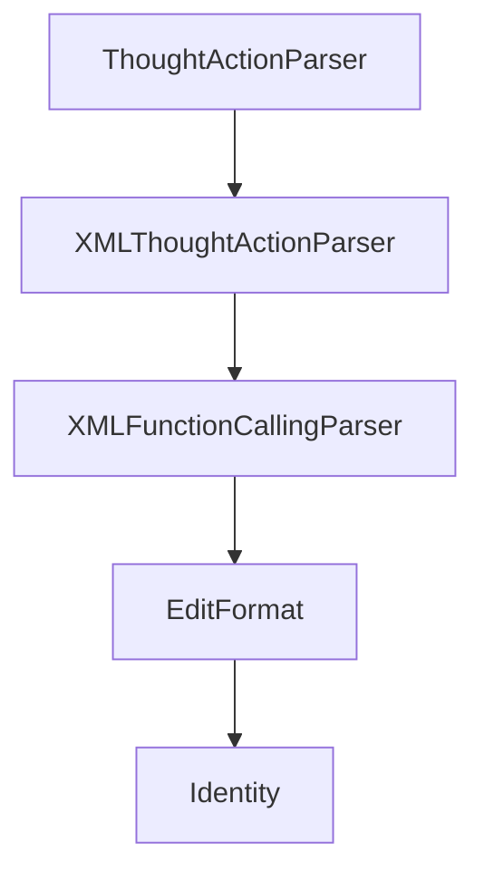

# Chapter 7: Development and Contribution Workflow

Welcome to **Chapter 7: Development and Contribution Workflow**. In this part of **SWE-agent Tutorial: Autonomous Repository Repair and Benchmark-Driven Engineering**, you will build an intuitive mental model first, then move into concrete implementation details and practical production tradeoffs.


This chapter covers how to contribute effectively while keeping changes reviewable and testable.

## Learning Goals

- use official contribution channels and issue templates
- align code changes with development guidelines
- keep PRs scoped and debuggable
- work with maintainers on roadmap-fit changes

## Contribution Pattern

- open issue context first for significant changes
- implement narrow, well-tested changes
- attach reproducible evidence for bug fixes
- use docs and Discord/issue channels for coordination

## Source References

- [SWE-agent Contributing Guide](https://github.com/SWE-agent/SWE-agent/blob/main/CONTRIBUTING.md)
- [SWE-agent Development Contribution Docs](https://swe-agent.com/latest/dev/contribute/)
- [SWE-agent Issues](https://github.com/SWE-agent/SWE-agent/issues)

## Summary

You now have a practical contribution workflow aligned with SWE-agent maintainers.

Next: [Chapter 8: Production Operations and Governance](08-production-operations-and-governance.md)

## Source Code Walkthrough

### `sweagent/tools/parsing.py`

The `ThoughtActionParser` class in [`sweagent/tools/parsing.py`](https://github.com/SWE-agent/SWE-agent/blob/HEAD/sweagent/tools/parsing.py) handles a key part of this chapter's functionality:

```py
"""Our parsers parse output from the LM into thoughts and actions.

For example, our most basic parser is the `ThoughtActionParser`.
It expects the model response to be a discussion followed by a command wrapped in backticks like so:

```
Let's look at the files in the current directory.

Action:
 ```
ls -l
 ```
```

For models that support function calling, we instead recommend using the `FunctionCallingParser`.

To use a specific parser, set the `parse_function` key in your tool config to the `type` field of the parser.

```yaml
agent:
    tools:
        ...
        parse_function:
            type: "thought_action"
```

Or from the command line: `--agent.tools.parse_function.type=thought_action`.

!!! note "Describing available tools"
    If you do not use the `FunctionCallingParser`, you need to include documentation about the available tools
    in your system prompt. You can use the `{{command_docs}}` variable to include the automatically generated
    documentation or explicitly describe the available tools.
```

This class is important because it defines how SWE-agent Tutorial: Autonomous Repository Repair and Benchmark-Driven Engineering implements the patterns covered in this chapter.

### `sweagent/tools/parsing.py`

The `XMLThoughtActionParser` class in [`sweagent/tools/parsing.py`](https://github.com/SWE-agent/SWE-agent/blob/HEAD/sweagent/tools/parsing.py) handles a key part of this chapter's functionality:

```py


class XMLThoughtActionParser(AbstractParseFunction, BaseModel):
    """
    Expects the model response to be a discussion followed by a command wrapped in XML tags.
    Example:
    Let's look at the files in the current directory.
    <command>
    ls -l
    </command>
    """

    error_message: str = dedent("""\
    Your output was not formatted correctly. You must always include one discussion and one command as part of your response. Make sure you do not have multiple discussion/command tags.
    Please make sure your output precisely matches the following format:
    """)

    type: Literal["xml_thought_action"] = "xml_thought_action"
    """Type for (de)serialization. Do not change."""

    def __call__(self, model_response: dict, commands: list[Command], strict=False) -> tuple[str, str]:
        """
        Parses the action from the output of the API call.
        We assume that the action is the last code block in the model_response.
        We also assume that the action is not nested within another code block.
        This is problematic if the model_response includes many unnamed ``` blocks.
        For instance:
        <command>
        This is a code block.
        </command>
        <command>
        This is another code block.
```

This class is important because it defines how SWE-agent Tutorial: Autonomous Repository Repair and Benchmark-Driven Engineering implements the patterns covered in this chapter.

### `sweagent/tools/parsing.py`

The `XMLFunctionCallingParser` class in [`sweagent/tools/parsing.py`](https://github.com/SWE-agent/SWE-agent/blob/HEAD/sweagent/tools/parsing.py) handles a key part of this chapter's functionality:

```py


class XMLFunctionCallingParser(AbstractParseFunction, BaseModel):
    """
    Expects the model response to be a tool calling format, where the command and parameters are specified
    in XML tags.
    Example:
    Let's look at the files in the current directory.
    <function=bash>
    <parameter=command>find /testbed -type f -name "_discovery.py"</parameter>
    </function>
    """

    error_message: str = dedent("""\
    
    Your last output did not use any tool calls!
    Please make sure your output includes exactly _ONE_ function call!
    If you think you have already resolved the issue, please submit your changes by running the `submit` command.
    If you think you cannot solve the problem, please run `submit`.
    Else, please continue with a new tool call!
    
    Your last output included multiple tool calls!
    Please make sure your output includes a thought and exactly _ONE_ function call.
    
    Your action could not be parsed properly: {{exception_message}}.
    Make sure your function call doesn't include any extra arguments that are not in the allowed arguments, and only use the allowed commands.
    
    Your action could not be parsed properly: {{exception_message}}.
    
    """)

    type: Literal["xml_function_calling"] = "xml_function_calling"
```

This class is important because it defines how SWE-agent Tutorial: Autonomous Repository Repair and Benchmark-Driven Engineering implements the patterns covered in this chapter.

### `sweagent/tools/parsing.py`

The `EditFormat` class in [`sweagent/tools/parsing.py`](https://github.com/SWE-agent/SWE-agent/blob/HEAD/sweagent/tools/parsing.py) handles a key part of this chapter's functionality:

```py


class EditFormat(ThoughtActionParser, BaseModel):
    """
    Expects the model response to be a discussion followed by a command wrapped in backticks.
    Example:
    We'll replace the contents of the current window with the following:
    ```
    import os
    os.listdir()
    ```
    """

    error_message: str = dedent("""\
    Your output was not formatted correctly. You must wrap the replacement text in backticks (```).
    Please make sure your output precisely matches the following format:
    COMMENTS
    You can write comments here about what you're going to do if you want.

    ```
    New window contents.
    Make sure you copy the entire contents of the window here, with the required indentation.
    Make the changes to the window above directly in this window.
    Remember that all of the window's contents will be replaced with the contents of this window.
    Don't include line numbers in your response.
    ```
    """)

    type: Literal["edit_format"] = "edit_format"
    """Type for (de)serialization. Do not change."""


```

This class is important because it defines how SWE-agent Tutorial: Autonomous Repository Repair and Benchmark-Driven Engineering implements the patterns covered in this chapter.


## How These Components Connect


