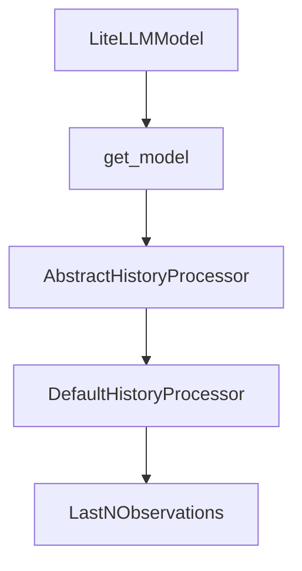

# Chapter 7: Development and Contribution Workflow

Welcome to **Chapter 7: Development and Contribution Workflow**. In this part of **SWE-agent Tutorial: Autonomous Repository Repair and Benchmark-Driven Engineering**, you will build an intuitive mental model first, then move into concrete implementation details and practical production tradeoffs.


This chapter covers how to contribute effectively while keeping changes reviewable and testable.

## Learning Goals

- use official contribution channels and issue templates
- align code changes with development guidelines
- keep PRs scoped and debuggable
- work with maintainers on roadmap-fit changes

## Contribution Pattern

- open issue context first for significant changes
- implement narrow, well-tested changes
- attach reproducible evidence for bug fixes
- use docs and Discord/issue channels for coordination

## Source References

- [SWE-agent Contributing Guide](https://github.com/SWE-agent/SWE-agent/blob/main/CONTRIBUTING.md)
- [SWE-agent Development Contribution Docs](https://swe-agent.com/latest/dev/contribute/)
- [SWE-agent Issues](https://github.com/SWE-agent/SWE-agent/issues)

## Summary

You now have a practical contribution workflow aligned with SWE-agent maintainers.

Next: [Chapter 8: Production Operations and Governance](08-production-operations-and-governance.md)

## Depth Expansion Playbook

## Source Code Walkthrough

### `sweagent/agent/models.py`

The `LiteLLMModel` class in [`sweagent/agent/models.py`](https://github.com/SWE-agent/SWE-agent/blob/HEAD/sweagent/agent/models.py) handles a key part of this chapter's functionality:

```py


class LiteLLMModel(AbstractModel):
    def __init__(self, args: GenericAPIModelConfig, tools: ToolConfig):
        """Model served by the `litellm` library."""
        # Always copy config to avoid shared state between different instances
        self.config: GenericAPIModelConfig = args.model_copy(deep=True)
        self.stats = InstanceStats()
        self.tools = tools
        self.logger = get_logger("swea-lm", emoji="🤖")

        if tools.use_function_calling:
            if not litellm.utils.supports_function_calling(model=self.config.name):
                msg = (
                    f"Model {self.config.name} does not support function calling. If your model"
                    " does not support function calling, you can use `parse_function='thought_action'` instead. "
                    "See https://swe-agent.com/latest/faq/ for more information."
                )
                self.logger.warning(msg)
        if self.config.litellm_model_registry is not None:
            with open(self.config.litellm_model_registry) as f:
                model_costs = json.load(f)
                litellm.register_model(model_costs)
        if self.config.max_input_tokens is not None:
            self.model_max_input_tokens = self.config.max_input_tokens
        else:
            self.model_max_input_tokens = litellm.model_cost.get(self.config.name, {}).get("max_input_tokens")

        if self.config.max_output_tokens is not None:
            self.model_max_output_tokens = self.config.max_output_tokens
        else:
            self.model_max_output_tokens = litellm.model_cost.get(self.config.name, {}).get("max_output_tokens")
```

This class is important because it defines how SWE-agent Tutorial: Autonomous Repository Repair and Benchmark-Driven Engineering implements the patterns covered in this chapter.

### `sweagent/agent/models.py`

The `get_model` function in [`sweagent/agent/models.py`](https://github.com/SWE-agent/SWE-agent/blob/HEAD/sweagent/agent/models.py) handles a key part of this chapter's functionality:

```py


def get_model(args: ModelConfig, tools: ToolConfig) -> AbstractModel:
    """Returns correct model object given arguments and commands"""
    # Convert GenericAPIModelConfig to specific model config if needed
    if isinstance(args, GenericAPIModelConfig) and not isinstance(
        args, HumanModelConfig | HumanThoughtModelConfig | ReplayModelConfig | InstantEmptySubmitModelConfig
    ):
        if args.name == "human":
            args = HumanModelConfig(**args.model_dump())
        elif args.name == "human_thought":
            args = HumanThoughtModelConfig(**args.model_dump())
        elif args.name == "replay":
            args = ReplayModelConfig(**args.model_dump())
        elif args.name == "instant_empty_submit":
            args = InstantEmptySubmitModelConfig(**args.model_dump())

    if args.name == "human":
        assert isinstance(args, HumanModelConfig), f"Expected {HumanModelConfig}, got {args}"
        return HumanModel(args, tools)
    if args.name == "human_thought":
        assert isinstance(args, HumanThoughtModelConfig), f"Expected {HumanThoughtModelConfig}, got {args}"
        return HumanThoughtModel(args, tools)
    if args.name == "replay":
        assert isinstance(args, ReplayModelConfig), f"Expected {ReplayModelConfig}, got {args}"
        return ReplayModel(args, tools)
    elif args.name == "instant_empty_submit":
        assert isinstance(args, InstantEmptySubmitModelConfig), f"Expected {InstantEmptySubmitModelConfig}, got {args}"
        return InstantEmptySubmitTestModel(args, tools)
    assert isinstance(args, GenericAPIModelConfig), f"Expected {GenericAPIModelConfig}, got {args}"
    return LiteLLMModel(args, tools)

```

This function is important because it defines how SWE-agent Tutorial: Autonomous Repository Repair and Benchmark-Driven Engineering implements the patterns covered in this chapter.

### `sweagent/agent/history_processors.py`

The `AbstractHistoryProcessor` class in [`sweagent/agent/history_processors.py`](https://github.com/SWE-agent/SWE-agent/blob/HEAD/sweagent/agent/history_processors.py) handles a key part of this chapter's functionality:

```py


class AbstractHistoryProcessor(Protocol):
    @abstractmethod
    def __call__(self, history: History) -> History:
        raise NotImplementedError


# Utility functions
# -----------------


def _get_content_stats(entry: HistoryItem) -> tuple[int, int]:
    if isinstance(entry["content"], str):
        return len(entry["content"].splitlines()), 0
    n_text_lines = sum(len(item["text"].splitlines()) for item in entry["content"] if item.get("type") == "text")
    n_images = sum(1 for item in entry["content"] if item.get("type") == "image_url")
    return n_text_lines, n_images


def _get_content_text(entry: HistoryItem) -> str:
    if isinstance(entry["content"], str):
        return entry["content"]
    assert len(entry["content"]) == 1, "Expected single message in content"
    return entry["content"][0]["text"]


def _set_content_text(entry: HistoryItem, text: str) -> None:
    if isinstance(entry["content"], str):
        entry["content"] = text
    else:
        assert len(entry["content"]) == 1, "Expected single message in content"
```

This class is important because it defines how SWE-agent Tutorial: Autonomous Repository Repair and Benchmark-Driven Engineering implements the patterns covered in this chapter.

### `sweagent/agent/history_processors.py`

The `DefaultHistoryProcessor` class in [`sweagent/agent/history_processors.py`](https://github.com/SWE-agent/SWE-agent/blob/HEAD/sweagent/agent/history_processors.py) handles a key part of this chapter's functionality:

```py


class DefaultHistoryProcessor(BaseModel):
    type: Literal["default"] = "default"
    """Do not change. Used for (de)serialization."""

    # pydantic config
    model_config = ConfigDict(extra="forbid")

    def __call__(self, history: History) -> History:
        return history


class LastNObservations(BaseModel):
    """Elide all but the last n observations or remove tagged observations.

    This is our most classic history processor, used in the original paper
    to elide but the last 5 observations.
    Elided observations are replaced by "Old environment output: (n lines omitted)".

    Typical configuration:

    ```yaml
    agent:
      history_processors:
        - type: last_n_observations
          n: 5
    ```

    as for example in use in the SWE-agent 0.7 config at
    https://github.com/SWE-agent/SWE-agent/blob/main/config/sweagent_0_7/07.yaml

```

This class is important because it defines how SWE-agent Tutorial: Autonomous Repository Repair and Benchmark-Driven Engineering implements the patterns covered in this chapter.


## How These Components Connect


