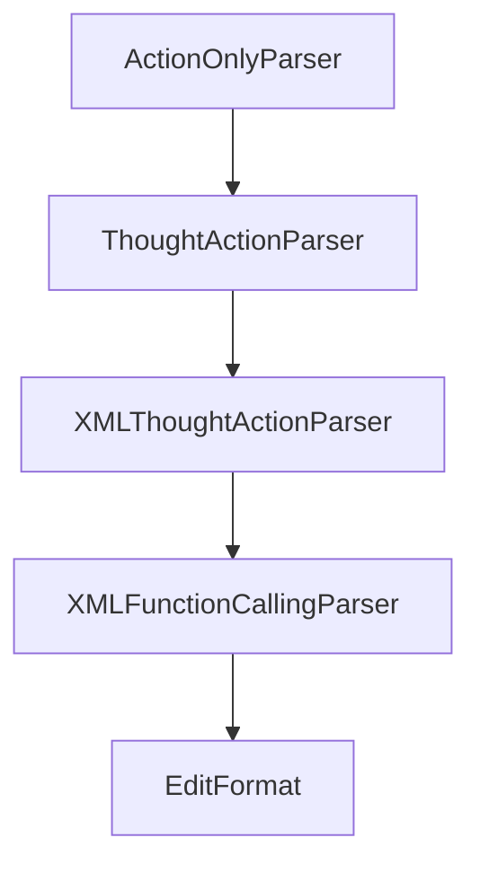

# Chapter 8: Production Operations and Governance

Welcome to **Chapter 8: Production Operations and Governance**. In this part of **SWE-agent Tutorial: Autonomous Repository Repair and Benchmark-Driven Engineering**, you will build an intuitive mental model first, then move into concrete implementation details and practical production tradeoffs.


This chapter maps production responsibilities for teams using autonomous coding agents.

## Learning Goals

- define approval boundaries for autonomous code changes
- implement observability and audit trails
- manage credential, sandbox, and data-access risks
- establish rollback and incident response protocols

## Governance Checklist

- policy controls for repo and tool scope
- mandatory review before merge to protected branches
- run logs and metadata retention for auditability
- periodic regression evaluation after model/config changes

## Source References

- [SWE-agent Security Policy](https://github.com/SWE-agent/SWE-agent/blob/main/SECURITY.md)
- [SWE-agent FAQ](https://swe-agent.com/latest/faq/)
- [SWE-agent Reference Docs](https://swe-agent.com/latest/reference/agent/)

## Summary

You now have a full SWE-agent learning path from setup to production governance.

Next tutorial: [Open SWE Tutorial](../open-swe-tutorial/)

## Depth Expansion Playbook

## Source Code Walkthrough

### `sweagent/tools/parsing.py`

The `ActionOnlyParser` class in [`sweagent/tools/parsing.py`](https://github.com/SWE-agent/SWE-agent/blob/HEAD/sweagent/tools/parsing.py) handles a key part of this chapter's functionality:

```py


class ActionOnlyParser(AbstractParseFunction, BaseModel):
    """Expects the model response to be a single command."""

    error_message: str = "No message found in model response."

    type: Literal["action_only"] = "action_only"
    """Type for (de)serialization. Do not change."""

    def __call__(self, model_response: dict, commands: list[Command], strict=False):
        return "", model_response["message"]


class ThoughtActionParser(AbstractParseFunction, BaseModel):
    """
    Expects the model response to be a discussion followed by a command wrapped in backticks.
    Example:
    Let's look at the files in the current directory.
    ```
    ls -l
    ```
    """

    error_message: str = dedent("""\
    Your output was not formatted correctly. You must always include one discussion and one command as part of your response. Make sure you do not have multiple discussion/command tags.
    Please make sure your output precisely matches the following format:
    DISCUSSION
    Discuss here with yourself about what your planning and what you're going to do in this step.

    ```
    command(s) that you're going to run
```

This class is important because it defines how SWE-agent Tutorial: Autonomous Repository Repair and Benchmark-Driven Engineering implements the patterns covered in this chapter.

### `sweagent/tools/parsing.py`

The `ThoughtActionParser` class in [`sweagent/tools/parsing.py`](https://github.com/SWE-agent/SWE-agent/blob/HEAD/sweagent/tools/parsing.py) handles a key part of this chapter's functionality:

```py
"""Our parsers parse output from the LM into thoughts and actions.

For example, our most basic parser is the `ThoughtActionParser`.
It expects the model response to be a discussion followed by a command wrapped in backticks like so:

```
Let's look at the files in the current directory.

Action:
 ```
ls -l
 ```
```

For models that support function calling, we instead recommend using the `FunctionCallingParser`.

To use a specific parser, set the `parse_function` key in your tool config to the `type` field of the parser.

```yaml
agent:
    tools:
        ...
        parse_function:
            type: "thought_action"
```

Or from the command line: `--agent.tools.parse_function.type=thought_action`.

!!! note "Describing available tools"
    If you do not use the `FunctionCallingParser`, you need to include documentation about the available tools
    in your system prompt. You can use the `{{command_docs}}` variable to include the automatically generated
    documentation or explicitly describe the available tools.
```

This class is important because it defines how SWE-agent Tutorial: Autonomous Repository Repair and Benchmark-Driven Engineering implements the patterns covered in this chapter.

### `sweagent/tools/parsing.py`

The `XMLThoughtActionParser` class in [`sweagent/tools/parsing.py`](https://github.com/SWE-agent/SWE-agent/blob/HEAD/sweagent/tools/parsing.py) handles a key part of this chapter's functionality:

```py


class XMLThoughtActionParser(AbstractParseFunction, BaseModel):
    """
    Expects the model response to be a discussion followed by a command wrapped in XML tags.
    Example:
    Let's look at the files in the current directory.
    <command>
    ls -l
    </command>
    """

    error_message: str = dedent("""\
    Your output was not formatted correctly. You must always include one discussion and one command as part of your response. Make sure you do not have multiple discussion/command tags.
    Please make sure your output precisely matches the following format:
    """)

    type: Literal["xml_thought_action"] = "xml_thought_action"
    """Type for (de)serialization. Do not change."""

    def __call__(self, model_response: dict, commands: list[Command], strict=False) -> tuple[str, str]:
        """
        Parses the action from the output of the API call.
        We assume that the action is the last code block in the model_response.
        We also assume that the action is not nested within another code block.
        This is problematic if the model_response includes many unnamed ``` blocks.
        For instance:
        <command>
        This is a code block.
        </command>
        <command>
        This is another code block.
```

This class is important because it defines how SWE-agent Tutorial: Autonomous Repository Repair and Benchmark-Driven Engineering implements the patterns covered in this chapter.

### `sweagent/tools/parsing.py`

The `XMLFunctionCallingParser` class in [`sweagent/tools/parsing.py`](https://github.com/SWE-agent/SWE-agent/blob/HEAD/sweagent/tools/parsing.py) handles a key part of this chapter's functionality:

```py


class XMLFunctionCallingParser(AbstractParseFunction, BaseModel):
    """
    Expects the model response to be a tool calling format, where the command and parameters are specified
    in XML tags.
    Example:
    Let's look at the files in the current directory.
    <function=bash>
    <parameter=command>find /testbed -type f -name "_discovery.py"</parameter>
    </function>
    """

    error_message: str = dedent("""\
    
    Your last output did not use any tool calls!
    Please make sure your output includes exactly _ONE_ function call!
    If you think you have already resolved the issue, please submit your changes by running the `submit` command.
    If you think you cannot solve the problem, please run `submit`.
    Else, please continue with a new tool call!
    
    Your last output included multiple tool calls!
    Please make sure your output includes a thought and exactly _ONE_ function call.
    
    Your action could not be parsed properly: {{exception_message}}.
    Make sure your function call doesn't include any extra arguments that are not in the allowed arguments, and only use the allowed commands.
    
    Your action could not be parsed properly: {{exception_message}}.
    
    """)

    type: Literal["xml_function_calling"] = "xml_function_calling"
```

This class is important because it defines how SWE-agent Tutorial: Autonomous Repository Repair and Benchmark-Driven Engineering implements the patterns covered in this chapter.


## How These Components Connect


