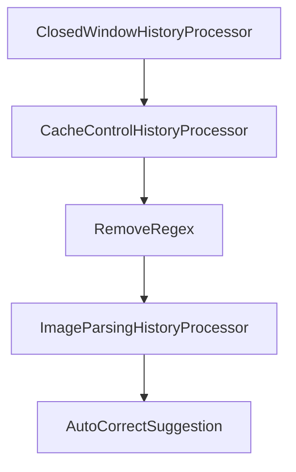

# Chapter 8: Production Operations and Governance

Welcome to **Chapter 8: Production Operations and Governance**. In this part of **SWE-agent Tutorial: Autonomous Repository Repair and Benchmark-Driven Engineering**, you will build an intuitive mental model first, then move into concrete implementation details and practical production tradeoffs.


This chapter maps production responsibilities for teams using autonomous coding agents.

## Learning Goals

- define approval boundaries for autonomous code changes
- implement observability and audit trails
- manage credential, sandbox, and data-access risks
- establish rollback and incident response protocols

## Governance Checklist

- policy controls for repo and tool scope
- mandatory review before merge to protected branches
- run logs and metadata retention for auditability
- periodic regression evaluation after model/config changes

## Source References

- [SWE-agent Security Policy](https://github.com/SWE-agent/SWE-agent/blob/main/SECURITY.md)
- [SWE-agent FAQ](https://swe-agent.com/latest/faq/)
- [SWE-agent Reference Docs](https://swe-agent.com/latest/reference/agent/)

## Summary

You now have a full SWE-agent learning path from setup to production governance.

Next tutorial: [Open SWE Tutorial](../open-swe-tutorial/)

## Source Code Walkthrough

### `sweagent/agent/history_processors.py`

The `ClosedWindowHistoryProcessor` class in [`sweagent/agent/history_processors.py`](https://github.com/SWE-agent/SWE-agent/blob/HEAD/sweagent/agent/history_processors.py) handles a key part of this chapter's functionality:

```py


class ClosedWindowHistoryProcessor(BaseModel):
    """For each value in history, keep track of which windows have been shown.
    We want to mark windows that should stay open (they're the last window for a particular file)
    Then we'll replace all other windows with a simple summary of the window (i.e. number of lines)
    """

    type: Literal["closed_window"] = "closed_window"
    """Do not change. Used for (de)serialization."""

    _pattern = re.compile(r"^(\d+)\:.*?(\n|$)", re.MULTILINE)
    _file_pattern = re.compile(r"\[File:\s+(.*)\s+\(\d+\s+lines\ total\)\]")

    # pydantic config
    model_config = ConfigDict(extra="forbid")

    def __call__(self, history):
        new_history = list()
        windows = set()
        for entry in reversed(history):
            data = entry.copy()
            if data["role"] != "user":
                new_history.append(entry)
                continue
            if data.get("is_demo", False):
                new_history.append(entry)
                continue
            matches = list(self._pattern.finditer(entry["content"]))
            if len(matches) >= 1:
                file_match = self._file_pattern.search(entry["content"])
                if file_match:
```

This class is important because it defines how SWE-agent Tutorial: Autonomous Repository Repair and Benchmark-Driven Engineering implements the patterns covered in this chapter.

### `sweagent/agent/history_processors.py`

The `CacheControlHistoryProcessor` class in [`sweagent/agent/history_processors.py`](https://github.com/SWE-agent/SWE-agent/blob/HEAD/sweagent/agent/history_processors.py) handles a key part of this chapter's functionality:

```py


class CacheControlHistoryProcessor(BaseModel):
    """This history processor adds manual cache control marks to the history.
    Use this when running with anthropic claude.
    """

    type: Literal["cache_control"] = "cache_control"
    """Do not change. Used for (de)serialization."""

    last_n_messages: int = 2
    """Add cache control to the last n user messages (and clear it for anything else).
    In most cases this should be set to 2 (caching for multi-turn conversations).
    When resampling and running concurrent instances, you want to set it to 1.
    If set to <= 0, any set cache control will be removed from all messages.
    """

    last_n_messages_offset: int = 0
    """E.g., set to 1 to start cache control after the second to last user message.
    This can be useful in rare cases, when you want to modify the last message after
    we've got the completion and you want to avoid cache mismatch.
    """

    tagged_roles: list[str] = ["user", "tool"]
    """Only add cache control to messages with these roles."""

    # pydantic config
    model_config = ConfigDict(extra="forbid")

    def __call__(self, history: History) -> History:
        new_history = []
        n_tagged = 0
```

This class is important because it defines how SWE-agent Tutorial: Autonomous Repository Repair and Benchmark-Driven Engineering implements the patterns covered in this chapter.

### `sweagent/agent/history_processors.py`

The `RemoveRegex` class in [`sweagent/agent/history_processors.py`](https://github.com/SWE-agent/SWE-agent/blob/HEAD/sweagent/agent/history_processors.py) handles a key part of this chapter's functionality:

```py


class RemoveRegex(BaseModel):
    """This history processor can remove arbitrary content from history items"""

    remove: list[str] = ["<diff>.*</diff>"]
    """Regex patterns to remove from history items"""

    keep_last: int = 0
    """Keep the last n history items unchanged"""

    type: Literal["remove_regex"] = "remove_regex"
    """Do not change. Used for (de)serialization."""

    # pydantic config
    model_config = ConfigDict(extra="forbid")

    def __call__(self, history: History) -> History:
        new_history = []
        for i_entry, entry in enumerate(reversed(history)):
            entry = copy.deepcopy(entry)
            if i_entry < self.keep_last:
                new_history.append(entry)
            else:
                if isinstance(entry["content"], list):
                    for item in entry["content"]:
                        if item["type"] == "text":
                            for pattern in self.remove:
                                item["text"] = re.sub(pattern, "", item["text"], flags=re.DOTALL)
                else:
                    assert isinstance(entry["content"], str), "Expected string content"
                    for pattern in self.remove:
```

This class is important because it defines how SWE-agent Tutorial: Autonomous Repository Repair and Benchmark-Driven Engineering implements the patterns covered in this chapter.

### `sweagent/agent/history_processors.py`

The `ImageParsingHistoryProcessor` class in [`sweagent/agent/history_processors.py`](https://github.com/SWE-agent/SWE-agent/blob/HEAD/sweagent/agent/history_processors.py) handles a key part of this chapter's functionality:

```py


class ImageParsingHistoryProcessor(BaseModel):
    """Parse embedded base64 images from markdown and convert to multi-modal format."""

    type: Literal["image_parsing"] = "image_parsing"
    allowed_mime_types: set[str] = {"image/png", "image/jpeg", "image/webp"}

    _pattern = re.compile(r"(!\[([^\]]*)\]\(data:)([^;]+);base64,([^)]+)(\))")
    model_config = ConfigDict(extra="forbid")

    def __call__(self, history: History) -> History:
        return [self._process_entry(entry) for entry in history]

    def _process_entry(self, entry: HistoryItem) -> HistoryItem:
        if entry.get("role") not in ["user", "tool"]:
            return entry
        entry = copy.deepcopy(entry)
        content = _get_content_text(entry)
        segments = self._parse_images(content)
        if any(seg["type"] == "image_url" for seg in segments):
            entry["content"] = segments
        return entry

    def _parse_images(self, content: str) -> list[dict]:
        segments = []
        last_end = 0
        has_images = False

        def add_text(text: str) -> None:
            """Add text to the last segment if it's text, otherwise create new text segment."""
            if text and segments and segments[-1]["type"] == "text":
```

This class is important because it defines how SWE-agent Tutorial: Autonomous Repository Repair and Benchmark-Driven Engineering implements the patterns covered in this chapter.


## How These Components Connect


