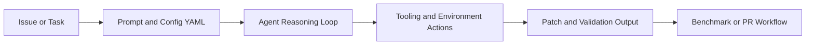

# SWE-agent Tutorial: Autonomous Repository Repair and Benchmark-Driven Engineering

> Learn how to use `SWE-agent/SWE-agent` for autonomous software engineering workflows, from single-issue runs to benchmark and research-grade evaluation.

## Why This Track Matters

SWE-agent remains one of the strongest open-source references for autonomous software engineering loops, especially for repo-scale issue resolution and SWE-bench workflows.

This track focuses on:

- running SWE-agent quickly on real repository issues
- understanding YAML-driven orchestration and tool contracts
- configuring model, environment, and execution controls
- operating evaluation and production workflows responsibly

## Current Snapshot (auto-updated)

- repository: [`SWE-agent/SWE-agent`](https://github.com/SWE-agent/SWE-agent)
- stars: about **18.5k**
- latest release: [`v1.1.0`](https://github.com/SWE-agent/SWE-agent/releases/tag/v1.1.0)
- recent activity: updates on **February 10, 2026**
- project note: maintainers indicate active investment in [`mini-swe-agent`](https://github.com/SWE-agent/mini-swe-agent/)
- project positioning: configurable autonomous coding agent for issue resolution and benchmark research

## Mental Model

## Chapter Guide

| Chapter | Key Question | Outcome |
|:--------|:-------------|:--------|
| [01 - Getting Started](01-getting-started.md) | How do I run SWE-agent on a first task? | Working baseline |
| [02 - Core Architecture and YAML Configuration](02-core-architecture-and-yaml-configuration.md) | How is SWE-agent structured and configured? | Architecture clarity |
| [03 - CLI Workflows and Usage Modes](03-cli-workflows-and-usage-modes.md) | How do I run single-task and batch flows effectively? | Execution strategy |
| [04 - Tooling, Environments, and Model Strategy](04-tooling-environments-and-model-strategy.md) | How do I tune tools, envs, and models safely? | Better runtime control |
| [05 - Benchmarking and Evaluation Practices](05-benchmarking-and-evaluation-practices.md) | How do I evaluate quality and regressions? | Strong evaluation loop |
| [06 - Offensive Security Mode and Specialized Workloads](06-offensive-security-mode-and-specialized-workloads.md) | How do specialized modes like EnIGMA fit in? | Workload scoping |
| [07 - Development and Contribution Workflow](07-development-and-contribution-workflow.md) | How do I contribute effectively to SWE-agent? | Contributor readiness |
| [08 - Production Operations and Governance](08-production-operations-and-governance.md) | How do teams operate SWE-agent safely over time? | Governance runbook |

## What You Will Learn

- how to configure and run SWE-agent across real-world coding tasks
- how to reason about YAML config surfaces and tool orchestration
- how to evaluate outcomes with benchmark-oriented discipline
- how to govern autonomous coding workflows in team environments

## Source References

- [SWE-agent Repository](https://github.com/SWE-agent/SWE-agent)
- [SWE-agent README](https://github.com/SWE-agent/SWE-agent/blob/main/README.md)
- [SWE-agent Docs](https://swe-agent.com/latest/)
- [Hello World Usage](https://swe-agent.com/latest/usage/hello_world/)
- [Batch Mode Usage](https://swe-agent.com/latest/usage/batch_mode/)
- [Development Contribution Docs](https://swe-agent.com/latest/dev/contribute/)

## Related Tutorials

- [Open SWE Tutorial](../open-swe-tutorial/)
- [OpenHands Tutorial](../openhands-tutorial/)
- [LangGraph Tutorial](../langgraph-tutorial/)
- [Cline Tutorial](../cline-tutorial/)

---

Start with [Chapter 1: Getting Started](01-getting-started.md).

## Navigation & Backlinks

- [Start Here: Chapter 1: Getting Started](01-getting-started.md)
- [Back to Main Catalog](../../README.md#-tutorial-catalog)
- [Browse A-Z Tutorial Directory](../../discoverability/tutorial-directory.md)
- [Search by Intent](../../discoverability/query-hub.md)
- [Explore Category Hubs](../../README.md#category-hubs)

## Full Chapter Map

1. [Chapter 1: Getting Started](01-getting-started.md)
2. [Chapter 2: Core Architecture and YAML Configuration](02-core-architecture-and-yaml-configuration.md)
3. [Chapter 3: CLI Workflows and Usage Modes](03-cli-workflows-and-usage-modes.md)
4. [Chapter 4: Tooling, Environments, and Model Strategy](04-tooling-environments-and-model-strategy.md)
5. [Chapter 5: Benchmarking and Evaluation Practices](05-benchmarking-and-evaluation-practices.md)
6. [Chapter 6: Offensive Security Mode and Specialized Workloads](06-offensive-security-mode-and-specialized-workloads.md)
7. [Chapter 7: Development and Contribution Workflow](07-development-and-contribution-workflow.md)
8. [Chapter 8: Production Operations and Governance](08-production-operations-and-governance.md)

*Generated by [AI Codebase Knowledge Builder](https://github.com/The-Pocket/Tutorial-Codebase-Knowledge)*
