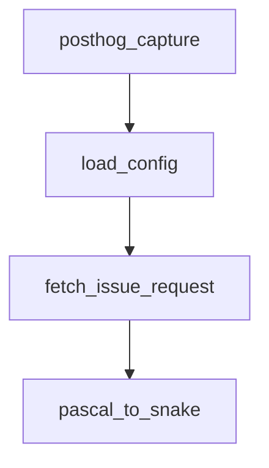

# Chapter 1: Getting Started and Current Product Posture

Welcome to **Chapter 1: Getting Started and Current Product Posture**. In this part of **Sweep Tutorial: Issue-to-PR AI Coding Workflows on GitHub**, you will build an intuitive mental model first, then move into concrete implementation details and practical production tradeoffs.


This chapter establishes where Sweep stands today and how to choose a practical adoption entry point.

## Learning Goals

- understand current repository and product posture
- choose hosted app, CLI, or self-hosting entry path
- run a first end-to-end issue workflow safely

## Product Posture Checklist

| Signal | Interpretation |
|:-------|:---------------|
| README points to JetBrains plugin | current primary product surface has shifted |
| docs still cover GitHub app and CLI | legacy workflows remain useful for study and operations |
| repo activity continues | ecosystem and operational knowledge still evolving |

## Fast Start: GitHub App Workflow

1. install Sweep in your preferred surface from [sweep.dev](https://sweep.dev)
2. open an issue prefixed with `Sweep:`
3. monitor generated PR and CI behavior
4. iterate using issue/PR comments starting with `Sweep:`

## First-Run Guardrails

- start with small, concrete tasks
- include specific filenames in issue text
- keep one behavior change per issue whenever possible

## Source References

- [README](https://github.com/sweepai/sweep/blob/main/README.md)
- [Getting Started](https://github.com/sweepai/sweep/blob/main/docs/pages/getting-started.md)
- [Sweep Website](https://sweep.dev)

## Summary

You now have a realistic starting context and first execution path.

Next: [Chapter 2: Issue to PR Workflow Architecture](02-issue-to-pr-workflow-architecture.md)

## Source Code Walkthrough

### `sweepai/cli.py`

The `posthog_capture` function in [`sweepai/cli.py`](https://github.com/sweepai/sweep/blob/HEAD/sweepai/cli.py) handles a key part of this chapter's functionality:

```py


def posthog_capture(event_name, properties, *args, **kwargs):
    POSTHOG_DISTINCT_ID = os.environ.get("POSTHOG_DISTINCT_ID")
    if POSTHOG_DISTINCT_ID:
        posthog.capture(POSTHOG_DISTINCT_ID, event_name, properties, *args, **kwargs)


def load_config():
    if os.path.exists(config_path):
        cprint(f"\nLoading configuration from {config_path}", style="yellow")
        with open(config_path, "r") as f:
            config = json.load(f)
        for key, value in config.items():
            try:
                os.environ[key] = value
            except Exception as e:
                cprint(f"Error loading config: {e}, skipping.", style="yellow")
        os.environ["POSTHOG_DISTINCT_ID"] = str(os.environ.get("POSTHOG_DISTINCT_ID", ""))
        # Should contain:
        # GITHUB_PAT
        # OPENAI_API_KEY
        # ANTHROPIC_API_KEY
        # VOYAGE_API_KEY
        # POSTHOG_DISTINCT_ID


def fetch_issue_request(issue_url: str, __version__: str = "0"):
    (
        protocol_name,
        _,
        _base_url,
```

This function is important because it defines how Sweep Tutorial: Issue-to-PR AI Coding Workflows on GitHub implements the patterns covered in this chapter.

### `sweepai/cli.py`

The `load_config` function in [`sweepai/cli.py`](https://github.com/sweepai/sweep/blob/HEAD/sweepai/cli.py) handles a key part of this chapter's functionality:

```py


def load_config():
    if os.path.exists(config_path):
        cprint(f"\nLoading configuration from {config_path}", style="yellow")
        with open(config_path, "r") as f:
            config = json.load(f)
        for key, value in config.items():
            try:
                os.environ[key] = value
            except Exception as e:
                cprint(f"Error loading config: {e}, skipping.", style="yellow")
        os.environ["POSTHOG_DISTINCT_ID"] = str(os.environ.get("POSTHOG_DISTINCT_ID", ""))
        # Should contain:
        # GITHUB_PAT
        # OPENAI_API_KEY
        # ANTHROPIC_API_KEY
        # VOYAGE_API_KEY
        # POSTHOG_DISTINCT_ID


def fetch_issue_request(issue_url: str, __version__: str = "0"):
    (
        protocol_name,
        _,
        _base_url,
        org_name,
        repo_name,
        _issues,
        issue_number,
    ) = issue_url.split("/")
    cprint("Fetching installation ID...")
```

This function is important because it defines how Sweep Tutorial: Issue-to-PR AI Coding Workflows on GitHub implements the patterns covered in this chapter.

### `sweepai/cli.py`

The `fetch_issue_request` function in [`sweepai/cli.py`](https://github.com/sweepai/sweep/blob/HEAD/sweepai/cli.py) handles a key part of this chapter's functionality:

```py


def fetch_issue_request(issue_url: str, __version__: str = "0"):
    (
        protocol_name,
        _,
        _base_url,
        org_name,
        repo_name,
        _issues,
        issue_number,
    ) = issue_url.split("/")
    cprint("Fetching installation ID...")
    installation_id = -1
    cprint("Fetching access token...")
    _token, g = get_github_client(installation_id)
    g: Github = g
    cprint("Fetching repo...")
    issue = g.get_repo(f"{org_name}/{repo_name}").get_issue(int(issue_number))

    issue_request = IssueRequest(
        action="labeled",
        issue=IssueRequest.Issue(
            title=issue.title,
            number=int(issue_number),
            html_url=issue_url,
            user=IssueRequest.Issue.User(
                login=issue.user.login,
                type="User",
            ),
            body=issue.body,
            labels=[
```

This function is important because it defines how Sweep Tutorial: Issue-to-PR AI Coding Workflows on GitHub implements the patterns covered in this chapter.

### `sweepai/cli.py`

The `pascal_to_snake` function in [`sweepai/cli.py`](https://github.com/sweepai/sweep/blob/HEAD/sweepai/cli.py) handles a key part of this chapter's functionality:

```py


def pascal_to_snake(name):
    return "".join(["_" + i.lower() if i.isupper() else i for i in name]).lstrip("_")


def get_event_type(event: Event | IssueEvent):
    if isinstance(event, IssueEvent):
        return "issues"
    else:
        return pascal_to_snake(event.type)[: -len("_event")]

@app.command()
def test():
    cprint("Sweep AI is installed correctly and ready to go!", style="yellow")

@app.command()
def watch(
    repo_name: str,
    debug: bool = False,
    record_events: bool = False,
    max_events: int = 30,
):
    if not os.path.exists(config_path):
        cprint(
            f"\nConfiguration not found at {config_path}. Please run [green]'sweep init'[/green] to initialize the CLI.\n",
            style="yellow",
        )
        raise ValueError(
            "Configuration not found, please run 'sweep init' to initialize the CLI."
        )
    posthog_capture(
```

This function is important because it defines how Sweep Tutorial: Issue-to-PR AI Coding Workflows on GitHub implements the patterns covered in this chapter.


## How These Components Connect


