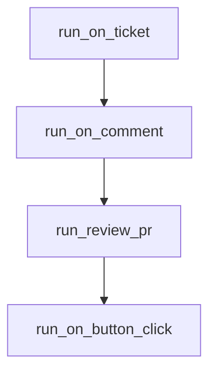

# Chapter 1: Getting Started and Current Product Posture

Welcome to **Chapter 1: Getting Started and Current Product Posture**. In this part of **Sweep Tutorial: Issue-to-PR AI Coding Workflows on GitHub**, you will build an intuitive mental model first, then move into concrete implementation details and practical production tradeoffs.


This chapter establishes where Sweep stands today and how to choose a practical adoption entry point.

## Learning Goals

- understand current repository and product posture
- choose hosted app, CLI, or self-hosting entry path
- run a first end-to-end issue workflow safely

## Product Posture Checklist

| Signal | Interpretation |
|:-------|:---------------|
| README points to JetBrains plugin | current primary product surface has shifted |
| docs still cover GitHub app and CLI | legacy workflows remain useful for study and operations |
| repo activity continues | ecosystem and operational knowledge still evolving |

## Fast Start: GitHub App Workflow

1. install Sweep in your preferred surface from [sweep.dev](https://sweep.dev)
2. open an issue prefixed with `Sweep:`
3. monitor generated PR and CI behavior
4. iterate using issue/PR comments starting with `Sweep:`

## First-Run Guardrails

- start with small, concrete tasks
- include specific filenames in issue text
- keep one behavior change per issue whenever possible

## Source References

- [README](https://github.com/sweepai/sweep/blob/main/README.md)
- [Getting Started](https://github.com/sweepai/sweep/blob/main/docs/pages/getting-started.md)
- [Sweep Website](https://sweep.dev)

## Summary

You now have a realistic starting context and first execution path.

Next: [Chapter 2: Issue to PR Workflow Architecture](02-issue-to-pr-workflow-architecture.md)

## Depth Expansion Playbook

## Source Code Walkthrough

### `sweepai/api.py`

The `run_on_ticket` function in [`sweepai/api.py`](https://github.com/sweepai/sweep/blob/HEAD/sweepai/api.py) handles a key part of this chapter's functionality:

```py
logger.bind(application="webhook")

def run_on_ticket(*args, **kwargs):
    tracking_id = get_hash()
    with logger.contextualize(
        **kwargs,
        name="ticket_" + kwargs["username"],
        tracking_id=tracking_id,
    ):
        return on_ticket(*args, **kwargs, tracking_id=tracking_id)


def run_on_comment(*args, **kwargs):
    tracking_id = get_hash()
    with logger.contextualize(
        **kwargs,
        name="comment_" + kwargs["username"],
        tracking_id=tracking_id,
    ):
        on_comment(*args, **kwargs, tracking_id=tracking_id)

def run_review_pr(*args, **kwargs):
    tracking_id = get_hash()
    with logger.contextualize(
        **kwargs,
        name="review_" + kwargs["username"],
        tracking_id=tracking_id,
    ):
        review_pr(*args, **kwargs, tracking_id=tracking_id)


def run_on_button_click(*args, **kwargs):
```

This function is important because it defines how Sweep Tutorial: Issue-to-PR AI Coding Workflows on GitHub implements the patterns covered in this chapter.

### `sweepai/api.py`

The `run_on_comment` function in [`sweepai/api.py`](https://github.com/sweepai/sweep/blob/HEAD/sweepai/api.py) handles a key part of this chapter's functionality:

```py


def run_on_comment(*args, **kwargs):
    tracking_id = get_hash()
    with logger.contextualize(
        **kwargs,
        name="comment_" + kwargs["username"],
        tracking_id=tracking_id,
    ):
        on_comment(*args, **kwargs, tracking_id=tracking_id)

def run_review_pr(*args, **kwargs):
    tracking_id = get_hash()
    with logger.contextualize(
        **kwargs,
        name="review_" + kwargs["username"],
        tracking_id=tracking_id,
    ):
        review_pr(*args, **kwargs, tracking_id=tracking_id)


def run_on_button_click(*args, **kwargs):
    thread = threading.Thread(target=handle_button_click, args=args, kwargs=kwargs)
    thread.start()
    global_threads.append(thread)


def terminate_thread(thread):
    """Terminate a python threading.Thread."""
    try:
        if not thread.is_alive():
            return
```

This function is important because it defines how Sweep Tutorial: Issue-to-PR AI Coding Workflows on GitHub implements the patterns covered in this chapter.

### `sweepai/api.py`

The `run_review_pr` function in [`sweepai/api.py`](https://github.com/sweepai/sweep/blob/HEAD/sweepai/api.py) handles a key part of this chapter's functionality:

```py
        on_comment(*args, **kwargs, tracking_id=tracking_id)

def run_review_pr(*args, **kwargs):
    tracking_id = get_hash()
    with logger.contextualize(
        **kwargs,
        name="review_" + kwargs["username"],
        tracking_id=tracking_id,
    ):
        review_pr(*args, **kwargs, tracking_id=tracking_id)


def run_on_button_click(*args, **kwargs):
    thread = threading.Thread(target=handle_button_click, args=args, kwargs=kwargs)
    thread.start()
    global_threads.append(thread)


def terminate_thread(thread):
    """Terminate a python threading.Thread."""
    try:
        if not thread.is_alive():
            return

        exc = ctypes.py_object(SystemExit)
        res = ctypes.pythonapi.PyThreadState_SetAsyncExc(
            ctypes.c_long(thread.ident), exc
        )
        if res == 0:
            raise ValueError("Invalid thread ID")
        elif res != 1:
            # Call with exception set to 0 is needed to cleanup properly.
```

This function is important because it defines how Sweep Tutorial: Issue-to-PR AI Coding Workflows on GitHub implements the patterns covered in this chapter.

### `sweepai/api.py`

The `run_on_button_click` function in [`sweepai/api.py`](https://github.com/sweepai/sweep/blob/HEAD/sweepai/api.py) handles a key part of this chapter's functionality:

```py


def run_on_button_click(*args, **kwargs):
    thread = threading.Thread(target=handle_button_click, args=args, kwargs=kwargs)
    thread.start()
    global_threads.append(thread)


def terminate_thread(thread):
    """Terminate a python threading.Thread."""
    try:
        if not thread.is_alive():
            return

        exc = ctypes.py_object(SystemExit)
        res = ctypes.pythonapi.PyThreadState_SetAsyncExc(
            ctypes.c_long(thread.ident), exc
        )
        if res == 0:
            raise ValueError("Invalid thread ID")
        elif res != 1:
            # Call with exception set to 0 is needed to cleanup properly.
            ctypes.pythonapi.PyThreadState_SetAsyncExc(thread.ident, 0)
            raise SystemError("PyThreadState_SetAsyncExc failed")
    except Exception as e:
        logger.exception(f"Failed to terminate thread: {e}")


# def delayed_kill(thread: threading.Thread, delay: int = 60 * 60):
#     time.sleep(delay)
#     terminate_thread(thread)

```

This function is important because it defines how Sweep Tutorial: Issue-to-PR AI Coding Workflows on GitHub implements the patterns covered in this chapter.


## How These Components Connect


