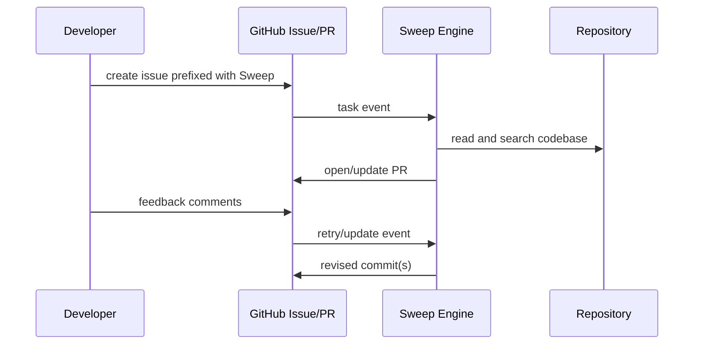

# Chapter 2: Issue to PR Workflow Architecture

Sweep is built around asynchronous task execution from issue intake to PR generation.

## Learning Goals

- map the lifecycle from issue text to generated PR
- identify control points for reliability and scope
- understand how comments trigger iterative updates

## Workflow Stages

## Reliability Controls

| Control | Why It Matters |
|:--------|:---------------|
| issue specificity | reduces wrong-file edits |
| scoped change size | improves first-pass success |
| PR feedback loops | allows incremental correction |

## Source References

- [Docs Home](https://github.com/sweepai/sweep/blob/main/docs/pages/index.mdx)
- [Getting Started](https://github.com/sweepai/sweep/blob/main/docs/pages/getting-started.md)
- [Usage Tutorial](https://github.com/sweepai/sweep/blob/main/docs/pages/usage/tutorial.mdx)

## Summary

You now have a lifecycle map for how Sweep executes issue-driven coding work.

Next: [Chapter 3: Repository Configuration and Governance](03-repository-configuration-and-governance.md)
