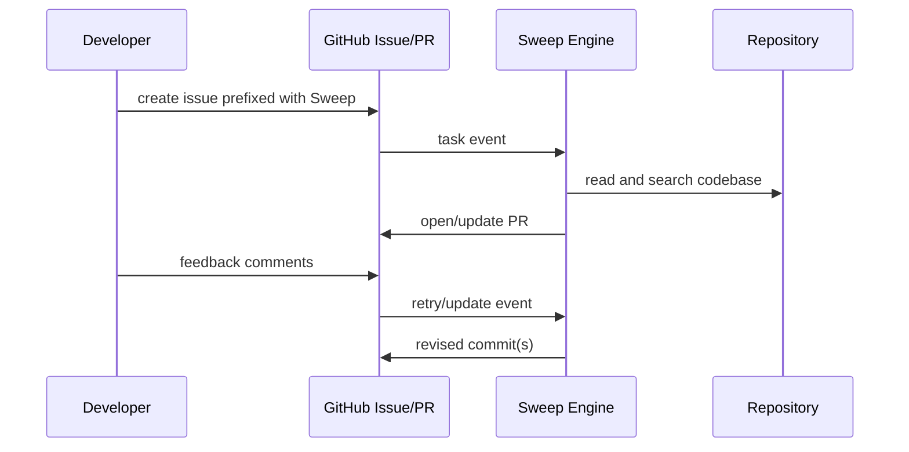
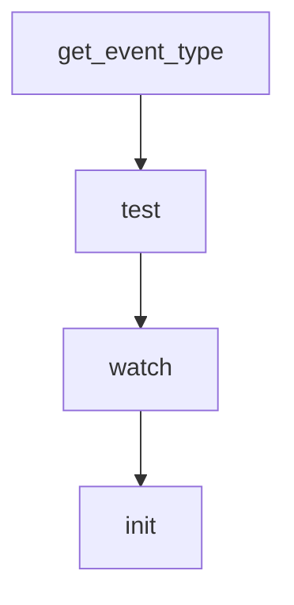

# Chapter 2: Issue to PR Workflow Architecture

Welcome to **Chapter 2: Issue to PR Workflow Architecture**. In this part of **Sweep Tutorial: Issue-to-PR AI Coding Workflows on GitHub**, you will build an intuitive mental model first, then move into concrete implementation details and practical production tradeoffs.


Sweep is built around asynchronous task execution from issue intake to PR generation.

## Learning Goals

- map the lifecycle from issue text to generated PR
- identify control points for reliability and scope
- understand how comments trigger iterative updates

## Workflow Stages


```mermaid
sequenceDiagram
    participant User as Developer
    participant GH as GitHub Issue/PR
    participant Sweep as Sweep Engine
    participant Repo as Repository

    User->>GH: create issue prefixed with Sweep
    GH->>Sweep: task event
    Sweep->>Repo: read and search codebase
    Sweep->>GH: open/update PR
    User->>GH: feedback comments
    GH->>Sweep: retry/update event
    Sweep->>GH: revised commit(s)
```

## Reliability Controls

| Control | Why It Matters |
|:--------|:---------------|
| issue specificity | reduces wrong-file edits |
| scoped change size | improves first-pass success |
| PR feedback loops | allows incremental correction |

## Source References

- [Docs Home](https://github.com/sweepai/sweep/blob/main/docs/pages/index.mdx)
- [Getting Started](https://github.com/sweepai/sweep/blob/main/docs/pages/getting-started.md)
- [Usage Tutorial](https://github.com/sweepai/sweep/blob/main/docs/pages/usage/tutorial.mdx)

## Summary

You now have a lifecycle map for how Sweep executes issue-driven coding work.

Next: [Chapter 3: Repository Configuration and Governance](03-repository-configuration-and-governance.md)

## Source Code Walkthrough

### `sweepai/cli.py`

The `get_event_type` function in [`sweepai/cli.py`](https://github.com/sweepai/sweep/blob/HEAD/sweepai/cli.py) handles a key part of this chapter's functionality:

```py


def get_event_type(event: Event | IssueEvent):
    if isinstance(event, IssueEvent):
        return "issues"
    else:
        return pascal_to_snake(event.type)[: -len("_event")]

@app.command()
def test():
    cprint("Sweep AI is installed correctly and ready to go!", style="yellow")

@app.command()
def watch(
    repo_name: str,
    debug: bool = False,
    record_events: bool = False,
    max_events: int = 30,
):
    if not os.path.exists(config_path):
        cprint(
            f"\nConfiguration not found at {config_path}. Please run [green]'sweep init'[/green] to initialize the CLI.\n",
            style="yellow",
        )
        raise ValueError(
            "Configuration not found, please run 'sweep init' to initialize the CLI."
        )
    posthog_capture(
        "sweep_watch_started",
        {
            "repo": repo_name,
            "debug": debug,
```

This function is important because it defines how Sweep Tutorial: Issue-to-PR AI Coding Workflows on GitHub implements the patterns covered in this chapter.

### `sweepai/cli.py`

The `test` function in [`sweepai/cli.py`](https://github.com/sweepai/sweep/blob/HEAD/sweepai/cli.py) handles a key part of this chapter's functionality:

```py

@app.command()
def test():
    cprint("Sweep AI is installed correctly and ready to go!", style="yellow")

@app.command()
def watch(
    repo_name: str,
    debug: bool = False,
    record_events: bool = False,
    max_events: int = 30,
):
    if not os.path.exists(config_path):
        cprint(
            f"\nConfiguration not found at {config_path}. Please run [green]'sweep init'[/green] to initialize the CLI.\n",
            style="yellow",
        )
        raise ValueError(
            "Configuration not found, please run 'sweep init' to initialize the CLI."
        )
    posthog_capture(
        "sweep_watch_started",
        {
            "repo": repo_name,
            "debug": debug,
            "record_events": record_events,
            "max_events": max_events,
        },
    )
    GITHUB_PAT = os.environ.get("GITHUB_PAT", None)
    if GITHUB_PAT is None:
        raise ValueError("GITHUB_PAT environment variable must be set")
```

This function is important because it defines how Sweep Tutorial: Issue-to-PR AI Coding Workflows on GitHub implements the patterns covered in this chapter.

### `sweepai/cli.py`

The `watch` function in [`sweepai/cli.py`](https://github.com/sweepai/sweep/blob/HEAD/sweepai/cli.py) handles a key part of this chapter's functionality:

```py

@app.command()
def watch(
    repo_name: str,
    debug: bool = False,
    record_events: bool = False,
    max_events: int = 30,
):
    if not os.path.exists(config_path):
        cprint(
            f"\nConfiguration not found at {config_path}. Please run [green]'sweep init'[/green] to initialize the CLI.\n",
            style="yellow",
        )
        raise ValueError(
            "Configuration not found, please run 'sweep init' to initialize the CLI."
        )
    posthog_capture(
        "sweep_watch_started",
        {
            "repo": repo_name,
            "debug": debug,
            "record_events": record_events,
            "max_events": max_events,
        },
    )
    GITHUB_PAT = os.environ.get("GITHUB_PAT", None)
    if GITHUB_PAT is None:
        raise ValueError("GITHUB_PAT environment variable must be set")
    g = Github(os.environ["GITHUB_PAT"])
    repo = g.get_repo(repo_name)
    if debug:
        logger.debug("Debug mode enabled")
```

This function is important because it defines how Sweep Tutorial: Issue-to-PR AI Coding Workflows on GitHub implements the patterns covered in this chapter.

### `sweepai/cli.py`

The `init` function in [`sweepai/cli.py`](https://github.com/sweepai/sweep/blob/HEAD/sweepai/cli.py) handles a key part of this chapter's functionality:

```py
    if not os.path.exists(config_path):
        cprint(
            f"\nConfiguration not found at {config_path}. Please run [green]'sweep init'[/green] to initialize the CLI.\n",
            style="yellow",
        )
        raise ValueError(
            "Configuration not found, please run 'sweep init' to initialize the CLI."
        )
    posthog_capture(
        "sweep_watch_started",
        {
            "repo": repo_name,
            "debug": debug,
            "record_events": record_events,
            "max_events": max_events,
        },
    )
    GITHUB_PAT = os.environ.get("GITHUB_PAT", None)
    if GITHUB_PAT is None:
        raise ValueError("GITHUB_PAT environment variable must be set")
    g = Github(os.environ["GITHUB_PAT"])
    repo = g.get_repo(repo_name)
    if debug:
        logger.debug("Debug mode enabled")

    def stream_events(repo: Repository, timeout: int = 2, offset: int = 2 * 60):
        processed_event_ids = set()
        current_time = time.time() - offset
        current_time = datetime.datetime.fromtimestamp(current_time)
        local_tz = datetime.datetime.now(datetime.timezone.utc).astimezone().tzinfo

        while True:
```

This function is important because it defines how Sweep Tutorial: Issue-to-PR AI Coding Workflows on GitHub implements the patterns covered in this chapter.


## How These Components Connect


```mermaid
flowchart TD
    A[get_event_type]
    B[test]
    C[watch]
    D[init]
    A --> B
    B --> C
    C --> D
```
