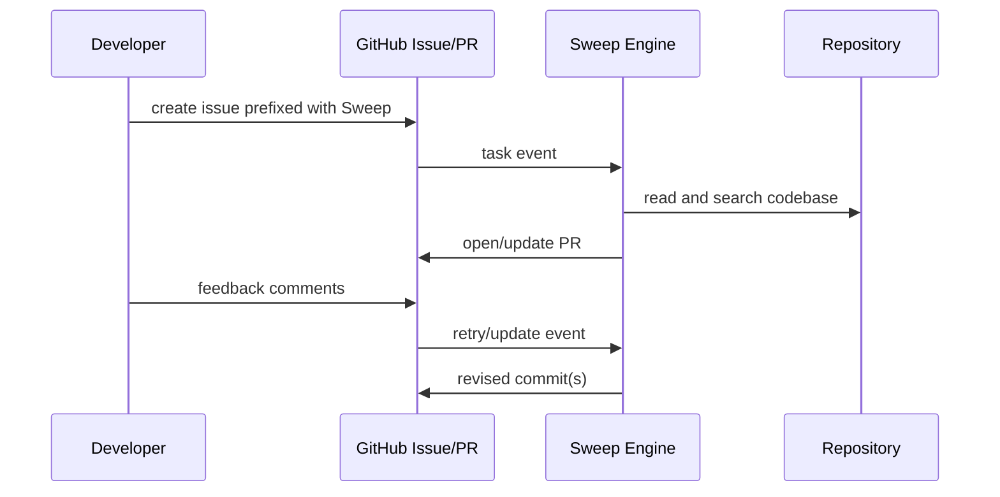
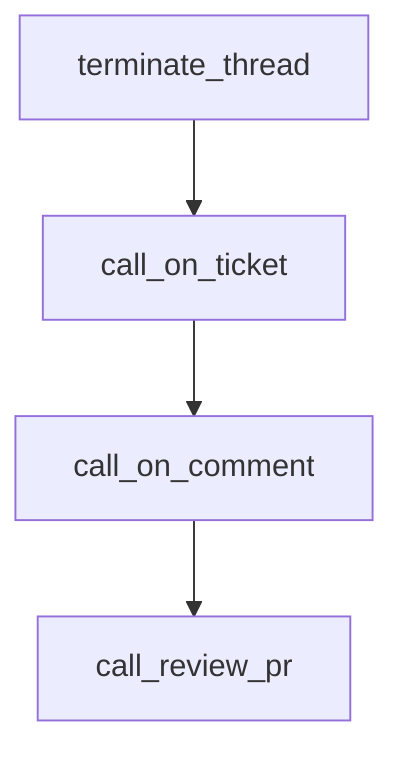

# Chapter 2: Issue to PR Workflow Architecture

Welcome to **Chapter 2: Issue to PR Workflow Architecture**. In this part of **Sweep Tutorial: Issue-to-PR AI Coding Workflows on GitHub**, you will build an intuitive mental model first, then move into concrete implementation details and practical production tradeoffs.


Sweep is built around asynchronous task execution from issue intake to PR generation.

## Learning Goals

- map the lifecycle from issue text to generated PR
- identify control points for reliability and scope
- understand how comments trigger iterative updates

## Workflow Stages


```mermaid
sequenceDiagram
    participant User as Developer
    participant GH as GitHub Issue/PR
    participant Sweep as Sweep Engine
    participant Repo as Repository

    User->>GH: create issue prefixed with Sweep
    GH->>Sweep: task event
    Sweep->>Repo: read and search codebase
    Sweep->>GH: open/update PR
    User->>GH: feedback comments
    GH->>Sweep: retry/update event
    Sweep->>GH: revised commit(s)
```

## Reliability Controls

| Control | Why It Matters |
|:--------|:---------------|
| issue specificity | reduces wrong-file edits |
| scoped change size | improves first-pass success |
| PR feedback loops | allows incremental correction |

## Source References

- [Docs Home](https://github.com/sweepai/sweep/blob/main/docs/pages/index.mdx)
- [Getting Started](https://github.com/sweepai/sweep/blob/main/docs/pages/getting-started.md)
- [Usage Tutorial](https://github.com/sweepai/sweep/blob/main/docs/pages/usage/tutorial.mdx)

## Summary

You now have a lifecycle map for how Sweep executes issue-driven coding work.

Next: [Chapter 3: Repository Configuration and Governance](03-repository-configuration-and-governance.md)

## Depth Expansion Playbook

## Source Code Walkthrough

### `sweepai/api.py`

The `terminate_thread` function in [`sweepai/api.py`](https://github.com/sweepai/sweep/blob/HEAD/sweepai/api.py) handles a key part of this chapter's functionality:

```py


def terminate_thread(thread):
    """Terminate a python threading.Thread."""
    try:
        if not thread.is_alive():
            return

        exc = ctypes.py_object(SystemExit)
        res = ctypes.pythonapi.PyThreadState_SetAsyncExc(
            ctypes.c_long(thread.ident), exc
        )
        if res == 0:
            raise ValueError("Invalid thread ID")
        elif res != 1:
            # Call with exception set to 0 is needed to cleanup properly.
            ctypes.pythonapi.PyThreadState_SetAsyncExc(thread.ident, 0)
            raise SystemError("PyThreadState_SetAsyncExc failed")
    except Exception as e:
        logger.exception(f"Failed to terminate thread: {e}")


# def delayed_kill(thread: threading.Thread, delay: int = 60 * 60):
#     time.sleep(delay)
#     terminate_thread(thread)


def call_on_ticket(*args, **kwargs):
    global on_ticket_events
    key = f"{kwargs['repo_full_name']}-{kwargs['issue_number']}"  # Full name, issue number as key

    # Use multithreading
```

This function is important because it defines how Sweep Tutorial: Issue-to-PR AI Coding Workflows on GitHub implements the patterns covered in this chapter.

### `sweepai/api.py`

The `call_on_ticket` function in [`sweepai/api.py`](https://github.com/sweepai/sweep/blob/HEAD/sweepai/api.py) handles a key part of this chapter's functionality:

```py


def call_on_ticket(*args, **kwargs):
    global on_ticket_events
    key = f"{kwargs['repo_full_name']}-{kwargs['issue_number']}"  # Full name, issue number as key

    # Use multithreading
    # Check if a previous process exists for the same key, cancel it
    e = on_ticket_events.get(key, None)
    if e:
        logger.info(f"Found previous thread for key {key} and cancelling it")
        terminate_thread(e)

    thread = threading.Thread(target=run_on_ticket, args=args, kwargs=kwargs)
    on_ticket_events[key] = thread
    thread.start()
    global_threads.append(thread)

def call_on_comment(
    *args, **kwargs
):  # TODO: if its a GHA delete all previous GHA and append to the end
    def worker():
        while not events[key].empty():
            task_args, task_kwargs = events[key].get()
            run_on_comment(*task_args, **task_kwargs)

    global events
    repo_full_name = kwargs["repo_full_name"]
    pr_id = kwargs["pr_number"]
    key = f"{repo_full_name}-{pr_id}"  # Full name, comment number as key

    comment_type = kwargs["comment_type"]
```

This function is important because it defines how Sweep Tutorial: Issue-to-PR AI Coding Workflows on GitHub implements the patterns covered in this chapter.

### `sweepai/api.py`

The `call_on_comment` function in [`sweepai/api.py`](https://github.com/sweepai/sweep/blob/HEAD/sweepai/api.py) handles a key part of this chapter's functionality:

```py
    global_threads.append(thread)

def call_on_comment(
    *args, **kwargs
):  # TODO: if its a GHA delete all previous GHA and append to the end
    def worker():
        while not events[key].empty():
            task_args, task_kwargs = events[key].get()
            run_on_comment(*task_args, **task_kwargs)

    global events
    repo_full_name = kwargs["repo_full_name"]
    pr_id = kwargs["pr_number"]
    key = f"{repo_full_name}-{pr_id}"  # Full name, comment number as key

    comment_type = kwargs["comment_type"]
    logger.info(f"Received comment type: {comment_type}")

    if key not in events:
        events[key] = SafePriorityQueue()

    events[key].put(0, (args, kwargs))

    # If a thread isn't running, start one
    if not any(
        thread.name == key and thread.is_alive() for thread in threading.enumerate()
    ):
        thread = threading.Thread(target=worker, name=key)
        thread.start()
        global_threads.append(thread)

# add a review by sweep on the pr
```

This function is important because it defines how Sweep Tutorial: Issue-to-PR AI Coding Workflows on GitHub implements the patterns covered in this chapter.

### `sweepai/api.py`

The `call_review_pr` function in [`sweepai/api.py`](https://github.com/sweepai/sweep/blob/HEAD/sweepai/api.py) handles a key part of this chapter's functionality:

```py

# add a review by sweep on the pr
def call_review_pr(*args, **kwargs):
    global review_pr_events
    key = f"{kwargs['repository'].full_name}-{kwargs['pr'].number}"  # Full name, issue number as key

    # Use multithreading
    # Check if a previous process exists for the same key, cancel it
    e = review_pr_events.get(key, None)
    if e:
        logger.info(f"Found previous thread for key {key} and cancelling it")
        terminate_thread(e)

    thread = threading.Thread(target=run_review_pr, args=args, kwargs=kwargs)
    review_pr_events[key] = thread
    thread.start()
    global_threads.append(thread)


@app.get("/health")
def redirect_to_health():
    return health_check()


@app.get("/", response_class=HTMLResponse)
def home(request: Request):
    try:
        validate_license()
        license_expired = False
    except Exception as e:
        logger.warning(e)
        license_expired = True
```

This function is important because it defines how Sweep Tutorial: Issue-to-PR AI Coding Workflows on GitHub implements the patterns covered in this chapter.


## How These Components Connect


```mermaid
flowchart TD
    A[terminate_thread]
    B[call_on_ticket]
    C[call_on_comment]
    D[call_review_pr]
    A --> B
    B --> C
    C --> D
```
