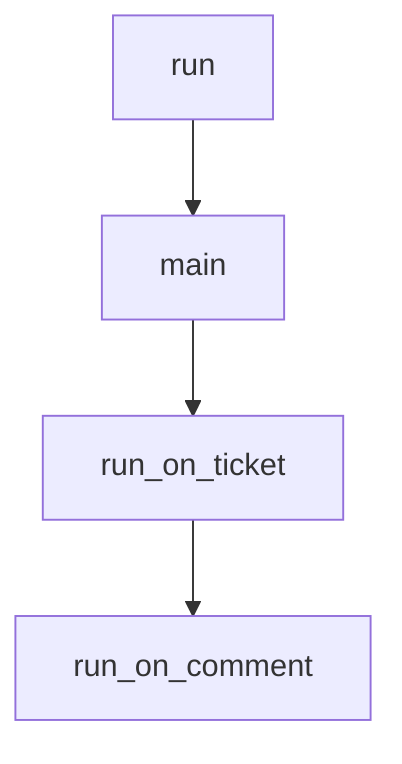

# Chapter 3: Repository Configuration and Governance

Welcome to **Chapter 3: Repository Configuration and Governance**. In this part of **Sweep Tutorial: Issue-to-PR AI Coding Workflows on GitHub**, you will build an intuitive mental model first, then move into concrete implementation details and practical production tradeoffs.


This chapter focuses on `sweep.yaml`, the main behavior contract for repository-level Sweep usage.

## Learning Goals

- configure branch, CI usage, and directory restrictions
- encode repository-specific guidance for better outputs
- prevent unsafe edits through policy and structure

## Key `sweep.yaml` Settings

| Key | Role |
|:----|:-----|
| `branch` | base branch for generated changes |
| `gha_enabled` | enable CI signal consumption |
| `blocked_dirs` | prevent edits in sensitive paths |
| `draft` | control PR draft behavior |
| `description` | provide repository context and coding rules |

## Baseline Config Example

```yaml
branch: main
gha_enabled: true
blocked_dirs: [".github/"]
draft: false
description: "Python 3.10 repo; follow PEP8 and update tests when modifying business logic."
```

## Governance Checklist

1. block sensitive infra and compliance directories
2. include style and testing expectations in description
3. review config changes like code with PR approval

## Source References

- [Config Docs](https://github.com/sweepai/sweep/blob/main/docs/pages/usage/config.mdx)
- [Default sweep.yaml](https://github.com/sweepai/sweep/blob/main/sweep.yaml)

## Summary

You now have a policy foundation for safer, more consistent Sweep behavior.

Next: [Chapter 4: Feedback Loops, Review Comments, and CI Repair](04-feedback-loops-review-comments-and-ci-repair.md)

## Source Code Walkthrough

### `sweepai/cli.py`

The `run` function in [`sweepai/cli.py`](https://github.com/sweepai/sweep/blob/HEAD/sweepai/cli.py) handles a key part of this chapter's functionality:

```py
    if not os.path.exists(config_path):
        cprint(
            f"\nConfiguration not found at {config_path}. Please run [green]'sweep init'[/green] to initialize the CLI.\n",
            style="yellow",
        )
        raise ValueError(
            "Configuration not found, please run 'sweep init' to initialize the CLI."
        )
    posthog_capture(
        "sweep_watch_started",
        {
            "repo": repo_name,
            "debug": debug,
            "record_events": record_events,
            "max_events": max_events,
        },
    )
    GITHUB_PAT = os.environ.get("GITHUB_PAT", None)
    if GITHUB_PAT is None:
        raise ValueError("GITHUB_PAT environment variable must be set")
    g = Github(os.environ["GITHUB_PAT"])
    repo = g.get_repo(repo_name)
    if debug:
        logger.debug("Debug mode enabled")

    def stream_events(repo: Repository, timeout: int = 2, offset: int = 2 * 60):
        processed_event_ids = set()
        current_time = time.time() - offset
        current_time = datetime.datetime.fromtimestamp(current_time)
        local_tz = datetime.datetime.now(datetime.timezone.utc).astimezone().tzinfo

        while True:
```

This function is important because it defines how Sweep Tutorial: Issue-to-PR AI Coding Workflows on GitHub implements the patterns covered in this chapter.

### `sweepai/cli.py`

The `main` function in [`sweepai/cli.py`](https://github.com/sweepai/sweep/blob/HEAD/sweepai/cli.py) handles a key part of this chapter's functionality:

```py
            return handle_request(payload, get_event_type(event))

    def main():
        cprint(
            f"\n[bold black on white]  Starting server, listening to events from {repo_name}...  [/bold black on white]\n",
        )
        cprint(
            f"To create a PR, please create an issue at https://github.com/{repo_name}/issues with a title prefixed with 'Sweep:' or label an existing issue with 'sweep'. The events will be logged here, but there may be a brief delay.\n"
        )
        for event in stream_events(repo):
            handle_event(event)

    if __name__ == "__main__":
        main()


@app.command()
def init(override: bool = False):
    # TODO: Fix telemetry
    if not override:
        if os.path.exists(config_path):
            with open(config_path, "r") as f:
                config = json.load(f)
                if "OPENAI_API_KEY" in config and "ANTHROPIC_API_KEY" in config and "GITHUB_PAT" in config:
                    override = typer.confirm(
                        f"\nConfiguration already exists at {config_path}. Override?",
                        default=False,
                        abort=True,
                    )
    cprint(
        "\n[bold black on white]  Initializing Sweep CLI...  [/bold black on white]\n",
    )
```

This function is important because it defines how Sweep Tutorial: Issue-to-PR AI Coding Workflows on GitHub implements the patterns covered in this chapter.

### `sweepai/api.py`

The `run_on_ticket` function in [`sweepai/api.py`](https://github.com/sweepai/sweep/blob/HEAD/sweepai/api.py) handles a key part of this chapter's functionality:

```py
logger.bind(application="webhook")

def run_on_ticket(*args, **kwargs):
    tracking_id = get_hash()
    with logger.contextualize(
        **kwargs,
        name="ticket_" + kwargs["username"],
        tracking_id=tracking_id,
    ):
        return on_ticket(*args, **kwargs, tracking_id=tracking_id)


def run_on_comment(*args, **kwargs):
    tracking_id = get_hash()
    with logger.contextualize(
        **kwargs,
        name="comment_" + kwargs["username"],
        tracking_id=tracking_id,
    ):
        on_comment(*args, **kwargs, tracking_id=tracking_id)

def run_review_pr(*args, **kwargs):
    tracking_id = get_hash()
    with logger.contextualize(
        **kwargs,
        name="review_" + kwargs["username"],
        tracking_id=tracking_id,
    ):
        review_pr(*args, **kwargs, tracking_id=tracking_id)


def run_on_button_click(*args, **kwargs):
```

This function is important because it defines how Sweep Tutorial: Issue-to-PR AI Coding Workflows on GitHub implements the patterns covered in this chapter.

### `sweepai/api.py`

The `run_on_comment` function in [`sweepai/api.py`](https://github.com/sweepai/sweep/blob/HEAD/sweepai/api.py) handles a key part of this chapter's functionality:

```py


def run_on_comment(*args, **kwargs):
    tracking_id = get_hash()
    with logger.contextualize(
        **kwargs,
        name="comment_" + kwargs["username"],
        tracking_id=tracking_id,
    ):
        on_comment(*args, **kwargs, tracking_id=tracking_id)

def run_review_pr(*args, **kwargs):
    tracking_id = get_hash()
    with logger.contextualize(
        **kwargs,
        name="review_" + kwargs["username"],
        tracking_id=tracking_id,
    ):
        review_pr(*args, **kwargs, tracking_id=tracking_id)


def run_on_button_click(*args, **kwargs):
    thread = threading.Thread(target=handle_button_click, args=args, kwargs=kwargs)
    thread.start()
    global_threads.append(thread)


def terminate_thread(thread):
    """Terminate a python threading.Thread."""
    try:
        if not thread.is_alive():
            return
```

This function is important because it defines how Sweep Tutorial: Issue-to-PR AI Coding Workflows on GitHub implements the patterns covered in this chapter.


## How These Components Connect


