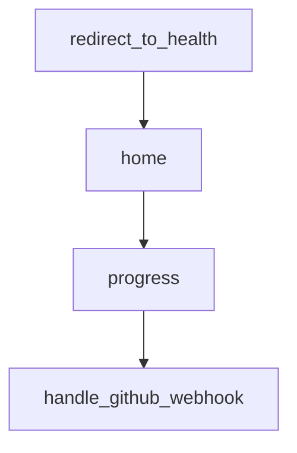

# Chapter 3: Repository Configuration and Governance

Welcome to **Chapter 3: Repository Configuration and Governance**. In this part of **Sweep Tutorial: Issue-to-PR AI Coding Workflows on GitHub**, you will build an intuitive mental model first, then move into concrete implementation details and practical production tradeoffs.


This chapter focuses on `sweep.yaml`, the main behavior contract for repository-level Sweep usage.

## Learning Goals

- configure branch, CI usage, and directory restrictions
- encode repository-specific guidance for better outputs
- prevent unsafe edits through policy and structure

## Key `sweep.yaml` Settings

| Key | Role |
|:----|:-----|
| `branch` | base branch for generated changes |
| `gha_enabled` | enable CI signal consumption |
| `blocked_dirs` | prevent edits in sensitive paths |
| `draft` | control PR draft behavior |
| `description` | provide repository context and coding rules |

## Baseline Config Example

```yaml
branch: main
gha_enabled: true
blocked_dirs: [".github/"]
draft: false
description: "Python 3.10 repo; follow PEP8 and update tests when modifying business logic."
```

## Governance Checklist

1. block sensitive infra and compliance directories
2. include style and testing expectations in description
3. review config changes like code with PR approval

## Source References

- [Config Docs](https://github.com/sweepai/sweep/blob/main/docs/pages/usage/config.mdx)
- [Default sweep.yaml](https://github.com/sweepai/sweep/blob/main/sweep.yaml)

## Summary

You now have a policy foundation for safer, more consistent Sweep behavior.

Next: [Chapter 4: Feedback Loops, Review Comments, and CI Repair](04-feedback-loops-review-comments-and-ci-repair.md)

## Depth Expansion Playbook

## Source Code Walkthrough

### `sweepai/api.py`

The `redirect_to_health` function in [`sweepai/api.py`](https://github.com/sweepai/sweep/blob/HEAD/sweepai/api.py) handles a key part of this chapter's functionality:

```py

@app.get("/health")
def redirect_to_health():
    return health_check()


@app.get("/", response_class=HTMLResponse)
def home(request: Request):
    try:
        validate_license()
        license_expired = False
    except Exception as e:
        logger.warning(e)
        license_expired = True
    return templates.TemplateResponse(
        name="index.html", context={"version": version, "request": request, "license_expired": license_expired}
    )


@app.get("/ticket_progress/{tracking_id}")
def progress(tracking_id: str = Path(...)):
    ticket_progress = TicketProgress.load(tracking_id)
    return ticket_progress.dict()


def handle_github_webhook(event_payload):
    handle_event(event_payload.get("request"), event_payload.get("event"))


def handle_request(request_dict, event=None):
    """So it can be exported to the listen endpoint."""
    with logger.contextualize(tracking_id="main", env=ENV):
```

This function is important because it defines how Sweep Tutorial: Issue-to-PR AI Coding Workflows on GitHub implements the patterns covered in this chapter.

### `sweepai/api.py`

The `home` function in [`sweepai/api.py`](https://github.com/sweepai/sweep/blob/HEAD/sweepai/api.py) handles a key part of this chapter's functionality:

```py

@app.get("/", response_class=HTMLResponse)
def home(request: Request):
    try:
        validate_license()
        license_expired = False
    except Exception as e:
        logger.warning(e)
        license_expired = True
    return templates.TemplateResponse(
        name="index.html", context={"version": version, "request": request, "license_expired": license_expired}
    )


@app.get("/ticket_progress/{tracking_id}")
def progress(tracking_id: str = Path(...)):
    ticket_progress = TicketProgress.load(tracking_id)
    return ticket_progress.dict()


def handle_github_webhook(event_payload):
    handle_event(event_payload.get("request"), event_payload.get("event"))


def handle_request(request_dict, event=None):
    """So it can be exported to the listen endpoint."""
    with logger.contextualize(tracking_id="main", env=ENV):
        action = request_dict.get("action")

        try:
            handle_github_webhook(
                {
```

This function is important because it defines how Sweep Tutorial: Issue-to-PR AI Coding Workflows on GitHub implements the patterns covered in this chapter.

### `sweepai/api.py`

The `progress` function in [`sweepai/api.py`](https://github.com/sweepai/sweep/blob/HEAD/sweepai/api.py) handles a key part of this chapter's functionality:

```py
from sweepai.utils.github_utils import CURRENT_USERNAME, get_github_client
from sweepai.utils.hash import verify_signature
from sweepai.utils.progress import TicketProgress
from sweepai.utils.safe_pqueue import SafePriorityQueue
from sweepai.utils.str_utils import BOT_SUFFIX, get_hash
from sweepai.utils.validate_license import validate_license
from sweepai.web.events import (
    CheckRunCompleted,
    CommentCreatedRequest,
    IssueCommentRequest,
    IssueRequest,
    PREdited,
    PRLabeledRequest,
    PRRequest,
)
from sweepai.web.health import health_check
import sentry_sdk
from sentry_sdk import set_user

version = time.strftime("%y.%m.%d.%H")

if SENTRY_URL:
    sentry_sdk.init(
        dsn=SENTRY_URL,
        traces_sample_rate=1.0,
        profiles_sample_rate=1.0,
        release=version
    )

app = FastAPI()

app.mount("/chat", chat_app)
```

This function is important because it defines how Sweep Tutorial: Issue-to-PR AI Coding Workflows on GitHub implements the patterns covered in this chapter.

### `sweepai/api.py`

The `handle_github_webhook` function in [`sweepai/api.py`](https://github.com/sweepai/sweep/blob/HEAD/sweepai/api.py) handles a key part of this chapter's functionality:

```py


def handle_github_webhook(event_payload):
    handle_event(event_payload.get("request"), event_payload.get("event"))


def handle_request(request_dict, event=None):
    """So it can be exported to the listen endpoint."""
    with logger.contextualize(tracking_id="main", env=ENV):
        action = request_dict.get("action")

        try:
            handle_github_webhook(
                {
                    "request": request_dict,
                    "event": event,
                }
            )
        except Exception as e:
            logger.exception(str(e))
        logger.info(f"Done handling {event}, {action}")
        return {"success": True}


# @app.post("/")
async def validate_signature(
    request: Request,
    x_hub_signature: Optional[str] = Header(None, alias="X-Hub-Signature-256")
):
    payload_body = await request.body()
    if not verify_signature(payload_body=payload_body, signature_header=x_hub_signature):
        raise HTTPException(status_code=403, detail="Request signatures didn't match!")
```

This function is important because it defines how Sweep Tutorial: Issue-to-PR AI Coding Workflows on GitHub implements the patterns covered in this chapter.


## How These Components Connect


