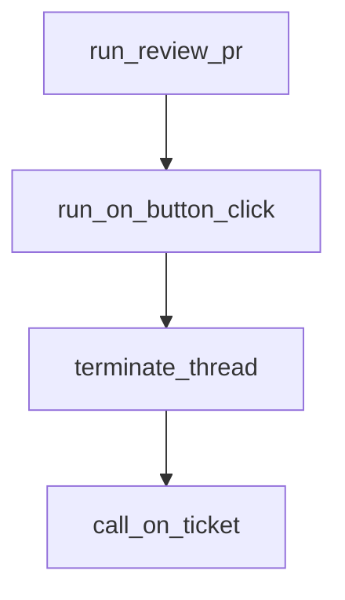

# Chapter 4: Feedback Loops, Review Comments, and CI Repair

Welcome to **Chapter 4: Feedback Loops, Review Comments, and CI Repair**. In this part of **Sweep Tutorial: Issue-to-PR AI Coding Workflows on GitHub**, you will build an intuitive mental model first, then move into concrete implementation details and practical production tradeoffs.


Sweep outcomes improve when teams actively run comment-based feedback loops and CI repair cycles.

## Learning Goals

- distinguish issue comments from PR review comments
- use feedback channels intentionally for targeted updates
- leverage CI signals to improve generated code quality

## Feedback Channels

| Channel | Typical Effect |
|:--------|:---------------|
| issue comment | broader cross-file or full-PR rework |
| PR comment | targeted iteration on existing change set |
| code review comment | file-local fixes with explicit context |

## Practical Pattern

1. start with issue-level clarification for large mistakes
2. move to file-level review comments for precise corrections
3. use CI failures to request deterministic fixes

## Source References

- [Getting Started: Fix Sweep PRs](https://github.com/sweepai/sweep/blob/main/docs/pages/getting-started.md)
- [Advanced Usage](https://github.com/sweepai/sweep/blob/main/docs/pages/usage/advanced.mdx)

## Summary

You now know how to turn generated PRs into high-quality merge candidates through structured feedback.

Next: [Chapter 5: CLI and Self-Hosted Deployment](05-cli-and-self-hosted-deployment.md)

## Source Code Walkthrough

### `sweepai/api.py`

The `run_review_pr` function in [`sweepai/api.py`](https://github.com/sweepai/sweep/blob/HEAD/sweepai/api.py) handles a key part of this chapter's functionality:

```py
        on_comment(*args, **kwargs, tracking_id=tracking_id)

def run_review_pr(*args, **kwargs):
    tracking_id = get_hash()
    with logger.contextualize(
        **kwargs,
        name="review_" + kwargs["username"],
        tracking_id=tracking_id,
    ):
        review_pr(*args, **kwargs, tracking_id=tracking_id)


def run_on_button_click(*args, **kwargs):
    thread = threading.Thread(target=handle_button_click, args=args, kwargs=kwargs)
    thread.start()
    global_threads.append(thread)


def terminate_thread(thread):
    """Terminate a python threading.Thread."""
    try:
        if not thread.is_alive():
            return

        exc = ctypes.py_object(SystemExit)
        res = ctypes.pythonapi.PyThreadState_SetAsyncExc(
            ctypes.c_long(thread.ident), exc
        )
        if res == 0:
            raise ValueError("Invalid thread ID")
        elif res != 1:
            # Call with exception set to 0 is needed to cleanup properly.
```

This function is important because it defines how Sweep Tutorial: Issue-to-PR AI Coding Workflows on GitHub implements the patterns covered in this chapter.

### `sweepai/api.py`

The `run_on_button_click` function in [`sweepai/api.py`](https://github.com/sweepai/sweep/blob/HEAD/sweepai/api.py) handles a key part of this chapter's functionality:

```py


def run_on_button_click(*args, **kwargs):
    thread = threading.Thread(target=handle_button_click, args=args, kwargs=kwargs)
    thread.start()
    global_threads.append(thread)


def terminate_thread(thread):
    """Terminate a python threading.Thread."""
    try:
        if not thread.is_alive():
            return

        exc = ctypes.py_object(SystemExit)
        res = ctypes.pythonapi.PyThreadState_SetAsyncExc(
            ctypes.c_long(thread.ident), exc
        )
        if res == 0:
            raise ValueError("Invalid thread ID")
        elif res != 1:
            # Call with exception set to 0 is needed to cleanup properly.
            ctypes.pythonapi.PyThreadState_SetAsyncExc(thread.ident, 0)
            raise SystemError("PyThreadState_SetAsyncExc failed")
    except Exception as e:
        logger.exception(f"Failed to terminate thread: {e}")


# def delayed_kill(thread: threading.Thread, delay: int = 60 * 60):
#     time.sleep(delay)
#     terminate_thread(thread)

```

This function is important because it defines how Sweep Tutorial: Issue-to-PR AI Coding Workflows on GitHub implements the patterns covered in this chapter.

### `sweepai/api.py`

The `terminate_thread` function in [`sweepai/api.py`](https://github.com/sweepai/sweep/blob/HEAD/sweepai/api.py) handles a key part of this chapter's functionality:

```py


def terminate_thread(thread):
    """Terminate a python threading.Thread."""
    try:
        if not thread.is_alive():
            return

        exc = ctypes.py_object(SystemExit)
        res = ctypes.pythonapi.PyThreadState_SetAsyncExc(
            ctypes.c_long(thread.ident), exc
        )
        if res == 0:
            raise ValueError("Invalid thread ID")
        elif res != 1:
            # Call with exception set to 0 is needed to cleanup properly.
            ctypes.pythonapi.PyThreadState_SetAsyncExc(thread.ident, 0)
            raise SystemError("PyThreadState_SetAsyncExc failed")
    except Exception as e:
        logger.exception(f"Failed to terminate thread: {e}")


# def delayed_kill(thread: threading.Thread, delay: int = 60 * 60):
#     time.sleep(delay)
#     terminate_thread(thread)


def call_on_ticket(*args, **kwargs):
    global on_ticket_events
    key = f"{kwargs['repo_full_name']}-{kwargs['issue_number']}"  # Full name, issue number as key

    # Use multithreading
```

This function is important because it defines how Sweep Tutorial: Issue-to-PR AI Coding Workflows on GitHub implements the patterns covered in this chapter.

### `sweepai/api.py`

The `call_on_ticket` function in [`sweepai/api.py`](https://github.com/sweepai/sweep/blob/HEAD/sweepai/api.py) handles a key part of this chapter's functionality:

```py


def call_on_ticket(*args, **kwargs):
    global on_ticket_events
    key = f"{kwargs['repo_full_name']}-{kwargs['issue_number']}"  # Full name, issue number as key

    # Use multithreading
    # Check if a previous process exists for the same key, cancel it
    e = on_ticket_events.get(key, None)
    if e:
        logger.info(f"Found previous thread for key {key} and cancelling it")
        terminate_thread(e)

    thread = threading.Thread(target=run_on_ticket, args=args, kwargs=kwargs)
    on_ticket_events[key] = thread
    thread.start()
    global_threads.append(thread)

def call_on_comment(
    *args, **kwargs
):  # TODO: if its a GHA delete all previous GHA and append to the end
    def worker():
        while not events[key].empty():
            task_args, task_kwargs = events[key].get()
            run_on_comment(*task_args, **task_kwargs)

    global events
    repo_full_name = kwargs["repo_full_name"]
    pr_id = kwargs["pr_number"]
    key = f"{repo_full_name}-{pr_id}"  # Full name, comment number as key

    comment_type = kwargs["comment_type"]
```

This function is important because it defines how Sweep Tutorial: Issue-to-PR AI Coding Workflows on GitHub implements the patterns covered in this chapter.


## How These Components Connect


