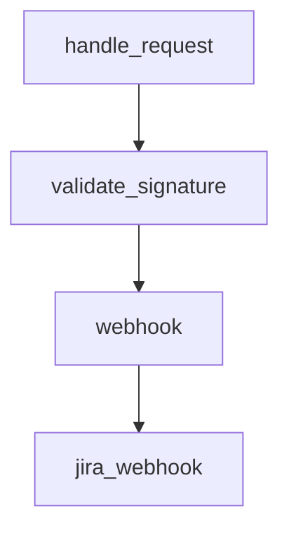

# Chapter 4: Feedback Loops, Review Comments, and CI Repair

Welcome to **Chapter 4: Feedback Loops, Review Comments, and CI Repair**. In this part of **Sweep Tutorial: Issue-to-PR AI Coding Workflows on GitHub**, you will build an intuitive mental model first, then move into concrete implementation details and practical production tradeoffs.


Sweep outcomes improve when teams actively run comment-based feedback loops and CI repair cycles.

## Learning Goals

- distinguish issue comments from PR review comments
- use feedback channels intentionally for targeted updates
- leverage CI signals to improve generated code quality

## Feedback Channels

| Channel | Typical Effect |
|:--------|:---------------|
| issue comment | broader cross-file or full-PR rework |
| PR comment | targeted iteration on existing change set |
| code review comment | file-local fixes with explicit context |

## Practical Pattern

1. start with issue-level clarification for large mistakes
2. move to file-level review comments for precise corrections
3. use CI failures to request deterministic fixes

## Source References

- [Getting Started: Fix Sweep PRs](https://github.com/sweepai/sweep/blob/main/docs/pages/getting-started.md)
- [Advanced Usage](https://github.com/sweepai/sweep/blob/main/docs/pages/usage/advanced.mdx)

## Summary

You now know how to turn generated PRs into high-quality merge candidates through structured feedback.

Next: [Chapter 5: CLI and Self-Hosted Deployment](05-cli-and-self-hosted-deployment.md)

## Depth Expansion Playbook

## Source Code Walkthrough

### `sweepai/api.py`

The `handle_request` function in [`sweepai/api.py`](https://github.com/sweepai/sweep/blob/HEAD/sweepai/api.py) handles a key part of this chapter's functionality:

```py


def handle_request(request_dict, event=None):
    """So it can be exported to the listen endpoint."""
    with logger.contextualize(tracking_id="main", env=ENV):
        action = request_dict.get("action")

        try:
            handle_github_webhook(
                {
                    "request": request_dict,
                    "event": event,
                }
            )
        except Exception as e:
            logger.exception(str(e))
        logger.info(f"Done handling {event}, {action}")
        return {"success": True}


# @app.post("/")
async def validate_signature(
    request: Request,
    x_hub_signature: Optional[str] = Header(None, alias="X-Hub-Signature-256")
):
    payload_body = await request.body()
    if not verify_signature(payload_body=payload_body, signature_header=x_hub_signature):
        raise HTTPException(status_code=403, detail="Request signatures didn't match!")

@app.post("/", dependencies=[Depends(validate_signature)])
def webhook(
    request_dict: dict = Body(...),
```

This function is important because it defines how Sweep Tutorial: Issue-to-PR AI Coding Workflows on GitHub implements the patterns covered in this chapter.

### `sweepai/api.py`

The `validate_signature` function in [`sweepai/api.py`](https://github.com/sweepai/sweep/blob/HEAD/sweepai/api.py) handles a key part of this chapter's functionality:

```py

# @app.post("/")
async def validate_signature(
    request: Request,
    x_hub_signature: Optional[str] = Header(None, alias="X-Hub-Signature-256")
):
    payload_body = await request.body()
    if not verify_signature(payload_body=payload_body, signature_header=x_hub_signature):
        raise HTTPException(status_code=403, detail="Request signatures didn't match!")

@app.post("/", dependencies=[Depends(validate_signature)])
def webhook(
    request_dict: dict = Body(...),
    x_github_event: Optional[str] = Header(None, alias="X-GitHub-Event"),
):
    """Handle a webhook request from GitHub"""
    with logger.contextualize(tracking_id="main", env=ENV):
        action = request_dict.get("action", None)

        logger.info(f"Received event: {x_github_event}, {action}")
        return handle_request(request_dict, event=x_github_event)

@app.post("/jira")
def jira_webhook(
    request_dict: dict = Body(...),
) -> None:
    def call_jira_ticket(*args, **kwargs):
        thread = threading.Thread(target=handle_jira_ticket, args=args, kwargs=kwargs)
        thread.start()
    call_jira_ticket(event=request_dict)

# Set up cronjob for this
```

This function is important because it defines how Sweep Tutorial: Issue-to-PR AI Coding Workflows on GitHub implements the patterns covered in this chapter.

### `sweepai/api.py`

The `webhook` function in [`sweepai/api.py`](https://github.com/sweepai/sweep/blob/HEAD/sweepai/api.py) handles a key part of this chapter's functionality:

```py

templates = Jinja2Templates(directory="sweepai/web")
logger.bind(application="webhook")

def run_on_ticket(*args, **kwargs):
    tracking_id = get_hash()
    with logger.contextualize(
        **kwargs,
        name="ticket_" + kwargs["username"],
        tracking_id=tracking_id,
    ):
        return on_ticket(*args, **kwargs, tracking_id=tracking_id)


def run_on_comment(*args, **kwargs):
    tracking_id = get_hash()
    with logger.contextualize(
        **kwargs,
        name="comment_" + kwargs["username"],
        tracking_id=tracking_id,
    ):
        on_comment(*args, **kwargs, tracking_id=tracking_id)

def run_review_pr(*args, **kwargs):
    tracking_id = get_hash()
    with logger.contextualize(
        **kwargs,
        name="review_" + kwargs["username"],
        tracking_id=tracking_id,
    ):
        review_pr(*args, **kwargs, tracking_id=tracking_id)

```

This function is important because it defines how Sweep Tutorial: Issue-to-PR AI Coding Workflows on GitHub implements the patterns covered in this chapter.

### `sweepai/api.py`

The `jira_webhook` function in [`sweepai/api.py`](https://github.com/sweepai/sweep/blob/HEAD/sweepai/api.py) handles a key part of this chapter's functionality:

```py

@app.post("/jira")
def jira_webhook(
    request_dict: dict = Body(...),
) -> None:
    def call_jira_ticket(*args, **kwargs):
        thread = threading.Thread(target=handle_jira_ticket, args=args, kwargs=kwargs)
        thread.start()
    call_jira_ticket(event=request_dict)

# Set up cronjob for this
@app.get("/update_sweep_prs_v2")
def update_sweep_prs_v2(repo_full_name: str, installation_id: int):
    # Get a Github client
    _, g = get_github_client(installation_id)

    # Get the repository
    repo = g.get_repo(repo_full_name)
    config = SweepConfig.get_config(repo)

    try:
        branch_ttl = int(config.get("branch_ttl", 7))
    except Exception:
        branch_ttl = 7
    branch_ttl = max(branch_ttl, 1)

    # Get all open pull requests created by Sweep
    pulls = repo.get_pulls(
        state="open", head="sweep", sort="updated", direction="desc"
    )[:5]

    # For each pull request, attempt to merge the changes from the default branch into the pull request branch
```

This function is important because it defines how Sweep Tutorial: Issue-to-PR AI Coding Workflows on GitHub implements the patterns covered in this chapter.


## How These Components Connect


