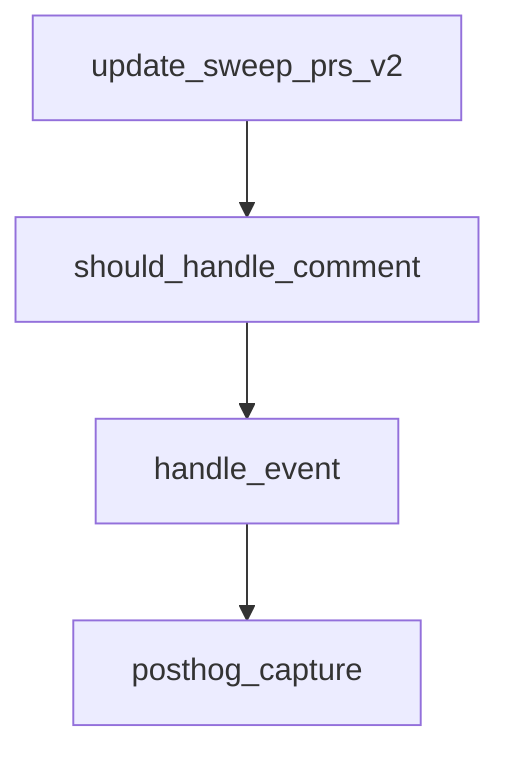

# Chapter 5: CLI and Self-Hosted Deployment

Welcome to **Chapter 5: CLI and Self-Hosted Deployment**. In this part of **Sweep Tutorial: Issue-to-PR AI Coding Workflows on GitHub**, you will build an intuitive mental model first, then move into concrete implementation details and practical production tradeoffs.


Sweep supports local CLI workflows and self-hosted GitHub app deployments for teams with tighter control requirements.

## Learning Goals

- choose between hosted app, local CLI, and self-hosted deployment
- understand key dependencies and environment assumptions
- define rollout criteria for private infrastructure

## Deployment Modes

| Mode | Best For |
|:-----|:---------|
| hosted GitHub app | fastest adoption with minimal ops overhead |
| Sweep CLI | local runs and experimentation |
| self-hosted Docker app | enterprise network and data-control requirements |

## CLI Bootstrap

```bash
pip install sweepai
sweep init
sweep run https://github.com/ORG/REPO/issues/1
```

## Self-Hosted Highlights

- create GitHub app and webhook configuration
- manage OpenAI/Anthropic credentials in `.env`
- deploy backend with Docker Compose
- configure webhook URL and monitor long-running tasks

## Source References

- [CLI Docs](https://github.com/sweepai/sweep/blob/main/docs/pages/cli.mdx)
- [Deployment Docs](https://github.com/sweepai/sweep/blob/main/docs/pages/deployment.mdx)

## Summary

You now have a mode-selection model for operating Sweep in different risk and compliance contexts.

Next: [Chapter 6: Search, Planning, and Execution Patterns](06-search-planning-and-execution-patterns.md)

## Depth Expansion Playbook

## Source Code Walkthrough

### `sweepai/api.py`

The `update_sweep_prs_v2` function in [`sweepai/api.py`](https://github.com/sweepai/sweep/blob/HEAD/sweepai/api.py) handles a key part of this chapter's functionality:

```py

# Set up cronjob for this
@app.get("/update_sweep_prs_v2")
def update_sweep_prs_v2(repo_full_name: str, installation_id: int):
    # Get a Github client
    _, g = get_github_client(installation_id)

    # Get the repository
    repo = g.get_repo(repo_full_name)
    config = SweepConfig.get_config(repo)

    try:
        branch_ttl = int(config.get("branch_ttl", 7))
    except Exception:
        branch_ttl = 7
    branch_ttl = max(branch_ttl, 1)

    # Get all open pull requests created by Sweep
    pulls = repo.get_pulls(
        state="open", head="sweep", sort="updated", direction="desc"
    )[:5]

    # For each pull request, attempt to merge the changes from the default branch into the pull request branch
    try:
        for pr in pulls:
            try:
                # make sure it's a sweep ticket
                feature_branch = pr.head.ref
                if not feature_branch.startswith(
                    "sweep/"
                ) and not feature_branch.startswith("sweep_"):
                    continue
```

This function is important because it defines how Sweep Tutorial: Issue-to-PR AI Coding Workflows on GitHub implements the patterns covered in this chapter.

### `sweepai/api.py`

The `should_handle_comment` function in [`sweepai/api.py`](https://github.com/sweepai/sweep/blob/HEAD/sweepai/api.py) handles a key part of this chapter's functionality:

```py
        logger.warning("Failed to update sweep PRs")

def should_handle_comment(request: CommentCreatedRequest | IssueCommentRequest):
    comment = request.comment.body
    return (
        (
            comment.lower().startswith("sweep:") # we will handle all comments (with or without label) that start with "sweep:"
        )
        and request.comment.user.type == "User" # ensure it's a user comment
        and request.comment.user.login not in BLACKLISTED_USERS # ensure it's not a blacklisted user
        and BOT_SUFFIX not in comment # we don't handle bot commnents
    )

def handle_event(request_dict, event):
    action = request_dict.get("action")
    
    username = request_dict.get("sender", {}).get("login")
    if username:
        set_user({"username": username})

    if repo_full_name := request_dict.get("repository", {}).get("full_name"):
        if repo_full_name in DISABLED_REPOS:
            logger.warning(f"Repo {repo_full_name} is disabled")
            return {"success": False, "error_message": "Repo is disabled"}

    with logger.contextualize(tracking_id="main", env=ENV):
        match event, action:
            case "check_run", "completed":
                request = CheckRunCompleted(**request_dict)
                _, g = get_github_client(request.installation.id)
                repo = g.get_repo(request.repository.full_name)
                pull_requests = request.check_run.pull_requests
```

This function is important because it defines how Sweep Tutorial: Issue-to-PR AI Coding Workflows on GitHub implements the patterns covered in this chapter.

### `sweepai/api.py`

The `handle_event` function in [`sweepai/api.py`](https://github.com/sweepai/sweep/blob/HEAD/sweepai/api.py) handles a key part of this chapter's functionality:

```py

def handle_github_webhook(event_payload):
    handle_event(event_payload.get("request"), event_payload.get("event"))


def handle_request(request_dict, event=None):
    """So it can be exported to the listen endpoint."""
    with logger.contextualize(tracking_id="main", env=ENV):
        action = request_dict.get("action")

        try:
            handle_github_webhook(
                {
                    "request": request_dict,
                    "event": event,
                }
            )
        except Exception as e:
            logger.exception(str(e))
        logger.info(f"Done handling {event}, {action}")
        return {"success": True}


# @app.post("/")
async def validate_signature(
    request: Request,
    x_hub_signature: Optional[str] = Header(None, alias="X-Hub-Signature-256")
):
    payload_body = await request.body()
    if not verify_signature(payload_body=payload_body, signature_header=x_hub_signature):
        raise HTTPException(status_code=403, detail="Request signatures didn't match!")

```

This function is important because it defines how Sweep Tutorial: Issue-to-PR AI Coding Workflows on GitHub implements the patterns covered in this chapter.

### `sweepai/cli.py`

The `posthog_capture` function in [`sweepai/cli.py`](https://github.com/sweepai/sweep/blob/HEAD/sweepai/cli.py) handles a key part of this chapter's functionality:

```py


def posthog_capture(event_name, properties, *args, **kwargs):
    POSTHOG_DISTINCT_ID = os.environ.get("POSTHOG_DISTINCT_ID")
    if POSTHOG_DISTINCT_ID:
        posthog.capture(POSTHOG_DISTINCT_ID, event_name, properties, *args, **kwargs)


def load_config():
    if os.path.exists(config_path):
        cprint(f"\nLoading configuration from {config_path}", style="yellow")
        with open(config_path, "r") as f:
            config = json.load(f)
        for key, value in config.items():
            try:
                os.environ[key] = value
            except Exception as e:
                cprint(f"Error loading config: {e}, skipping.", style="yellow")
        os.environ["POSTHOG_DISTINCT_ID"] = str(os.environ.get("POSTHOG_DISTINCT_ID", ""))
        # Should contain:
        # GITHUB_PAT
        # OPENAI_API_KEY
        # ANTHROPIC_API_KEY
        # VOYAGE_API_KEY
        # POSTHOG_DISTINCT_ID


def fetch_issue_request(issue_url: str, __version__: str = "0"):
    (
        protocol_name,
        _,
        _base_url,
```

This function is important because it defines how Sweep Tutorial: Issue-to-PR AI Coding Workflows on GitHub implements the patterns covered in this chapter.


## How These Components Connect


