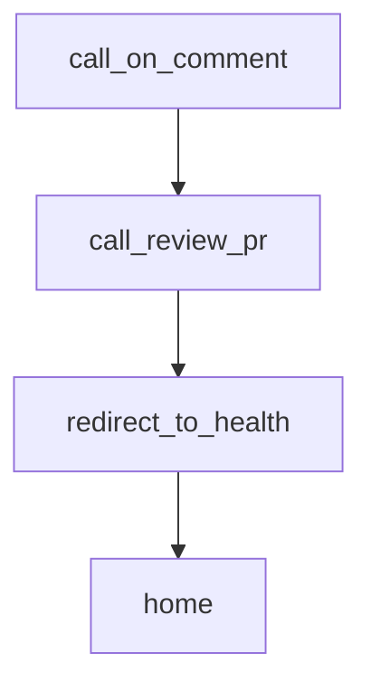

# Chapter 5: CLI and Self-Hosted Deployment

Welcome to **Chapter 5: CLI and Self-Hosted Deployment**. In this part of **Sweep Tutorial: Issue-to-PR AI Coding Workflows on GitHub**, you will build an intuitive mental model first, then move into concrete implementation details and practical production tradeoffs.


Sweep supports local CLI workflows and self-hosted GitHub app deployments for teams with tighter control requirements.

## Learning Goals

- choose between hosted app, local CLI, and self-hosted deployment
- understand key dependencies and environment assumptions
- define rollout criteria for private infrastructure

## Deployment Modes

| Mode | Best For |
|:-----|:---------|
| hosted GitHub app | fastest adoption with minimal ops overhead |
| Sweep CLI | local runs and experimentation |
| self-hosted Docker app | enterprise network and data-control requirements |

## CLI Bootstrap

```bash
pip install sweepai
sweep init
sweep run https://github.com/ORG/REPO/issues/1
```

## Self-Hosted Highlights

- create GitHub app and webhook configuration
- manage OpenAI/Anthropic credentials in `.env`
- deploy backend with Docker Compose
- configure webhook URL and monitor long-running tasks

## Source References

- [CLI Docs](https://github.com/sweepai/sweep/blob/main/docs/pages/cli.mdx)
- [Deployment Docs](https://github.com/sweepai/sweep/blob/main/docs/pages/deployment.mdx)

## Summary

You now have a mode-selection model for operating Sweep in different risk and compliance contexts.

Next: [Chapter 6: Search, Planning, and Execution Patterns](06-search-planning-and-execution-patterns.md)

## Source Code Walkthrough

### `sweepai/api.py`

The `call_on_comment` function in [`sweepai/api.py`](https://github.com/sweepai/sweep/blob/HEAD/sweepai/api.py) handles a key part of this chapter's functionality:

```py
    global_threads.append(thread)

def call_on_comment(
    *args, **kwargs
):  # TODO: if its a GHA delete all previous GHA and append to the end
    def worker():
        while not events[key].empty():
            task_args, task_kwargs = events[key].get()
            run_on_comment(*task_args, **task_kwargs)

    global events
    repo_full_name = kwargs["repo_full_name"]
    pr_id = kwargs["pr_number"]
    key = f"{repo_full_name}-{pr_id}"  # Full name, comment number as key

    comment_type = kwargs["comment_type"]
    logger.info(f"Received comment type: {comment_type}")

    if key not in events:
        events[key] = SafePriorityQueue()

    events[key].put(0, (args, kwargs))

    # If a thread isn't running, start one
    if not any(
        thread.name == key and thread.is_alive() for thread in threading.enumerate()
    ):
        thread = threading.Thread(target=worker, name=key)
        thread.start()
        global_threads.append(thread)

# add a review by sweep on the pr
```

This function is important because it defines how Sweep Tutorial: Issue-to-PR AI Coding Workflows on GitHub implements the patterns covered in this chapter.

### `sweepai/api.py`

The `call_review_pr` function in [`sweepai/api.py`](https://github.com/sweepai/sweep/blob/HEAD/sweepai/api.py) handles a key part of this chapter's functionality:

```py

# add a review by sweep on the pr
def call_review_pr(*args, **kwargs):
    global review_pr_events
    key = f"{kwargs['repository'].full_name}-{kwargs['pr'].number}"  # Full name, issue number as key

    # Use multithreading
    # Check if a previous process exists for the same key, cancel it
    e = review_pr_events.get(key, None)
    if e:
        logger.info(f"Found previous thread for key {key} and cancelling it")
        terminate_thread(e)

    thread = threading.Thread(target=run_review_pr, args=args, kwargs=kwargs)
    review_pr_events[key] = thread
    thread.start()
    global_threads.append(thread)


@app.get("/health")
def redirect_to_health():
    return health_check()


@app.get("/", response_class=HTMLResponse)
def home(request: Request):
    try:
        validate_license()
        license_expired = False
    except Exception as e:
        logger.warning(e)
        license_expired = True
```

This function is important because it defines how Sweep Tutorial: Issue-to-PR AI Coding Workflows on GitHub implements the patterns covered in this chapter.

### `sweepai/api.py`

The `redirect_to_health` function in [`sweepai/api.py`](https://github.com/sweepai/sweep/blob/HEAD/sweepai/api.py) handles a key part of this chapter's functionality:

```py

@app.get("/health")
def redirect_to_health():
    return health_check()


@app.get("/", response_class=HTMLResponse)
def home(request: Request):
    try:
        validate_license()
        license_expired = False
    except Exception as e:
        logger.warning(e)
        license_expired = True
    return templates.TemplateResponse(
        name="index.html", context={"version": version, "request": request, "license_expired": license_expired}
    )


@app.get("/ticket_progress/{tracking_id}")
def progress(tracking_id: str = Path(...)):
    ticket_progress = TicketProgress.load(tracking_id)
    return ticket_progress.dict()


def handle_github_webhook(event_payload):
    handle_event(event_payload.get("request"), event_payload.get("event"))


def handle_request(request_dict, event=None):
    """So it can be exported to the listen endpoint."""
    with logger.contextualize(tracking_id="main", env=ENV):
```

This function is important because it defines how Sweep Tutorial: Issue-to-PR AI Coding Workflows on GitHub implements the patterns covered in this chapter.

### `sweepai/api.py`

The `home` function in [`sweepai/api.py`](https://github.com/sweepai/sweep/blob/HEAD/sweepai/api.py) handles a key part of this chapter's functionality:

```py

@app.get("/", response_class=HTMLResponse)
def home(request: Request):
    try:
        validate_license()
        license_expired = False
    except Exception as e:
        logger.warning(e)
        license_expired = True
    return templates.TemplateResponse(
        name="index.html", context={"version": version, "request": request, "license_expired": license_expired}
    )


@app.get("/ticket_progress/{tracking_id}")
def progress(tracking_id: str = Path(...)):
    ticket_progress = TicketProgress.load(tracking_id)
    return ticket_progress.dict()


def handle_github_webhook(event_payload):
    handle_event(event_payload.get("request"), event_payload.get("event"))


def handle_request(request_dict, event=None):
    """So it can be exported to the listen endpoint."""
    with logger.contextualize(tracking_id="main", env=ENV):
        action = request_dict.get("action")

        try:
            handle_github_webhook(
                {
```

This function is important because it defines how Sweep Tutorial: Issue-to-PR AI Coding Workflows on GitHub implements the patterns covered in this chapter.


## How These Components Connect


