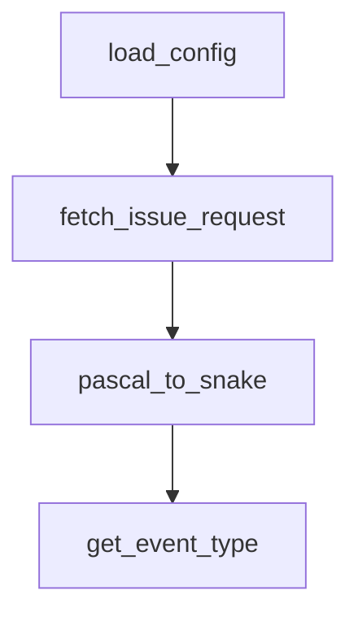

# Chapter 6: Search, Planning, and Execution Patterns

Welcome to **Chapter 6: Search, Planning, and Execution Patterns**. In this part of **Sweep Tutorial: Issue-to-PR AI Coding Workflows on GitHub**, you will build an intuitive mental model first, then move into concrete implementation details and practical production tradeoffs.


Sweep performance depends on a consistent internal pattern: search, plan, implement, validate, and revise.

## Learning Goals

- map the fixed-flow execution philosophy
- align prompt structure with search and planning strengths
- minimize failures from under-specified tasks

## Execution Philosophy

From project docs and FAQ, Sweep emphasizes a bounded workflow instead of open-domain tool execution:

1. search and identify relevant code context
2. plan changes from issue instructions
3. write and update code in PR form
4. validate through CI and user feedback

## Prompting Patterns That Help

| Pattern | Benefit |
|:--------|:--------|
| mention target files/functions | better retrieval precision |
| include desired behavior and constraints | clearer planning output |
| provide reference implementation files | stronger stylistic alignment |

## Source References

- [Advanced Usage](https://github.com/sweepai/sweep/blob/main/docs/pages/usage/advanced.mdx)
- [FAQ](https://github.com/sweepai/sweep/blob/main/docs/pages/faq.mdx)

## Summary

You now understand the core behavioral pattern that drives Sweep output quality.

Next: [Chapter 7: Limitations, Risk Controls, and Safe Scope](07-limitations-risk-controls-and-safe-scope.md)

## Depth Expansion Playbook

## Source Code Walkthrough

### `sweepai/cli.py`

The `load_config` function in [`sweepai/cli.py`](https://github.com/sweepai/sweep/blob/HEAD/sweepai/cli.py) handles a key part of this chapter's functionality:

```py


def load_config():
    if os.path.exists(config_path):
        cprint(f"\nLoading configuration from {config_path}", style="yellow")
        with open(config_path, "r") as f:
            config = json.load(f)
        for key, value in config.items():
            try:
                os.environ[key] = value
            except Exception as e:
                cprint(f"Error loading config: {e}, skipping.", style="yellow")
        os.environ["POSTHOG_DISTINCT_ID"] = str(os.environ.get("POSTHOG_DISTINCT_ID", ""))
        # Should contain:
        # GITHUB_PAT
        # OPENAI_API_KEY
        # ANTHROPIC_API_KEY
        # VOYAGE_API_KEY
        # POSTHOG_DISTINCT_ID


def fetch_issue_request(issue_url: str, __version__: str = "0"):
    (
        protocol_name,
        _,
        _base_url,
        org_name,
        repo_name,
        _issues,
        issue_number,
    ) = issue_url.split("/")
    cprint("Fetching installation ID...")
```

This function is important because it defines how Sweep Tutorial: Issue-to-PR AI Coding Workflows on GitHub implements the patterns covered in this chapter.

### `sweepai/cli.py`

The `fetch_issue_request` function in [`sweepai/cli.py`](https://github.com/sweepai/sweep/blob/HEAD/sweepai/cli.py) handles a key part of this chapter's functionality:

```py


def fetch_issue_request(issue_url: str, __version__: str = "0"):
    (
        protocol_name,
        _,
        _base_url,
        org_name,
        repo_name,
        _issues,
        issue_number,
    ) = issue_url.split("/")
    cprint("Fetching installation ID...")
    installation_id = -1
    cprint("Fetching access token...")
    _token, g = get_github_client(installation_id)
    g: Github = g
    cprint("Fetching repo...")
    issue = g.get_repo(f"{org_name}/{repo_name}").get_issue(int(issue_number))

    issue_request = IssueRequest(
        action="labeled",
        issue=IssueRequest.Issue(
            title=issue.title,
            number=int(issue_number),
            html_url=issue_url,
            user=IssueRequest.Issue.User(
                login=issue.user.login,
                type="User",
            ),
            body=issue.body,
            labels=[
```

This function is important because it defines how Sweep Tutorial: Issue-to-PR AI Coding Workflows on GitHub implements the patterns covered in this chapter.

### `sweepai/cli.py`

The `pascal_to_snake` function in [`sweepai/cli.py`](https://github.com/sweepai/sweep/blob/HEAD/sweepai/cli.py) handles a key part of this chapter's functionality:

```py


def pascal_to_snake(name):
    return "".join(["_" + i.lower() if i.isupper() else i for i in name]).lstrip("_")


def get_event_type(event: Event | IssueEvent):
    if isinstance(event, IssueEvent):
        return "issues"
    else:
        return pascal_to_snake(event.type)[: -len("_event")]

@app.command()
def test():
    cprint("Sweep AI is installed correctly and ready to go!", style="yellow")

@app.command()
def watch(
    repo_name: str,
    debug: bool = False,
    record_events: bool = False,
    max_events: int = 30,
):
    if not os.path.exists(config_path):
        cprint(
            f"\nConfiguration not found at {config_path}. Please run [green]'sweep init'[/green] to initialize the CLI.\n",
            style="yellow",
        )
        raise ValueError(
            "Configuration not found, please run 'sweep init' to initialize the CLI."
        )
    posthog_capture(
```

This function is important because it defines how Sweep Tutorial: Issue-to-PR AI Coding Workflows on GitHub implements the patterns covered in this chapter.

### `sweepai/cli.py`

The `get_event_type` function in [`sweepai/cli.py`](https://github.com/sweepai/sweep/blob/HEAD/sweepai/cli.py) handles a key part of this chapter's functionality:

```py


def get_event_type(event: Event | IssueEvent):
    if isinstance(event, IssueEvent):
        return "issues"
    else:
        return pascal_to_snake(event.type)[: -len("_event")]

@app.command()
def test():
    cprint("Sweep AI is installed correctly and ready to go!", style="yellow")

@app.command()
def watch(
    repo_name: str,
    debug: bool = False,
    record_events: bool = False,
    max_events: int = 30,
):
    if not os.path.exists(config_path):
        cprint(
            f"\nConfiguration not found at {config_path}. Please run [green]'sweep init'[/green] to initialize the CLI.\n",
            style="yellow",
        )
        raise ValueError(
            "Configuration not found, please run 'sweep init' to initialize the CLI."
        )
    posthog_capture(
        "sweep_watch_started",
        {
            "repo": repo_name,
            "debug": debug,
```

This function is important because it defines how Sweep Tutorial: Issue-to-PR AI Coding Workflows on GitHub implements the patterns covered in this chapter.


## How These Components Connect


