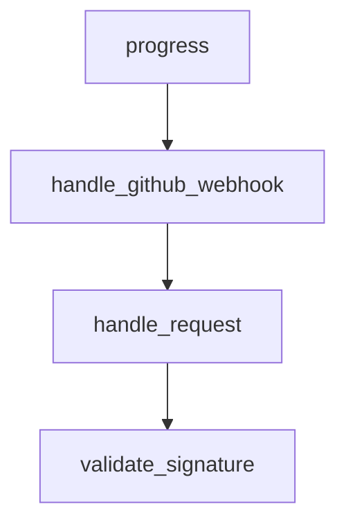

# Chapter 6: Search, Planning, and Execution Patterns

Welcome to **Chapter 6: Search, Planning, and Execution Patterns**. In this part of **Sweep Tutorial: Issue-to-PR AI Coding Workflows on GitHub**, you will build an intuitive mental model first, then move into concrete implementation details and practical production tradeoffs.


Sweep performance depends on a consistent internal pattern: search, plan, implement, validate, and revise.

## Learning Goals

- map the fixed-flow execution philosophy
- align prompt structure with search and planning strengths
- minimize failures from under-specified tasks

## Execution Philosophy

From project docs and FAQ, Sweep emphasizes a bounded workflow instead of open-domain tool execution:

1. search and identify relevant code context
2. plan changes from issue instructions
3. write and update code in PR form
4. validate through CI and user feedback

## Prompting Patterns That Help

| Pattern | Benefit |
|:--------|:--------|
| mention target files/functions | better retrieval precision |
| include desired behavior and constraints | clearer planning output |
| provide reference implementation files | stronger stylistic alignment |

## Source References

- [Advanced Usage](https://github.com/sweepai/sweep/blob/main/docs/pages/usage/advanced.mdx)
- [FAQ](https://github.com/sweepai/sweep/blob/main/docs/pages/faq.mdx)

## Summary

You now understand the core behavioral pattern that drives Sweep output quality.

Next: [Chapter 7: Limitations, Risk Controls, and Safe Scope](07-limitations-risk-controls-and-safe-scope.md)

## Source Code Walkthrough

### `sweepai/api.py`

The `progress` function in [`sweepai/api.py`](https://github.com/sweepai/sweep/blob/HEAD/sweepai/api.py) handles a key part of this chapter's functionality:

```py
from sweepai.utils.github_utils import CURRENT_USERNAME, get_github_client
from sweepai.utils.hash import verify_signature
from sweepai.utils.progress import TicketProgress
from sweepai.utils.safe_pqueue import SafePriorityQueue
from sweepai.utils.str_utils import BOT_SUFFIX, get_hash
from sweepai.utils.validate_license import validate_license
from sweepai.web.events import (
    CheckRunCompleted,
    CommentCreatedRequest,
    IssueCommentRequest,
    IssueRequest,
    PREdited,
    PRLabeledRequest,
    PRRequest,
)
from sweepai.web.health import health_check
import sentry_sdk
from sentry_sdk import set_user

version = time.strftime("%y.%m.%d.%H")

if SENTRY_URL:
    sentry_sdk.init(
        dsn=SENTRY_URL,
        traces_sample_rate=1.0,
        profiles_sample_rate=1.0,
        release=version
    )

app = FastAPI()

app.mount("/chat", chat_app)
```

This function is important because it defines how Sweep Tutorial: Issue-to-PR AI Coding Workflows on GitHub implements the patterns covered in this chapter.

### `sweepai/api.py`

The `handle_github_webhook` function in [`sweepai/api.py`](https://github.com/sweepai/sweep/blob/HEAD/sweepai/api.py) handles a key part of this chapter's functionality:

```py


def handle_github_webhook(event_payload):
    handle_event(event_payload.get("request"), event_payload.get("event"))


def handle_request(request_dict, event=None):
    """So it can be exported to the listen endpoint."""
    with logger.contextualize(tracking_id="main", env=ENV):
        action = request_dict.get("action")

        try:
            handle_github_webhook(
                {
                    "request": request_dict,
                    "event": event,
                }
            )
        except Exception as e:
            logger.exception(str(e))
        logger.info(f"Done handling {event}, {action}")
        return {"success": True}


# @app.post("/")
async def validate_signature(
    request: Request,
    x_hub_signature: Optional[str] = Header(None, alias="X-Hub-Signature-256")
):
    payload_body = await request.body()
    if not verify_signature(payload_body=payload_body, signature_header=x_hub_signature):
        raise HTTPException(status_code=403, detail="Request signatures didn't match!")
```

This function is important because it defines how Sweep Tutorial: Issue-to-PR AI Coding Workflows on GitHub implements the patterns covered in this chapter.

### `sweepai/api.py`

The `handle_request` function in [`sweepai/api.py`](https://github.com/sweepai/sweep/blob/HEAD/sweepai/api.py) handles a key part of this chapter's functionality:

```py


def handle_request(request_dict, event=None):
    """So it can be exported to the listen endpoint."""
    with logger.contextualize(tracking_id="main", env=ENV):
        action = request_dict.get("action")

        try:
            handle_github_webhook(
                {
                    "request": request_dict,
                    "event": event,
                }
            )
        except Exception as e:
            logger.exception(str(e))
        logger.info(f"Done handling {event}, {action}")
        return {"success": True}


# @app.post("/")
async def validate_signature(
    request: Request,
    x_hub_signature: Optional[str] = Header(None, alias="X-Hub-Signature-256")
):
    payload_body = await request.body()
    if not verify_signature(payload_body=payload_body, signature_header=x_hub_signature):
        raise HTTPException(status_code=403, detail="Request signatures didn't match!")

@app.post("/", dependencies=[Depends(validate_signature)])
def webhook(
    request_dict: dict = Body(...),
```

This function is important because it defines how Sweep Tutorial: Issue-to-PR AI Coding Workflows on GitHub implements the patterns covered in this chapter.

### `sweepai/api.py`

The `validate_signature` function in [`sweepai/api.py`](https://github.com/sweepai/sweep/blob/HEAD/sweepai/api.py) handles a key part of this chapter's functionality:

```py

# @app.post("/")
async def validate_signature(
    request: Request,
    x_hub_signature: Optional[str] = Header(None, alias="X-Hub-Signature-256")
):
    payload_body = await request.body()
    if not verify_signature(payload_body=payload_body, signature_header=x_hub_signature):
        raise HTTPException(status_code=403, detail="Request signatures didn't match!")

@app.post("/", dependencies=[Depends(validate_signature)])
def webhook(
    request_dict: dict = Body(...),
    x_github_event: Optional[str] = Header(None, alias="X-GitHub-Event"),
):
    """Handle a webhook request from GitHub"""
    with logger.contextualize(tracking_id="main", env=ENV):
        action = request_dict.get("action", None)

        logger.info(f"Received event: {x_github_event}, {action}")
        return handle_request(request_dict, event=x_github_event)

@app.post("/jira")
def jira_webhook(
    request_dict: dict = Body(...),
) -> None:
    def call_jira_ticket(*args, **kwargs):
        thread = threading.Thread(target=handle_jira_ticket, args=args, kwargs=kwargs)
        thread.start()
    call_jira_ticket(event=request_dict)

# Set up cronjob for this
```

This function is important because it defines how Sweep Tutorial: Issue-to-PR AI Coding Workflows on GitHub implements the patterns covered in this chapter.


## How These Components Connect


