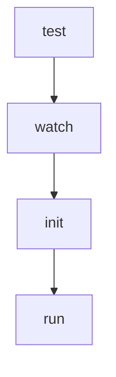

# Chapter 7: Limitations, Risk Controls, and Safe Scope

Welcome to **Chapter 7: Limitations, Risk Controls, and Safe Scope**. In this part of **Sweep Tutorial: Issue-to-PR AI Coding Workflows on GitHub**, you will build an intuitive mental model first, then move into concrete implementation details and practical production tradeoffs.


Sweep reliability is highly sensitive to task size and ambiguity. This chapter operationalizes safe scope boundaries.

## Learning Goals

- recognize official limitations before assigning work
- define scope constraints for predictable runs
- establish escalation paths when tasks exceed limits

## Practical Limits to Respect

| Constraint | Operational Implication |
|:-----------|:------------------------|
| large multi-file refactors | split into smaller issues |
| very large files/context | reduce scope and include explicit anchors |
| non-code assets | route to manual workflow |

## Risk Controls

1. gate large tasks with human decomposition first
2. require human review for every generated PR
3. keep strong CI checks and protected-branch rules

## Source References

- [Limitations](https://github.com/sweepai/sweep/blob/main/docs/pages/about/limitations.mdx)
- [Advanced Usage](https://github.com/sweepai/sweep/blob/main/docs/pages/usage/advanced.mdx)

## Summary

You now have a guardrail framework for assigning tasks Sweep can complete with high confidence.

Next: [Chapter 8: Migration Strategy and Long-Term Operations](08-migration-strategy-and-long-term-operations.md)

## Depth Expansion Playbook

## Source Code Walkthrough

### `sweepai/cli.py`

The `test` function in [`sweepai/cli.py`](https://github.com/sweepai/sweep/blob/HEAD/sweepai/cli.py) handles a key part of this chapter's functionality:

```py

@app.command()
def test():
    cprint("Sweep AI is installed correctly and ready to go!", style="yellow")

@app.command()
def watch(
    repo_name: str,
    debug: bool = False,
    record_events: bool = False,
    max_events: int = 30,
):
    if not os.path.exists(config_path):
        cprint(
            f"\nConfiguration not found at {config_path}. Please run [green]'sweep init'[/green] to initialize the CLI.\n",
            style="yellow",
        )
        raise ValueError(
            "Configuration not found, please run 'sweep init' to initialize the CLI."
        )
    posthog_capture(
        "sweep_watch_started",
        {
            "repo": repo_name,
            "debug": debug,
            "record_events": record_events,
            "max_events": max_events,
        },
    )
    GITHUB_PAT = os.environ.get("GITHUB_PAT", None)
    if GITHUB_PAT is None:
        raise ValueError("GITHUB_PAT environment variable must be set")
```

This function is important because it defines how Sweep Tutorial: Issue-to-PR AI Coding Workflows on GitHub implements the patterns covered in this chapter.

### `sweepai/cli.py`

The `watch` function in [`sweepai/cli.py`](https://github.com/sweepai/sweep/blob/HEAD/sweepai/cli.py) handles a key part of this chapter's functionality:

```py

@app.command()
def watch(
    repo_name: str,
    debug: bool = False,
    record_events: bool = False,
    max_events: int = 30,
):
    if not os.path.exists(config_path):
        cprint(
            f"\nConfiguration not found at {config_path}. Please run [green]'sweep init'[/green] to initialize the CLI.\n",
            style="yellow",
        )
        raise ValueError(
            "Configuration not found, please run 'sweep init' to initialize the CLI."
        )
    posthog_capture(
        "sweep_watch_started",
        {
            "repo": repo_name,
            "debug": debug,
            "record_events": record_events,
            "max_events": max_events,
        },
    )
    GITHUB_PAT = os.environ.get("GITHUB_PAT", None)
    if GITHUB_PAT is None:
        raise ValueError("GITHUB_PAT environment variable must be set")
    g = Github(os.environ["GITHUB_PAT"])
    repo = g.get_repo(repo_name)
    if debug:
        logger.debug("Debug mode enabled")
```

This function is important because it defines how Sweep Tutorial: Issue-to-PR AI Coding Workflows on GitHub implements the patterns covered in this chapter.

### `sweepai/cli.py`

The `init` function in [`sweepai/cli.py`](https://github.com/sweepai/sweep/blob/HEAD/sweepai/cli.py) handles a key part of this chapter's functionality:

```py
    if not os.path.exists(config_path):
        cprint(
            f"\nConfiguration not found at {config_path}. Please run [green]'sweep init'[/green] to initialize the CLI.\n",
            style="yellow",
        )
        raise ValueError(
            "Configuration not found, please run 'sweep init' to initialize the CLI."
        )
    posthog_capture(
        "sweep_watch_started",
        {
            "repo": repo_name,
            "debug": debug,
            "record_events": record_events,
            "max_events": max_events,
        },
    )
    GITHUB_PAT = os.environ.get("GITHUB_PAT", None)
    if GITHUB_PAT is None:
        raise ValueError("GITHUB_PAT environment variable must be set")
    g = Github(os.environ["GITHUB_PAT"])
    repo = g.get_repo(repo_name)
    if debug:
        logger.debug("Debug mode enabled")

    def stream_events(repo: Repository, timeout: int = 2, offset: int = 2 * 60):
        processed_event_ids = set()
        current_time = time.time() - offset
        current_time = datetime.datetime.fromtimestamp(current_time)
        local_tz = datetime.datetime.now(datetime.timezone.utc).astimezone().tzinfo

        while True:
```

This function is important because it defines how Sweep Tutorial: Issue-to-PR AI Coding Workflows on GitHub implements the patterns covered in this chapter.

### `sweepai/cli.py`

The `run` function in [`sweepai/cli.py`](https://github.com/sweepai/sweep/blob/HEAD/sweepai/cli.py) handles a key part of this chapter's functionality:

```py
    if not os.path.exists(config_path):
        cprint(
            f"\nConfiguration not found at {config_path}. Please run [green]'sweep init'[/green] to initialize the CLI.\n",
            style="yellow",
        )
        raise ValueError(
            "Configuration not found, please run 'sweep init' to initialize the CLI."
        )
    posthog_capture(
        "sweep_watch_started",
        {
            "repo": repo_name,
            "debug": debug,
            "record_events": record_events,
            "max_events": max_events,
        },
    )
    GITHUB_PAT = os.environ.get("GITHUB_PAT", None)
    if GITHUB_PAT is None:
        raise ValueError("GITHUB_PAT environment variable must be set")
    g = Github(os.environ["GITHUB_PAT"])
    repo = g.get_repo(repo_name)
    if debug:
        logger.debug("Debug mode enabled")

    def stream_events(repo: Repository, timeout: int = 2, offset: int = 2 * 60):
        processed_event_ids = set()
        current_time = time.time() - offset
        current_time = datetime.datetime.fromtimestamp(current_time)
        local_tz = datetime.datetime.now(datetime.timezone.utc).astimezone().tzinfo

        while True:
```

This function is important because it defines how Sweep Tutorial: Issue-to-PR AI Coding Workflows on GitHub implements the patterns covered in this chapter.


## How These Components Connect


