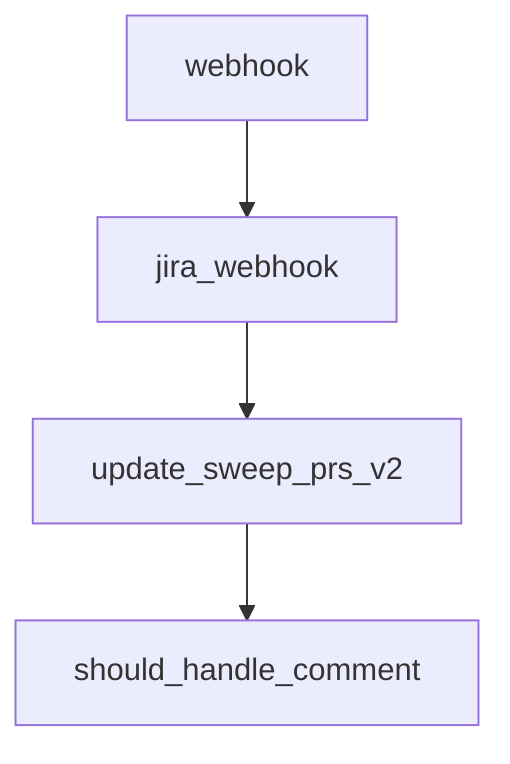

# Chapter 7: Limitations, Risk Controls, and Safe Scope

Welcome to **Chapter 7: Limitations, Risk Controls, and Safe Scope**. In this part of **Sweep Tutorial: Issue-to-PR AI Coding Workflows on GitHub**, you will build an intuitive mental model first, then move into concrete implementation details and practical production tradeoffs.


Sweep reliability is highly sensitive to task size and ambiguity. This chapter operationalizes safe scope boundaries.

## Learning Goals

- recognize official limitations before assigning work
- define scope constraints for predictable runs
- establish escalation paths when tasks exceed limits

## Practical Limits to Respect

| Constraint | Operational Implication |
|:-----------|:------------------------|
| large multi-file refactors | split into smaller issues |
| very large files/context | reduce scope and include explicit anchors |
| non-code assets | route to manual workflow |

## Risk Controls

1. gate large tasks with human decomposition first
2. require human review for every generated PR
3. keep strong CI checks and protected-branch rules

## Source References

- [Limitations](https://github.com/sweepai/sweep/blob/main/docs/pages/about/limitations.mdx)
- [Advanced Usage](https://github.com/sweepai/sweep/blob/main/docs/pages/usage/advanced.mdx)

## Summary

You now have a guardrail framework for assigning tasks Sweep can complete with high confidence.

Next: [Chapter 8: Migration Strategy and Long-Term Operations](08-migration-strategy-and-long-term-operations.md)

## Source Code Walkthrough

### `sweepai/api.py`

The `webhook` function in [`sweepai/api.py`](https://github.com/sweepai/sweep/blob/HEAD/sweepai/api.py) handles a key part of this chapter's functionality:

```py

templates = Jinja2Templates(directory="sweepai/web")
logger.bind(application="webhook")

def run_on_ticket(*args, **kwargs):
    tracking_id = get_hash()
    with logger.contextualize(
        **kwargs,
        name="ticket_" + kwargs["username"],
        tracking_id=tracking_id,
    ):
        return on_ticket(*args, **kwargs, tracking_id=tracking_id)


def run_on_comment(*args, **kwargs):
    tracking_id = get_hash()
    with logger.contextualize(
        **kwargs,
        name="comment_" + kwargs["username"],
        tracking_id=tracking_id,
    ):
        on_comment(*args, **kwargs, tracking_id=tracking_id)

def run_review_pr(*args, **kwargs):
    tracking_id = get_hash()
    with logger.contextualize(
        **kwargs,
        name="review_" + kwargs["username"],
        tracking_id=tracking_id,
    ):
        review_pr(*args, **kwargs, tracking_id=tracking_id)

```

This function is important because it defines how Sweep Tutorial: Issue-to-PR AI Coding Workflows on GitHub implements the patterns covered in this chapter.

### `sweepai/api.py`

The `jira_webhook` function in [`sweepai/api.py`](https://github.com/sweepai/sweep/blob/HEAD/sweepai/api.py) handles a key part of this chapter's functionality:

```py

@app.post("/jira")
def jira_webhook(
    request_dict: dict = Body(...),
) -> None:
    def call_jira_ticket(*args, **kwargs):
        thread = threading.Thread(target=handle_jira_ticket, args=args, kwargs=kwargs)
        thread.start()
    call_jira_ticket(event=request_dict)

# Set up cronjob for this
@app.get("/update_sweep_prs_v2")
def update_sweep_prs_v2(repo_full_name: str, installation_id: int):
    # Get a Github client
    _, g = get_github_client(installation_id)

    # Get the repository
    repo = g.get_repo(repo_full_name)
    config = SweepConfig.get_config(repo)

    try:
        branch_ttl = int(config.get("branch_ttl", 7))
    except Exception:
        branch_ttl = 7
    branch_ttl = max(branch_ttl, 1)

    # Get all open pull requests created by Sweep
    pulls = repo.get_pulls(
        state="open", head="sweep", sort="updated", direction="desc"
    )[:5]

    # For each pull request, attempt to merge the changes from the default branch into the pull request branch
```

This function is important because it defines how Sweep Tutorial: Issue-to-PR AI Coding Workflows on GitHub implements the patterns covered in this chapter.

### `sweepai/api.py`

The `update_sweep_prs_v2` function in [`sweepai/api.py`](https://github.com/sweepai/sweep/blob/HEAD/sweepai/api.py) handles a key part of this chapter's functionality:

```py

# Set up cronjob for this
@app.get("/update_sweep_prs_v2")
def update_sweep_prs_v2(repo_full_name: str, installation_id: int):
    # Get a Github client
    _, g = get_github_client(installation_id)

    # Get the repository
    repo = g.get_repo(repo_full_name)
    config = SweepConfig.get_config(repo)

    try:
        branch_ttl = int(config.get("branch_ttl", 7))
    except Exception:
        branch_ttl = 7
    branch_ttl = max(branch_ttl, 1)

    # Get all open pull requests created by Sweep
    pulls = repo.get_pulls(
        state="open", head="sweep", sort="updated", direction="desc"
    )[:5]

    # For each pull request, attempt to merge the changes from the default branch into the pull request branch
    try:
        for pr in pulls:
            try:
                # make sure it's a sweep ticket
                feature_branch = pr.head.ref
                if not feature_branch.startswith(
                    "sweep/"
                ) and not feature_branch.startswith("sweep_"):
                    continue
```

This function is important because it defines how Sweep Tutorial: Issue-to-PR AI Coding Workflows on GitHub implements the patterns covered in this chapter.

### `sweepai/api.py`

The `should_handle_comment` function in [`sweepai/api.py`](https://github.com/sweepai/sweep/blob/HEAD/sweepai/api.py) handles a key part of this chapter's functionality:

```py
        logger.warning("Failed to update sweep PRs")

def should_handle_comment(request: CommentCreatedRequest | IssueCommentRequest):
    comment = request.comment.body
    return (
        (
            comment.lower().startswith("sweep:") # we will handle all comments (with or without label) that start with "sweep:"
        )
        and request.comment.user.type == "User" # ensure it's a user comment
        and request.comment.user.login not in BLACKLISTED_USERS # ensure it's not a blacklisted user
        and BOT_SUFFIX not in comment # we don't handle bot commnents
    )

def handle_event(request_dict, event):
    action = request_dict.get("action")
    
    username = request_dict.get("sender", {}).get("login")
    if username:
        set_user({"username": username})

    if repo_full_name := request_dict.get("repository", {}).get("full_name"):
        if repo_full_name in DISABLED_REPOS:
            logger.warning(f"Repo {repo_full_name} is disabled")
            return {"success": False, "error_message": "Repo is disabled"}

    with logger.contextualize(tracking_id="main", env=ENV):
        match event, action:
            case "check_run", "completed":
                request = CheckRunCompleted(**request_dict)
                _, g = get_github_client(request.installation.id)
                repo = g.get_repo(request.repository.full_name)
                pull_requests = request.check_run.pull_requests
```

This function is important because it defines how Sweep Tutorial: Issue-to-PR AI Coding Workflows on GitHub implements the patterns covered in this chapter.


## How These Components Connect


