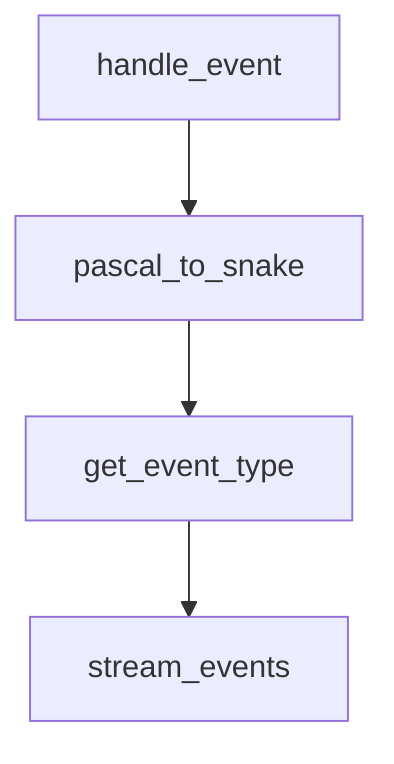

# Chapter 8: Migration Strategy and Long-Term Operations

Welcome to **Chapter 8: Migration Strategy and Long-Term Operations**. In this part of **Sweep Tutorial: Issue-to-PR AI Coding Workflows on GitHub**, you will build an intuitive mental model first, then move into concrete implementation details and practical production tradeoffs.


The Sweep ecosystem has evolved over time. Teams need an explicit strategy to preserve value while adapting tooling.

## Learning Goals

- distinguish workflow assets worth preserving
- define migration criteria to adjacent agent platforms
- keep governance and auditability stable across transitions

## Preserve These Assets

| Asset | Why Preserve |
|:------|:-------------|
| issue prompt templates | reusable task decomposition patterns |
| `sweep.yaml` policy defaults | repository governance and safety constraints |
| PR review playbooks | consistent human quality control |

## Migration Planning Questions

1. which current workflows depend on GitHub issue automation?
2. what alternative agent surfaces are being adopted (IDE, CLI, browser)?
3. how will CI and review policy stay unchanged during tooling shifts?

## Source References

- [README](https://github.com/sweepai/sweep/blob/main/README.md)
- [Roadmap Notes](https://github.com/sweepai/sweep/blob/main/docs/pages/about/roadmap.mdx)
- [Contributing](https://github.com/sweepai/sweep/blob/main/CONTRIBUTING.md)

## Summary

You now have a long-term operating approach for using Sweep responsibly within a changing coding-agent landscape.

Next: compare adjacent architectures in [OpenCode](../opencode-tutorial/) and [Stagewise](../stagewise-tutorial/).

## Source Code Walkthrough

### `sweepai/api.py`

The `handle_event` function in [`sweepai/api.py`](https://github.com/sweepai/sweep/blob/HEAD/sweepai/api.py) handles a key part of this chapter's functionality:

```py

def handle_github_webhook(event_payload):
    handle_event(event_payload.get("request"), event_payload.get("event"))


def handle_request(request_dict, event=None):
    """So it can be exported to the listen endpoint."""
    with logger.contextualize(tracking_id="main", env=ENV):
        action = request_dict.get("action")

        try:
            handle_github_webhook(
                {
                    "request": request_dict,
                    "event": event,
                }
            )
        except Exception as e:
            logger.exception(str(e))
        logger.info(f"Done handling {event}, {action}")
        return {"success": True}


# @app.post("/")
async def validate_signature(
    request: Request,
    x_hub_signature: Optional[str] = Header(None, alias="X-Hub-Signature-256")
):
    payload_body = await request.body()
    if not verify_signature(payload_body=payload_body, signature_header=x_hub_signature):
        raise HTTPException(status_code=403, detail="Request signatures didn't match!")

```

This function is important because it defines how Sweep Tutorial: Issue-to-PR AI Coding Workflows on GitHub implements the patterns covered in this chapter.

### `sweepai/watch.py`

The `pascal_to_snake` function in [`sweepai/watch.py`](https://github.com/sweepai/sweep/blob/HEAD/sweepai/watch.py) handles a key part of this chapter's functionality:

```py


def pascal_to_snake(name):
    return "".join(["_" + i.lower() if i.isupper() else i for i in name]).lstrip("_")


def get_event_type(event: Event | IssueEvent):
    if isinstance(event, IssueEvent):
        return "issues"
    else:
        return pascal_to_snake(event.type)[: -len("_event")]


def stream_events(repo: Repository, timeout: int = 2, offset: int = 2 * 60):
    processed_event_ids = set()
    current_time = time.time() - offset
    current_time = datetime.datetime.fromtimestamp(current_time)
    local_tz = datetime.datetime.now(datetime.timezone.utc).astimezone().tzinfo

    while True:
        events_iterator = chain(
            islice(repo.get_events(), MAX_EVENTS),
            islice(repo.get_issues_events(), MAX_EVENTS),
        )
        for i, event in enumerate(events_iterator):
            if event.id not in processed_event_ids:
                local_time = event.created_at.replace(
                    tzinfo=datetime.timezone.utc
                ).astimezone(local_tz)

                if local_time.timestamp() > current_time.timestamp():
                    yield event
```

This function is important because it defines how Sweep Tutorial: Issue-to-PR AI Coding Workflows on GitHub implements the patterns covered in this chapter.

### `sweepai/watch.py`

The `get_event_type` function in [`sweepai/watch.py`](https://github.com/sweepai/sweep/blob/HEAD/sweepai/watch.py) handles a key part of this chapter's functionality:

```py


def get_event_type(event: Event | IssueEvent):
    if isinstance(event, IssueEvent):
        return "issues"
    else:
        return pascal_to_snake(event.type)[: -len("_event")]


def stream_events(repo: Repository, timeout: int = 2, offset: int = 2 * 60):
    processed_event_ids = set()
    current_time = time.time() - offset
    current_time = datetime.datetime.fromtimestamp(current_time)
    local_tz = datetime.datetime.now(datetime.timezone.utc).astimezone().tzinfo

    while True:
        events_iterator = chain(
            islice(repo.get_events(), MAX_EVENTS),
            islice(repo.get_issues_events(), MAX_EVENTS),
        )
        for i, event in enumerate(events_iterator):
            if event.id not in processed_event_ids:
                local_time = event.created_at.replace(
                    tzinfo=datetime.timezone.utc
                ).astimezone(local_tz)

                if local_time.timestamp() > current_time.timestamp():
                    yield event
                else:
                    if DEBUG:
                        logger.debug(
                            f"Skipping event {event.id} because it is in the past (local_time={local_time}, current_time={current_time}, i={i})"
```

This function is important because it defines how Sweep Tutorial: Issue-to-PR AI Coding Workflows on GitHub implements the patterns covered in this chapter.

### `sweepai/watch.py`

The `stream_events` function in [`sweepai/watch.py`](https://github.com/sweepai/sweep/blob/HEAD/sweepai/watch.py) handles a key part of this chapter's functionality:

```py


def stream_events(repo: Repository, timeout: int = 2, offset: int = 2 * 60):
    processed_event_ids = set()
    current_time = time.time() - offset
    current_time = datetime.datetime.fromtimestamp(current_time)
    local_tz = datetime.datetime.now(datetime.timezone.utc).astimezone().tzinfo

    while True:
        events_iterator = chain(
            islice(repo.get_events(), MAX_EVENTS),
            islice(repo.get_issues_events(), MAX_EVENTS),
        )
        for i, event in enumerate(events_iterator):
            if event.id not in processed_event_ids:
                local_time = event.created_at.replace(
                    tzinfo=datetime.timezone.utc
                ).astimezone(local_tz)

                if local_time.timestamp() > current_time.timestamp():
                    yield event
                else:
                    if DEBUG:
                        logger.debug(
                            f"Skipping event {event.id} because it is in the past (local_time={local_time}, current_time={current_time}, i={i})"
                        )
            if DEBUG:
                logger.debug(f"Skipping event {event.id} because it is already handled")
            processed_event_ids.add(event.id)
        time.sleep(timeout)


```

This function is important because it defines how Sweep Tutorial: Issue-to-PR AI Coding Workflows on GitHub implements the patterns covered in this chapter.


## How These Components Connect


