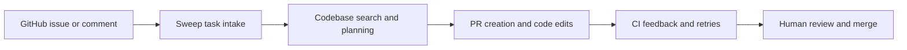

# Sweep Tutorial: Issue-to-PR AI Coding Workflows on GitHub

> Learn how to use `sweepai/sweep` to turn GitHub issues into pull requests, operate feedback loops, and run self-hosted or CLI workflows with clear guardrails.

## Why This Track Matters

Sweep popularized an issue-to-PR coding-agent workflow on GitHub. Even with product evolution over time, the repository and docs still provide strong patterns for asynchronous AI delivery loops, feedback handling, and operational controls.

This track focuses on:

- running Sweep issue and PR workflows effectively
- configuring repository-level behavior through `sweep.yaml`
- operating review, CI, and retry loops for higher output quality
- understanding self-hosted and local CLI deployment paths

## Current Snapshot (auto-updated)

- repository: [`sweepai/sweep`](https://github.com/sweepai/sweep)
- stars: about **7.6k**
- latest tagged release in repository: [`sweep-sandbox-v1`](https://github.com/sweepai/sweep/releases/tag/sweep-sandbox-v1) (legacy tag)
- recent activity: verify latest commits to confirm current maintenance status
- posture note: repository README now points users to the Sweep JetBrains plugin while legacy docs continue to describe GitHub issue-to-PR workflows

## Mental Model

## Chapter Guide

| Chapter | Key Question | Outcome |
|:--------|:-------------|:--------|
| [01 - Getting Started and Current Product Posture](01-getting-started-and-current-product-posture.md) | Which Sweep path should teams use today? | Clear starting point |
| [02 - Issue to PR Workflow Architecture](02-issue-to-pr-workflow-architecture.md) | How does Sweep move from issue text to code changes? | Better task decomposition |
| [03 - Repository Configuration and Governance](03-repository-configuration-and-governance.md) | How do `sweep.yaml` controls shape behavior? | Stronger repo policy |
| [04 - Feedback Loops, Review Comments, and CI Repair](04-feedback-loops-review-comments-and-ci-repair.md) | How do you iteratively improve generated PRs? | Higher merge quality |
| [05 - CLI and Self-Hosted Deployment](05-cli-and-self-hosted-deployment.md) | When should teams run local CLI or self-hosted app paths? | Deployment strategy |
| [06 - Search, Planning, and Execution Patterns](06-search-planning-and-execution-patterns.md) | What internal workflow patterns matter most? | Better reliability expectations |
| [07 - Limitations, Risk Controls, and Safe Scope](07-limitations-risk-controls-and-safe-scope.md) | What constraints must teams respect? | Fewer failed runs |
| [08 - Migration Strategy and Long-Term Operations](08-migration-strategy-and-long-term-operations.md) | How do teams evolve workflow investments as products shift? | Durable adoption plan |

## What You Will Learn

- how to run Sweep with realistic task sizing and expectations
- how to tune config and review loops for better issue-to-PR outcomes
- how to choose between hosted, CLI, and self-hosted deployment modes
- how to manage lifecycle and migration risk as agent tooling evolves

## Source References

- [Sweep Repository](https://github.com/sweepai/sweep)
- [README](https://github.com/sweepai/sweep/blob/main/README.md)
- [Docs Home](https://docs.sweep.dev/)
- [Getting Started](https://github.com/sweepai/sweep/blob/main/docs/pages/getting-started.md)
- [Config](https://github.com/sweepai/sweep/blob/main/docs/pages/usage/config.mdx)
- [Advanced Usage](https://github.com/sweepai/sweep/blob/main/docs/pages/usage/advanced.mdx)
- [CLI](https://github.com/sweepai/sweep/blob/main/docs/pages/cli.mdx)
- [Deployment](https://github.com/sweepai/sweep/blob/main/docs/pages/deployment.mdx)
- [Limitations](https://github.com/sweepai/sweep/blob/main/docs/pages/about/limitations.mdx)

## Related Tutorials

- [OpenCode Tutorial](../opencode-tutorial/)
- [Tabby Tutorial](../tabby-tutorial/)
- [Continue Tutorial](../continue-tutorial/)
- [Stagewise Tutorial](../stagewise-tutorial/)

---

Start with [Chapter 1: Getting Started and Current Product Posture](01-getting-started-and-current-product-posture.md).

## Navigation & Backlinks

- [Start Here: Chapter 1: Getting Started and Current Product Posture](01-getting-started-and-current-product-posture.md)
- [Back to Main Catalog](../../README.md#-tutorial-catalog)
- [Browse A-Z Tutorial Directory](../../discoverability/tutorial-directory.md)
- [Search by Intent](../../discoverability/query-hub.md)
- [Explore Category Hubs](../../README.md#category-hubs)

## Full Chapter Map

1. [Chapter 1: Getting Started and Current Product Posture](01-getting-started-and-current-product-posture.md)
2. [Chapter 2: Issue to PR Workflow Architecture](02-issue-to-pr-workflow-architecture.md)
3. [Chapter 3: Repository Configuration and Governance](03-repository-configuration-and-governance.md)
4. [Chapter 4: Feedback Loops, Review Comments, and CI Repair](04-feedback-loops-review-comments-and-ci-repair.md)
5. [Chapter 5: CLI and Self-Hosted Deployment](05-cli-and-self-hosted-deployment.md)
6. [Chapter 6: Search, Planning, and Execution Patterns](06-search-planning-and-execution-patterns.md)
7. [Chapter 7: Limitations, Risk Controls, and Safe Scope](07-limitations-risk-controls-and-safe-scope.md)
8. [Chapter 8: Migration Strategy and Long-Term Operations](08-migration-strategy-and-long-term-operations.md)

*Generated by [AI Codebase Knowledge Builder](https://github.com/The-Pocket/Tutorial-Codebase-Knowledge)*
