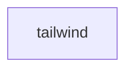

# Chapter 1: Getting Started and First Server

Welcome to **Chapter 1: Getting Started and First Server**. In this part of **Tabby Tutorial: Self-Hosted AI Coding Assistant Architecture and Operations**, you will build an intuitive mental model first, then move into concrete implementation details and practical production tradeoffs.


This chapter gets Tabby running with a clean local baseline so every later chapter can focus on architecture and operations instead of setup drift.

## Learning Goals

- choose an installation path that matches your environment
- run a first Tabby server and create an account
- connect an editor extension and verify completions
- capture baseline checks for repeatable setup

## Prerequisites

| Requirement | Why It Matters |
|:------------|:---------------|
| Docker or a host runtime for Tabby binary | quickest path to a stable server |
| GPU optional, CPU acceptable for initial validation | avoid blocking first-time setup |
| modern editor (VS Code, JetBrains, Vim/Neovim) | validate client integration early |

## Fastest Bootstrap: Docker

```bash
docker run -d \
  --name tabby \
  --gpus all \
  -p 8080:8080 \
  -v $HOME/.tabby:/data \
  registry.tabbyml.com/tabbyml/tabby \
    serve \
    --model StarCoder-1B \
    --chat-model Qwen2-1.5B-Instruct \
    --device cuda
```

Then open `http://localhost:8080` and complete account registration.

## Setup Validation Checklist

1. server process is running and reachable on port `8080`
2. account registration completes in the web UI
3. personal token is generated in the homepage
4. editor extension connects using endpoint + token
5. inline completions appear in a real repository

## Early Failure Triage

| Symptom | Likely Cause | First Fix |
|:--------|:-------------|:----------|
| container exits quickly | model/device mismatch | switch to a smaller model and recheck runtime flags |
| extension cannot authenticate | missing/invalid token | regenerate token and update extension settings |
| slow or empty completions | model backend not healthy | verify server logs and reduce model size for baseline |

## Source References

- [README: Run Tabby in 1 Minute](https://github.com/TabbyML/tabby/blob/main/README.md)
- [Docker Installation Guide](https://tabby.tabbyml.com/docs/quick-start/installation/docker)
- [Setup IDE Extension](https://tabby.tabbyml.com/docs/quick-start/setup-ide)

## Summary

You now have a working Tabby deployment with at least one connected editor client.

Next: [Chapter 2: Architecture and Runtime Components](02-architecture-and-runtime-components.md)

## Depth Expansion Playbook

## Source Code Walkthrough

### `website/docusaurus.config.js`

The `tailwind` function in [`website/docusaurus.config.js`](https://github.com/TabbyML/tabby/blob/HEAD/website/docusaurus.config.js) handles a key part of this chapter's functionality:

```js

  plugins: [
    async function tailwind(context, options) {
      return {
        name: "docusaurus-tailwindcss",
        configurePostCss(postcssOptions) {
          // Appends TailwindCSS and AutoPrefixer.
          postcssOptions.plugins.push(require("tailwindcss"));
          postcssOptions.plugins.push(require("autoprefixer"));
          return postcssOptions;
        },
      };
    },
    [
      "posthog-docusaurus",
      {
        apiKey: "phc_aBzNGHzlOy2C8n1BBDtH7d4qQsIw9d8T0unVlnKfdxB",
        appUrl: "https://app.posthog.com",
        enableInDevelopment: false,
      },
    ],
    [
      '@docusaurus/plugin-client-redirects',
      {
        redirects: [
          {
            to: '/blog/2024/02/05/create-tabby-extension-with-language-server-protocol',
            from: '/blog/running-tabby-as-a-language-server'
          },
          {
            to: '/blog/2023/09/05/deploy-tabby-to-huggingface-space',
            from: '/blog/deploy-tabby-to-huggingface-space.md',
```

This function is important because it defines how Tabby Tutorial: Self-Hosted AI Coding Assistant Architecture and Operations implements the patterns covered in this chapter.


## How These Components Connect


