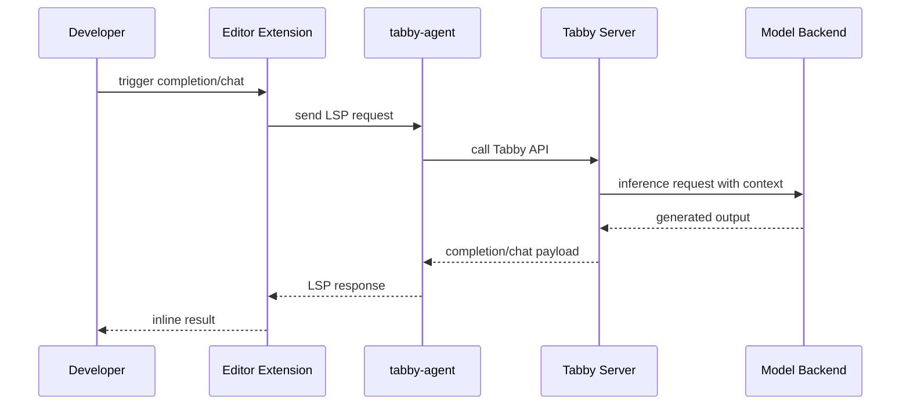

# Chapter 2: Architecture and Runtime Components

Tabby is more than a single completion endpoint. It is a layered runtime that combines server services, context processing, and editor-facing agent bridges.

## Learning Goals

- map major runtime components and boundaries
- understand request flow from editor to model backend
- identify where to place custom integrations and controls

## Core Component Map

| Component | Responsibility |
|:----------|:---------------|
| Tabby server | serves completion/chat APIs and admin web UI |
| `tabby-agent` | LSP bridge between editors and Tabby APIs |
| editor extension | user interaction layer for completion/chat |
| model backends | completion/chat/embedding inference providers |
| indexing subsystem | builds repository and document context |

## Runtime Flow

## Repository Structure Orientation

| Path | Why You Care |
|:-----|:-------------|
| `clients/` | extension and agent-side integration patterns |
| `crates/` | core server/runtime internals implemented in Rust |
| `website/docs/` | operational and configuration guidance |
| `ee/` | enterprise-oriented modules and integrations |

## Design Implications

- API and LSP boundaries let teams update editor adapters independently.
- Model provider abstraction enables mixed local and remote deployment strategy.
- Context indexing is a first-class system, not an optional add-on.

## Source References

- [Tabby Repository Layout](https://github.com/TabbyML/tabby)
- [Welcome Docs](https://tabby.tabbyml.com/docs/welcome/)
- [tabby-agent README](https://github.com/TabbyML/tabby/blob/main/clients/tabby-agent/README.md)

## Summary

You now have a structural map for where behavior lives and how requests move across Tabby.

Next: [Chapter 3: Model Serving and Completion Pipeline](03-model-serving-and-completion-pipeline.md)
