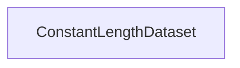

# Chapter 3: Model Serving and Completion Pipeline

Welcome to **Chapter 3: Model Serving and Completion Pipeline**. In this part of **Tabby Tutorial: Self-Hosted AI Coding Assistant Architecture and Operations**, you will build an intuitive mental model first, then move into concrete implementation details and practical production tradeoffs.


This chapter focuses on how Tabby combines completion, chat, and embedding configuration into practical response quality.

## Learning Goals

- separate completion and chat model responsibilities
- configure HTTP model providers correctly
- choose safe defaults for latency and quality

## Model Roles in Tabby

| Model Type | Typical Purpose |
|:-----------|:----------------|
| completion model | inline code completion and edit suggestions |
| chat model | assistant responses and interactive reasoning |
| embedding model | retrieval and repository/document context matching |

## Example Configuration Strategy

```toml
# ~/.tabby/config.toml
[model.chat.http]
kind = "openai/chat"
model_name = "gpt-4o"
api_endpoint = "https://api.openai.com/v1"
api_key = "${OPENAI_API_KEY}"

[model.embedding.http]
kind = "openai/embedding"
model_name = "text-embedding-3-small"
api_endpoint = "https://api.openai.com/v1"
api_key = "${OPENAI_API_KEY}"
```

Use a completion-capable model path that matches your deployment target (local model or compatible API).

## Tuning Priorities

1. stabilize response time first
2. validate completion relevance in real repositories
3. tune model size and provider routing after baseline quality is stable

## Common Tradeoffs

| Decision | Benefit | Cost |
|:---------|:--------|:-----|
| smaller local completion model | lower latency and lower infra cost | weaker long-context quality |
| remote high-capability chat model | better reasoning for chat workflows | network and usage cost |
| shared provider for all roles | simpler operations | less control per workload |

## Source References

- [Config TOML](https://tabby.tabbyml.com/docs/administration/config-toml)
- [OpenAI HTTP API Reference in Tabby Docs](https://tabby.tabbyml.com/docs/references/models-http-api/openai)
- [Tabby Models Directory](https://tabby.tabbyml.com/docs/models)

## Summary

You now understand how model role separation drives both quality and operational cost.

Next: [Chapter 4: Answer Engine and Context Indexing](04-answer-engine-and-context-indexing.md)

## Source Code Walkthrough

### `python/tabby/trainer.py`

The `ConstantLengthDataset` class in [`python/tabby/trainer.py`](https://github.com/TabbyML/tabby/blob/HEAD/python/tabby/trainer.py) handles a key part of this chapter's functionality:

```py


class ConstantLengthDataset:
    """
    Iterable dataset that returns constant length chunks of tokens from stream of text files.
        Args:
            tokenizer (Tokenizer): The processor used for proccessing the data.
            dataset (dataset.Dataset): Dataset with text files.
            infinite (bool): If True the iterator is reset after dataset reaches end else stops.
            seq_length (int): Length of token sequences to return.
            num_of_sequences (int): Number of token sequences to keep in buffer.
            chars_per_token (int): Number of characters per token used to estimate number of tokens in text buffer.
    """

    def __init__(
        self,
        tokenizer,
        dataset,
        infinite=False,
        seq_length=1024,
        num_of_sequences=1024,
        chars_per_token=3.6,
        content_field="content",
    ):
        self.tokenizer = tokenizer
        self.concat_token_id = tokenizer.eos_token_id
        self.dataset = dataset
        self.seq_length = seq_length
        self.infinite = infinite
        self.current_size = 0
        self.max_buffer_size = seq_length * chars_per_token * num_of_sequences
        self.content_field = content_field
```

This class is important because it defines how Tabby Tutorial: Self-Hosted AI Coding Assistant Architecture and Operations implements the patterns covered in this chapter.


## How These Components Connect


