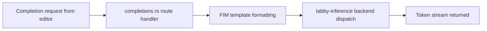

# Chapter 3: Model Serving and Completion Pipeline

Welcome to **Chapter 3: Model Serving and Completion Pipeline**. In this part of **Tabby Tutorial: Self-Hosted AI Coding Assistant Architecture and Operations**, you will build an intuitive mental model first, then move into concrete implementation details and practical production tradeoffs.


This chapter focuses on how Tabby combines completion, chat, and embedding configuration into practical response quality.

## Learning Goals

- separate completion and chat model responsibilities
- configure HTTP model providers correctly
- choose safe defaults for latency and quality

## Model Roles in Tabby

| Model Type | Typical Purpose |
|:-----------|:----------------|
| completion model | inline code completion and edit suggestions |
| chat model | assistant responses and interactive reasoning |
| embedding model | retrieval and repository/document context matching |

## Example Configuration Strategy

```toml
# ~/.tabby/config.toml
[model.chat.http]
kind = "openai/chat"
model_name = "gpt-4o"
api_endpoint = "https://api.openai.com/v1"
api_key = "${OPENAI_API_KEY}"

[model.embedding.http]
kind = "openai/embedding"
model_name = "text-embedding-3-small"
api_endpoint = "https://api.openai.com/v1"
api_key = "${OPENAI_API_KEY}"
```

Use a completion-capable model path that matches your deployment target (local model or compatible API).

## Tuning Priorities

1. stabilize response time first
2. validate completion relevance in real repositories
3. tune model size and provider routing after baseline quality is stable

## Common Tradeoffs

| Decision | Benefit | Cost |
|:---------|:--------|:-----|
| smaller local completion model | lower latency and lower infra cost | weaker long-context quality |
| remote high-capability chat model | better reasoning for chat workflows | network and usage cost |
| shared provider for all roles | simpler operations | less control per workload |

## Source References

- [Config TOML](https://tabby.tabbyml.com/docs/administration/config-toml)
- [OpenAI HTTP API Reference in Tabby Docs](https://tabby.tabbyml.com/docs/references/models-http-api/openai)
- [Tabby Models Directory](https://tabby.tabbyml.com/docs/models)

## Summary

You now understand how model role separation drives both quality and operational cost.

Next: [Chapter 4: Answer Engine and Context Indexing](04-answer-engine-and-context-indexing.md)

## Source Code Walkthrough

Use the following upstream sources to verify model serving and completion pipeline details while reading this chapter:

- [`crates/tabby/src/routes/completions.rs`](https://github.com/TabbyML/tabby/blob/HEAD/crates/tabby/src/routes/) — the completion API route handler that validates completion requests, applies FIM (fill-in-the-middle) template formatting, invokes the inference backend, and streams completion tokens.
- [`crates/tabby-inference/src/lib.rs`](https://github.com/TabbyML/tabby/blob/HEAD/crates/tabby-inference/src/lib.rs) — the inference backend trait and request dispatch logic that routes completion requests to the correct model backend.

Suggested trace strategy:
- trace the completion request from the Axum handler in `completions.rs` through inference dispatch to the backend
- review FIM template construction to understand how prefix/suffix/middle context is formatted for different model families
- check `crates/tabby-common/src/api/` for the completion request/response schema definitions

## How These Components Connect

