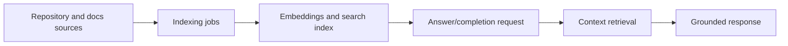

# Chapter 4: Answer Engine and Context Indexing

Tabby quality depends on context. This chapter covers how indexing and answer workflows convert repository state into grounded responses.

## Learning Goals

- understand repository and document context ingestion
- map answer engine behavior to indexed sources
- define reliability checks for context freshness

## Context Pipeline

## Operational Pattern

| Stage | Control Point |
|:------|:--------------|
| ingestion | decide which repos/docs are indexed |
| indexing cadence | set update frequency and shard behavior |
| retrieval | validate relevance in real tasks |
| answer output | verify citations and code references are coherent |

## Quality Guardrails

- maintain repository selection policy to avoid noisy context.
- run periodic smoke prompts against known code locations.
- monitor indexing failures before they accumulate stale context.

## Recent Capability Signals

The changelog documents ongoing work around context quality, including custom document APIs and indexing behavior improvements.

## Source References

- [Tabby Changelog](https://github.com/TabbyML/tabby/blob/main/CHANGELOG.md)
- [Administration: Context](https://tabby.tabbyml.com/docs/administration/context)
- [Administration: Index Custom Document](https://tabby.tabbyml.com/docs/administration/index-custom-document)

## Summary

You now have a practical model for operating Tabby as a context-grounded assistant instead of a bare autocomplete endpoint.

Next: [Chapter 5: Editor Agents and Client Integrations](05-editor-agents-and-client-integrations.md)
